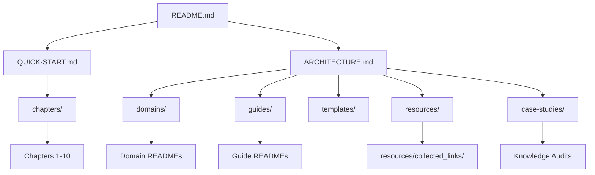

# 🧭 Repository Overview

> **Purpose:** Cung cấp bản đồ trực quan giúp định hướng nhanh giữa các thư mục `chapters/`, `domains/`, `guides/`, `templates/`, `resources/`, và `case-studies/`.
>
> **Last reviewed:** March 2026

---

## 🌳 Kiến trúc tổng thể

- **README.md**: Cổng vào với phần Repository Structure.
- **QUICK-START.md**: Lựa đường dựa trên cấp độ (Beginner → Entrepreneur).
- **ARCHITECTURE.md**: Triết lý tổ chức + tiêu chuẩn chất lượng.
- **OVERVIEW.md (tài liệu này)**: Bản đồ tổng hợp, cập nhật khi thêm thư mục lớn.

---

## 👥 User journey tiêu biểu

| Persona | Lộ trình gợi ý | Deliverable mong muốn |
| --- | --- | --- |
| **Explorer** (người mới) | `README.md → QUICK-START.md → chapters/` | Framework học tuần tự, checklist hành động |
| **Specialist** (kỹ sư kỹ thuật) | `README.md → domains/<domain>/README.md → INDEX.md` | Roadmap kỹ thuật, case study, external links |
| **Career Builder** (tập trung soft skills) | `README.md → guides/03-career-skills/README.md → INDEX.md → templates/` | Life OS, KPI cá nhân, template hành động |
| **Researcher** (muốn ví dụ thực tế) | `README.md → case-studies/ → knowledge-audits/` | Bộ câu hỏi audit, phân tích đa lĩnh vực |

---

## 🧩 Liên kết chính giữa các thư mục

| Hub | Liên kết chéo quan trọng | Ghi chú |
| --- | --- | --- |
| `chapters/` | Trỏ tới domain tương ứng ở cuối mỗi chương | Hỗ trợ Beginner chọn chuyên ngành |
| `domains/` | Mỗi README thêm mục "External Resources" trỏ tới `resources/collected_links/<domain>.md` | Bảo đảm người đọc tra cứu nhanh công cụ ngoài |
| `guides/03-career-skills/` | Dẫn tới templates, innovation, IELTS, growth | Tạo cầu nối giữa mindset ↔ hành động |
| `case-studies/knowledge-audits/` | Backlink về domain/guide để lấp gap kiến thức | Giúp người học quay lại tài liệu cần ôn |
| `_archive/` | Được liên kết từ README của thư mục gốc khi nội dung hết hạn | Lưu vết lịch sử, tránh xoá vĩnh viễn |

---

## 📝 Quy ước cập nhật tài liệu

1. **Badge độ khó & Last Reviewed**: Mọi README chính cần hiển thị mức độ (Beginner/Intermediate/Advanced) và mốc cập nhật gần nhất.
2. **INDEX.md cho thư mục lớn**: Khi thư mục >10 file, thêm INDEX với phân nhóm rõ ràng.
3. **External Resources**: Nếu domain/guides có tài liệu tham chiếu, tạo sub-section trỏ tới `resources/collected_links/`.
4. **_archive/**: Nội dung cũ → di chuyển vào đây cùng ghi chú lý do và link bản thay thế.

---

> 📌 *Khi bổ sung thư mục hoặc roadmap mới, nhớ cập nhật OVERVIEW.md để cộng đồng nắm được sự thay đổi tổng thể.*