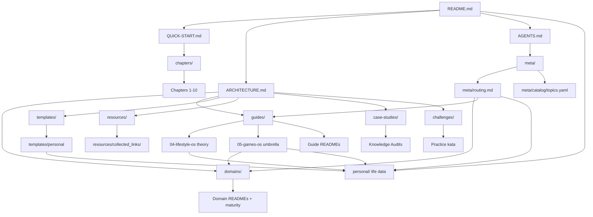

# 🧭 Repository Overview

> **Purpose:** Bản đồ giữa knowledge library (`domains/`, `guides/`…) và **personal life data** (`personal/`).
>
> **Last reviewed:** August 2026  
> **Corpus:** ~1.2M words · ~1,800 Markdown files · 15 domains · + `personal/` life OS data

---

## 🌳 Kiến trúc tổng thể

- **`personal/`**: records ăn uống, daily, body, habits, weekly — [`personal/README.md`](./personal/README.md)
- **README.md**: Cổng vào với phần Repository Structure.
- **QUICK-START.md**: Lựa đường dựa trên cấp độ (Beginner → Entrepreneur).
- **ARCHITECTURE.md**: Triết lý tổ chức + tiêu chuẩn chất lượng.
- **OVERVIEW.md (tài liệu này)**: Bản đồ tổng hợp.
- **domains/README.md**: Inventory + maturity.
- **Agents:** [`AGENTS.md`](./AGENTS.md) → [`meta/`](./meta/) ([routing](./meta/routing.md) / [catalog](./meta/catalog/) / [eval](./meta/eval/)) · crawlers: [`llms.txt`](./llms.txt)

---

## 📊 Snapshot theo thư mục (Aug 2026)

| Hub | ~Markdown files | Vai trò |
| --- | ---: | --- |
| `guides/` | ~900 | Career / wealth / mental models / lifestyle **theory** |
| `domains/` | ~740 | Technical depth (15 domains) |
| `personal/` | growing | **Your** daily/nutrition/body/habits/weekly **records** |
| `case-studies/` | ~44 | Audits, stories, mental-model analyses |
| `challenges/` | ~50 | Deliberate practice |
| `templates/` | ~37 | Ready-to-use worksheets (+ `templates/personal/`) |
| `resources/` | ~26 | External curation |
| `chapters/` | ~13 | Linear beginner path |

**Domain maturity shortcut:** 6 Stable · 9 Drafting · 0 Stub — mọi domain có challenge map (trừ Product/PM cross-cutting). Chi tiết: [`domains/README.md`](./domains/README.md).

---

## 👥 User journey tiêu biểu

| Persona | Lộ trình gợi ý | Deliverable mong muốn |
| --- | --- | --- |
| **Explorer** (người mới) | `README.md → QUICK-START.md → chapters/` → domain 🟢 Stable | Framework học tuần tự, checklist hành động |
| **Specialist** (kỹ sư kỹ thuật) | `README.md → domains/<domain>/README.md` (+ maturity check) | Roadmap kỹ thuật, case study, external links |
| **Career Builder** (tập trung soft skills) | `README.md → guides/03-career-skills/README.md → templates/` | Life OS, KPI cá nhân, template hành động |
| **Practitioner** (cần drill) | `domains/` theory → `challenges/<area>/` | Kata cụ thể, feedback nhanh |
| **Researcher** (muốn ví dụ thực tế) | `README.md → case-studies/ → knowledge-audits/` | Bộ câu hỏi audit, phân tích đa lĩnh vực |
| **AI Agent / RAG** | `AGENTS.md` → `meta/routing.md` / `meta/catalog/topics.yaml` → hub → canonical | Cite paths; treat `personal/` as private |

---

## 🧩 Liên kết chính giữa các thư mục

| Hub | Liên kết chéo quan trọng | Ghi chú |
| --- | --- | --- |
| `chapters/` | Trỏ tới domain tương ứng ở cuối mỗi chương | Hỗ trợ Beginner chọn chuyên ngành |
| `domains/` | Maturity hub + "External Resources" → `resources/collected_links/` | Tránh học Stub như thể đã cover xong |
| `guides/03-career-skills/` | Dẫn tới templates, innovation, IELTS, growth | Tạo cầu nối giữa mindset ↔ hành động |
| `guides/05-games-os/` | Make → `domains/game-dev`; Earn → career game-dev; Play/Follow local | Umbrella games; không thay tech domain |
| `challenges/` | Drill theo topic gần với domain tương ứng | Bù khoảng trống practice |
| `case-studies/knowledge-audits/` | Backlink về domain/guide để lấp gap kiến thức | Giúp người học quay lại tài liệu cần ôn |
| `_archive/` | Được liên kết từ README của thư mục gốc khi nội dung hết hạn | Lưu vết lịch sử, tránh xoá vĩnh viễn |

---

## 📝 Quy ước cập nhật tài liệu

1. **Badge độ khó & Last Reviewed**: Mọi README chính cần hiển thị mức độ (Beginner/Intermediate/Advanced) và mốc cập nhật gần nhất.
2. **Domain maturity**: Khi thêm/xoá file trong domain làm thay đổi bậc Stable/Drafting/Stub, cập nhật `domains/README.md` (+ `INDEX.md`).
3. **INDEX.md cho thư mục lớn**: Khi thư mục >10 file, thêm INDEX với phân nhóm rõ ràng.
4. **External Resources**: Nếu domain/guides có tài liệu tham chiếu, tạo sub-section trỏ tới `resources/collected_links/`.
5. **_archive/**: Nội dung cũ → di chuyển vào đây cùng ghi chú lý do và link bản thay thế.

---

> 📌 *Khi bổ sung thư mục hoặc roadmap mới, nhớ cập nhật OVERVIEW.md và ARCHITECTURE.md để cộng đồng nắm được sự thay đổi tổng thể.*