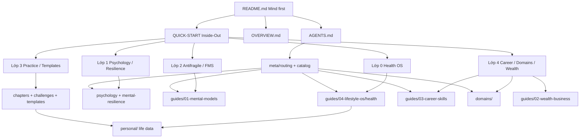

# Repository Overview

> **Purpose:** Bản đồ knowledge library + personal life data, theo roadmap **từ trong ra ngoài**.  
> **Last reviewed:** August 2026  
> **Corpus:** ~1.2M words · ~1,800 Markdown files · 15 domains · + `personal/`

---

## Triết lý lộ trình (Inside → Out)

```text
Sinh hóa → Tâm lý / nội tâm → Nội lực & sửa sai → Thực hành → Career / thế giới ngoài
   0              1                    2                 3              4
```

| Lớp | Ý | Nơi sống trong repo |
| --- | --- | --- |
| **0 Sinh hóa** | Ngủ, hormone, stress, năng lượng | `guides/04-lifestyle-os/health/` · records: `personal/` |
| **1 Tâm lý & nội tâm** | Schema, cảm xúc, resilience, Stoic/CBT | `guides/01-mental-models/psychology/` · `well-being/mental-resilience/` |
| **2 Nội lực** | Antifragile, FMS, thoát sai, nội lực nghịch cảnh | `guides/01-mental-models/` (antifragile, FMS, philosophy practical) |
| **3 Thực hành** | Habit, deliberate practice, template, metacog | `chapters/` · `templates/` · `challenges/` · `personal/` |
| **4 Bên ngoài** | Career, wealth, tech domains, games earn, luật | `guides/03-career-skills/` · `02-wealth-business/` · `domains/` · `05-games-os/` · `06-vn-law/` |

**Cổng người đọc:** [`README.md`](./README.md) (Mind trước, Career thu gọn) → [`QUICK-START.md`](./QUICK-START.md) (8 tuần mặc định lớp 0→3, rồi lớp 4).

Educational lifestyle; không thay chẩn đoán y khoa. `personal/` = dữ liệu riêng — agent không lộ trừ khi user hỏi.

---

## Kiến trúc tổng thể



- **`README.md`**: Cổng — ưu tiên Mind · Nội lực · Sinh hóa.  
- **`QUICK-START.md`**: Lộ trình 5 lớp + 8 tuần mặc định.  
- **`OVERVIEW.md` (file này)**: Bản đồ kiến trúc + journey.  
- **`ARCHITECTURE.md`**: Quy ước tổ chức & chất lượng.  
- **`AGENTS.md` → `meta/`**: Điều hướng agent/RAG · [`llms.txt`](./llms.txt).  
- **`personal/`**: Records — [`personal/README.md`](./personal/README.md).

---

## Snapshot theo thư mục (Aug 2026)

| Hub | ~Markdown | Vai trò trên lộ trình |
| --- | ---: | --- |
| `guides/04-lifestyle-os/` | (trong ~900 guides) | Lớp 0–1 + Life OS |
| `guides/01-mental-models/` | | Lớp 1–2 (psychology, antifragile, FMS) |
| `guides/03-career-skills/` | | Lớp 4 (+ một phần growth/resilience hỗ trợ lớp 2–3) |
| `guides/02-wealth-business/` | | Lớp 4 (tiền / DN) |
| `guides/05-games-os/` · `06-vn-law/` | | Lớp 4 / specialized |
| `domains/` | ~740 | Lớp 4 tech (15 domains; ưu tiên 🟢 Stable) |
| `personal/` | growing | Lớp 0–3 records |
| `chapters/` · `challenges/` · `templates/` | | Lớp 3 thực hành |
| `case-studies/` · `resources/` | | Ví dụ & tài nguyên ngoài |

**Domain maturity:** xem [`domains/README.md`](./domains/README.md).

---

## User journey (theo lớp, không chỉ theo job title)

| Persona | Lộ trình gợi ý | Deliverable |
| --- | --- | --- |
| **Builder nội lực** (mặc định) | README Mind → QUICK-START tuần 1–8 (lớp 0→3) → `personal/` log | Ngủ/hormone ổn · model nhận thức · journal sai · habit |
| **Recovering** (burnout) | QUICK-START lớp 0–1 only → mental-resilience → sleep | Phục hồi trước khi tăng tải nghề |
| **Practitioner** | Lớp 3: chapters + challenges + templates | Kata, weekly review, deliberate practice |
| **Career Builder** | Sau lớp 0–3 ổn → `guides/03-career-skills/` + domain Stable | Roadmap nghề, portfolio, KPI |
| **Specialist kỹ thuật** | `domains/<x>/README.md` (+ maturity) · challenges | Depth kỹ thuật |
| **Researcher** | `case-studies/` · knowledge-audits | Audit / phân tích đa lăng kính |
| **AI Agent / RAG** | `AGENTS.md` → routing/catalog → hub → canonical | Cite paths; `personal/` private |

Overlap tech ↔ career: [`meta/domain-guide-map.md`](./meta/domain-guide-map.md).

---

## Liên kết chéo quan trọng

| Hub | Liên kết | Ghi chú |
| --- | --- | --- |
| Health OS | map → rhythm → control → `*-system.md` | Shortcut trong `AGENTS.md` |
| Psychology | perception / predictive → CBT / bias → resilience | Case study trong perception-through-models |
| Mental models | antifragile ↔ FMS ↔ fast-correction ↔ mistake-journal | Lớp 2 |
| `chapters/` | Deliberate practice, habits | Cầu lớp 3 |
| `domains/` | Maturity + challenges | Lớp 4; đừng học Stub như Stable |
| `guides/05-games-os/` | Make → domains/game-dev; Earn → career | Không thay tech domain |
| `guides/06-vn-law/` | catalog VBQPPL | Educational, không phải tư vấn pháp lý |
| `_archive/` | Link từ README thư mục gốc | Lịch sử, không xóa im lặng |

---

## Quy ước cập nhật

1. **Badge độ khó & Last Reviewed** trên README hub chính.  
2. **Domain maturity** đổi → cập nhật `domains/README.md`.  
3. **Canonical topic mới** → `meta/routing.md` + `meta/catalog/topics.yaml` (+ `check_agent_catalog.py`).  
4. **INDEX** khi thư mục >10 file.  
5. Đổi triết lý lộ trình (inside-out) → cập nhật **README + QUICK-START + OVERVIEW** cùng lúc.  
6. Nội dung cũ → `_archive/` kèm link thay thế.

---

> Khi thêm roadmap hoặc hub lớn, cập nhật file này và [`ARCHITECTURE.md`](./ARCHITECTURE.md).
