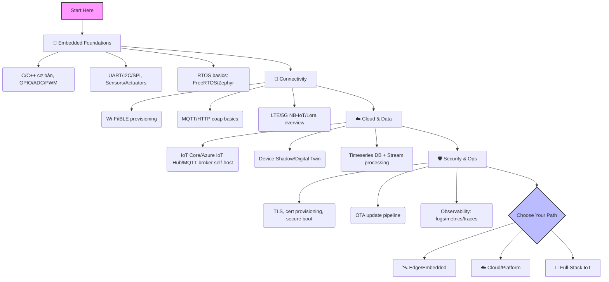

# 🌐 Internet of Things (IoT) Roadmap

> [← Back to domains](../README.md) | [Home](../../README.md)
>
> **Difficulty:** 🟢 Beginner → 🔴 Advanced (Progressive)
>
> **Prerequisites:** Lập trình C/C++ hoặc Python cơ bản, kiến thức điện tử số cơ bản (GPIO, UART), mạng máy tính căn bản (TCP/IP).
>
> **Time to Master:** 12-24 tháng (từ prototyping đến triển khai edge + cloud)

**🧩 Knowledge Audit (gợi ý):**
* Sử dụng checklist tự đánh giá: kiến thức MCU (GPIO, ADC, PWM), kết nối (UART/I2C/SPI), MQTT/HTTP, bảo mật thiết bị (TLS, provisioning), và cloud IoT (Shadow/Digital Twin).

---

## 🗺️ 1. Reality Check: IoT Engineer

| Tiêu chí | Embedded/Edge Engineer | IoT Cloud/Platform | IoT Full-Stack (Device ↔ Cloud) |
| :--- | :--- | :--- | :--- |
| **Độ khó** | ⭐⭐⭐⭐ (Firmware, RTOS, debug phần cứng) | ⭐⭐⭐ (Backend + event streaming) | ⭐⭐⭐⭐ (Phối hợp HW/SW/Cloud) |
| **Cơ hội việc làm** | ⭐⭐⭐⭐ (Thiết bị công nghiệp, sản phẩm tiêu dùng) | ⭐⭐⭐⭐ (Platform, data, integration) | ⭐⭐⭐⭐ (Team nhỏ, startup) |
| **Tech Stack** | C/C++, FreeRTOS/Zephyr, HAL/SDK, BLE/Wi-Fi, MQTT | Node/Go/Python, REST/gRPC, MQTT broker, Kafka, Timeseries DB | Kết hợp MCU + Cloud, OTA, observability |
| **Verdict** | Nếu mạnh firmware/điện tử, chọn Edge; nếu mạnh backend/data, chọn Cloud; muốn tổng lực thì Full-Stack IoT. |

---

## 📚 2. Visual Roadmap



### Visual Roadmap – Printable (PNG/SVG)
- [Visual Roadmap (PNG)](./visuals/iot-roadmap.png)
- [Visual Roadmap (SVG)](./visuals/iot-roadmap.svg)
- [Topic Map (OTA + C2)](./visuals/iot-ota-c2-topics.svg)

> Nếu chưa tồn tại file hình, xem `visuals/README.md` để biết cách xuất mermaid sang PNG/SVG.

---

## 🧭 3. Detailed Roadmap (Mục lục)

### Foundations (Nền tảng bắt buộc)
* **C/C++ for MCU**: biến/điều khiển GPIO, ngắt (interrupt), timer, UART logging.
* **Giao tiếp phần cứng**: UART/I2C/SPI, đọc cảm biến (temp/humidity), điều khiển relay/LED/servo.
* **RTOS cơ bản**: Task, queue, semaphore, low-power, scheduler tick.
* **Kết nối cơ bản**: Wi-Fi/BLE provisioning, MQTT publish/subscribe, HTTP(s) call đơn giản.

### Connectivity & Protocols
* **MQTT v3.1.1/v5**: QoS 0/1/2, retain, last will, topic design, session.
* **HTTP/CoAP**: khi nào dùng REST vs CoAP; idempotent methods cho thiết bị yếu.
* **BLE/Wi-Fi/NB-IoT/LoRa**: trade-off năng lượng, băng thông, phạm vi; chọn module phù hợp use case.

### Cloud & Data Layer
* **Message Broker**: EMQX/Mosquitto/AWS IoT Core/Azure IoT Hub; auth (mutual TLS), rate limit.
* **Device Shadow / Digital Twin**: đồng bộ trạng thái thiết bị ↔ cloud, quản lý desired vs reported state.
* **Data Pipeline**: Ingest → Stream (Kafka/Kinesis) → Timeseries DB (InfluxDB/TimescaleDB) → Dashboard/Alert.
* **Command & Control (C2)**: RPC xuống thiết bị, thiết kế topic và ACL an toàn.

### Security & Operations
* **Thiết bị**: Secure boot, firmware signing, unique device key (per-device cert), secure storage (TPM/SE nếu có).
* **Kênh truyền**: TLS 1.2+, cert rotation, mTLS, chống replay.
* **OTA**: Delta update, versioning, rollback, staged rollout, health check.
* **Observability**: Logs/metrics/traces, fleet monitoring, alerting (offline detection, battery drop, error spikes).

### Edge/Embedded Track
* **Toolchain & SDK**: ESP-IDF/STM32 HAL/nRF SDK; CMake/PlatformIO.
* **RTOS nâng cao**: Task pinning, memory footprint, power profiling, watchdog, brown-out detection.
* **Edge ML (tuỳ chọn)**: TinyML (TFLite Micro), keyword spotting, anomaly detection on MCU.

### Cloud/Platform Track
* **Ingestion & API**: REST/gRPC for admin, MQTT bridge, authZ với IAM.
* **Multi-tenant & ACL**: Tách namespace theo tenant, role (device vs operator), policy-as-code.
* **Timeseries & Alerting**: Retention policy, downsampling, anomaly detection.
* **SRE for IoT**: SLO cho latency uplink/downlink, error budget, canary/blue-green cho OTA backend.

### Labs (Thực hành gợi ý)
* **Lab 1 – ESP32 Hello IoT (C code ESP-IDF)**
  * Mục tiêu: Đọc DHT22, publish MQTT.
  * Snippet (ESP-IDF):
    ```c
    // main.c (rút gọn)
    esp_mqtt_client_handle_t client;
    static void mqtt_event_handler(void *handler_args, esp_event_base_t base, int32_t event_id, void *event_data) {
      if (event_id == MQTT_EVENT_CONNECTED) {
        esp_mqtt_client_publish(client, "iot/demo/temp", "{\"temp\":24.5}", 0, 1, 0);
      }
    }
    void app_main(void) {
      // WiFi init + connect...
      esp_mqtt_client_config_t cfg = {.uri="mqtts://broker.example.com", .cert_pem=server_cert_pem};
      client = esp_mqtt_client_init(&cfg);
      esp_mqtt_client_register_event(client, ESP_EVENT_ANY_ID, mqtt_event_handler, NULL);
      esp_mqtt_client_start(client);
    }
    ```
  * Bước: Flash ESP-IDF, connect Wi-Fi, MQTT pub/sub, xem bằng MQTTX.

* **Lab 2 – STM32 + FreeRTOS MQTT (C code HAL)**
  * Mục tiêu: STM32F4 đọc cảm biến qua I2C, gửi MQTT qua module ESP8266 (AT) hoặc W5500.
  * Snippet (pseudo):
    ```c
    // task_mqtt.c (giả lập)
    void vTaskMQTT(void *pv) {
      for(;;) {
        float t = read_temp_i2c();
        char payload[64];
        snprintf(payload, 64, "{\"t\":%.2f}", t);
        mqtt_publish("factory/node1/temp", payload, QOS1);
        vTaskDelay(pdMS_TO_TICKS(5000));
      }
    }
    ```
  * Bước: FreeRTOS tasks: sensor task + MQTT task; queue để gửi payload; kiểm tra reconnect.

* **Lab 3 – Secure MQTT + OTA (ESP32)**
  * Mục tiêu: mTLS + OTA delta.
  * Snippet (ESP-IDF OTA):
    ```c
    esp_http_client_config_t cfg = {
      .url = "https://ota.example.com/firmware.bin",
      .cert_pem = server_cert_pem,
    };
    esp_err_t ret = esp_https_ota(&cfg);
    if (ret == ESP_OK) esp_restart();
    ```
  * Bước: Gen CA + per-device cert, cấu hình EMQX mTLS, ký firmware, OTA delta (ESP-IDF patch update).

* **Lab 4 – Cloud Ingest & Dashboard (Kafka + TimescaleDB)**
  * Mục tiêu: MQTT bridge → Kafka → TimescaleDB → Grafana + alert offline.
  * Pipeline bước:
    1) EMQX/Mosquitto bridge MQTT topic `sensors/#` → Kafka topic `iot.sensors` (QoS1).
    2) Kafka Connect sink → TimescaleDB (schema gợi ý):
       ```sql
       CREATE TABLE readings (
         device_id text,
         ts timestamptz NOT NULL,
         temp double precision,
         hum double precision,
         battery double precision,
         PRIMARY KEY (device_id, ts)
       );
       SELECT create_hypertable('readings', 'ts');
       ```
    3) Grafana: dashboard, alert rule offline (no data 5m), battery < 20%.

* **Lab 5 – Command & Control (C2) với idempotency**
  * Mục tiêu: Điều khiển relay từ cloud, tránh replay.
  * Topic gợi ý: `cmd/{deviceId}`; payload:
    ```json
    {"cmd":"relay_on","id":"uuid-123","exp":1710000000}
    ```
  * Thiết bị phải:
    * Kiểm tra `exp`, từ chối nếu hết hạn.
    * Lưu `id` gần nhất để chống replay.
    * Gửi ack: `ack/{deviceId}` với status và idempotency key.

* **Lab 6 – Edge ML (Optional)**
  * Mục tiêu: Keyword spotting on-device.
  * Bước: TFLite Micro trên ESP32, quantize INT8, benchmark latency; bật deep sleep giữa các lần infer.

### Hướng dẫn build/flash nhanh

**ESP-IDF (ESP32)**
```bash
# Cài IDF (nếu chưa):
git clone --recursive https://github.com/espressif/esp-idf.git
cd esp-idf && ./install.sh esp32 && . ./export.sh

# Build & flash
idf.py set-target esp32
idf.py build
idf.py -p COM3 flash monitor   # trên Windows đổi COM3 theo cổng
```
Notes: dùng `menuconfig` để set Wi-Fi SSID/PWD, broker URI; bật `CONFIG_MQTT_TRANSPORT_SSL` để dùng mTLS.

**PlatformIO (ESP32)**
`platformio.ini` tối thiểu:
```ini
[env:esp32dev]
platform = espressif32
board = esp32dev
framework = arduino
monitor_speed = 115200
lib_deps = 
  knolleary/PubSubClient
build_flags = 
  -D WIFI_SSID="\"your-ssid\""
  -D WIFI_PASS="\"your-pass\""
```
Lệnh: `pio run -t upload -t monitor`.

**STM32CubeMX + FreeRTOS + MQTT (qua ESP8266 AT/W5500)**
1) CubeMX: bật FreeRTOS, UART cho ESP8266 (hoặc SPI cho W5500), I2C cho cảm biến.
2) Generate code → mở bằng STM32CubeIDE hoặc Makefile project.
3) Thêm MQTT client (như `paho.mqtt.embedded-c` hoặc `MQTT-C`), tạo task MQTT và sensor task.
4) Build & flash qua ST-Link: `st-flash write build/firmware.bin 0x8000000` (hoặc dùng CubeIDE Run/Debug).

### Cấu hình mẫu hạ tầng

**EMQX (ACL + bridge Kafka)**
`emqx.conf` (rút gọn ý tưởng):
```
auth.mqtt.jwt.enable = true
# hoặc auth.mqtt.jwt = off và dùng cert-based nếu mTLS

listener.tcp.external = 1883
listener.ssl.external = 8883
listener.ssl.external.certfile = /etc/emqx/certs/server.pem
listener.ssl.external.keyfile  = /etc/emqx/certs/server.key

bridge.mqtt.aws.address = kafka-bridge:1883
bridge.mqtt.aws.proto_ver = mqttv4
bridge.mqtt.aws.forwards = sensors/#
```
Topic design gợi ý: `devices/{deviceId}/state`, `devices/{deviceId}/telemetry`, `cmd/{deviceId}`, `ack/{deviceId}`.

**Kafka Connect → TimescaleDB**
Connector (JDBC sink) ví dụ `timescale-sink.json`:
```json
{
  "name": "timescale-sink",
  "config": {
    "connector.class": "io.confluent.connect.jdbc.JdbcSinkConnector",
    "tasks.max": "1",
    "topics": "iot.sensors",
    "connection.url": "jdbc:postgresql://timescaledb:5432/iot?user=iot&password=pass",
    "insert.mode": "insert",
    "pk.mode": "none",
    "auto.create": "true",
    "auto.evolve": "true",
    "table.name.format": "readings"
  }
}
```
Timescale schema tối thiểu:
```sql
CREATE TABLE IF NOT EXISTS readings (
  device_id text,
  ts timestamptz NOT NULL,
  temp double precision,
  hum double precision,
  battery double precision,
  PRIMARY KEY (device_id, ts)
);
SELECT create_hypertable('readings', 'ts', if_not_exists => TRUE);
SELECT add_retention_policy('readings', INTERVAL '90 days');
```

### Case Study đầy đủ: "Smart Factory Floor" (tóm lược nhiều trang)

**Bối cảnh**: 500 thiết bị STM32/ESP32 đo nhiệt/độ ẩm/rung tại 5 xưởng. Yêu cầu: alert sớm quá nhiệt, offline, pin yếu; C2 bật/tắt quạt; OTA an toàn; SLO ingest < 2s, mất gói <0.1%.

**Kiến trúc**
```
Devices (STM32+ESP32) --MQTT QoS1--> EMQX --bridge--> Kafka (iot.sensors)
Kafka Connect JDBC --> TimescaleDB --> Grafana/Alert
Operator UI/API (REST/gRPC) --> Command topic (cmd/{deviceId})
ACK topic (ack/{deviceId}) back to EMQX -> UI
OTA server (HTTPS) + signed firmware; EMQX for status callbacks
```

**Topic map (đề xuất)**
- Telemetry: `devices/{deviceId}/telemetry` (QoS1)
- State/Shadow: `devices/{deviceId}/state` (reported), `desired/{deviceId}` (desired)
- Command: `cmd/{deviceId}` (QoS1), payload `{cmd,id,exp}`
- Ack: `ack/{deviceId}` with `{id,status,error}`
- OTA status: `ota/{deviceId}/status`

**Schema (TimescaleDB)**
```sql
CREATE TABLE readings (
  device_id text,
  ts timestamptz NOT NULL,
  temp double precision,
  hum double precision,
  vib double precision,
  battery double precision,
  PRIMARY KEY (device_id, ts)
);
SELECT create_hypertable('readings', 'ts');
SELECT add_retention_policy('readings', INTERVAL '180 days');
```

**Alert rules (Grafana/Alertmanager)**
- Offline: no data 5m from `devices/{id}`
- Over-temp: temp > 75°C trong 3 mẫu liên tiếp
- Battery low: battery < 20%
- Sensor spike: vib z-score > 3 trong 5 phút

**Kịch bản sự cố & khắc phục**
1) **MQTT backlog tăng cao**: kiểm tra QoS, bật bridge async, scale Kafka partition; rate limit device chatty.
2) **Thiết bị offline hàng loạt (Wi-Fi/Power)**: quan sát RSSI/battery; fallback lưu buffer local và resend khi reconnect.
3) **Lệnh C2 bị lặp**: dùng idempotency key, TTL `exp`, lưu cache id gần nhất; broker ACL ngăn publish trái phép.
4) **Dữ liệu trễ >2s**: xem latency EMQX→Kafka→Connector→DB; tăng consumer parallelism; bật compression.
5) **Firmware OTA lỗi/brick**: dùng dual-partition + rollback; staged rollout 5%→20%→100%; abort khi error rate >3%.

**Quy trình OTA an toàn (tóm tắt)**
1) Ký firmware (hash + private key) → upload OTA server.
2) Thiết bị tải HTTPS, verify signature + version > current.
3) Flash vào partition B, reboot test; nếu fail health check thì rollback partition A.
4) Báo cáo trạng thái qua `ota/{deviceId}/status`.

### Career & Certification Mapping
| Track | Junior Goal | Advanced Goal | Content Mapping |
| --- | --- | --- | --- |
| Embedded/Edge | Hiểu GPIO, RTOS cơ bản, MQTT pub/sub | OTA, secure boot, low-power, TinyML | Foundations, Connectivity, Security, Edge Track |
| Cloud/Platform | MQTT broker, ingest pipeline, dashboard | Multi-tenant, digital twin, SRE, alerting | Cloud & Data, Security, Cloud Track |
| Full-Stack IoT | MCU ↔ Cloud end-to-end demo | Fleet-scale ops, staged rollout, observability | All modules + Labs 1-4 |

### Learning Path (6-12-18 tháng)
* **0-3 tháng (Foundations)**: C/C++ hoặc Python MCU; GPIO/ADC/PWM; UART/I2C/SPI; Wi-Fi/BLE provisioning; MQTT pub/sub; flash firmware ESP32/STM32; logging + watchdog.
* **4-6 tháng (Connectivity & Cloud)**: MQTT v5 QoS, topic design; EMQX/Mosquitto; Device Shadow/Digital Twin; REST/gRPC cho operator; Timeseries DB + dashboard; alert offline/battery.
* **7-9 tháng (Security & OTA)**: mTLS per-device cert; secure boot + firmware signing; OTA staged rollout & rollback; ACL/rate limit; C2 idempotency.
* **10-12 tháng (Data & SRE)**: Kafka ingest, partitioning; TimescaleDB retention/downsampling; SLO latency/loss; canary OTA backend; blue-green.
* **12-18 tháng (Specialize)**: TinyML (keyword spotting/anomaly); Edge gateway; Multi-tenant IoT platform; Rule engine/stream processing; Cost & power optimization.

### Ứng dụng điển hình (Use-case mapping)
* **Smart Home/Building**: HVAC, chiếu sáng, năng lượng; yêu cầu bảo mật OTA và quyền riêng tư.
* **Industrial/Factory**: Predictive maintenance (vibration/temp), SCADA integration, downtime alert.
* **Energy/Utility**: AMI/Smart meter, lưới điện thông minh, load shifting, giám sát pin/solar.
* **Agriculture**: Cảm biến đất/độ ẩm, tưới tự động, NB-IoT/LoRa cho vùng rộng.
* **Healthcare/Wellness**: Wearable BLE → Gateway → Cloud; yêu cầu tuân thủ bảo mật dữ liệu.

### Case Studies (tóm tắt)
1) **Smart Factory – Predictive Maintenance**
   * Thiết bị: STM32 + accelerometer; sampling 1 kHz, edge feature (RMS, kurtosis); gửi MQTT QoS1.
   * Cloud: MQTT → Kafka → TimescaleDB; alert qua Grafana/Slack; OTA để cập nhật ngưỡng.
   * Security: mTLS, ACL theo thiết bị/site; OTA signed + staged.
2) **Smart Home – Secure OTA & C2**
   * Thiết bị: ESP32 Wi-Fi + relay + DHT22; provisioning BLE, chuyển Wi-Fi; C2 idempotent.
   * Cloud: EMQX bridge → Kafka; device shadow cho trạng thái relay; alert offline >5 phút.
   * Security: mTLS, per-device cert; firmware signing; replay protection cho command.
3) **Cold Chain – Temperature Compliance**
   * Thiết bị: ESP32 hoặc nRF52 + LTE-M/NB-IoT; gửi temp mỗi 2 phút, lưu buffer khi mất mạng.
   * Cloud: MQTT QoS1; TimescaleDB retention 90 ngày; alert khi >8°C quá 10 phút.
   * Ops: SLO latency <2s cho alert; dashboard hành trình; OTA khi thay đổi logic cảnh báo.

---

## ✅ 4. Checklist gợi ý

- [ ] Làm Lab 1 (ESP32 + MQTT cơ bản)
- [ ] Thiết lập mTLS và kiểm chứng với broker (Lab 2)
- [ ] Dựng pipeline ingest + dashboard (Lab 3)
- [ ] Thiết kế & thử nghiệm C2 an toàn (Lab 4)
- [ ] (Tuỳ chọn) TinyML demo (Lab 5)

> **Last Updated:** March 2026