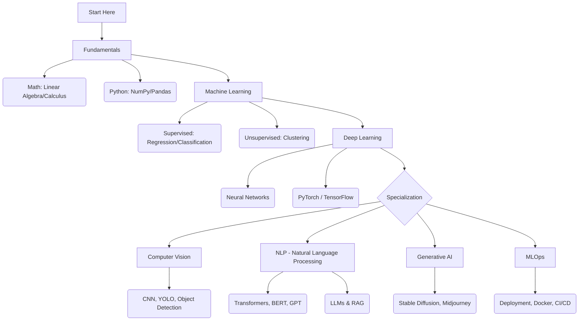

# 🤖 Artificial Intelligence & Machine Learning Roadmap

> [← Back to Home](../../README.md) | [🚀 Quick Start](../../QUICK-START.md) | [📖 Glossary](../../GLOSSARY.md)
>
> **Difficulty:** 🟢 Beginner → 🔴 Advanced (Progressive)
>
> **Prerequisites:** Python basics, High school math (improving as you go)
>
> **Time to Master:** 12-24 months (Beginner to Production-ready)

**🎯 New to AI/ML?** Start with [Quick Start Guide](../../QUICK-START.md) to find your path!  
**🗺️ Structured 9-step path:** [AI Engineering Roadmap 2026](./ai-engineering-roadmap-2026.md) — Foundation → RAG → **Agents** → MLOps → Portfolio.  
**🔍 AI terms:** See [Glossary](../../GLOSSARY.md) for Machine Learning, Neural Networks, LLM, etc.  
**📊 Difficulty levels:** See [DIFFICULTY-GUIDE.md](../../DIFFICULTY-GUIDE.md) to understand learning paths.  
**🧩 Knowledge Audit:** Check [AI & ML Knowledge Audit](../../case-studies/knowledge-audits/ai-knowledge-audit.md) to test your expertise!

---

AI không còn là khoa học viễn tưởng. Nó đang viết code, vẽ tranh và lái xe.
Lộ trình này giúp bạn đi từ con số 0 đến việc xây dựng được mô hình Generative AI của riêng mình.

---

## 🗺️ Visual Roadmap

---

## 📚 Detailed Roadmap

### **1. Fundamentals (Nền tảng)**
*   **[Mathematics for ML](./fundamentals/math-for-ml.md):** Đại số tuyến tính (Vector/Matrix), Giải tích (Đạo hàm) và Xác suất thống kê.
*   **[Python Data Stack](./fundamentals/python-data-stack.md):** Thành thạo NumPy, Pandas và Matplotlib để xử lý dữ liệu.

### **2. Machine Learning (Classic ML)**
*   **[Supervised Learning](./machine-learning/supervised-learning.md):** Hồi quy tuyến tính, Logistic Regression, Decision Trees và SVM.
*   **Unsupervised Learning:** Phân cụm (K-Means) và Giảm chiều dữ liệu (PCA). *(Coming soon)*

### **3. Deep Learning (Mạng nơ-ron)**
*   **[Neural Networks 101](./deep-learning/neural-networks-101.md):** Perceptron, Backpropagation và các hàm kích hoạt (ReLU, Sigmoid).

### **4. Computer Vision (Thị giác máy tính)**
*   **[CNN Architectures](./computer-vision/cnn-architectures.md):** Mạng tích chập (CNN), ResNet, YOLO để nhận diện vật thể.

### **5. NLP (Xử lý ngôn ngữ tự nhiên)**
*   **[Transformers & LLMs](./nlp/transformers-llm.md):** Cơ chế Attention, BERT, GPT và cách Fine-tune mô hình ngôn ngữ lớn.

### **6. Generative AI (AI tạo sinh)**
*   **[Diffusion Models](./generative-ai/diffusion-models.md):** Cách Stable Diffusion vẽ tranh từ văn bản.
*   **[🛡️ Responsible AI](./generative-ai/responsible-ai.md):** Nguyên tắc, rủi ro và cách xây dựng AI an toàn, công bằng.

### **7. AI Agents & Multi-Agent Systems (Trợ lý AI)** — *Bước 4 trong [AI Engineering Roadmap 2026](./ai-engineering-roadmap-2026.md)*
*   **[Agents — Mục lục & Lộ trình](./agents/README.md):** ⭐ Tổng quan và thứ tự học (Architecture → Frameworks → RAG/Memory → Multi-Agent → Eval).
*   **[Agent Architecture](./agents/agent-architecture.md):** Cấu trúc của một Agent (LLM + Memory + Planning + Tools).
*   **[Agent Frameworks](./agents/agent-frameworks.md):** LangChain, LangGraph, AutoGen và CrewAI.
*   **[Multi-Agent Collaboration](./agents/multi-agent-collaboration.md):** Cách nhiều Agent hợp tác để giải quyết vấn đề phức tạp.
*   **[Autonomous Agents](./agents/autonomous-agents.md):** AutoGPT, BabyAGI và tương lai của AI tự chủ.

### **8. Advanced Agent Techniques (Chuyên sâu)**
*   **[Advanced RAG](./agents/advanced/graph-rag.md):** GraphRAG, Hybrid Search và Reranking.
*   **[Advanced Memory](./agents/advanced/memory-architecture.md):** MemGPT và quản lý bộ nhớ dài hạn.
*   **[Design Patterns](./agents/advanced/design-patterns.md):** Reflection, Planning (ToT) và Tool Selection.
*   **[Local Agents](./agents/advanced/local-agents.md):** Chạy Agent Offline với Ollama/Llama.cpp.
*   **[Evaluation](./agents/advanced/evaluating-agents.md):** Đánh giá Agent bằng RAGAS và AgentBench.
*   **[Human-in-the-loop](./agents/advanced/human-in-the-loop.md):** Tương tác người máy, Streaming và UX.

### **9. MLOps (Vận hành AI)**
*   **[Deployment Pipeline](./mlops/deployment-pipeline.md):** Đưa mô hình từ Notebook ra Production bằng Docker và Kubernetes.
*   **[CI/CD for AI](./mlops/cicd-for-ai.md):** Quy trình CI/CD chuyên biệt cho Machine Learning (CT & Model Registry).

---

## 🛠️ Tools & Frameworks
*   **Frameworks:** PyTorch (Research), TensorFlow (Production), Scikit-learn.
*   **Environment:** Jupyter Notebook, Google Colab, Kaggle.
*   **Tracking:** MLflow, Weights & Biases (W&B).

---

> **Last Updated:** February 2026
