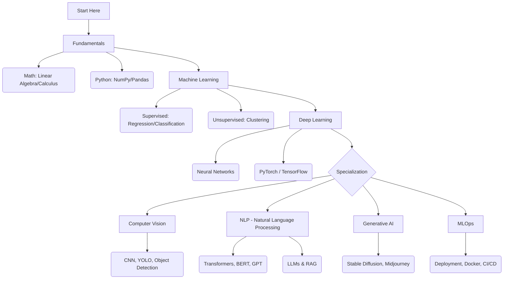

# 🤖 Artificial Intelligence & Machine Learning Roadmap

> [← Back to Home](../../README.md) | [🚀 Quick Start](../../QUICK-START.md) | [📖 Glossary](../../GLOSSARY.md)
>
> **📊 Difficulty levels:** See [DIFFICULTY-GUIDE.md](../../DIFFICULTY-GUIDE.md) to understand learning paths.
> **🧩 Knowledge Audit:** Check [AI & ML Knowledge Audit](../../case-studies/knowledge-audits/ai-knowledge-audit.md) to test your expertise!
> **🔗 External Resources:** [resources/collected_links/ai-development.md](../../resources/collected_links/ai-development.md)
> **📚 Glossary:** Jump to [GLOSSARY.md](../../GLOSSARY.md) for quick definitions.
> **📅 Last reviewed:** March 2026

**🎯 New to AI/ML?** Start with [Quick Start Guide](../../QUICK-START.md) to find your path!  
**🗺️ Structured 9-step path:** [AI Engineering Roadmap 2026](./ai-engineering-roadmap-2026.md) — Foundation → RAG → **Agents** → MLOps → Portfolio.  
AI không còn là khoa học viễn tưởng. Nó đang viết code, vẽ tranh và lái xe.
Lộ trình này giúp bạn đi từ con số 0 đến việc xây dựng được mô hình Generative AI của riêng mình.

## 📑 Case Study Index (học từ thất bại & vận hành thực chiến)
- **Engineering:** [Knight Capital deployment failure](../../case-studies/mental-models-analysis/engineering-analysis-deployment-failure.md) — 440M USD vì lỗi rollout, bài học margin of safety & rollback.
- **Economics:** [Food Delivery Platform unit economics](../../case-studies/mental-models-analysis/economics-analysis-platform-failure.md) — Chi phí cơ hội, elasticity, trần lợi nhuận.
- **Incentives / Opportunity Cost / Elasticity:** Lăng kính kinh tế để đánh giá động cơ, chi phí cơ hội và hiệu ứng lề trước khi ra quyết định.
- **History:** [Nokia fall](../../case-studies/mental-models-analysis/history-analysis-nokia-fall.md) — Path dependence, Lindy, mistiming.
- **Math (optional):** [Blitzscaling growth vs fragility](../../case-studies/mental-models-analysis/amazon-blitzscaling-analysis.md) — Trade-off tăng trưởng và độ bền hệ thống.

---
### 🧭 Cách đọc & tính hành động
- Bài có biểu tượng **✓** chứa mục **“Ứng dụng Thực chiến”** (checklist triển khai nhanh). Ví dụ: [AI Agent Use Cases](./agents/agent-use-cases.md).
- Gợi ý template cho bài mới: 1) Định nghĩa / mô hình; 2) Ví dụ đời sống/kinh doanh; 3) Ứng dụng Thực chiến (3–5 bullet cụ thể); 4) Link case study (nếu có).

### 📈 Economics as mental models (Layer 2.5)
- Nếu muốn đào sâu incentives / opportunity cost / elasticity / game theory: đọc **[Behavioral Economics](../../guides/02-wealth-business/investing/advanced/behavioral-economics.md)** (đã có phần bias & quyết định), hoặc **[Macroeconomics](../../guides/02-wealth-business/investing/advanced/macroeconomics.md)** và **[Microeconomics](../../guides/02-wealth-business/investing/advanced/microeconomics.md)**.
- Tích hợp vào workflow quyết định: coi như bộ lăng kính để đánh giá chi phí cơ hội, động cơ, hiệu ứng lề (elasticity) trước khi chọn mô hình/giải pháp.

### 🧩 Integration Layer: Stacking models (1–2 trang)
- Xem chi tiết: [Integration Layer — Stacking Mental Models](./integration-layer.md).

### ✅ Mental model of the week
- Gợi ý: mỗi tuần 1 model + 1 experiment nhỏ. Ví dụ Tuần 1: **Hanlon’s Razor** — khi bực, tự hỏi “có phải vô ý không?”.
- Đặt lịch trong Metacog-OS hoặc todo cá nhân, gắn nhãn ✓ sau khi thử nghiệm 3–5 lần.

## 📌 Mục lục nhanh (highlights)
- Fundamentals: [math-for-ml](./fundamentals/math-for-ml.md), [python-data-stack](./fundamentals/python-data-stack.md) — Toán & Python nền tảng.
- Machine Learning: [supervised-learning](./machine-learning/supervised-learning.md), [unsupervised-learning](./machine-learning/unsupervised-learning.md), [ensemble-methods](./machine-learning/ensemble-methods.md), [feature-engineering](./machine-learning/feature-engineering.md) — Thuật toán cổ điển & xử lý đặc trưng.
- Deep Learning: [neural-networks-101](./deep-learning/neural-networks-101.md), [optimization-tricks](./deep-learning/optimization-tricks.md), [regularization](./deep-learning/regularization.md) — Mạng nơ-ron, tối ưu và chống overfit.
- Computer Vision: [cnn-architectures](./computer-vision/cnn-architectures.md), [image-segmentation](./computer-vision/image-segmentation.md), [vision-transformers](./computer-vision/vision-transformers.md), [3d-vision](./computer-vision/3d-vision.md) — Nhận dạng, phân đoạn, ViT, 3D/NeRF.
- NLP: [transformers-llm](./nlp/transformers-llm.md), [llm-fine-tuning](./nlp/llm-fine-tuning.md), [llm-inference-optimization](./nlp/llm-inference-optimization.md) — LLM, fine-tune, tối ưu suy luận.
- Generative AI: [diffusion-models](./generative-ai/diffusion-models.md), [multimodal-models](./generative-ai/multimodal-models.md), [text-to-video](./generative-ai/text-to-video.md) — Sinh ảnh/âm thanh/video, mô hình đa phương thức.
- Reinforcement Learning: [README](./reinforcement-learning/README.md), [rl-fundamentals](./reinforcement-learning/rl-fundamentals.md), [policy-gradient](./reinforcement-learning/policy-gradient.md) — Cơ bản RL, chính sách/giá trị, policy gradient.
- MLOps: [deployment-pipeline](./mlops/deployment-pipeline.md), [llmops](./mlops/llmops.md), [experiment-tracking](./mlops/experiment-tracking.md) — Triển khai, vận hành, theo dõi thí nghiệm.
- Labs: [labs/README](./labs/README.md) — Kaggle guide, dự án RAG chatbot, Colab GPU tips.
- Advanced: [distributed-training](./advanced/distributed-training.md), [interpretability](./advanced/interpretability.md), [ai-security](./advanced/ai-security.md) — Scale, giải thích, an toàn.

## 🗺️ Visual Roadmap

---

## 📚 Detailed Roadmap

### **1. Fundamentals (Nền tảng)**
*   **[Mathematics for ML](./fundamentals/math-for-ml.md):** Đại số tuyến tính (Vector/Matrix), Giải tích (Đạo hàm) và Xác suất thống kê.
*   **[Python Data Stack](./fundamentals/python-data-stack.md):** Thành thạo NumPy, Pandas và Matplotlib để xử lý dữ liệu.

### **2. Machine Learning (Classic ML)**
*   **[Supervised Learning](./machine-learning/supervised-learning.md):** Hồi quy tuyến tính, Logistic Regression, Decision Trees và SVM.
*   **[Unsupervised Learning](./machine-learning/unsupervised-learning.md):** Phân cụm (K-Means, Hierarchical, DBSCAN), giảm chiều (PCA, t-SNE/UMAP) và anomaly detection.
*   **[Semi-Supervised Learning](./machine-learning/semi-supervised-learning.md):** Pseudo-labeling, consistency regularization, graph-based và workflow thực chiến.
*   **[Feature Engineering](./machine-learning/feature-engineering.md):** Quy trình 5 bước, kỹ thuật numerical/categorical/text, automation và checklist triển khai.
*   **[Feature Selection](./machine-learning/feature-selection.md):** Filter/Wrapper/Embedded methods, stability selection và chiến lược cho time-series.
*   **[Model Selection & HPO](./machine-learning/model-selection.md):** Cross-validation, nested CV, Optuna/Ray Tune workflow và tiêu chí chọn model.
*   **[Ensemble Methods](./machine-learning/ensemble-methods.md):** Bagging, Boosting, Stacking và các best practices triển khai.
*   **[Practice Pack](./machine-learning/practice-exercises.md):** Bài tập regression, classification, clustering, anomaly và feature store mini project.
*   **[Benchmark Datasets](./machine-learning/benchmark-datasets.md):** Bộ dữ liệu regression, classification, anomaly, time-series để luyện tập.
*   **[Deployment Templates](./machine-learning/deployment-templates.md):** REST API, batch pipelines, CI/CD và monitoring checklist.
*   **[Experiment Tracking](./machine-learning/experiment-tracking.md):** Template ghi chép thí nghiệm, MLflow/W&B snippets và checklist reproducibility.
*   **[Cost Optimization](./machine-learning/cost-optimization.md):** Chiến lược tiết kiệm chi phí data, compute, inference và monitoring.
*   **[Cloud Guides](./machine-learning/cloud-guides.md):** Cheat-sheet dịch vụ AWS/Azure/GCP cho training, deployment và multi-cloud tips.
*   **[Hands-on Labs](./machine-learning/hands-on-labs.md):** Notebook template, project ideas và Kaggle competition playbook.
*   **[AI/ML Labs & Projects](./labs/README.md):** Chuẩn hoá cách luyện tập qua hướng dẫn Kaggle, dự án end-to-end (classification, sentiment, recommender) và build nâng cao (RAG chatbot, coding agent, Colab GPU tips).
    *   **[Kaggle Competition Guide](./labs/kaggle-competition-guide.md):** Checklist chuẩn bị dữ liệu, baseline, submit và tối ưu leaderboard.
    *   **[Project RAG Chatbot](./labs/project-rag-chatbot.md):** Thiết kế kiến trúc RAG, chunking, retriever hybrid và UX chat.
    *   **[Colab GPU Tips](./labs/colab-gpu-tips.md):** Tối ưu quota, mixed precision, profile GPU và mẹo tiết kiệm chi phí.

### **3. Deep Learning (Mạng nơ-ron)**
*   **[Neural Networks 101](./deep-learning/neural-networks-101.md):** Perceptron, Backpropagation và các hàm kích hoạt (ReLU, Sigmoid).
*   **[Optimization Tricks](./deep-learning/optimization-tricks.md):** Chọn optimizer (SGD, AdamW), LR scheduling (Cosine, OneCycle), gradient clipping, AMP, BatchNorm/LayerNorm tips.
*   **[Regularization](./deep-learning/regularization.md):** Dropout/DropConnect, early stopping, data augmentation đa domain, weight decay, label smoothing, stochastic depth checklist.
*   **[Architectures Zoo](./deep-learning/architectures-zoo.md):** RNN → LSTM → GRU fundamentals, bidirectional/stacked cấu hình và checklist triển khai.
*   **[Convolutional Tricks](./deep-learning/convolutional-tricks.md):** ResNet/DenseNet/MobileNet cheat-sheet, depthwise/dilated conv, SE blocks, training & deployment checklist.
*   **[Transformers Fundamentals](./deep-learning/transformers-fundamentals.md):** Self-attention, positional encoding, encoder vs decoder, biến thể GPT/BERT/T5/ViT và training tips.

### **4. Computer Vision (Thị giác máy tính)**
*   **[CNN Architectures](./computer-vision/cnn-architectures.md):** Mạng tích chập (CNN), ResNet, YOLO để nhận diện vật thể.
*   **[Image Segmentation](./computer-vision/image-segmentation.md):** Semantic vs instance vs panoptic, U-Net, Mask R-CNN, DeepLab v3+, SAM.
*   **[Vision Transformers](./computer-vision/vision-transformers.md):** ViT, CLIP, SAM, DINO v2, workflow fine-tune và ứng dụng zero-shot.
*   **[Object Detection Guide](./computer-vision/object-detection-guide.md):** So sánh YOLO/Faster R-CNN/DETR, pipeline training → deployment.
*   **[Video Understanding](./computer-vision/video-understanding.md):** Action recognition (SlowFast, TimeSformer), temporal modeling và deployment tips.
*   **[3D Vision & Neural Rendering](./computer-vision/3d-vision.md):** Depth estimation, point cloud/mesh, NeRF & Gaussian Splatting workflows.
*   **[CV Applications](./computer-vision/cv-applications.md):** OCR, face recognition, medical imaging, retail, surveillance và checklist triển khai.
*   **[Segmentation & ViT Labs](./computer-vision/segmentation-vit-labs.md):** Hai lab thực hành (Brain Tumor UNet + Steel Defect ViT) với checklist triển khai.
*   **[CV Repo Template](./computer-vision/cv-repo-template.md):** Cấu trúc repo end-to-end (data, configs, training, deployment, Triton).
*   **[Realtime YOLOv8 + Triton](./computer-vision/realtime-yolov8-triton.md):** Camera stream → Triton inference → dashboard, kèm config & client code.

### **5. NLP (Xử lý ngôn ngữ tự nhiên)**
*   **[NLP Foundations](./nlp/nlp-foundations.md):** Cleaning, tokenization, feature engineering và classical pipeline.
*   **[Text Preprocessing](./nlp/text-preprocessing.md):** Tokenization strategies, normalization, stemming/lemmatization và pipeline template.
*   **[Traditional NLP](./nlp/traditional-nlp.md):** POS tagging, NER, sentiment, topic modeling với pipeline tiền-Transformer.
*   **[Embeddings Deep Dive](./nlp/embeddings-deep-dive.md):** Word2Vec, FastText, contextual & sentence embeddings.
*   **[Classic NLP Tasks](./nlp/classic-nlp-tasks.md):** NER, sentiment, topic modeling với CRF/SVM/LDA.
*   **[Transformers & LLMs](./nlp/transformers-llm.md):** Cơ chế Attention, BERT, GPT và cách Fine-tune mô hình ngôn ngữ lớn.
*   **[LLM Fine-tuning](./nlp/llm-fine-tuning.md):** Full fine-tune vs PEFT, LoRA/QLoRA workflow và checklist deploy.
*   **[LLM Inference Optimization](./nlp/llm-inference-optimization.md):** Quantization, vLLM/TensorRT-LLM, batching và cost control.
*   **[NLP Labs](./nlp/nlp-labs.md):** Chuỗi lab truyền thống (tokenizer toolkit, CRF NER, sentiment logistic vs BERT, topic dashboard).
*   **[Speech Processing](./nlp/speech-processing.md):** Workflow ASR/TTS, Wav2Vec2/Whisper, Tacotron/FastSpeech và deployment tips.
*   **[Information Retrieval](./nlp/information-retrieval.md):** BM25, dense retrieval, hybrid reranking và đánh giá nDCG/MRR.

### **6. Generative AI (AI tạo sinh)**
*   **[Diffusion Models](./generative-ai/diffusion-models.md):** Giải phẫu Stable Diffusion, sampling schedule và pipeline huấn luyện.
*   **[Multimodal Models](./generative-ai/multimodal-models.md):** Mô hình text-image-audio, CLIP/ALIGN, Flamingo, Chameleon và chiến lược fine-tune.
*   **[Text-to-Video](./generative-ai/text-to-video.md):** Workflow Sora/Gen-3/Runway, 3D Gaussian Splatting và quy trình render tối ưu.
*   **[Audio Generation](./generative-ai/audio-generation.md):** MusicLM, AudioLM, voice cloning và mẹo kiểm soát nhạc/cảm xúc.
*   **[3D Generation](./generative-ai/3d-generation.md):** NeRF, Gaussian Splatting, DreamFusion và ứng dụng XR/metaverse.
*   **[Prompt Testing & Evaluation](./generative-ai/prompt-testing.md):** Thiết lập test harness, đánh giá quality/cost/latency và checklist reproducibility.
*   **[Content Safety & Responsible AI](./generative-ai/content-safety.md):** Guardrails, watermarking, moderation pipelines.
*   **[Responsible AI Strategy](./generative-ai/responsible-ai.md):** Framework quản trị, tuân thủ và quy trình phê duyệt mô hình.

### **7. AI Agents & Multi-Agent Systems (Trợ lý AI)** — *Bước 4 trong [AI Engineering Roadmap 2026](./ai-engineering-roadmap-2026.md)*
*   **[Agents — Mục lục & Lộ trình](./agents/README.md):** ⭐ Tổng quan và thứ tự học (Architecture → Frameworks → RAG/Memory → Multi-Agent → Eval).
*   **[Agent Architecture](./agents/agent-architecture.md):** Cấu trúc của một Agent (LLM + Memory + Planning + Tools).
*   **[Agent Frameworks](./agents/agent-frameworks.md):** LangChain, LangGraph, AutoGen và CrewAI.
*   **[Multi-Agent Collaboration](./agents/multi-agent-collaboration.md):** Cách nhiều Agent hợp tác để giải quyết vấn đề phức tạp.
*   **[Autonomous Agents](./agents/autonomous-agents.md):** AutoGPT, BabyAGI và tương lai của AI tự chủ.

### **8. Advanced Agent Techniques (Chuyên sâu)**
*   **[Advanced RAG](./agents/advanced/graph-rag.md):** GraphRAG, Hybrid Search và Reranking.
*   **[Advanced Memory](./agents/advanced/memory-architecture.md):** MemGPT và quản lý bộ nhớ dài hạn.
*   **[Design Patterns](./agents/advanced/design-patterns.md):** Reflection, Planning (ToT) và Tool Selection.
*   **[Local Agents](./agents/advanced/local-agents.md):** Chạy Agent Offline với Ollama/Llama.cpp.
*   **[Evaluation](./agents/advanced/evaluating-agents.md):** Đánh giá Agent bằng RAGAS và AgentBench.
*   **[Human-in-the-loop](./agents/advanced/human-in-the-loop.md):** Tương tác người máy, Streaming và UX.

### **9. Reinforcement Learning**
*   **[RL Roadmap](./reinforcement-learning/README.md):** Lộ trình học RL theo giai đoạn Fundamentals → Algorithms → Applications.
*   **[RL Fundamentals](./reinforcement-learning/rl-fundamentals.md):** MDP, value/policy functions, exploration và workflow train PPO/DQN/SAC.
*   **[Q-Learning & DQN](./reinforcement-learning/q-learning.md):** Q-table, DQN, Double/Dueling, Rainbow và best practices.
*   **[Policy Gradient & Actor-Critic](./reinforcement-learning/policy-gradient.md):** REINFORCE, A2C/A3C, PPO, advantage/GAE và implementation notes.
*   **[Multi-Agent RL](./reinforcement-learning/multi-agent-rl.md):** Cooperative/competitive settings, CTDE, MADDPG, QMIX, MAPPO.
*   **[RL Applications](./reinforcement-learning/rl-applications.md):** Game AI, robotics, recommendation, finance và RLHF pipeline.
*   **[Model-Based RL](./reinforcement-learning/model-based-rl.md):** Dynamics model, MBPO/Dreamer/MuZero, planning (MPC/CEM) và best practices.
*   **[RL Labs & Playbook](./reinforcement-learning/rl-labs.md):** Chuỗi lab CartPole→PPO, SAC continuous control, multi-agent RLlib, offline RL, model-based MBPO/Dreamer, RLHF pipeline.
*   **[RL Repo Template](./reinforcement-learning/rl-repo-template.md):** Cấu trúc repo RL end-to-end (configs, agents, dynamics model, scripts, deployment, monitoring).

### **10. MLOps (Vận hành AI)**
*   **[Deployment Pipeline](./mlops/deployment-pipeline.md):** Đưa mô hình từ Notebook ra Production bằng Docker và Kubernetes.
*   **[CI/CD for AI](./mlops/cicd-for-ai.md):** Quy trình CI/CD chuyên biệt cho Machine Learning (CT & Model Registry).
*   **[Feature Stores](./mlops/feature-stores.md):** Feast, Tecton, kiến trúc batch + streaming và governance feature.
*   **[Experiment Tracking](./mlops/experiment-tracking.md):** MLflow, W&B, DVC và best practices reproducibility.
*   **[Model Registry](./mlops/model-registry.md):** Versioning, stages (dev/staging/prod) và workflow promote/rollback.
*   **[LLMOps](./mlops/llmops.md):** Quản lý prompt, eval RAG, guardrails, cost và A/B testing cho LLM.

### **11. Advanced Topics (Scaling & Safety)**
*   **[Module Overview](./advanced/README.md):** Lộ trình nâng cao để tối ưu và bảo vệ hệ thống AI production.
*   **[Distributed Training](./advanced/distributed-training.md):** DeepSpeed, FSDP, tensor/pipeline parallel và checklist vận hành.
*   **[Efficient Inference](./advanced/efficient-inference.md):** Quantization, pruning, distillation, vLLM/Triton serving patterns.
*   **[Synthetic Data](./advanced/synthetic-data.md):** Kỹ thuật sinh dữ liệu (GAN, diffusion, CTGAN) và validation/privacy.
*   **[Continual Learning](./advanced/continual-learning.md):** Chống catastrophic forgetting với replay, regularization, prompt adapters.
*   **[Interpretability](./advanced/interpretability.md):** SHAP, LIME, attention visualization, governance checklist.
*   **[AI Security](./advanced/ai-security.md):** Adversarial defense, model stealing protection, prompt injection guardrails.

---

## 🛠️ Tools & Frameworks
*   **Frameworks:** PyTorch (Research), TensorFlow (Production), Scikit-learn.
*   **Environment:** Jupyter Notebook, Google Colab, Kaggle.
*   **Tracking:** MLflow, Weights & Biases (W&B).
*   **Hardware:** [AI Hardware Landscape](./ai-hardware-guide.md) – GPU/TPU/edge devices, checklist chọn hạ tầng AI.

---

## 🔗 Cross-Domain Shortcuts
- **Strategic thinking / Mental models (Productivity):** [Productivity → Mental Models](../../guides/03-career-skills/productivity/mental-models/README.md)
- **Decision & Prioritization:** [Deep Work & Time Management](../../guides/03-career-skills/productivity/core-skills/personal-work-framework.md) · [Failure Management System](../../guides/03-career-skills/productivity/core-skills/failure-management-system.md)
- **Fast Correction Mindset (FMS):** [Tư duy sửa sai nhanh](../../guides/01-mental-models/fast-correction-mindset.md)
- **Recursion / Self-reference:** [Recursion in Consciousness](../../guides/01-mental-models/recursion-consciousness.md) · [Recursion in Psychology](../../guides/01-mental-models/psychology/recursion-in-psychology.md) · [Recursive Thinking](../../guides/01-mental-models/recursive-thinking.md)

---

> **Last Updated:** February 2026
