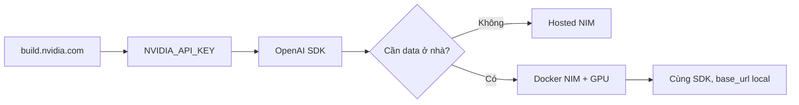

# Sử dụng AI models của NVIDIA

> [← Labs](./README.md) · Hub: [AI/ML](../README.md) · Inference: [LLM inference optimization](../nlp/llm-inference-optimization.md)

> NVIDIA không bán “một chatbot”. Họ bán **model + runtime tối ưu GPU**. Cách dùng đúng là chọn **cửa vào**, rồi giữ **cùng một client OpenAI-compatible**.

## Agent SUMMARY

- Bốn cửa: **hosted NIM API** (không cần GPU) → **self-host NIM** (Docker + GPU) → **RTX local** → **Hugging Face weights + TensorRT-LLM/vLLM**.
- Hosted endpoint: `https://integrate.api.nvidia.com/v1` + key `nvapi-…` từ [build.nvidia.com](https://build.nvidia.com).
- Client: OpenAI SDK, chỉ đổi `base_url` + `model`. Code app **không đổi** khi chuyển hosted → local NIM.
- Copy **model id** từ trang model; id thay đổi theo catalog. Đừng hard-code từ bài viết này.
- Hai loại key: `NVIDIA_API_KEY` (gọi API hosted) vs `NGC_API_KEY` (kéo container NIM).
- Self-host: một model / một container; GPU đủ VRAM; cache weights tại `/opt/nim/.cache`.
- Hosted **free** cho NVIDIA Developer Program (không cần thẻ): prototype/học; bị **rate limit theo model**, không phải SLA production.
- Production: hosted = trial; NIM trên GPU mình = data không rời hạ tầng. Self-host research/dev miễn phí (tới 16 GPU); **prod thương mại** cần NVIDIA AI Enterprise.
- Educational how-to — kiểm tra license model, rate limit, và ToS trên catalog trước khi đưa vào sản phẩm.

---

## 1. Bản đồ 4 cửa vào

| Cửa | Khi nào dùng | Cần GPU? | Endpoint |
| --- | --- | --- | --- |
| **A. Hosted NIM API** | Thử model, prototype, agent, không có card NVIDIA | Không | `https://integrate.api.nvidia.com/v1` |
| **B. Self-host NIM** | Production / data nội bộ / latency ổn | Có (data center, cloud, workstation) | `http://localhost:8000/v1` |
| **C. RTX PC (Windows)** | Chat + RAG trên máy nhà | RTX 30/40/50, ≥8 GB VRAM | App local (ChatRTX / NIM on RTX) |
| **D. Weights tự serve** | Fine-tune, research, engine tự chọn | Có | vLLM / TensorRT-LLM / Ollama |

**Nguyên tắc:** bắt đầu cửa A. Khi code chạy ổn, đổi `base_url` sang cửa B. Không viết client riêng cho NVIDIA.



---

## 2. Cửa A — Hosted API (làm trước, 10 phút)

Catalog: [build.nvidia.com](https://build.nvidia.com) · Quickstart NVIDIA: [API Catalog Quickstart](https://docs.api.nvidia.com/nim/docs/api-quickstart)

### 2.1 Tài khoản và key

1. Mở [build.nvidia.com](https://build.nvidia.com), đăng nhập NVIDIA Developer (không bắt buộc thẻ).
2. Chọn một model (ví dụ Llama / Nemotron) → tab **Preview** để chat trên web.
3. **Get API Key** → copy key bắt đầu bằng `nvapi-`. Key chỉ hiện một lần.
4. Lưu vào biến môi trường, không commit vào git:

```powershell
# Windows PowerShell (session hiện tại)
$env:NVIDIA_API_KEY = "nvapi-..."
```

```bash
# bash / zsh
export NVIDIA_API_KEY="nvapi-..."
```

Key hosted lấy tại [build.nvidia.com/settings](https://build.nvidia.com/settings). Key **hết hạn / bị revoke** thì tạo lại; đừng nhét key vào notebook public.

### 2.2 Gọi bằng OpenAI SDK (Python)

```bash
pip install openai
```

```python
import os
from openai import OpenAI

client = OpenAI(
    base_url="https://integrate.api.nvidia.com/v1",
    api_key=os.environ["NVIDIA_API_KEY"],
)

resp = client.chat.completions.create(
    model="meta/llama-3.1-8b-instruct",  # copy id từ trang model
    messages=[
        {"role": "system", "content": "Trả lời tiếng Việt, ngắn, đúng."},
        {"role": "user", "content": "Giải thích NIM trong 3 câu."},
    ],
    temperature=0.2,
    max_tokens=512,
)
print(resp.choices[0].message.content)
```

Mọi NIM chat endpoint implement **OpenAI Chat Completions**. Streaming, tool/function calling: bật như OpenAI (`stream=True`, `tools=[...]`) — **nếu trang model ghi hỗ trợ**.

### 2.3 curl

```bash
curl https://integrate.api.nvidia.com/v1/chat/completions \
  -H "Authorization: Bearer $NVIDIA_API_KEY" \
  -H "Content-Type: application/json" \
  -d "{\"model\":\"meta/llama-3.1-8b-instruct\",\"messages\":[{\"role\":\"user\",\"content\":\"Hello\"}]}"
```

Liệt kê model đang thấy được:

```bash
curl https://integrate.api.nvidia.com/v1/models \
  -H "Authorization: Bearer $NVIDIA_API_KEY"
```

### 2.4 Model reasoning (Nemotron / DeepSeek-class)

Một số model có **thinking / reasoning budget**. Truyền qua `extra_body` (không phải field OpenAI chuẩn). Copy snippet **Get Code** trên trang model — đừng đoán:

```python
resp = client.chat.completions.create(
    model="nvidia/nemotron-3-nano-omni-30b-a3b-reasoning",  # ví dụ — kiểm tra catalog
    messages=[{"role": "user", "content": "2+2 bằng bao nhiêu?"}],
    extra_body={
        "chat_template_kwargs": {"enable_thinking": True},
    },
)
```

Thinking token có thể nằm trong `content` hoặc field riêng tùy parser. Đọc response thô một lần trước khi parse trong production.

### 2.5 Có free không?

**Có — hosted API miễn phí để học và prototype**, không cần thẻ. Điều kiện: tài khoản [NVIDIA Developer Program](https://developer.nvidia.com/developer-program) + key từ [build.nvidia.com](https://build.nvidia.com).

| Cái gì free | Cái gì không |
| --- | --- |
| Chat trên web + gọi API hosted (trial) | Production / app ra khách hàng trên endpoint NVIDIA |
| Self-host NIM để research/dev (tới **16 GPU**, mọi hạ tầng) | Self-host **thương mại / prod** → cần [NVIDIA AI Enterprise](https://www.nvidia.com/en-us/data-center/products/ai-enterprise/) |
| Weight mở trên Hugging Face `nvidia/…` (xem license từng model) | Điện / GPU cloud nếu bạn thuê máy |
| ChatRTX / Ollama trên RTX nhà bạn | NVIDIA không tặng card |

Giới hạn hosted (Aug 2026, kiểm tra dashboard góc phải [build.nvidia.com](https://build.nvidia.com)):

- Hệ **credit cũ** phần lớn đã thay bằng **rate limit theo model** (request/phút), phụ thuộc traffic. Cộng đồng hay gặp ~40 RPM — **không phải SLA công bố**.
- Không xin tăng RPM trên forum; muốn ổn định → cửa B (self-host) hoặc license enterprise.
- Giờ cao điểm có thể chờ lâu / 429.
- Hosted chạy trên **NVIDIA DGX Cloud**: dữ liệu đi ra máy NVIDIA. Không gửi PII / secret.
- License model (Llama, Gemma, …) vẫn áp dụng dù inference “free”.

FAQ NVIDIA: [NIM FAQ (Developer Forums)](https://forums.developer.nvidia.com/t/nvidia-nim-faq/300317).

---

## 3. Chọn model theo việc

Id dưới đây là **hướng dẫn họ model**, không phải id bất biến. Luôn copy từ [build.nvidia.com/search](https://build.nvidia.com/search).

| Việc | Họ model (gợi ý) | Ghi chú |
| --- | --- | --- |
| Chat / viết / tóm tắt | Llama 3.x Instruct, Nemotron Nano | Rẻ, đủ cho prototype |
| Reasoning / agent dài | Nemotron Super / reasoning variants, DeepSeek-class trên catalog | Bật thinking nếu trang model cho phép |
| Code | Devstral / Llama / Nemotron coding | Test trên repo thật, đừng tin benchmark marketing |
| Embedding / RAG | NIM retrieval / embedding trên catalog | Cùng base URL, endpoint `/v1/embeddings` |
| Vision / speech | NIM vision, ASR/TTS trên catalog | Payload khác chat — dùng snippet trang model |
| Train / fine-tune | NVIDIA NeMo, Hugging Face `nvidia/…` | Cửa D, không phải hosted chat |

**Nemotron** = LLM (và biến thể omni/reasoning) do NVIDIA train hoặc post-train. **NIM** = hộp Docker + API để *chạy* Nemotron *và* model bên thứ ba (Llama, Mistral, Gemma, …).

---

## 4. Cửa B — Self-host NIM (cùng API, GPU của mình)

Khi: data không được rời VPC, cần p95 ổn, hoặc hosted hết quota.

Docs: [NIM LLM Quickstart](https://docs.nvidia.com/nim/large-language-models/latest/get-started/quickstart.html) · [Deployment FAQ](https://docs.api.nvidia.com/nim/docs/deployment)

### 4.1 Chuẩn bị

- NVIDIA GPU đủ VRAM theo **Support Matrix** của đúng NIM (đừng đoán từ bài blog).
- Driver + [NVIDIA Container Toolkit](https://docs.nvidia.com/datacenter/cloud-native/container-toolkit/latest/install-guide.html) + Docker.
- **NGC API key** (kéo image/weights): [NGC](https://ngc.nvidia.com) → Setup API Keys. Key hosted `nvapi-` đôi khi dùng được cho NGC; nếu `docker login` fail thì tạo Personal Key, tick **NGC Catalog**.

```bash
export NGC_API_KEY="..."   # khác vai trò với NVIDIA_API_KEY hosted
echo "$NGC_API_KEY" | docker login nvcr.io --username '$oauthtoken' --password-stdin

export LOCAL_NIM_CACHE="$HOME/.cache/nim"
mkdir -p "$LOCAL_NIM_CACHE"
```

### 4.2 Chạy một LLM NIM

Image name lấy từ trang model (nút **Deploy** / **Self-host**), không copy mù:

```bash
docker run --gpus=all \
  -e NGC_API_KEY \
  -v "$LOCAL_NIM_CACHE:/opt/nim/.cache" \
  -p 8000:8000 \
  nvcr.io/nim/meta/llama-3.1-8b-instruct:latest
```

Lần đầu: kéo engine/weights (nặng). Lần sau dùng cache. Health: `GET http://localhost:8000/v1/health/ready` (port mặc định 8000).

NIM tự chọn backend: GPU trong support matrix → **TensorRT-LLM**; GPU khác đủ VRAM → **vLLM**. Bạn không cấu hình engine trừ khi tuning production.

**Một container = một model.** KV cache chiếm phần lớn VRAM còn lại — đừng nhét hai LLM vào một GPU “cho vui”.

### 4.3 Đổi đúng một dòng trong app

```python
client = OpenAI(
    base_url="http://localhost:8000/v1",
    api_key="not-needed",  # local NIM thường không check key kiểu OpenAI
)
```

LangChain, Open WebUI, Continue, Cursor (custom OpenAI-compatible), agent framework: cùng pattern — `base_url` + model id.

K8s / cloud: Helm reference của NVIDIA; NIM chạy trên AKS/EKS/GKE. Tensor parallelism cần topology GPU P2P đúng — xem FAQ NVIDIA.

---

## 5. Cửa C — Máy RTX Windows (không viết server)

Dành cho **dùng**, không phải **serve production**.

| Công cụ | Việc |
| --- | --- |
| [ChatRTX](https://www.nvidia.com/en-us/ai-on-rtx/chatrtx.md) | Demo chat + RAG local trên Windows 11 + RTX (≥8 GB). Cài installer, tải model trong app. Repo GitHub sample đã **deprecated (2026-01)** — ưu tiên bản từ NVIDIA, đừng build từ fork cũ. |
| NIM on RTX / LM Studio / AnythingLLM | App desktop trỏ NIM local; cùng ý tưởng cửa B nhưng UX click. |
| [Ollama](https://ollama.com) trên Windows NVIDIA | Nhanh cho GGUF; không phải NIM, nhưng chạy được nhiều weight `nvidia/…` đã quant. Xem [Local agents](../agents/advanced/local-agents.md). |

Yêu cầu điển hình ChatRTX (kiểm tra trang download): Windows 11, driver mới, ~70 GB đĩa khi tải model.

---

## 6. Cửa D — Tải weight và tự serve

Khi cần fine-tune, quant riêng, hoặc NIM chưa cover model.

1. Hugging Face org [`nvidia`](https://huggingface.co/nvidia) — Nemotron, Llama-Nemotron, Cosmos, …
2. Serve:
   - **vLLM** — throughput, continuous batching ([inference optimization](../nlp/llm-inference-optimization.md)).
   - **TensorRT-LLM** — latency trên GPU NVIDIA, build engine theo SKU.
   - **Triton** — đa model (LLM + CV + speech) — [deployment patterns](../mlops/model-deployment-patterns.md).
3. Train/adapt: **NVIDIA NeMo** / Megatron; LoRA adapter có thể gắn lại vào NIM (multi-LoRA) nếu model nằm trong danh sách NIM hỗ trợ.

Đừng mix: weight Hugging Face nhét vào container NIM **model-specific** trừ khi docs model đó cho phép **model-free NIM** + `NIM_MODEL_PATH` / `HF_TOKEN`.

---

## 7. Nhét vào app thật (3 mẫu)

### 7.1 LangChain

```python
from langchain_openai import ChatOpenAI

llm = ChatOpenAI(
    base_url="https://integrate.api.nvidia.com/v1",
    api_key=os.environ["NVIDIA_API_KEY"],
    model="meta/llama-3.1-8b-instruct",
)
```

### 7.2 Cursor / IDE (OpenAI-compatible)

Nếu IDE cho **Override OpenAI base URL**:

- Base URL: `https://integrate.api.nvidia.com/v1`
- API key: `NVIDIA_API_KEY`
- Model: id copy từ catalog (một số UI cần id đúng từng ký tự)

Local NIM: `http://127.0.0.1:8000/v1`. Tắt VPN/proxy nếu localhost bị nuốt.

### 7.3 RAG nội bộ

Hosted embedding NIM + vector DB (Qdrant) + chat NIM. Lab: [Advanced RAG Qdrant](./lab-advanced-rag-qdrant.md). Khi tài liệu cấm lên cloud: **cả embed lẫn generate** phải cửa B.

---

## 8. Ứng dụng thực chiến

- [ ] Ngày 1: Preview 3 model trên web, ghi latency cảm tính + chất lượng tiếng Việt.
- [ ] Ngày 1: 1 script Python hosted, 10 prompt cố định, log token + lỗi 429.
- [ ] Ngày 2: Đổi `base_url` sang biến môi trường (`NIM_BASE_URL`) — sẵn sàng local.
- [ ] Trước prod: bảng **model id · license · PII policy · max context · tool calling (có/không)**.
- [ ] Self-host: đo VRAM (`nvidia-smi`), p50/p95, OOM khi `max_tokens` lớn — xem [LLMOps](../mlops/llmops.md).

---

## 9. Pitfalls

| Lỗi | Cách tránh |
| --- | --- |
| Hard-code model id từ blog | Copy từ trang model / `GET /v1/models` |
| Gửi secret lên hosted | Cửa B hoặc redact |
| Nhầm `NVIDIA_API_KEY` và `NGC_API_KEY` | Hosted chat vs `docker pull` NGC |
| Hai LLM một GPU | Một NIM / pod; KV cache nuốt VRAM |
| Tin ChatRTX = production | Demo desktop; serve = NIM/vLLM |
| Quant GGUF rồi trách NIM chậm | GGUF (Ollama) ≠ TensorRT engine của NIM |
| Bật thinking rồi parse như chat thường | In raw JSON một lần |

---

## Liên quan

- [LLM inference optimization](../nlp/llm-inference-optimization.md) — vLLM vs TensorRT-LLM, batching, KV cache
- [Local agents](../agents/advanced/local-agents.md) — Ollama / llama.cpp
- [LLMOps](../mlops/llmops.md) — prompt, eval, cost
- [AI hardware](../ai-hardware-guide.md) — GPU / Jetson / DGX
- [Small language models](../nlp/small-language-models.md) — chạy 8B trên workstation
- Catalog NVIDIA: [build.nvidia.com](https://build.nvidia.com) · Docs: [docs.api.nvidia.com/nim](https://docs.api.nvidia.com/nim/docs/api-quickstart)
