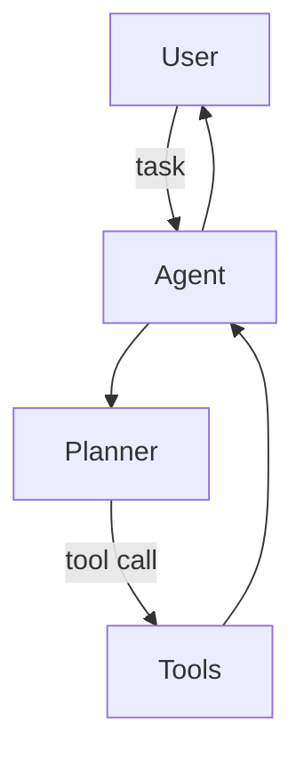

## 🧑‍💻 Project: Coding Assistant Agent

> [← Back to Labs](./README.md)

Xây dựng agent hỗ trợ lập trình (tương tự GitHub Copilot mini) với LLM + tool execution.

---

## 1. Scope & Requirements

- Use case: trả lời câu hỏi codebase, generate function, refactor, viết test.
- Constraint: giữ state conversation, truy cập repo local, chạy test.
- KPI: task success rate, latency, number of interventions.

---

## 2. Architecture

Components:

1. **Planner:** xác định bước cần làm (read file, modify, run tests).
2. **Tools:**
   - Code search (ripgrep, tree-sitter)
   - File read/write
   - Command execution (pytest, npm test)
3. **LLM Controller:** GPT-4/Claude hoặc Llama 3 fine-tune.

Flow:

---

## 3. Knowledge & Context

- Build codebase index (symbol graph, embeddings).
- Chunk code files + store in vector DB để retrieval.
- Provide repo manifest (package.json, requirements.txt, docs) cho agent.

Checklist:

- [ ] Limit tool execution (sandbox, timeouts)
- [ ] Audit logging (prompt, tool call)
- [ ] Secret masking trong logs

---

## 4. Interaction Design

- Chat UI (Next.js) hoặc VSCode extension.
- Commands: `/read file`, `/run tests`, `/plan`.
- Display diff proposals trước khi áp dụng thay đổi.

---

## 5. Evaluation

- Benchmark tasks (fix bug, add feature, write tests).
- Metrics: completion time, number of tool calls, human edits.
- Maintain dataset `agent_tasks.json` để regression test.

---

## 6. Deployment & Ops

- Backend: LangGraph/LangChain Agents hoặc custom state machine.
- Sandbox: Docker container isolated repo.
- Monitoring: log prompt, tool latency, success/fail reason.

> 🎯 Bonus: tích hợp cùng CI để agent tạo PR tự động với summary + test results.
