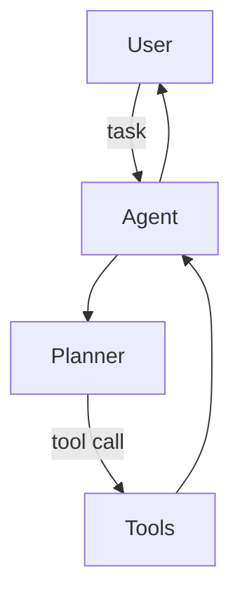

## 🧑‍💻 Project: Coding Assistant Agent

> [← Back to Labs](./README.md)

Xây agent hỗ trợ lập trình (tương tự Copilot mini) với LLM + tool execution.

---

## 1. Scope & Requirements

- Use case: Q&A codebase, generate function, refactor, viết test.
- Constraint: giữ state, truy cập repo local, chạy test.
- KPI: task success rate, latency, number of interventions.

---

## 2. Architecture

Components:

1. **Planner:** xác định bước (read file, modify, run tests).
2. **Tools:** code search (ripgrep/tree-sitter), file read/write, command exec (pytest/npm test).
3. **LLM Controller:** GPT-4/Claude hoặc Llama 3 fine-tune.

Flow:

---

## 3. Knowledge & Context

- Build codebase index (symbol graph, embeddings).
- Chunk code + vector DB cho retrieval.
- Cung cấp manifest (package.json, requirements.txt, docs).

Checklist:

- [ ] Limit tool execution (sandbox, timeouts)
- [ ] Audit logging (prompt, tool call)
- [ ] Secret masking trong logs

---

## 4. Interaction Design

- Chat UI (Next.js) hoặc VSCode extension.
- Commands: `/read file`, `/run tests`, `/plan`.
- Hiển thị diff proposal trước khi apply.

---

## 5. Evaluation

- Benchmark tasks: fix bug, add feature, write tests.
- Metrics: completion time, tool calls, human edits.
- Dataset `agent_tasks.json` cho regression.

---

## 6. Deployment & Ops

- Backend: LangGraph/LangChain Agents hoặc state machine custom.
- Sandbox: Docker container isolated repo.
- Monitoring: log prompt, tool latency, success/fail reason.

> 🎯 Bonus: tích hợp cùng CI để agent tạo PR tự động với summary + test results.
