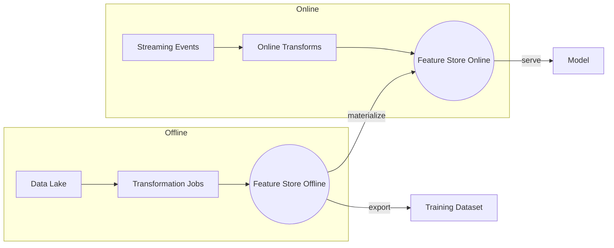

# 🧱 Feature Stores at Scale

> [← Back to MLOps](./README.md)

Feature store giúp chuẩn hoá pipeline feature giữa môi trường **offline (training)** và **online (inference)**, đảm bảo reuse và nhất quán.

---

## 1. Tại sao cần Feature Store?

- **Consistency:** Không còn chuyện mỗi team tự viết pipeline feature riêng → tránh training-serving skew.
- **Reuse:** Một feature (ví dụ: `user_7d_purchase_count`) được chia sẻ và versioned.
- **Real-time Serving:** Kết hợp dữ liệu batch + streaming (Kafka, Kinesis) để phục vụ mô hình thời gian thực.
- **Governance:** Metadata rõ ràng (owner, lineage, approvals) + kiểm soát truy cập.

---

## 2. Kiến trúc chuẩn



---

## 3. Công cụ phổ biến

| Platform | Điểm mạnh | Khi nào dùng |
| --- | --- | --- |
| **Feast (OSS)** | Dễ tích hợp, hỗ trợ batch + streaming, Python SDK. | Startup/nhóm nhỏ muốn tự host, cloud-native. |
| **Tecton** | SaaS, built-in monitoring, backfills và governance. | Doanh nghiệp cần SLA cao, muốn managed service. |
| **Databricks Feature Store** | Tight integration với Delta Lake & MLflow. | Đã dùng Databricks ecosystem. |
| **Vertex AI Feature Store** | Managed trên GCP, online serving latency thấp. | Stack GCP, cần multi-regional replication. |

---

## 4. Thiết kế feature pipelines

- **Offline batch:** sử dụng Spark/Beam để tạo feature hàng giờ/ngày.
- **Online streaming:** xử lý event real-time, đảm bảo cùng logic với batch (dùng shared transformations hoặc declarative definitions).
- **Materialization:** lên lịch sync từ offline → online store, monitor độ trễ.

Checklist triển khai:

- [ ] Mô tả feature trong YAML/Registry (name, dtype, description, owner).
- [ ] Versioning mỗi thay đổi schema.
- [ ] Kiểm định quality (null %, distribution) trước khi publish.
- [ ] Access control theo domain (PII vs non-PII).

---

## 5. Demo Feast (Python)

```python
from feast import FeatureStore

store = FeatureStore(repo_path="feature_repo")
training_df = store.get_historical_features(
    entity_df=entity_df,
    features=["user_stats:total_orders", "user_stats:avg_basket"]
).to_df()

online_features = store.get_online_features(
    features=["user_stats:total_orders"],
    entity_rows=[{"user_id": 42}]
).to_dict()
```

---

## 6. Vận hành & Monitoring

- **Data freshness:** cảnh báo khi materialization chậm hơn threshold.
- **Backfill plan:** script tự động reprocess khi logic feature thay đổi.
- **Cost control:** tách cold storage (S3, GCS) và hot storage (Redis, Bigtable) phù hợp use case.

> 🎯 Bonus: xây Feature Catalog UI (Metabase/DataHub) để DS tìm kiếm và request quyền truy cập nhanh.
