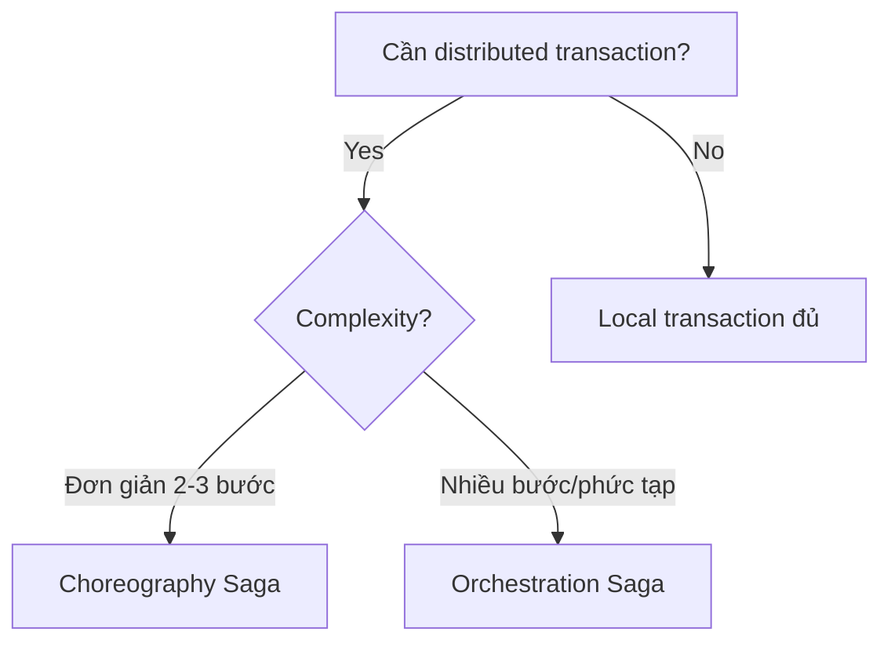

# 🌐 Distributed Systems Architecture

> [← Back to Backend Development](../README.md)

This module covers the principles and patterns of building systems that run across multiple computers.

## 1. CAP Theorem & PACELC
You can't have it all. Choose your trade-offs.

### **CAP Theorem**
*   **Consistency (C):** Every read receives the most recent write or an error.
*   **Availability (A):** Every request receives a (non-error) response, without guarantee that it contains the most recent write.
*   **Partition Tolerance (P):** The system continues to operate despite an arbitrary number of messages being dropped or delayed by the network.

**Reality Check:** Network partitions (P) are inevitable. You MUST choose between **CP** (Consistency) or **AP** (Availability) when a partition occurs.

### **PACELC Theorem**
Extends CAP.
*   If **Partition (P)** occurs: Choose **Availability (A)** or **Consistency (C)**.
*   **Else (E)** (Normal operation): Choose **Latency (L)** or **Consistency (C)**.
*   *Example:* DynamoDB lets you choose Strong Consistency (higher latency) or Eventual Consistency (lower latency).

---

## 2. Consistency Models
How "correct" is the data right now?

1.  **Strong Consistency (Linearizability):** Once a write is successful, all subsequent reads see that value. Like a single machine. Hardest to achieve, highest latency. (e.g., Google Spanner, Etcd).
2.  **Sequential Consistency:** Operations from a single client are seen in order, but different clients might see different orders relative to each other.
3.  **Causal Consistency:** If process A tells process B it updated `x`, B must see the update. Unrelated processes might see things differently.
4.  **Eventual Consistency:** Reads *eventually* return the latest write. Standard for high-availability systems (Cassandra, DNS).

---

## 3. Consensus Algorithms
How do distributed nodes agree on a value (e.g., who is the leader)?

### **Paxos**
*   The classic algorithm. Proven correct but notoriously difficult to understand and implement.
*   Used in Google Chubby.

### **Raft**
*   Designed to be understandable.
*   **Key Concepts:** Leader Election, Log Replication, Safety.
*   **Nodes:** Leader, Follower, Candidate.
*   **Used in:** Kubernetes (Etcd), Consul, CockroachDB, Kafka (KRaft).

### **Gossip Protocol**
*   Nodes randomly share state with neighbors. Epidemic spread.
*   Eventually consistent, scalable, robust.
*   **Used in:** Cassandra (cluster membership), DynamoDB.

---

## 4. Event-Driven Architecture (EDA)
Decoupling services using asynchronous messages.

### **Message Queue (Standard)**
*   **Tool:** RabbitMQ, ActiveMQ, SQS.
*   **Pattern:** Producer -> Queue -> Consumer.
*   **Delivery:** Point-to-Point. Message is deleted after consumption.
*   **Use Case:** Task processing (email sending, image resizing).

### **Event Streaming (Log-based)**
*   **Tool:** Apache Kafka, Redpanda, Kinesis.
*   **Pattern:** Producer -> Topic (Log) -> Consumer Group.
*   **Delivery:** Pub/Sub. Messages are persisted for a retention period. Consumers track their own offset.
*   **Use Case:** Real-time analytics, Event sourcing, CDC (Change Data Capture).

### **Patterns**
*   **Saga Pattern:** Managing distributed transactions.
    *   **Choreography:** Services emit events, others listen. No central coordinator.
    *   **Orchestration:** Central coordinator tells services what to do.
*   **CQRS (Command Query Responsibility Segregation):** Separate Read and Write models.
    *   Writes go to normalized DB (Postgres).
    *   Events update specialized Read DB (Elasticsearch/Redis).

---

## ✅ Apply it
- [ ] Xác định rõ hệ thống của bạn ưu tiên CP hay AP khi xảy ra partition, cập nhật vào runbook.
- [ ] Thiết lập test consistency: viết script mô phỏng write/read để quan sát eventual consistency latency.
- [ ] Chạy PoC Saga cho một quy trình nhiều bước (đặt hàng → thanh toán → giao nhận) với cả choreography và orchestration để so sánh.
- [ ] Lập dashboard theo dõi throughput và lag của event bus (Kafka/SQS) trong môi trường staging.

## 🔗 Cross-reference
- [System Design Glossary](../system-design/system-design-glossary.md) – tra cứu nhanh thuật ngữ CAP, quorum, consensus.
- [Realtime Flash Sale Inventory](../system-design/realtime-flash-sale-inventory.md) – ví dụ áp dụng AP + eventual consistency trong flash sale.
- [Monitoring & Observability](../monitoring-observability.md) – đo lường queue lag, latency để bảo vệ distributed system.

---

## 5. Distributed Locking
> Đảm bảo chỉ một node thao tác tài nguyên tại một thời điểm.

### 5.1 Redis Redlock
- **Cơ chế:** chạy 5 Redis master độc lập, client acquire lock bằng cách ghi key với TTL vào phần lớn (>=3) nodes. Lock thành công nếu thoả majority và thời gian còn lại đủ lớn.
- **Ưu:** latency thấp, dễ triển khai.
- **Rủi ro:** clock drift/partition có thể dẫn tới double lock; cần set TTL phù hợp.
- **Best practice:** dùng thư viện uy tín (redis-py lock, Redisson), monitor TTL expiry, tránh lock cho critical safety nếu không có quorum store thật sự bền.

### 5.2 Zookeeper/Etcd lock
- **ZK Lock:** tạo `ephemeral znode` + `sequential` trong path. Node nhỏ nhất giữ lock. Khi phiên mất, znode xoá → lock tự giải phóng.
- **Etcd Lock:** dùng lease + revision. Client giữ lease và thực hiện CAS trên key lock.
- **Ưu:** đảm bảo nhờ consensus (Paxos/Raft) → strong consistency.
- **Nhược:** latency cao hơn Redis, cần duy trì session/lease.

### 5.3 Pattern áp dụng
- Lock dùng cho tác vụ ngắn (job scheduler, cron) → release sớm.
- Kèm idempotent fallback nếu lock biến mất.
- Thiết lập metric lock wait time, failure rate.

## 6. Leader Election Patterns
> Chọn node điều phối chung (primary shard, scheduler).

- **Raft/Etcd built-in:** follower timeout → candidate → vote majority → leader. Thường dùng cho control plane (K8s API server via etcd).
- **Zookeeper recipe:** sử dụng `ephemeral sequential znode`, node nhỏ nhất làm leader, watcher theo dõi node trước.
- **Gossip + Bully Algorithm:** node có ID lớn thắng. Dễ implement nhưng không đảm bảo consensus mạnh.
- **Kubernetes Lease API:** controller tạo Lease object, renew theo TTL; ai renew được coi là leader.

### Best practice
- Thiết kế leader stateless (dễ failover).
- Leader ghi heartbeat; follower takeover khi timeout.
- Log election events để debug split-brain.

## 7. Clock Synchronization
> Ordering events across nodes.

- **Physical clock (NTP):** giới hạn độ chính xác (drift ~ms). Không đủ cho ordering chính xác tuyệt đối.
- **Logical clock (Lamport):** mỗi event tăng counter, gửi kèm counter → đảm bảo partial ordering nhưng không phân biệt concurrency.
- **Vector clock:** mỗi node giữ vector counters; so sánh để biết causal vs concurrent. Dùng trong Dynamo/Cassandra conflict resolution.
- **Hybrid Logical Clock (HLC):** kết hợp physical time + logical counter để có total ordering gần chính xác, dùng trong Spanner/CockroachDB.

### Khuyến nghị
- Đồng bộ NTP + monitor skew.
- Với hệ thống yêu cầu causal ordering → dùng logical/vector clock.
- Khi cần transaction timestamp global → xem xét HLC + TrueTime (GPS + atomic clock) nếu dùng Google Spanner.

## 8. Idempotency Patterns
> Bảo đảm lệnh thực thi nhiều lần vẫn cho kết quả như một lần.

- **Idempotency Key:** client gửi `Idempotency-Key` header. Server lưu kết quả theo key, nếu nhận lại trả response cũ.
- **Request log / dedup store:** lưu hash request trong DB/cache với TTL.
- **At-least-once vs Exactly-once:**
  - *At-least-once* delivery (Kafka, SQS) → consumer phải idempotent.
  - *Exactly-once* đắt đỏ, thường dùng transactional outbox + Kafka EOS.
- **State machine approach:** chuyển trạng thái (pending, processed) với constraint unique.

### Checklist
- Gắn idempotency key cho API write quan trọng (payment, booking).
- Consumer ghi offset cùng kết quả trong một transaction (outbox pattern).
- Dùng versioning/optimistic locking để chặn double update.

## 9. Distributed Tracing Deep Dive (OpenTelemetry)
> Hiểu toàn bộ hành trình request qua microservices.

- **Span & Trace:** mỗi request = trace, mỗi bước = span. Span có attribute, event, status.
- **Context propagation:** W3C Trace Context (`traceparent`, `tracestate`).
- **OpenTelemetry components:** SDK (instrument code) + Collector (nhận, xử lý, export) + Backend (Jaeger, Tempo, Honeycomb).
- **Sampling:** head-based (upfront) vs tail-based (collector quyết định). Tail sampling phù hợp khi chỉ lưu trace lỗi.
- **Metrics + Logs correlation:** OTel hỗ trợ attach span ID vào log/metric.

### Implement steps
1. Chọn ngôn ngữ SDK OTel (Java, Go, Node…)
2. Instrument HTTP/gRPC client & server.
3. Deploy OTel Collector (otelcol) → export tới Jaeger/Tempo.
4. Thiết lập exemplars link metric ↔ trace.

### Apply it
- [ ] Bật tracing cho critical path (checkout, payment).
- [ ] Thiết lập sampling 10% + tail sampling lỗi.
- [ ] Đo trace latency cho từng span, tìm bottleneck.
- [ ] Kết nối trace với log (trace_id) để debug nhanh.

---
