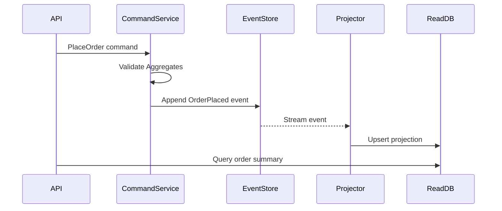

# ⚡ Event Sourcing + CQRS (L3-L4)

> Biến mọi thay đổi trạng thái thành chuỗi sự kiện bất biến. Mỗi “write” là append event, read side tái dựng trạng thái theo nhu cầu. Phù hợp khi cần audit, time-travel, tích hợp với downstream analytics.

## 1. Các khối xây dựng
- **Command Model (Write Model):** Validate rules, sinh `DomainEvent` thay vì mutate DB trực tiếp.
- **Event Store:** Log bất biến, append-only (Kafka, EventStoreDB, DynamoDB + streams).
- **Read Model:** Một hoặc nhiều projection phục vụ query nhanh (SQL view, Elastic, Redis cache).
- **Message Bus:** Event được publish để các bounded context khác subscribe.

## 2. Thiết kế event & aggregate
- **Aggregate Root** giữ bất biến (invariant); mọi command phải pass qua aggregate.
- **Event schema** immutable. Use versioning (additive fields) + schema registry.
- **Event ID & metadata** (correlation, causation, tenant) giúp tracing.
- **Snapshots** cho aggregate lớn: mỗi N event, lưu snapshot để replay nhanh.

## 3. Patterns triển khai
- **CQRS song song:** write endpoint trả về event ID, read side eventually consistent.
- **Outbox pattern:** transactionally ghi event vào outbox table, background worker publish.
- **Transaction boundary:** dùng **unit of work** cho aggregate; đừng commit nhiều aggregate khác context trong 1 transaction.
- **Dual write guard:** tuyệt đối tránh ghi trực tiếp vào read DB từ write flow.
- **Replay:** projector phải idempotent và có checkpoint; hỗ trợ **backfill selective** (chỉ một projection) và **full replay**.
- **Exactly-once vs at-least-once:** chấp nhận **at-least-once** + idempotency; tránh xây exactly-once trừ khi có infra đặc biệt (e.g., transactional outbox + de-dup window).

### Saga / Process Manager (liên quan)
- **Chọn kiểu saga:** choreography (event-driven) cho workflow đơn giản; orchestration (process manager) khi cần điều phối, retry có kiểm soát.
- **Idempotency key:** lưu trong command handler hoặc outbox để tránh double-handle.
- **Timeout & compensation:** mọi bước dài cần timeout; định nghĩa hành động bù (compensate) thay vì rollback truyền thống.

## 4. Giám sát & vận hành
- **Lag tracking:** đo khoảng cách giữa newest event và projection offset; cảnh báo khi lag > SLO.
- **Poison event handling:** đưa vào dead-letter + manual fix; log cả payload lẫn metadata (causation/correlation).
- **Schema migration:** additive-first; projector backward-compatible. Dùng **schema registry** + versioning.
- **Backfill:** khi thêm read model mới, chạy replay từ event 0; cho phép **throttle** để không quá tải downstream.
- **Capacity planning:** tính throughput append và projection. Event store cần backup/retention rõ ràng; cold storage cho event cũ.

## 5. Data partitioning & multi-tenant
- **Shard event store:** hash theo aggregate ID hoặc tenant ID; dùng consistent hashing để thêm shard mượt.
- **Tenant metadata:** thêm `tenant_id` vào event metadata; enforce tại write model + projection filter.
- **Projection per tenant:** cân nhắc read model tách theo tenant lớn để giảm fan-out.

## ⚠️ Khi nào nên/không nên dùng
- ✅ Domain phức tạp, audit/time-travel quan trọng, nhiều service cần subscribe.
- ✅ Business rule thay đổi thường xuyên → cần history để tái hiện.
- ❌ CRUD đơn giản, dữ liệu ít thay đổi, latency cực thấp cần consistency mạnh.
- ❌ Đội ngũ chưa có kinh nghiệm vận hành stream/event store.

## ✅ Apply it
- [ ] Chọn 1 bounded context nhiều thay đổi (Order, Billing) để thử event sourcing song song với hệ thống cũ.
- [ ] Thiết kế event contract + metadata (tenant, correlation, causation) chuẩn hoá, lưu tại schema registry.
- [ ] Viết projector idempotent + checkpoint store; đo lag và error rate.
- [ ] Thiết lập dashboard theo dõi event lag, poison rate, throughput append.
- [ ] Thử kịch bản replay toàn bộ event store cho staging; test throttle + selective backfill.

## 🔗 Cross-reference
- [Distributed Systems](./distributed-systems.md) – kiến thức consistency & Saga liên quan tới event sourcing.
- [Microservices Patterns Deep Dive](./microservices-patterns-deep-dive.md) – kết hợp event sourcing với saga/outbox.
- [Data Partitioning](./data-partitioning.md) *(will cover)* – shard event store/read model.
- [Monitoring & Observability](../monitoring-observability.md) – setup tracing cho projection pipeline.