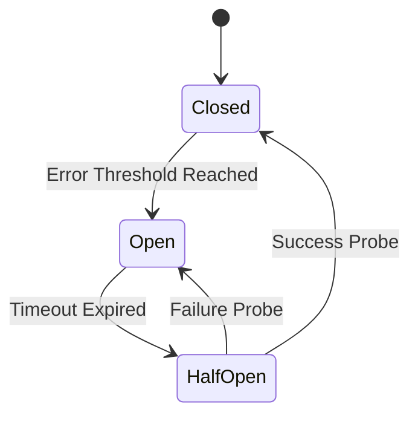
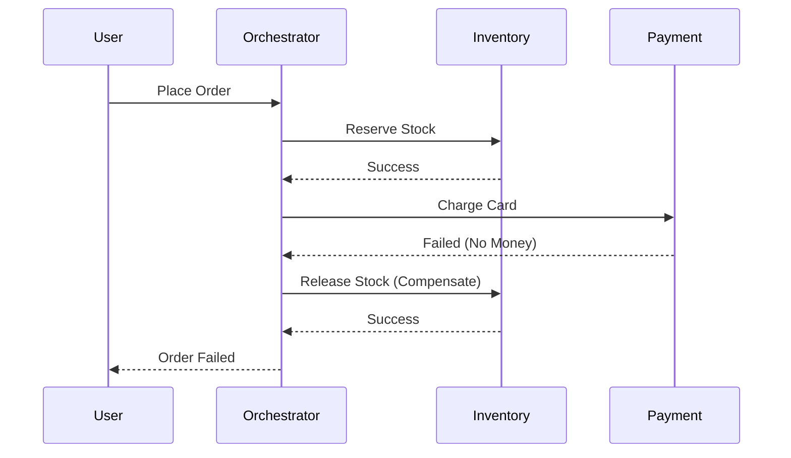

# 🧩 Microservices Patterns: Circuit Breaker & Saga _(Level 3-4)_

> [← Back to Backend Roadmap](../README.md) · [Architecture Hub](./README.md)

Khi chia nhỏ hệ thống thành Microservices, bạn sẽ gặp phải 2 cơn ác mộng lớn nhất:
1.  **Cascade Failure:** Một service chết kéo theo cả hệ thống chết.
2.  **Distributed Transactions:** Làm sao để rollback khi giao dịch trải dài trên nhiều service?

Hướng dẫn này sẽ giúp bạn giải quyết chúng bằng các Patterns kinh điển.

---

## 1. Circuit Breaker (Cầu Dao Điện) ⚡
> 🎯 **Mục tiêu:** Bảo vệ upstream service khỏi external dependency lỗi.

### Vấn đề (The Problem):
Tưởng tượng Service A gọi Service B. Nếu Service B bị treo (timeout), Service A sẽ chờ mãi -> Hết thread pool -> Service A cũng treo theo.
Nếu có 100 service gọi nhau, lỗi này sẽ lan truyền như domino (Cascade Failure).

### Giải pháp (The Solution):
Đặt một "Cầu dao" giữa A và B. Khi B lỗi quá nhiều, cầu dao sẽ **NHẢY (OPEN)** và ngắt kết nối ngay lập tức để bảo vệ A.



### Trạng thái (States):
1.  **CLOSED (Đóng - Bình thường):**
    *   Requests đi qua bình thường.
    *   Đếm số lần lỗi.
2.  **OPEN (Mở - Ngắt mạch):**
    *   Nếu lỗi vượt ngưỡng (VD: 50% trong 10s) -> Chuyển sang OPEN.
    *   Tất cả requests bị từ chối ngay lập tức (Fail Fast).
3.  **HALF-OPEN (Nửa mở - Thăm dò):**
    *   Sau một khoảng thời gian (VD: 30s), cho phép 1 vài request đi qua thử.
    *   Nếu thành công -> Chuyển về **CLOSED**.
    *   Nếu thất bại -> Quay lại **OPEN**.

### Pseudo-code (Resilience4j)
```java
var circuitBreaker = CircuitBreaker.ofDefaults("inventory");

Supplier<String> supplier = CircuitBreaker
    .decorateSupplier(circuitBreaker, () -> inventoryClient.reserve());

try {
    return supplier.get();
} catch (CallNotPermittedException ex) {
    return fallback("Inventory busy");
}
```

---

## 2. Saga Pattern (Giao Dịch Phân Tán) 🔄
> 🎯 **Mục tiêu:** Rollback khi transaction trải dài nhiều service.

### Vấn đề (The Problem):
Trong Monolith, bạn dùng `BEGIN TRANSACTION ... COMMIT/ROLLBACK` để đảm bảo tính toàn vẹn (ACID).
Trong Microservices, mỗi service có Database riêng. Bạn không thể rollback DB của service khác.

**Ví dụ:** Đặt hàng (Order) -> Trừ kho (Inventory) -> Thanh toán (Payment).
Nếu Thanh toán thất bại, bạn phải hoàn lại kho (Rollback Inventory).

### Giải pháp (The Solution):
Chia giao dịch lớn thành chuỗi các giao dịch nhỏ cục bộ. Nếu một bước thất bại, chạy các **Compensating Transactions** (Giao dịch bù trừ) để hoàn tác các bước trước đó.

### Hai cách triển khai Saga:

#### Cách 1: Choreography (Vũ điệu - Event-based) 💃
Các service tự nghe sự kiện của nhau và phản ứng. Không có người điều phối trung tâm.

*   **Order Service:** Tạo đơn -> Gửi event `OrderCreated`.
*   **Inventory Service:** Nghe `OrderCreated` -> Trừ kho -> Gửi event `InventoryReserved` (hoặc `InventoryFailed`).
*   **Payment Service:** Nghe `InventoryReserved` -> Trừ tiền -> Gửi event `PaymentProcessed` (hoặc `PaymentFailed`).

**Ưu điểm:** Đơn giản, loose coupling.
**Nhược điểm:** Khó theo dõi quy trình phức tạp.

#### Cách 2: Orchestration (Nhạc trưởng - Command-based) 🎼
Có một service trung tâm (Saga Orchestrator) điều phối mọi thứ.

*   **Order Orchestrator:**
    1.  Gửi lệnh `ReserveStock` tới Inventory.
    2.  Nhận `StockReserved` -> Gửi lệnh `ProcessPayment` tới Payment.
    3.  Nhận `PaymentFailed` -> Gửi lệnh `CompensateStock` tới Inventory để hoàn tác.

**Ưu điểm:** Dễ quản lý logic phức tạp, rõ ràng.
**Nhược điểm:** Orchestrator có thể trở thành điểm thắt cổ chai (Bottleneck).

### Sơ đồ Saga (Orchestration):


### Pseudo-code (Orchestrator)
```typescript
async function handleOrder(cmd: PlaceOrderCommand) {
  await bus.send(new ReserveStock(cmd.orderId));
  const payment = await bus.send(new ChargePayment(cmd.orderId));

  if (!payment.success) {
    await bus.send(new ReleaseStock(cmd.orderId));
    throw new Error("Payment failed");
  }
}
```

---

## 3. Sidecar Pattern (Xe Sidecar) 🏍️ _(Level 3)_

### Vấn đề (The Problem):
Bạn có 100 microservices viết bằng Node.js, Go, Java. Mỗi service đều cần Logging, Monitoring, SSL, Circuit Breaker.
Nếu implement code này vào từng service -> Lặp code, khó update.

### Giải pháp (The Solution):
Đặt một container phụ (Sidecar) chạy song song với container chính. Sidecar sẽ lo phần hạ tầng (Infrastructure concerns).

**Ví dụ:** Envoy Proxy, Istio Agent.
Service chính chỉ lo Business Logic. Mọi traffic đi ra/vào đều qua Sidecar.

---

## 4. Backend for Frontend (BFF) 📱 _(Level 3)_

### Vấn đề (The Problem):
Mobile App cần ít dữ liệu hơn Web App. Nếu dùng chung 1 API Gateway, Mobile sẽ phải tải dư thừa data.

### Giải pháp (The Solution):
Tạo Gateway riêng cho từng loại Client.
*   **Web BFF:** Gọi 3 services, aggregate dữ liệu chi tiết.
*   **Mobile BFF:** Gọi 2 services, chỉ lấy dữ liệu cần thiết, giảm payload size.

---

## 5. Tổng kết (Summary) ✨
| Pattern | Giải quyết vấn đề gì? | Khi nào dùng? |
| :--- | :--- | :--- |
| **Circuit Breaker** | Cascade Failure | Khi gọi external service không tin cậy. |
| **Saga** | Distributed Transactions | Khi transaction trải dài nhiều service. |
| **Sidecar** | Cross-cutting concerns | Khi dùng Kubernetes/Service Mesh. |
| **BFF** | Client-specific needs | Khi UI Mobile và Web quá khác nhau. |

---

## 🛠️ Apply it
1. **Circuit Breaker Drill:** Thêm Resilience4j/Polly vào service hiện tại, cấu hình threshold + metric export sang Prometheus.
2. **Saga Simulator:** Viết test chaos: ép Payment fail 30% để đảm bảo compensating action release stock thành công.
3. **Sidecar Rollout:** Triển khai service mesh (Istio/Linkerd) cho 1 namespace; đo latency trước và sau.

## 🔗 Cross-reference
- [microservices-patterns.md](./microservices-patterns.md): overview decomposition/integration patterns.
- [cloud-native.md](./cloud-native.md): service mesh, sidecar details.
- [devops-sre/devops-lab-pack.md](../devops-sre/devops-lab-pack.md): lab cho circuit breaker, chaos test.
