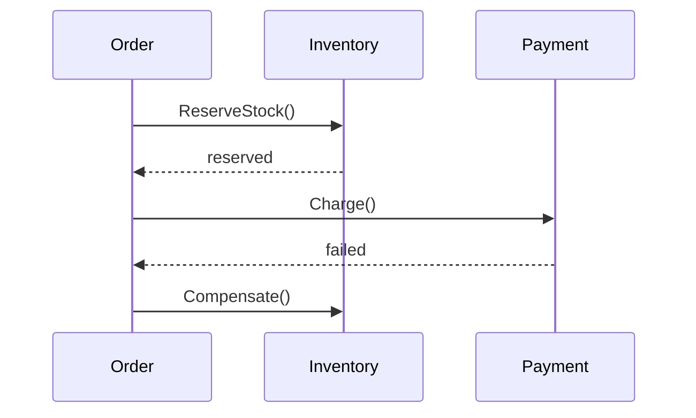
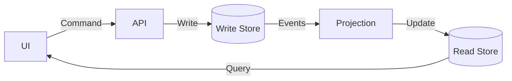

# 🧩 Microservices Design Patterns _(Level 3: Scalable Systems)_

> [← Back to Backend Development](../README.md) · [Architecture Hub](./README.md)

Building distributed systems is hard. Những pattern dưới đây giúp bạn quản lý độ phức tạp, đảm bảo reliability và giữ consistency khi tách monolith.

## 1. Decomposition Patterns
> 🎯 **Khi cần:** chuẩn bị tách monolith sang microservices.
How to break a monolith into services.

### **Decompose by Business Capability**
*   **Strategy:** Group services based on business functions (e.g., Order Management, Inventory, Shipping).
*   **Pros:** Stable architecture aligned with business structure.
*   **Cons:** Can lead to "God Services" if business capabilities are too broad.

### **Decompose by Subdomain (DDD)**
*   **Strategy:** Use Domain-Driven Design.
    *   **Core Domain:** The unique value (e.g., Recommendation Engine).
    *   **Supporting Domain:** Helper logic (e.g., Catalog).
    *   **Generic Domain:** Standard logic (e.g., Auth, Payments).
*   **Pros:** Clear boundaries (Bounded Contexts).

### **Strangler Fig Pattern**
*   **Strategy:** Gradually migrate a legacy monolith by building new features as microservices and routing traffic to them via a proxy. Eventually, the monolith "dies".
*   **Use Case:** Modernizing legacy systems without a full rewrite.

---

## 2. Integration Patterns
> 🎯 **Khi cần:** tổ chức traffic flow giữa services và client.
How services talk to each other.

### **API Gateway**
*   **Problem:** Clients shouldn't call 50 different services directly.
*   **Solution:** Single entry point (Gateway) handles routing, auth, rate limiting, and aggregation.
*   **Tools:** Kong, AWS API Gateway, Nginx.

### **BFF (Backend for Frontend)**
*   **Problem:** Mobile app needs different data format than Web app.
*   **Solution:** Create specific Gateways for each client type.
*   **Example:** `Mobile-BFF` strips heavy JSON fields; `Web-BFF` aggregates data for dashboard.

### **Sidecar Pattern**
*   **Problem:** Cross-cutting concerns (logging, monitoring, retry) clutter business logic.
*   **Solution:** Deploy a helper container (Sidecar) alongside the main service container.
*   **Example:** Envoy Proxy in Kubernetes (Service Mesh). The app talks to localhost; Envoy handles the network magic.

---

## 3. Data Management Patterns
> 🎯 **Khi cần:** giữ dữ liệu nhất quán trong hệ thống phân tán.
The hardest part of microservices: Data consistency.

### **Database per Service**
*   **Rule:** Each service has its own DB. Other services cannot access it directly (must use API).
*   **Pros:** Loose coupling. Services can choose best DB (SQL vs NoSQL).
*   **Cons:** Cross-service queries and transactions are hard.

### **Saga Pattern (Distributed Transactions)**

*   **Problem:** ACID transactions don't work across services.
*   **Solution:** A sequence of local transactions. If one fails, execute **Compensating Transactions** to undo previous steps.
    *   **Choreography:** Services emit events. "Order Created" -> Inventory Service listens -> "Inventory Reserved". (Good for simple flows).
    *   **Orchestration:** A central coordinator (Orchestrator) tells services what to do. (Good for complex flows).

### **CQRS (Command Query Responsibility Segregation)**

*   **Strategy:** Split the application into two parts:
    *   **Command (Write):** Handles updates (INSERT/UPDATE). Optimized for consistency.
    *   **Query (Read):** Handles reads. Optimized for speed (can use denormalized views/Elasticsearch).
*   **Sync:** Commands update Read DB asynchronously via events.

---

## 4. Resiliency Patterns
> 🎯 **Khi cần:** ngăn cascade failure, ổn định hệ thống.
Preventing cascading failures.

### **Circuit Breaker**
*   **Concept:** Like an electrical circuit.
    *   **Closed (Normal):** Requests flow through.
    *   **Open (Tripped):** If failures > threshold (e.g., 50%), block requests immediately (Fail fast).
    *   **Half-Open:** After timeout, let 1 request through to test if service recovered.
*   **Why:** Don't hammer a dead service; let it recover.

### **Bulkhead**
*   **Concept:** Ship compartments. If one floods, the ship doesn't sink.
*   **Strategy:** Isolate resources (Thread pools, Connection pools) per service.
*   **Example:** If Image Processing service is slow, it shouldn't consume all threads and block the Login service.

### **Retry with Exponential Backoff**
*   **Strategy:** If a call fails, retry after 1s, then 2s, then 4s...
*   **Jitter:** Add random noise (e.g., 4.1s, 3.9s) to prevent "Thundering Herd" (all clients retrying at exact same time).

---

## 5. Observability Patterns
> 🎯 **Khi cần:** debug flow request qua nhiều service.
"Where did my request go?"

### **Log Aggregation**
*   **Problem:** Logs are scattered across 100 containers.
*   **Solution:** Centralize logs (ELK Stack, Loki).

### **Distributed Tracing**
*   **Strategy:** Assign a unique **Trace ID** (Correlation ID) to the first request. Pass this ID to all downstream services.
*   **Result:** Visualize the entire request path in Jaeger/Zipkin.

### **Health Check API**
*   **Endpoint:** `GET /health`.
*   **Response:** `200 OK` (I'm alive) or `503 Service Unavailable`.
*   **Use:** Load Balancer/Kubernetes checks this to kill/restart unhealthy instances.

---

## 🛠️ Apply it
1. **Monolith Audit:** Vẽ lại các context hiện tại, phân loại Core/Supporting/Generic domain → đề xuất sơ đồ Strangler Fig trong 1 trang.
2. **Gateway Sprint:** Prototype API Gateway + 1 BFF (Web) sử dụng Kong/Nginx. Mục tiêu: gom 3 API hiện tại thành 1 endpoint aggregate.
3. **Saga POC:** Viết demo 3 service (Order, Inventory, Payment) với event choreography. Track trace ID qua từng event để chuẩn bị cho observability.

## 🔗 Cross-reference
- [microservices-patterns-deep-dive.md](./microservices-patterns-deep-dive.md): Circuit breaker/Saga code-level.
- [distributed-systems.md](./distributed-systems.md): CAP, consistency, consensus lý thuyết.
- [testing/advanced-strategies.md](../testing/advanced-strategies.md): Contract/chaos test cho microservices.
