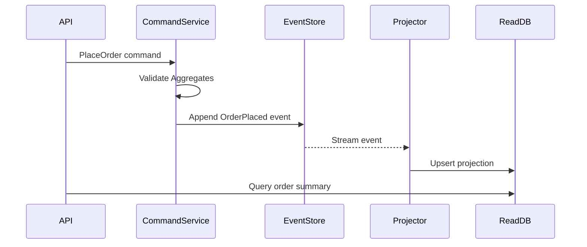

# ⚡ Event Sourcing + CQRS (L3-L4)

> Biến mọi thay đổi trạng thái thành chuỗi sự kiện bất biến. Mỗi “write” là append event, read side tái dựng trạng thái theo nhu cầu. Phù hợp khi cần audit, time-travel, tích hợp với downstream analytics.

## 1. Các khối xây dựng
- **Command Model (Write Model):** Validate rules, sinh `DomainEvent` thay vì mutate DB trực tiếp.
- **Event Store:** Log bất biến, append-only (Kafka, EventStoreDB, DynamoDB + streams).
- **Read Model:** Một hoặc nhiều projection phục vụ query nhanh (SQL view, Elastic, Redis cache).
- **Message Bus:** Event được publish để các bounded context khác subscribe.

## 2. Thiết kế event & aggregate
- **Aggregate Root** giữ bất biến (invariant); mọi command phải pass qua aggregate.
- **Event schema** immutable. Use versioning (additive fields) + schema registry.
- **Event ID & metadata** (correlation, causation, tenant) giúp tracing.
- **Snapshots** cho aggregate lớn: mỗi N event, lưu snapshot để replay nhanh.

## 3. Patterns triển khai
- **CQRS song song:** write endpoint trả về event ID, read side eventually consistent.
- **Outbox pattern:** transactionally ghi event vào outbox table, background worker publish.
- **Dual write guard:** tuyệt đối tránh ghi trực tiếp vào read DB từ write flow.
- **Replay:** projector có khả năng rebuild read model từ event log (idempotent).

## 4. Giám sát & vận hành
- **Lag tracking:** đo khoảng cách giữa newest event và projection offset.
- **Poison event handling:** đưa vào dead-letter + manual fix.
- **Schema migration:** thêm version mới, projector xử lý cả version cũ/lên map.
- **Backfill:** khi thêm read model mới, chạy replay từ event 0.

## ⚠️ Khi nào nên/không nên dùng
- ✅ Domain phức tạp, audit/time-travel quan trọng, nhiều service cần subscribe.
- ✅ Business rule thay đổi thường xuyên → cần history để tái hiện.
- ❌ CRUD đơn giản, dữ liệu ít thay đổi, latency cực thấp cần consistency mạnh.
- ❌ Đội ngũ chưa có kinh nghiệm vận hành stream/event store.

## ✅ Apply it
- [ ] Chọn 1 bounded context nhiều thay đổi (Order, Billing) để thử event sourcing song song với hệ thống cũ.
- [ ] Thiết kế event contract + metadata chuẩn hoá, lưu tại schema registry.
- [ ] Viết projector idempotent cho 1 read model (ví dụ: OrderSummary) và đo độ trễ cập nhật.
- [ ] Thiết lập dashboard theo dõi event lag + error rate của projector.
- [ ] Thử kịch bản replay toàn bộ event store cho môi trường staging để kiểm chứng khả năng phục hồi.

## 🔗 Cross-reference
- [Distributed Systems](./distributed-systems.md) – kiến thức consistency & Saga liên quan tới event sourcing.
- [Microservices Patterns Deep Dive](./microservices-patterns-deep-dive.md) – kết hợp event sourcing với saga/outbox.
- [Data Partitioning](./data-partitioning.md) *(will cover)* – shard event store/read model.
- [Monitoring & Observability](../monitoring-observability.md) – setup tracing cho projection pipeline.