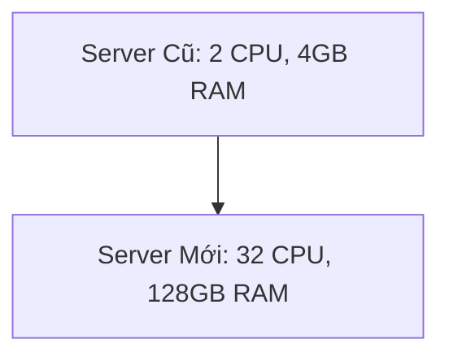
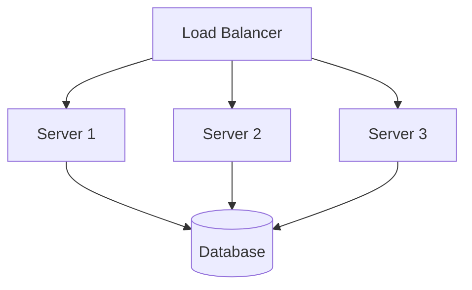

# 🐘 Scale Up vs 🐜 Scale Out: Chiến Lược Nào Giúp Tiết Kiệm 90% Chi Phí?

> [← Back to Backend Roadmap](../README.md)

Khi hệ thống của bạn phát triển từ 100 users lên 1 triệu users, bạn sẽ đối mặt với câu hỏi kinh điển: **Nên mua máy to hơn (Scale Up) hay mua nhiều máy nhỏ (Scale Out)?**

Bài viết này sẽ giúp bạn chọn chiến lược đúng đắn.

---

## 1. Scale Up - Nâng Cấp Dọc (Vertical Scaling) 🐘
*Biệt danh: "Con Voi Trong Phòng"*

### Cách làm:
Mua thêm RAM, thêm CPU, nâng cấp ổ cứng SSD cho server hiện tại. Biến con server "còi" thành một "siêu máy tính".

### ✅ Ưu điểm:
1.  **Đơn giản tuyệt đối:** Không cần sửa dòng code nào. Mọi thứ vẫn chạy trên 1 máy.
2.  **Quản lý dễ:** Chỉ có 1 OS, 1 Database, không cần cấu hình mạng phức tạp.
3.  **Tốt cho giai đoạn đầu:** Khi team nhỏ, bạn cần tốc độ ra mắt (Time to Market) hơn là khả năng mở rộng vô hạn.

### ❌ Nhược điểm:
1.  **Giới hạn phần cứng (Hard Limit):** Bạn không thể nâng cấp mãi. Một máy chủ vật lý có giới hạn RAM/CPU tối đa.
2.  **Single Point of Failure (SPOF):** Nếu "Con Voi" ốm (sập nguồn, lỗi OS), toàn bộ hệ thống chết.
3.  **Chi phí phi tuyến tính:** Giá của một thanh RAM 128GB đắt hơn rất nhiều so với 4 thanh 32GB. Server càng khủng, giá càng "chát".

---

## 2. Scale Out - Mở Rộng Ngang (Horizontal Scaling) 🐜
*Biệt danh: "Đàn Kiến"*

### Cách làm:
Thay vì mua máy to, bạn mua nhiều máy nhỏ giá rẻ và kết nối chúng lại. Dùng **Load Balancer** để chia tải.

### ✅ Ưu điểm:
1.  **Không giới hạn (Unlimited):** Cần thêm sức mạnh? Chỉ cần mua thêm server. Google, Facebook dùng hàng triệu server nhỏ.
2.  **High Availability (HA):** Nếu Server 1 chết, Server 2 và 3 vẫn gánh được tải. Hệ thống không bao giờ sập hoàn toàn.
3.  **Chi phí linh hoạt:** Dùng Cloud (AWS/Azure), bạn có thể bật thêm server khi traffic cao và tắt đi khi traffic thấp (Auto-scaling).

### ❌ Nhược điểm:
1.  **Phức tạp hóa vấn đề:** Bạn cần Load Balancer, Service Discovery, Distributed Cache (Redis).
2.  **Stateless:** Code backend không được lưu session trong RAM (vì request sau có thể rơi vào server khác). Phải dùng Redis để lưu session.
3.  **Network Latency:** Các server giao tiếp qua mạng sẽ chậm hơn so với gọi hàm trong cùng 1 máy.

---

## 3. Bảng So Sánh Chi Tiết 📊

| Tiêu chí | 🐘 Scale Up (Vertical) | 🐜 Scale Out (Horizontal) |
| :--- | :--- | :--- |
| **Chi phí** | Đắt đỏ khi lên cấu hình cao | Rẻ hơn, linh hoạt (Pay as you go) |
| **Độ phức tạp** | Thấp (Giữ nguyên kiến trúc) | Cao (Cần Load Balancer, Service Discovery) |
| **Giới hạn** | Có giới hạn phần cứng | Gần như không giới hạn |
| **Downtime** | Có (Khi nâng cấp/bảo trì) | Không (Rolling Update) |
| **Phù hợp với** | Monolith, Database (khó scale ngang) | Microservices, Web Server, Cache |
| **Code change** | Không cần | Cần (Stateless, External Session) |

---

## 4. Chiến Lược "Start Simple" 🎯

Đừng vội vàng Scale Out ngay từ ngày đầu (trừ khi bạn là Google).

1.  **Giai đoạn MVP (0 - 10k users):**
    *   👉 **Dùng Scale Up.**
    *   Thuê 1 VPS tốt (4 CPU, 8GB RAM). Cài App + DB chung 1 máy.
    *   Mục tiêu: Ra mắt nhanh, tiết kiệm thời gian dev.

2.  **Giai đoạn Growth (10k - 100k users):**
    *   👉 **Tách Database.**
    *   App Server vẫn Scale Up.
    *   Database chuyển sang Managed Service (RDS) hoặc server riêng.

3.  **Giai đoạn Scale (100k+ users):**
    *   👉 **Chuyển sang Scale Out.**
    *   App Server: Chạy nhiều instance sau Load Balancer.
    *   Cache: Dùng Redis cluster.
    *   Database: Bắt đầu nghĩ đến Read Replica hoặc Sharding.

> **Lời khuyên:** "Start simple with Vertical. Plan for Horizontal as you grow."
> (Bắt đầu đơn giản với Dọc. Chuẩn bị kế hoạch cho Ngang khi lớn mạnh.)
