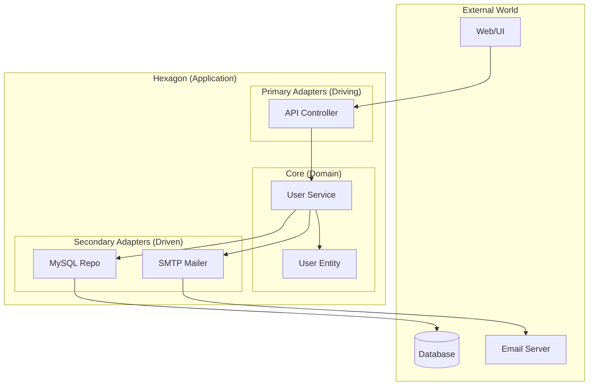

# 💠 Hexagonal Architecture: Bí Kíp Code "Bất Tử"

> [← Back to Backend Roadmap](../README.md)

Bạn có muốn code của mình sống sót qua mọi thay đổi công nghệ? Hôm nay dùng MySQL, ngày mai sếp bảo chuyển sang MongoDB? Hôm nay dùng REST API, ngày mai đổi sang GraphQL?
**Hexagonal Architecture (Ports & Adapters)** chính là câu trả lời.

---

## 1. Cấu Trúc Tổng Thể: Lõi Ứng Dụng Ở Trung Tâm 🧩

Tưởng tượng ứng dụng của bạn như một hình lục giác (Hexagon).
*   **Ở giữa (Core):** Business Logic thuần túy. Không biết gì về Database, Web, hay API.
*   **Ở cạnh (Ports):** Các "ổ cắm" (Interfaces) để giao tiếp.
*   **Ở ngoài (Adapters):** Các "phích cắm" (Implementation) kết nối với thế giới bên ngoài.



---

## 2. Các Thành Phần Chính

### 🌐 1. Primary Adapters (Driving) - "Cổng Vào"
Đây là những thứ **gọi vào** ứng dụng của bạn.
*   **HTTP:** Web Server (Express, NestJS Controller).
*   **CLI:** Dòng lệnh console.
*   **Test:** Unit Test gọi trực tiếp service.

👉 **Nhiệm vụ:** Nhận request từ bên ngoài -> Chuyển đổi dữ liệu -> Gọi vào Lõi (qua Port).

### 🏗️ 2. Secondary Adapters (Driven) - "Cổng Ra" (Cơ Sở Hạ Tầng)
Đây là những thứ ứng dụng của bạn **gọi ra** để làm việc.
*   **Database:** MySQL, MongoDB, PostgreSQL.
*   **Notification:** Email (SMTP), SMS (Twilio).
*   **Message Queue:** RabbitMQ, Kafka.

👉 **Nhiệm vụ:** Thực thi các Port (Interface) do Lõi định nghĩa.

### 💠 3. Lõi Ứng Dụng (Application Core) - Trái Tim ❤️
Nơi chứa logic nghiệp vụ quan trọng nhất.
*   **Luật bất di bất dịch:**
    *   ❌ KHÔNG import thư viện HTTP, Database, Queue.
    *   ❌ KHÔNG biết Adapter nào đang được sử dụng.
    *   ✅ CHỈ giao tiếp qua **Ports** (Interfaces).

### 🔌 4. Ports - Những "Ổ Cắm" Trung Gian
Hợp đồng (Contract) giữa Lõi và Thế giới bên ngoài.

#### Code Example (TypeScript):

**1. Định nghĩa Port (Trong Lõi):**
```typescript
// Core/Ports/UserRepository.ts
export interface UserRepository {
  findById(id: string): Promise<User>;
  save(user: User): Promise<void>;
}
```

**2. Implement Adapter (Trong Infrastructure):**
```typescript
// Infrastructure/Adapters/MySQLUserRepository.ts
import { UserRepository } from '../../Core/Ports/UserRepository';

export class MySQLUserRepository implements UserRepository {
  async findById(id: string): Promise<User> {
    // Code SQL cụ thể ở đây (Phụ thuộc MySQL)
    const row = await db.query('SELECT * FROM users WHERE id = ?', [id]);
    return new User(row.id, row.name);
  }
  
  async save(user: User): Promise<void> {
    await db.query('INSERT INTO users ...');
  }
}
```

**3. Sử dụng trong Service (Trong Lõi):**
```typescript
// Core/Services/UserService.ts
export class UserService {
  constructor(private userRepo: UserRepository) {} // Dependency Injection

  async changePassword(userId: string, newPass: string) {
    const user = await this.userRepo.findById(userId); // Gọi qua Interface
    user.changePassword(newPass);
    await this.userRepo.save(user);
  }
}
```

---

## 3. Tại Sao Nó "Bất Tử"? 🛡️

1.  **Độc lập công nghệ:** Muốn đổi từ MySQL sang MongoDB? Chỉ cần viết thêm `MongoUserRepository` implement `UserRepository`. Logic nghiệp vụ (UserService) **không cần sửa một dòng code nào!**
2.  **Dễ Test:** Khi viết Unit Test cho `UserService`, bạn không cần Database thật. Chỉ cần Mock cái `UserRepository`.
3.  **Dễ bảo trì:** Code Database bị lỗi? Chỉ cần sửa trong Adapter, không sợ ảnh hưởng đến logic tính toán lương.

---

## 4. Khi Nào Dùng? 🤔

*   **Dùng khi:**
    *   Hệ thống lớn, phức tạp (Enterprise).
    *   Logic nghiệp vụ quan trọng, cần tồn tại lâu dài (5-10 năm).
    *   Cần thay đổi công nghệ hạ tầng thường xuyên.
*   **KHÔNG dùng khi:**
    *   Làm MVP, dự án nhỏ, CRUD đơn giản.
    *   Code sẽ quá cồng kềnh (Over-engineering).

> **Lời khuyên:** "Hiểu tất cả, nhưng chỉ dùng những gì bạn cần."
