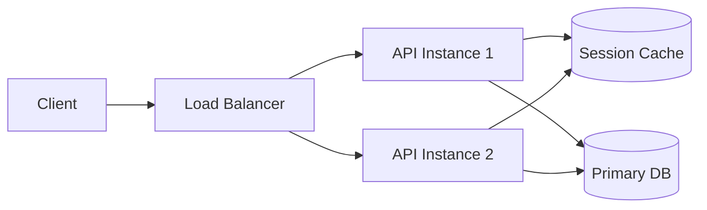

# ⚡ High Performance Architecture _(Level 2-3)_

> [← Back to Backend Development](../README.md) · [Architecture Hub](./README.md)

Module này bao quát các pattern nền tảng để tăng throughput, giảm latency và chuẩn hoá SLO cho backend.

## 1. Concurrency Models
> 🎯 **Khi cần:** xử lý nhiều request đồng thời mà không block server.

### **Thread-based Concurrency (Multithreading)**
*   **Concept:** Each request spawns a new thread (or uses a thread pool).
*   **Examples:** Java (Spring Boot), Python (threading), C#.
*   **Pros:** Good for CPU-bound tasks, simple mental model.
*   **Cons:** Context switching overhead, high memory usage per thread (the C10K problem).

### **Event Loop (Event-driven / Non-blocking I/O)**
*   **Concept:** Single-threaded loop handles all I/O events. Callbacks/Promises execute when I/O completes.
*   **Examples:** Node.js, Python (Asyncio), Go (Goroutines - hybrid approach).
*   **Pros:** Extremely efficient for I/O-bound tasks, low memory footprint.
*   **Cons:** Blocking the event loop freezes the entire server (e.g., heavy JSON parsing).

### **Goroutines (Go) & Virtual Threads (Java 21)**
*   **Concept:** "Green threads" managed by the runtime, not the OS. M:N scheduling (M goroutines on N OS threads).
*   **Advantage:** Millions of concurrent routines with minimal overhead.

---

## 2. Caching Strategies
> 🎯 **Khi cần:** giảm tải DB, cải thiện tốc độ đọc.

### **Where to Cache?**
1.  **Browser/Client:** HTTP Headers (`Cache-Control`, `ETag`).
2.  **CDN (Content Delivery Network):** Edge caching for static assets.
3.  **API Gateway / Reverse Proxy:** Nginx/Varnish caching response.
4.  **Application Cache:** Redis/Memcached (In-memory).
5.  **Database Cache:** DB Buffer Pool.

### **Caching Patterns**
**Cache Aside (Lazy Loading):** App checks cache -> Miss -> App queries DB -> App writes to cache.
    *   *Pros:* Only requested data is cached.
    *   *Cons:* First request is slow (cold start). Stale data potential.
*   **Write-Through:** App writes to Cache and DB simultaneously.
    *   *Pros:* Data consistency.
    *   *Cons:* Higher write latency.
*   **Write-Back (Write-Behind):** App writes only to Cache -> Cache async updates DB.
    *   *Pros:* Extremely fast writes.
    *   *Cons:* Data loss risk if cache crashes before sync.

---

## 3. Load Balancing Algorithms
> 🎯 **Khi cần:** phân phối tải, tăng tính sẵn sàng.

### **Layer 4 vs Layer 7**
*   **Layer 4 (Transport):** Based on IP/Port. Fast, dumb (doesn't see content).
*   **Layer 7 (Application):** Based on URL, Headers, Cookies. Smart, slower (needs SSL termination).

### **Common Algorithms**
1.  **Round Robin:** Sequential distribution (A -> B -> C -> A). Good for identical servers.
2.  **Weighted Round Robin:** Assign more traffic to powerful servers.
3.  **Least Connections:** Send to server with fewest active connections. Good for long-lived sessions (WebSocket).
4.  **IP Hash (Source Hash):** Client IP maps to specific server. Ensures **Session Stickiness**.
5.  **Consistent Hashing:**
    *   Used in distributed caches (e.g., Cassandra, DynamoDB).
    *   Maps keys to a "Ring".
    *   **Benefit:** Adding/Removing a node only affects `K/N` keys, not all keys.

---

## 4. Scalability Patterns
> 🎯 **Khi cần:** quyết định scale up/down hoặc scale out.

### **Vertical Scaling (Scale Up)**
*   Add more RAM/CPU to a single server.
*   *Limit:* Hardware ceiling, single point of failure.

### **Horizontal Scaling (Scale Out)**
*   Add more servers.
*   *Requirement:* Stateless application (session stored in Redis/DB, not local memory).

---

## 🛠️ Apply it
1. **Latency Budget:** Đo P95 response time → đặt mục tiêu < 150ms, chọn pattern cần áp dụng (cache, concurrency).
2. **Cache Drill:** Thêm Redis cache-aside cho endpoint ngốn DB nhiều nhất, đo chênh lệch CPU/latency trước-sau.
3. **LB Simulation:** Cấu hình Nginx với least_conn và IP hash, log kết quả phân phối để chọn thuật toán phù hợp.

## 🔗 Cross-reference
- [scaling-strategy.md](./scaling-strategy.md): Chi phí & quyết định scale.
- [monitoring-observability.md](../monitoring-observability.md): Thiết lập metric, alert cho SLO.
- [devops-sre/devops-lab-pack.md](../devops-sre/devops-lab-pack.md): Lab load testing & autoscaling.
