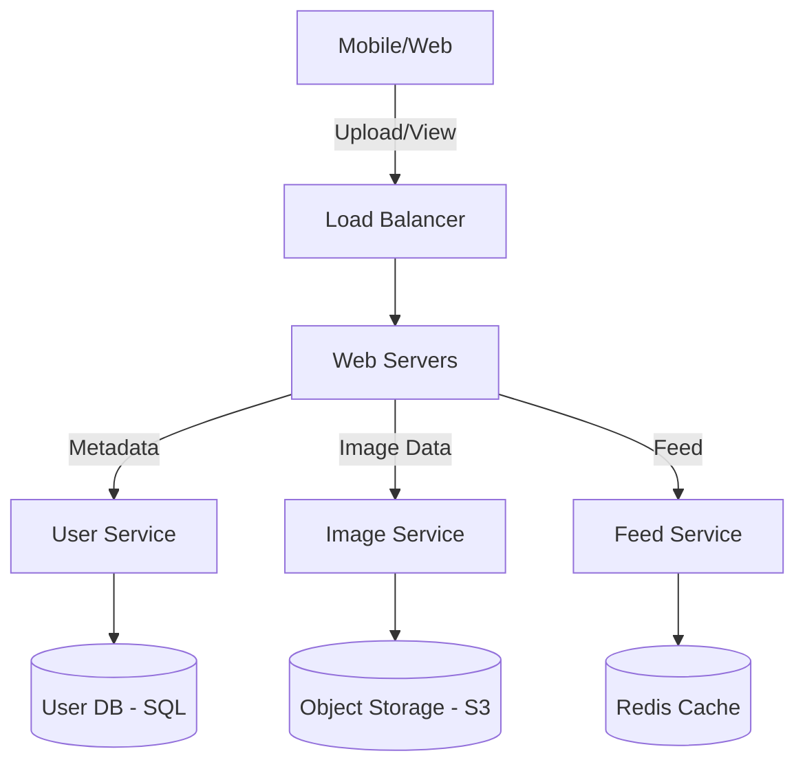

# 🏗️ System Design: Design Instagram (Deep Dive)

> [← Back to Backend Roadmap](../README.md)

Thiết kế một hệ thống chia sẻ ảnh như Instagram là một câu hỏi kinh điển trong phỏng vấn System Design.
Nó kiểm tra kiến thức về: **Scalability, Database Design, Caching, và Asynchronous Processing**.

---

## 1. Requirements Clarification (Xác định yêu cầu) 📝

### Functional Requirements (Chức năng):
1.  **Post Photo:** User có thể upload ảnh + caption.
2.  **News Feed:** User xem được ảnh mới nhất từ những người họ follow.
3.  **Follow:** User có thể follow người khác.

### Non-Functional Requirements (Phi chức năng):
1.  **High Availability:** Hệ thống phải luôn online (AP trong CAP theorem). Chấp nhận Eventual Consistency (feed có thể chậm vài giây).
2.  **Low Latency:** Feed phải load dưới 200ms.
3.  **Reliability:** Không được làm mất ảnh của user.

### Constraints (Quy mô):
*   500 triệu Users.
*   10 triệu Daily Active Users (DAU).
*   Mỗi user post 2 ảnh/ngày.
*   Mỗi user xem feed 10 lần/ngày.

---

## 2. Capacity Estimation (Ước tính dung lượng) 🧮

### Traffic:
*   **Write (Upload):** 10M DAU * 2 photos = 20M photos/day.
    *   20M / 86400s ≈ **230 photos/second**.
*   **Read (View Feed):** 10M DAU * 10 views = 100M views/day.
    *   100M / 86400s ≈ **1,150 requests/second**.

### Storage:
*   Trung bình 1 ảnh = 2MB.
*   Daily Storage = 20M photos * 2MB = **40TB / day**.
*   10 năm = 40TB * 365 * 10 ≈ **146PB**. -> Cần Object Storage (S3).

---

## 3. High-Level Design (Thiết kế tổng quan) 🏛️

*   **User Service:** Quản lý thông tin user, follow relationship (SQL).
*   **Image Service:** Upload ảnh lên S3, lưu metadata (URL, size) vào DB.
*   **Feed Service:** Tạo và lấy feed cho user (Redis).

---

## 4. Deep Dive (Chi tiết kỹ thuật) 🔍

### 4.1. Database Schema (SQL vs NoSQL?)

**Metadata (Users, Photos):** Dùng **Relational DB (PostgreSQL/MySQL)** vì cần ACID và structure rõ ràng.
*   `Users`: id, name, email.
*   `Photos`: id, user_id, photo_url, created_at.
*   `Follows`: follower_id, followee_id (Composite PK).

**Feed:** Dùng **NoSQL (Cassandra/DynamoDB)** hoặc **Redis** vì cần write/read cực nhanh.

### 4.2. Feed Generation (Bài toán khó nhất) 🔥

Làm sao để user A thấy ảnh của B, C, D (những người A follow) theo thứ tự thời gian?

#### Cách 1: Pull Model (Fan-out-on-load)
*   Khi A vào feed, hệ thống query: `SELECT * FROM Photos WHERE user_id IN (List Followees) ORDER BY time DESC`.
*   **Ưu:** Đơn giản, realtime.
*   **Nhược:** Rất chậm nếu A follow 1000 người. DB phải sort hàng triệu dòng.

#### Cách 2: Push Model (Fan-out-on-write) ✅
*   Mỗi user có một "Pre-computed Feed" (List photo IDs) trong Redis.
*   Khi B post ảnh mới -> Hệ thống đẩy (push) ID ảnh đó vào Feed của tất cả followers của B.
*   Khi A vào feed -> Chỉ cần đọc từ Redis (O(1)).
*   **Ưu:** Read cực nhanh.
*   **Nhược:** Chậm khi write. Nếu B là người nổi tiếng (Celeb) có 10 triệu followers -> Phải write 10 triệu lần (Thảm họa!).

#### Cách 3: Hybrid Approach (Instagram dùng cách này) 🚀
*   **User thường:** Dùng **Push Model**.
*   **Celeb (người nổi tiếng):** Dùng **Pull Model**. Ảnh của Celeb không được push vào feed của followers. Khi user load feed, hệ thống sẽ trộn (merge) feed từ Redis với ảnh mới nhất của Celeb mà user follow.

### 4.3. Image Storage Optimization 🖼️
*   **Upload:** Client upload trực tiếp lên S3 (dùng Presigned URL) để giảm tải cho Web Server.
*   **Delivery:** Dùng **CDN (Content Delivery Network)** (CloudFront/Akamai) để cache ảnh ở các edge server gần user nhất. User ở VN sẽ tải ảnh từ server VN thay vì server Mỹ.

---

## 5. Reliability & Redundancy (Độ tin cậy) 🛡️
*   **Database:** Master-Slave Replication. Write vào Master, Read từ Slaves.
*   **Sharding:** Chia nhỏ User DB dựa trên `user_id` để scale (VD: Shard 1 chứa users 1-1M, Shard 2 chứa 1M-2M).
*   **Backup:** Snapshot DB và S3 hàng ngày.

---

## 6. Summary (Tóm tắt) ✨
Để thiết kế Instagram, chìa khóa là:
1.  Tách biệt lưu trữ ảnh (S3 + CDN) và metadata (SQL).
2.  Xử lý bài toán Feed bằng mô hình **Hybrid (Push + Pull)**.
3.  Sử dụng **Caching (Redis)** ở mọi nơi có thể.
