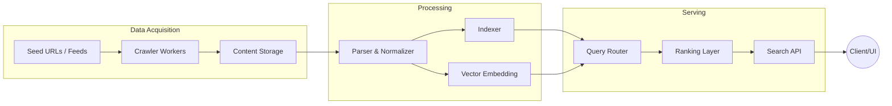

# 🔎 Search Engine Architecture for Developers

---
title: "Search Engine Architecture"
description: "Pipeline crawl → index → vector retrieval dành cho đội backend xây vertical search."
tags:
  - backend
  - search
  - system-design
updated: 2026-03-11
---

> [← Back to System Design](../README.md) | [Backend Roadmap](../README.md#-3-detailed-roadmap) | [Home](../../../README.md)
>
> **Difficulty:** 🟡 Intermediate → 🔴 Advanced (Systems + IR)
>
> **Prerequisites:** HTTP, REST API, Database fundamentals, basic distributed systems
>
> **Time to Master:** 4-8 tuần để nắm nền tảng, 6-12 tháng để triển khai production
>
> **🔗 Curated Links:** [resources/collected_links/backend-dev.md](../../../resources/collected_links/backend-dev.md)

---

## 1. Problem Framing & Requirements

| Dimension | Functional Requirements | Non-functional Requirements |
| --- | --- | --- |
| **Crawler** | Thu thập URL từ seeds, sitemap, RSS | Phải tôn trọng robots.txt, crawl budget rõ ràng |
| **Indexer** | Chuẩn hóa nội dung, tạo inverted index & vector index | Latency xây chỉ mục < vài phút với incremental updates |
| **Query Serving** | Gợi ý query, trả kết quả xếp hạng theo intent | P99 latency < 200ms, throughput 5k qps |
| **Observability** | Log crawl errors, ranking signals | Alert khi CTR giảm bất thường |

**Scope bài viết:** Search engine cho developers (site search, vertical search). Không xây Google clone, nhưng áp dụng thành phần tương tự ở scale vừa.

---

## 2. High-Level Architecture



Các thành phần chính:
1. **Crawler Layer:** lấy nội dung, deduplicate, tôn trọng chính sách robots/crawl-delay.
2. **Processing Layer:** chuẩn hóa HTML → text, detect language, remove boilerplate, thực hiện tokenization, stemming.
3. **Index Layer:** inverted index (BM25) + vector index (FAISS, HNSW) phục vụ hybrid search.
4. **Serving Layer:** query parsing, retrieval, ranking, personalization, logging.
5. **Observability:** metrics (QPS, latency), quality signals (CTR, dwell time), A/B testing.

---

## 3. Crawl & Ingest Pipeline

### 3.1 Crawl Scheduler
- **Frontier:** Priority queue chứa URL, scoring theo freshness, domain politeness.
- **Robots & Sitemap:** parse sitemap.xml → enqueue, kiểm tra `Disallow`.
- **Rate limiting:** tách host → mỗi host có token bucket (ví dụ 1 req/second).

```pseudo
while frontier.not_empty():
  target = frontier.pop()
  if robots_cache[target.host].disallow(target.path): continue
  if should_throttle(target.host): frontier.defer(target)
  resp = http_fetch(target)
  if resp.status in [200, 304]:
      enqueue_processing(resp)
      extract_links(resp).forEach(frontier.push)
```

### 3.2 Content Processing
- **Normalization:** Strip HTML, giữ lại title, meta, headings, main content (Readability algos).
- **Language Detection & Tokenization:** sử dụng ICU4J, spaCy.
- **Boilerplate Removal:** Rule-based hoặc ML classifier.
- **Document Store:** lưu bản gốc + metadata trong object storage (S3) hoặc columnar store.

### 3.3 Incremental Updates
- **Fingerprinting:** sử dụng simhash để phát hiện duplicate.
- **Change detection:** so sánh hash → chỉ reindex khi khác.
- **Versioning:** index giữ `doc_id`, `version`, `last_updated` để rollback.

---

## 4. Index Layer Details

| Kiểu Index | Công nghệ | Lý do |
| --- | --- | --- |
| **Inverted Index** | Elasticsearch/OpenSearch, Vespa | Keyword search, BM25 scoring |
| **Forward Store** | Column store (Parquet, Cassandra) | Truy xuất snippet, metadata |
| **Vector Index** | FAISS, Milvus, Pinecone | Semantic similarity, embeddings |
| **Graph Index** | Neo4j, JanusGraph | PageRank, entity relation |

### 4.1 Sharding & Replication
- **Sharding strategy:** by document ID hash để phân tán đồng đều.
- **Replication:** primary + replicas để high availability, cho phép query song song.
- **Reindexing:** dùng topic (Kafka) phát event `doc_updated` → indexers xử lý bất đồng bộ.

### 4.2 Embedding Pipeline
- Model: SBERT, OpenAI text-embedding-3-large, Cohere.
- Batch compute embeddings → lưu vector 1536-dim trong vector store, kèm doc_id.
- Hybrid retrieval: Weighted sum score = α * BM25 + β * cosine(vector).

---

## 5. Query Understanding & Retrieval

### 5.1 Query Pipeline
1. **Normalization:** lowercase, remove stopwords (tuỳ ngôn ngữ), handle typos (edit distance / noisy channel model).
2. **Intent Detection:** classifier (LightGBM) phân loại informational vs transactional.
3. **Query Rewriting:** synonyms, lemmatization, expand entity graph.
4. **Candidate Retrieval:**
   - **Lexical:** BM25 top-1000.
   - **Vector:** ANN search top-200 (HNSW, IVF).
5. **Blending:** merge candidates, deduplicate theo doc_id.

### 5.2 Ranking Layer
- **Feature engineering:** BM25 score, page authority, freshness, CTR, embedding similarity.
- **Learning to Rank:** LambdaMART/XGBoost, hoặc BERT cross-encoder để re-rank top-50.
- **Contextual Signals:** geo, device, personalization (history embeddings).
- **Diversity:** MMR (Maximal Marginal Relevance) để tránh kết quả trùng lặp.

### 5.3 Snippet & Highlighting
- Lấy đoạn văn chứa terms, highlight query matches.
- Nếu dùng vector search → trích summary bằng LLM (chú ý chi phí, caching).

---

## 6. API & Interface Design

### 6.1 REST API Example
```
GET /search
Query params:
  q=vector database
  page=1&size=10
  vertical=docs
  userId=123 (optional for personalization)

Response:
{
  "query": "vector database",
  "took_ms": 85,
  "results": [
     {
       "doc_id": "12345",
       "title": "Building Vector Search with FAISS",
       "snippet": "...",
       "score": 0.83,
       "url": "/docs/vector-search",
       "metadata": {
          "language": "en",
          "last_updated": "2026-03-01"
       }
     }
  ],
  "facets": {
     "language": {"en": 120, "vi": 80}
  }
}
```

### 6.2 GraphQL Alternative
Cho phép client chọn trường cần thiết, nested facets. Cần tối ưu N+1 qua dataloader caching.

### 6.3 Autocomplete & Suggestions
- Trie hoặc prefix index, scoring theo popularity, seasonality.
- Query logs → train Markov/Seq2Seq model gợi ý truy vấn tiếp theo.

---

## 7. Scaling & Reliability

| Layer | Bottleneck | Giải pháp |
| --- | --- | --- |
| Crawl | Millions URLs/day | Horizontal scale crawler workers, dùng polite queue per host |
| Index | Rebuild mất hàng giờ | Incremental indexing, dual-write strategy, snapshot/restore |
| Query | Latency >200ms khi load cao | Cache hot queries, Result cache (Redis), gRPC internal calls |
| Ranking | Model inference chậm | Distil model, batch scoring, GPU inference pods |
| Vector search | Billion vectors | HNSW quantization, disk-based ANN (Vespa), hierarchical shards |

**Reliability patterns:**
- **Circuit Breaker:** nếu downstream index shard down → fallback sang replica.
- **Bulkhead:** tách resource pool cho ranking vs autocomplete.
- **Canary Deploy:** validate model mới trên 5% traffic.
- **Chaos Testing:** simulate node failure, verify rebalancing hoạt động.

---

## 8. Observability & Search Quality

### 8.1 Metrics
- **System:** QPS, P50/P95/P99 latency, error rate, cache hit rate.
- **Quality:** CTR@k, NDCG@k, abandonment rate, dwell time.
- **Crawler:** pages crawled/hour, error codes, delay per host.

### 8.2 Logging & Tracing
- Structured log (JSON) cho query ID, features, ranking model version.
- Distributed tracing (OpenTelemetry) từ API → ranking → index shards.

### 8.3 Evaluation
- **Offline:** Relevance judgments (annotators), compute MAP, NDCG.
- **Online:** A/B test, interleaving (Team Draft Interleaving) để so sánh model.

---

## 9. Build vs Buy

| Use case | Giải pháp tự xây | Managed service |
| --- | --- | --- |
| Site search nhỏ | Meilisearch, Typesense | Algolia, Azure Cognitive Search |
| Enterprise doc search | OpenSearch, Elastic | AWS Kendra, GCP Vertex AI Search |
| Vector/RAG search | LlamaIndex + Milvus | Pinecone, Weaviate Cloud, Chroma Cloud |
| Commerce search | Elastic App Search, Vespa | Coveo, Constructor.io |

**Criteria chọn:** latency, multi-region, budget, compliance (PII), tuning flexibility.

---

## 10. Hands-on Roadmap for Devs

1. **MVP (Week 1-2):**
   - Crawl RSS feed → save raw HTML (Python + Scrapy).
   - Parse text → index vào Meilisearch.
   - Simple UI (Next.js) gọi API search.
2. **Phase 2 (Week 3-5):**
   - Thêm Redis cache cho popular queries.
   - Implement synonyms, typo tolerance.
   - Add analytics (log query, clicks).
3. **Phase 3 (Week 6-8):**
   - Hybrid search: BM25 + OpenAI embeddings.
   - Ranking ml model (LightGBM) với click logs.
   - Observability: Grafana dashboard + alerting.

**Deliverables portfolio:** Architecture diagram, code repo, Lighthouse metrics, case study blog.

---

## 11. System Design Exercise: Vertical Search for Developer Docs

### 11.1 Bài toán
Thiết kế hệ thống search cho một nền tảng tài liệu kỹ thuật (ví dụ framework nguồn mở) với ~5 triệu bài viết, hỗ trợ tìm kiếm đa ngôn ngữ (EN/VI/JP) và cần kết quả trong <150ms.

### 11.2 Yêu cầu chi tiết
| Functional | Non-Functional |
| --- | --- |
| Crawl docs từ GitHub, blog, changelog RSS | P95 latency < 150ms, 99.9% availability |
| Hỗ trợ filter theo version, language, doc type | Tối ưu chi phí (<$10k/tháng) |
| Suggestions + typo tolerance | Index cập nhật trong vòng 5 phút sau commit |
| Cho phép embed widget search vào docs site khác | Audit trail: log query + result phục vụ debug |

### 11.3 Yêu cầu kỹ thuật
- Thiết kế sơ đồ kiến trúc đầy đủ (Mermaid hoặc draw.io) gồm crawler, processing, index, serving.
- Tính toán sơ bộ: dung lượng index, số shard, số worker crawl cần thiết.
- Đưa ra chiến lược caching và autoscaling khi traffic tăng 5x vào thời điểm release.
- Đề xuất cách đánh giá chất lượng (offline + online metrics) và quy trình rollback khi model ranking mới gây tụt CTR.
- Trình bày trade-off build vs dùng dịch vụ (Algolia, Elastic Cloud) với số liệu chi phí/latency.

### 11.4 Gợi ý chấm điểm (dùng khi self-review)
| Tiêu chí | Điểm |
| --- | --- |
| Kiến trúc tổng thể rõ ràng, có data flow | 20 |
| Giải quyết các bottleneck (crawl, index, query) với số liệu cụ thể | 20 |
| Chiến lược scaling/cache/failover hợp lý | 20 |
| Phần ranking + quality metrics (NDCG, CTR) rõ, có kế hoạch A/B | 20 |
| Tính toán chi phí + build vs buy có luận cứ | 20 |

Tổng: 100 điểm. ≥80 điểm coi như đạt chuẩn Senior System Design round.

---

## 12. Reference & Further Reading
- 📘 *Designing Data-Intensive Applications* – chương Search & IR.
- 📄 Google Caffeine Paper, Facebook Unicorn search architecture.
- 🧑‍💻 Elasticsearch / OpenSearch docs (Shard design, query DSL).
- 🔍 Vespa.ai blog (hybrid search, tensor ranking).
- 🤖 LlamaIndex / LangChain – triển khai RAG search.

---

> **Last Updated:** March 2026

## ✅ Apply it
- [ ] Dựng MVP crawl + search nội bộ (Scrapy + Meilisearch) trong 1 tuần.
- [ ] Tính toán dung lượng index và số shard cần thiết cho dataset của bạn.
- [ ] Thiết kế dashboard quan sát (QPS, latency, CTR) và alert khi CTR giảm.
- [ ] Viết playbook rollback khi model ranking mới tụt chất lượng.
- [ ] Đặt SLA p95 latency và chạy load test 5k QPS để đo gap.
- [ ] Lập bảng chi phí build vs buy (Elastic Cloud, Algolia) với số liệu hàng tháng.