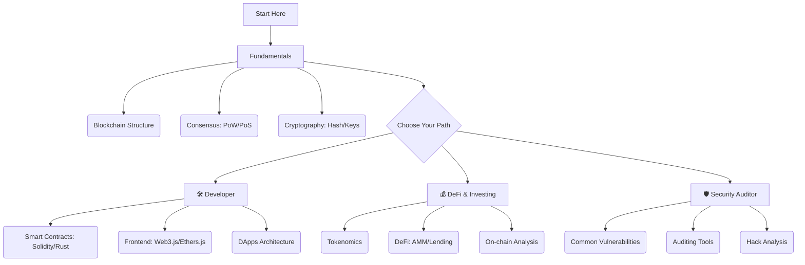

# 🔗 Blockchain Knowledge Base

> [← Domains hub](../README.md) | [Home](../../README.md) | [Challenges](../../challenges/blockchain/README.md) | [🚀 Quick Start](../../QUICK-START.md)
>
> **Difficulty:** 🟢 Beginner → 🔴 Advanced (Progressive)  
> **Practice:** [Solidity escrow challenge](../../challenges/blockchain/challenge-solidity-escrow.md)
>
> **Prerequisites:** Basic programming knowledge helpful but not required
>
> **Time to Master:** 6-18 months (Fundamentals to DApp development)
>
> **🔗 Curated Links:** [resources/collected_links/blockchain.md](../../resources/collected_links/blockchain.md)

**📊 Difficulty levels:** See [DIFFICULTY-GUIDE.md](../../DIFFICULTY-GUIDE.md) to understand learning paths.
**🧩 Knowledge Audit:** Check [Blockchain & Web3 Knowledge Audit](../../case-studies/knowledge-audits/blockchain-knowledge-audit.md) to test your expertise!

---

Blockchain không chỉ là Crypto. Nó là một cuộc cách mạng về **Trust (Niềm tin)** và **Data Integrity (Tính toàn vẹn dữ liệu)**.
Thư viện này cung cấp kiến thức toàn diện từ cơ bản đến chuyên sâu về công nghệ Blockchain.

---

## 🗺️ Visual Roadmap

---

## 📚 Detailed Roadmap

### **1. Fundamentals (Nền tảng)**
*   **[Blockchain 101](./fundamentals/blockchain-101.md):** Khái niệm sổ cái phân tán (Distributed Ledger), cấu trúc Block, và cơ chế đồng thuận.
*   **[Ethereum & EVM](./fundamentals/ethereum-evm.md):** Hiểu về "Máy tính thế giới" Ethereum, Gas fee và vòng đời giao dịch.

### **2. Development (Lập trình DApp)**
*   **[Smart Contracts](./development/smart-contracts.md):** Ngôn ngữ Solidity, Rust và các Framework (Hardhat, Foundry).
*   **Web3 Frontend:** Kết nối ví Metamask, tương tác với Blockchain từ trình duyệt. *(Coming soon)*

### **3. DeFi (Tài chính phi tập trung)**
*   **[DeFi Mechanisms](./defi/defi-mechanisms.md):** Cách hoạt động của AMM (Uniswap), Lending (Aave) và Yield Farming.
*   **[Advanced DeFi (Derivatives)](./defi/derivatives-perps.md):** Phái sinh (Futures, Options) và chiến lược Flash Loans.

### **4. Security & Privacy (Bảo mật & Riêng tư)**
*   **[Smart Contract Auditing](./security/smart-contract-auditing.md):** Các lỗi bảo mật phổ biến (Reentrancy, Overflow) và cách phòng tránh.
*   **[ZK-Proofs & Privacy](./security/zk-proofs-privacy.md):** Công nghệ Zero-Knowledge Proofs và giao dịch ẩn danh (Tornado Cash).

### **5. Investing & Trading (Đầu tư & Thuật toán)**
*   **[Tokenomics Playbook](./investing/tokenomics.md):** Phân tích nguồn cung, lạm phát, chiến lược giao dịch.
*   **[Case Study Portfolio](./investing/case-study-portfolio.md):** Ví dụ phân bổ đa bucket + log review.
*   **[Valuation Models](./investing/valuation-models.md):** DCF, multiples, network metrics cho crypto.
*   **[On-chain Sleuthing & Tracking ✨](./trends/on-chain-sleuthing.md):** Workflow Dune Analytics (SQL), Arkham Whale tracking và bắt bệnh Rug Pull. (⭐ **New**)
*   **[Algorithmic Trading Bot ✨](./trading/algorithmic-trading-bot.md):** Tự động hóa điểm mua/bán Spot với Python CCXT, lập ma trận Grid Bot và Arbitrage. (⭐ **New**)

### **6. The Dark Forest (MEV & Khai Thác Tiền)**
*   **[MEV & Arbitrage Strategies ✨](./mev/mev-arbitrage-strategies.md):** Cách Searcher lấy tiền từ Mempool. Front-running, Sandwich attack và Flashbot RPC. (⭐ **New**)

### **6. Scaling & Infrastructure (Mở rộng & Hạ tầng)**
*   **[Layer 2 Scaling](./scaling/layer2-deep-dive.md):** Optimistic Rollups vs ZK-Rollups.
*   **[Cross-chain Bridges](./interoperability/cross-chain-bridges.md):** Cơ chế cầu nối và rủi ro bảo mật.

### **7. NFT & Governance (Văn hóa & Quản trị)**
*   **[NFT & GameFi](./nft-gamefi/nft-standards-economy.md):** Tiêu chuẩn NFT mới (ERC-721A, SBT) và kinh tế trong Game (Dual Token).
*   **[DAO Governance](./governance/dao-models.md):** Các mô hình quản trị phi tập trung và cơ chế bỏ phiếu.

### **8. MMO & Airdrop**
*   **[MMO & Retroactive Playbook](./mmo/README.md):** Chiến lược săn Airdrop, MMO quest và tối ưu chiến dịch.

### **9. 🧪 Blockchain Thao Trường (Labs)**
*   **[Lab: MEV Sniper, Flash Loan & Grid Bot ✨](./labs/README.md):** Bài tập thực chiến Cáo/Mực để lập trình viên tự động hóa việc rình rập và khai thác Lợi nhuận DeFi. (⭐ **New**)

---

## 🛠️ Tools & Resources
*   **Explorer:** Etherscan, BscScan, Solscan.
*   **Development:** Remix IDE, VS Code (Solidity extension).
*   **Data:** Dune Analytics, DefiLlama, CoinGecko.

---

> **Last Updated:** February 2026
