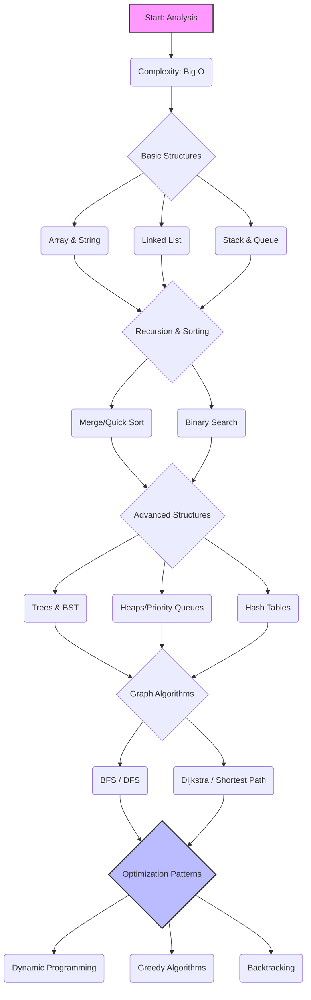

# 🧮 Data Structures & Algorithms (DSA) Roadmap

> [← Back to Chapter 1](../../chapters/01-xac-dinh-linh-vuc.md) | [Home](../../README.md) | [🚀 Quick Start](../../QUICK-START.md) | [📖 Glossary](../../GLOSSARY.md)
>
> **Difficulty:** 🟡 Intermediate → 🔴 Advanced (Deep Logic)
>
> **Prerequisites:** Basic knowledge of at least one programming language (C++, Java, Python, or JavaScript)
>
> **Time to Master:** 6-12 months (Consistent practice)
>
> **🔗 Curated Links:** [resources/collected_links/dsa.md](../../resources/collected_links/dsa.md)

---

## 📊 1. Why DSA? (Tại sao phải học?)

Cấu trúc dữ liệu và Giải thuật là "xương sống" của ngành Khoa học Máy tính. Nó không chỉ giúp bạn qua môn hay vượt qua vòng phỏng vấn của các Big Tech (FAANG), mà còn:
1.  **Tối ưu hóa tài nguyên:** Giảm thiểu CPU (Time Complexity) và RAM (Space Complexity).
2.  **Tư duy giải quyết vấn đề:** Rèn luyện khả năng phân tích bài toán một cách hệ thống.
3.  **Khả năng mở rộng (Scalability):** Hệ thống lớn không thể chạy tốt nếu dùng thuật toán kém hiệu quả.

---

## 🗺️ 2. Visual Roadmap

---

## 📚 3. Detailed Roadmap (Mục lục chi tiết)

### **Giai đoạn 1: Phân tích & Cấu trúc cơ bản**
*   **[Complexity Analysis](./complexity-analysis.md):** Hiểu sâu về Big O, Big Omega, Big Theta.
*   **[Arrays & Strings](./arrays-strings.md):** Two Pointers, Sliding Window, Prefix Sum.
*   **[Linked Lists](./linked-lists.md):** Singly, Doubly, Circular, Fast & Slow Pointers.
*   **[Stacks & Queues](./stacks-queues.md):** Monotonic Stack, Deque.

### **Giai đoạn 2: Đệ quy & Sắp xếp**
*   **[Recursion Fundamentals](./recursion.md):** Tư duy đệ quy và bộ nhớ Stack.
*   **[Sorting & Searching](./sorting-searching.md):** Quicksort, Mergesort, Binary Search (Search on Answer).

### **Giai đoạn 3: Cấu trúc dữ liệu phi tuyến (Advanced)**
*   **[Trees & Graphs](./trees-graphs.md):** Binary Tree, BST, AVL, Segment Tree, Disjoint Set Union (DSU).
*   **[Hash Tables](./hash-tables.md):** Collision handling, Hash functions.
*   **[Heaps](./heaps.md):** Min-heap, Max-heap, Priority Queue.

### **Giai đoạn 4: Thuật toán Tối ưu (Patterns)**
*   **[Dynamic Programming (DP)](./dynamic-programming.md):** Memoization vs Tabulation, Knapsack, LIS, LCS.
*   **[Greedy Algorithms](./greedy.md):** Huffman Coding, Interval Scheduling.
*   **[Backtracking](./backtracking.md):** N-Queens, Sudoku Solver.

---

## 🧪 4. Practice & Resources (Thực hành)

Đừng chỉ đọc, hãy code. 

### **Platforms:**
1.  **LeetCode:** Tiêu chuẩn cho phỏng vấn (Luyện 75-150 câu kinh điển).
2.  **Codeforces:** Dành cho người muốn thi Competitive Programming (CP).
3.  **Hackerrank:** Bài tập cơ bản theo từng chủ đề.

### **Must-read Books:**
*   *"Introduction to Algorithms" (CLRS)* - Cuốn "Kinh thánh" của thuật toán.
*   *"Grokking Algorithms"* - Dễ hiểu, nhiều hình minh họa (Dành cho người mới).
*   *"Cracking the Coding Interview"* - Chiến thuật phỏng vấn Big Tech.

### **Coding Challenges (Hands-on):**
1. **[Coding Challenge #1 – Real-time Delivery Stream Scheduler](./coding-challenges/delivery-stream-scheduler.md):** Stream scheduling, priority queue, greedy assignment.
2. **[Coding Challenge #2 – Memory Window Anomaly Detector](./coding-challenges/memory-window-anomaly.md):** Sliding window + hashmap, detection trong O(n).
3. **[Coding Challenge #3 – Drone Route Load Balancer](./coding-challenges/drone-route-balancer.md):** Weighted interval scheduling + heap cho drone logistics.

---

## 🗓️ 6. Lộ Trình Luyện DSA 14 Ngày (Intensive Sprint)

> **Mục tiêu:** xây dựng nền tảng tư duy thuật toán + luyện giải 30-40 bài chất lượng cao trong 2 tuần, dành ~2-3 giờ/ngày.
>
> **Nguyên tắc:** (1) Mỗi ngày 1 chủ đề chính + 1 pattern phụ, (2) Luôn kết hợp đọc lý thuyết + code bài, (3) Review lỗi hằng ngày.

| Ngày | Chủ đề chính | Focus phụ & tài nguyên | Bài tập gợi ý |
|-----|--------------|-------------------------|---------------|
| **Day 1** | Complexity Analysis | Big-O cheat sheet, [complexity-analysis.md](./complexity-analysis.md) | 3 bài so sánh độ phức tạp, trace manual |
| **Day 2** | Arrays & Strings (Two Pointers) | Sliding Window mini-guide | 4 bài: Two Sum, Anagram, Longest Substring |
| **Day 3** | Prefix Sum & Difference Array | Review edge cases (overflow) | 3 bài: Subarray Sum, Range Update |
| **Day 4** | Linked Lists | Fast/Slow pointers, reverse list | 3 bài: Detect cycle, reorder list |
| **Day 5** | Stacks & Queues | Monotonic Stack, Deque | 3 bài: Next Greater, Sliding Window Max |
| **Day 6** | Recursion Fundamentals | Draw recursion tree, memo stack depth | 3 bài: Fibonacci, Tower of Hanoi, permutations |
| **Day 7** | Sorting + Binary Search Patterns | Search on Answer, boundary tricks | 4 bài: Koko Eating Bananas, Aggressive Cows |
| **Day 8** | Trees (Traversal, BST) | Implement inorder/level-order from scratch | 4 bài: Validate BST, Lowest Common Ancestor |
| **Day 9** | Advanced Trees (Trie/Segment Tree overview) | Ôn lý thuyết + 1 bài cài đặt nhẹ | 2 bài: Prefix queries, range sum segment tree |
| **Day 10** | Heaps & Priority Queue | Top-K patterns, heapify | 3 bài: Merge k sorted lists, Task Scheduler |
| **Day 11** | Hash Tables & Bit Manipulation | Collision handling, XOR tricks | 4 bài: Subarray XOR, Two Sum variants |
| **Day 12** | Graph Basics (BFS/DFS) | Adj list vs matrix, visited patterns | 4 bài: Number of Islands, Course Schedule |
| **Day 13** | Shortest Path & Union-Find | Dijkstra template, DSU ops | 3 bài: Network Delay, Kruskal mini case |
| **Day 14** | Dynamic Programming Sprint | Knapsack/LIS/LCS overview | 4 bài: 0/1 Knapsack, LIS patience sorting |

### Daily Routine (gợi ý)

1. **Warm-up 15’**: Đọc lại notes ngày trước, highlight lỗi tư duy.
2. **Lý thuyết 30’**: Từ file tương ứng trong roadmap + video tuỳ chọn.
3. **Practice 90’**: Chọn 3-4 bài LeetCode/Codeforces theo chủ đề.
4. **Debrief 30’**: Ghi lại mẫu tư duy, tối ưu, hoặc template code.

### Weekly Review (Day 7 & Day 14)

- Tổng hợp 10 bài khó nhất, viết mini post-mortem.
- Chọn 1 challenge thực tế trong thư mục `coding-challenges/` để áp dụng pattern.
- Đánh giá tiến độ theo tiêu chí: số bài AC, số lỗi repeat, mức tự tin (1-5).

---

## 📊 5. Knowledge Audit

**🧩 Thử thách Năng lực:** Bạn đã sẵn sàng để giải quyết các bài toán phức tạp chưa? 
👉 **[DSA Knowledge Audit](../../case-studies/knowledge-audits/dsa-knowledge-audit.md)** (⭐ **New**)

---

## 💡 6. Core Skills Example (CV Keywords)

*   ❌ **Chung chung:** "Biết thuật toán và cấu trúc dữ liệu."
*   ✅ **Specific:** "Proficient in algorithmic problem-solving using Dynamic Programming and Graph theory; optimized system performance by replacing $O(n^2)$ search with $O(\log n)$ using Hash Maps and Binary Search."
