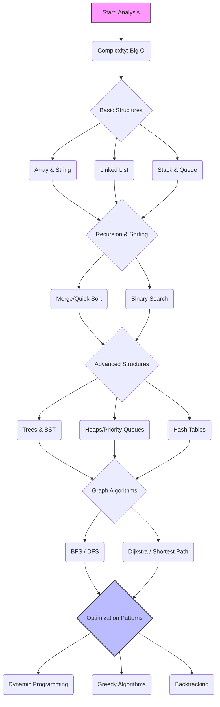

# 🧮 Data Structures & Algorithms (DSA) Roadmap

> [← Back to Chapter 1](../../chapters/01-xac-dinh-linh-vuc.md) | [Home](../../README.md) | [🚀 Quick Start](../../QUICK-START.md) | [📖 Glossary](../../GLOSSARY.md)
>
> **Difficulty:** 🟡 Intermediate → 🔴 Advanced (Deep Logic)
>
> **Prerequisites:** Basic knowledge of at least one programming language (C++, Java, Python, or JavaScript)
>
> **Time to Master:** 6-12 months (Consistent practice)
>
> **🔗 Curated Links:** [resources/collected_links/dsa.md](../../resources/collected_links/dsa.md)

---

## 📊 1. Why DSA? (Tại sao phải học?)

Cấu trúc dữ liệu và Giải thuật là "xương sống" của ngành Khoa học Máy tính. Nó không chỉ giúp bạn qua môn hay vượt qua vòng phỏng vấn của các Big Tech (FAANG), mà còn:
1.  **Tối ưu hóa tài nguyên:** Giảm thiểu CPU (Time Complexity) và RAM (Space Complexity).
2.  **Tư duy giải quyết vấn đề:** Rèn luyện khả năng phân tích bài toán một cách hệ thống.
3.  **Khả năng mở rộng (Scalability):** Hệ thống lớn không thể chạy tốt nếu dùng thuật toán kém hiệu quả.

---

## 🗺️ 2. Visual Roadmap

---

## 📚 3. Detailed Roadmap (Mục lục chi tiết)

### **Giai đoạn 1: Phân tích & Cấu trúc cơ bản**
*   **[Complexity Analysis](./complexity-analysis.md):** Hiểu sâu về Big O, Big Omega, Big Theta.
*   **[Arrays & Strings](./arrays-strings.md):** Two Pointers, Sliding Window, Prefix Sum.
*   **[Linked Lists](./linked-lists.md):** Singly, Doubly, Circular, Fast & Slow Pointers.
*   **[Stacks & Queues](./stacks-queues.md):** Monotonic Stack, Deque.

### **Giai đoạn 2: Đệ quy & Sắp xếp**
*   **[Recursion Fundamentals](./recursion.md):** Tư duy đệ quy và bộ nhớ Stack.
*   **[Sorting & Searching](./sorting-searching.md):** Quicksort, Mergesort, Binary Search (Search on Answer).

### **Giai đoạn 3: Cấu trúc dữ liệu phi tuyến (Advanced)**
*   **[Trees & Graphs](./trees-graphs.md):** Binary Tree, BST, AVL, Segment Tree, Disjoint Set Union (DSU).
*   **[Hash Tables](./hash-tables.md):** Collision handling, Hash functions.
*   **[Heaps](./heaps.md):** Min-heap, Max-heap, Priority Queue.

### **Giai đoạn 4: Thuật toán Tối ưu (Patterns)**
*   **[Dynamic Programming (DP)](./dynamic-programming.md):** Memoization vs Tabulation, Knapsack, LIS, LCS.
*   **[Greedy Algorithms](./greedy.md):** Huffman Coding, Interval Scheduling.
*   **[Backtracking](./backtracking.md):** N-Queens, Sudoku Solver.

---

## 🧪 4. Practice & Resources (Thực hành)

Đừng chỉ đọc, hãy code. 

### **Platforms:**
1.  **LeetCode:** Tiêu chuẩn cho phỏng vấn (Luyện 75-150 câu kinh điển).
2.  **Codeforces:** Dành cho người muốn thi Competitive Programming (CP).
3.  **Hackerrank:** Bài tập cơ bản theo từng chủ đề.

### **Must-read Books:**
*   *"Introduction to Algorithms" (CLRS)* - Cuốn "Kinh thánh" của thuật toán.
*   *"Grokking Algorithms"* - Dễ hiểu, nhiều hình minh họa (Dành cho người mới).
*   *"Cracking the Coding Interview"* - Chiến thuật phỏng vấn Big Tech.

---

## 📊 5. Knowledge Audit

**🧩 Thử thách Năng lực:** Bạn đã sẵn sàng để giải quyết các bài toán phức tạp chưa? 
👉 **[DSA Knowledge Audit](../../case-studies/knowledge-audits/dsa-knowledge-audit.md)** (⭐ **New**)

---

## 💡 6. Core Skills Example (CV Keywords)

*   ❌ **Chung chung:** "Biết thuật toán và cấu trúc dữ liệu."
*   ✅ **Specific:** "Proficient in algorithmic problem-solving using Dynamic Programming and Graph theory; optimized system performance by replacing $O(n^2)$ search with $O(\log n)$ using Hash Maps and Binary Search."
