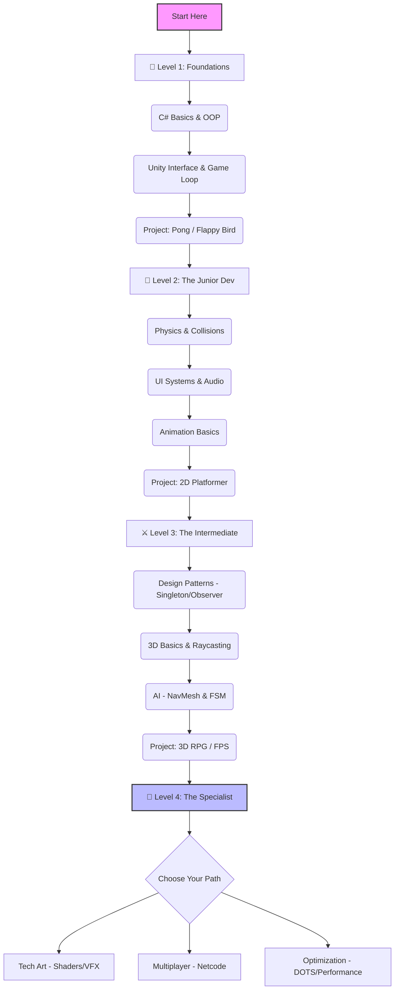

# 🎮 Game Development Roadmap (Unity Focus)

> 📍 **Navigation Note:**  
> - **This folder (domains/game-dev/):** Technical skills - Unity, C#, Game Architecture, Shaders, Multiplayer  
> - **Career & Business guide:** See [guides/game-dev/](../../guides/game-dev/README.md) for freelancing, publisher deals, monetization strategies

> [← Back to Chapter 1](../../chapters/01-xac-dinh-linh-vuc.md) | [Home](../../README.md) | [🚀 Quick Start](../../QUICK-START.md) | [📖 Glossary](../../GLOSSARY.md)
>
> **Difficulty:** 🟢 Beginner → 🔴 Advanced (Progressive)
>
> **Prerequisites:** Basic programming knowledge (any language), Passion for games
>
> **Time to Master:** 12-24 months (Beginner to Professional Unity Developer)
>
> 🚀 **New Guide:** [Roadmap to $10k/Month for Game Developers](../../guides/game-dev/game-dev-10k-roadmap.md)

**🎯 Starting Game Dev?** See [Quick Start - Beginner Path](../../QUICK-START.md#-path-1-beginner-developer-0-1-year) for your first steps!  
**🔍 Game Dev terms:** Check [Glossary](../../GLOSSARY.md) - Unity, C#, Physics, AI concepts explained simply.  
**📊 Difficulty levels:** See [DIFFICULTY-GUIDE.md](../../DIFFICULTY-GUIDE.md) to understand learning paths.

---

## 📊 1. Reality Check: Game Dev vs The World

Trước khi bắt đầu, hãy nhìn thẳng vào thực tế. Game Dev là con đường đầy đam mê nhưng cũng nhiều chông gai. Dưới đây là bảng so sánh với các lĩnh vực khác tại thị trường Việt Nam & Global.

| Tiêu chí | 🎮 Game Dev (Unity) | 🌐 Web Dev (Fullstack) | 📱 App Dev (Mobile) | 🤖 AI/ML Engineer |
| :--- | :--- | :--- | :--- | :--- |
| **Độ khó (Entry Barrier)** | ⭐⭐⭐⭐ (Khá khó - Toán + Art + Code) | ⭐⭐ (Dễ - JS/HTML/CSS) | ⭐⭐⭐ (Trung bình) | ⭐⭐⭐⭐⭐ (Rất khó - Toán cao cấp) |
| **Cơ hội việc làm (VN)** | ⭐⭐⭐ (VNG, Amanotes, Topebox, Indie) | ⭐⭐⭐⭐⭐ (Rất nhiều - Outsourcing/Product) | ⭐⭐⭐⭐ (Nhiều) | ⭐⭐⭐ (Đang hot nhưng ít slot Junior) |
| **Mức lương (Junior)** | 📉 Thấp hơn Web ~10-20% | 💰 Trung bình | 💰 Trung bình | 📈 Cao nhất |
| **Cạnh tranh** | 🔥 Cao (Nhiều người mê game) | 🔥 Rất cao (Bão hòa Junior) | ⚖️ Trung bình | ⚖️ Thấp (Thiếu nhân sự chất lượng) |
| **Work-Life Balance** | ⚠️ **Crunch Time** (Thường xuyên OT) | ✅ Ổn (Tùy công ty) | ✅ Ổn | ✅ Tốt (Research/Lab) |
| **Satisfaction** | ❤️ **Cực cao** (Thấy user chơi game mình làm) | 😐 Bình thường | 🙂 Khá | 🧠 Thỏa mãn trí tuệ |

> **Verdict:** Chỉ chọn Game Dev nếu bạn thực sự yêu thích việc tạo ra trải nghiệm tương tác (Interactive Experiences) và sẵn sàng chấp nhận mức lương khởi điểm thấp hơn một chút để đổi lấy niềm vui trong công việc.

---

## 🗺️ 2. Visual Roadmap (Unity Path)

---

## 🚀 3. Detailed Roadmap (Unity Focused)

### 🐣 Level 1: The Foundations (0 - 3 Tháng)
*Tập trung: Làm quen với C# và tư duy Component của Unity.*

*   **Core Concepts:**
    *   **C#:** Variables, Functions, Loops, Classes, Inheritance (Kế thừa).
    *   **Unity:** Scene view, Hierarchy, Inspector, Prefabs.
    *   **Scripting:** `Monobehaviour`, `Start()`, `Update()`, `GetComponent<>`.
*   **Actions:**
    *   Clone game **Pong**: Học về Input System (Legacy), Transform movement.
    *   Clone game **Flappy Bird**: Học về Rigidbody2D, Collision Detection, Instantiate (Spawn ống).
*   **✅ Completion Criteria:**
    *   [ ] Tự viết được một script di chuyển nhân vật mà không nhìn tutorial.
    *   [ ] Hiểu sự khác nhau giữa `Update()` và `FixedUpdate()`.
    *   [ ] Đăng 1 game đơn giản lên Itch.io.

### 🔨 Level 2: The Junior Dev (3 - 9 Tháng)
*Tập trung: Hoàn thiện kỹ năng làm game 2D và UI/UX.*

*   **Core Concepts:**
    *   **Physics 2D:** Forces, Gravity, Material (Friction/Bounciness).
    *   **UI (uGUI/Toolkit):** Canvas, Anchors, Buttons, Sliders.
    *   **Animation:** Animator Controller, States, Transitions, Blend Trees.
    *   **Audio:** AudioSource, AudioListener, AudioMixer.
    *   **Data:** `PlayerPrefs` để lưu điểm số/setting.
*   **Actions:**
    *   Build **2D Platformer** (kiểu Mario/Celeste): Xử lý Jumping logic, Ground check, Enemy đơn giản.
    *   Tạo **Main Menu**: Start Game, Options (Volume), Quit.
*   **✅ Completion Criteria:**
    *   [ ] Build được 1 file `.exe` hoặc `.apk` chạy ổn định.
    *   [ ] Game có đầy đủ vòng lặp: Start -> Play -> Game Over -> Restart.
    *   [ ] Code không bị spaghetti (biết tách script quản lý riêng).

### ⚔️ Level 3: The Intermediate (9 - 18 Tháng)
*Tập trung: Architecture, 3D và AI.*

*   **Core Concepts:**
    *   **Design Patterns:** Singleton (GameManager), Observer (Event System - Giảm phụ thuộc giữa các object), Object Pooling (Tối ưu đạn/kẻ thù).
    *   **3D World:** Mesh, Texture, Material, Lighting (Baked vs Realtime).
    *   **AI:** NavMesh (Tìm đường), Finite State Machine (Idle -> Chase -> Attack).
    *   **Data Persistence:** JSON / ScriptableObjects để quản lý Stats/Inventory.
*   **Actions:**
    *   Build **3D Shooter (FPS/TPS)** hoặc **Top-down RPG**.
    *   Implement hệ thống **Inventory** và **Quest**.
*   **✅ Completion Criteria:**
    *   [ ] Hiểu và sử dụng thành thạo `ScriptableObjects` để config data.
    *   [ ] Sử dụng Git để quản lý source code (biết dùng `.gitignore` cho Unity).
    *   [ ] Game chạy mượt 60fps trên máy cấu hình trung bình.

### 👑 Level 4: The Specialist (18+ Tháng)
*Tập trung: Chọn 1 ngách để trở thành Expert.*

Bạn không thể giỏi tất cả. Hãy chọn 1 con đường:

#### **🅰️ Path A: Technical Artist (Graphics)**
*   **Học:** Shader Graph, HLSL, VFX Graph, Post-processing, URP/HDRP Pipelines.
*   **Job:** Cầu nối giữa Artist và Coder. Lương rất cao và khan hiếm.

#### **🅱️ Path B: Multiplayer Engineer (Networking)**
*   **Học:** Netcode for GameObjects (NGO), Mirror, Photon (PUN/Fusion).
*   **Concept:** Latency compensation, Server-Authoritative, Prediction.
*   **Job:** Làm game IO, MOBA, FPS Online.

#### **🅾️ Path C: Performance Engineer (Optimization)**
*   **Học:** Profiler, Memory Management, Addressables (Asset Loading), DOTS (Data-Oriented Technology Stack).
*   **Job:** Tối ưu game cho Mobile/VR/Console.

---

### **Advanced Topics (Chuyên sâu)**
*   **[Game Engines Deep Dive](./engines/unity-advanced.md):** Unity DOTS/ECS tối ưu hiệu năng và Unreal Engine 5 Nanite/Lumen.
*   **[Graphics & Shaders](./graphics/shader-programming.md):** Viết Shader (HLSL/GLSL) và hiệu ứng VFX Graph.
*   **[Game AI Patterns](./ai/game-ai-patterns.md):** Thiết kế trí tuệ nhân tạo cho NPC (FSM, Behavior Trees, GOAP).
*   **[Behavior Tree Guide](./ai/behavior-tree/core-concepts.md):** Hướng dẫn toàn diện về Behavior Tree (Lý thuyết, Tự code, GraphView Editor).
*   **[Procedural Generation](./pcg/procedural-generation.md):** Thuật toán tạo thế giới ngẫu nhiên (Perlin Noise, Wave Function Collapse).

### **Unity Deep Dive (Làm chủ Unity)**
*   **[Advanced Architecture](./unity-deep-dive/architecture-patterns.md):** ScriptableObjects, Dependency Injection (Zenject) và Design Patterns.
*   **[Performance Optimization](./unity-deep-dive/optimization-techniques.md):** Quản lý bộ nhớ, Profiling và Draw Call Batching.
*   **[Editor Scripting](./unity-deep-dive/editor-scripting.md):** Tự viết công cụ (Tools) và tùy biến Inspector.
*   **[VFX & Lighting](./unity-deep-dive/vfx-lighting-mastery.md):** Nghệ thuật ánh sáng (Lightmapping) và hiệu ứng hạt (VFX Graph).

## 🌐 4. Game Server & Multiplayer Deep Dive

Multiplayer Game không chỉ là game có nhiều người chơi, mà là một **Hệ phân tán (Distributed System)** phức tạp.

> 📘 **Tài liệu chi tiết:** Xem file **[Game Server & Multiplayer Guide](./game-server-guide.md)** để đọc bản phân tích chuyên sâu về Architecture, Code Concepts và DevOps.

### Tóm tắt nội dung chính:

1.  **Architecture:**
    *   **Dedicated Server:** Chuẩn mực cho game FPS/MOBA chống hack.
    *   **P2P / Listen Server:** Tiết kiệm chi phí cho game Co-op nhỏ.

2.  **Core Concepts (Xem chi tiết trong guide):**
    *   **Prediction & Reconciliation:** Kỹ thuật che giấu độ trễ (Lag) cho user.
    *   **Lag Compensation:** Server "quay ngược thời gian" để tính hit chính xác.
    *   **Serialization:** Tối ưu hóa gói tin gửi qua mạng (Bit packing).

3.  **DevOps & Hosting:**
    *   **Deployment:** Dockerize Unity Server & chạy trên Linux VPS/Cloud.
    *   **Scaling:** Sử dụng Kubernetes (Agones) hoặc AWS GameLift để tự động mở thêm server khi đông khách.

---

## 💼 5. Portfolio & Career Strategy

Để kiếm việc Unity Dev lương $1000+, bạn cần portfolio "chất" hơn là bằng đại học.

### Portfolio Checklist:
1.  **Github:** Phải có code sạch. Đừng upload cả thư mục `Library` (dùng .gitignore chuẩn).
2.  **Itch.io Page:** Trang trưng bày game. Screenshot đẹp, GIF gameplay, mô tả rõ ràng.
3.  **1 Flagship Project:**
    *   Đừng show 10 game rác tutorial.
    *   Show **1 game hoàn chỉnh nhất** (Tier 3).
    *   Có video trailer 30s.

### Interview Prep:
*   **Câu hỏi kinh điển:** "Object Pooling là gì?", "Tại sao không dùng `GameObject.Find()` trong Update?", "Draw Call là gì?".
*   **Live Coding:** Thường là bài toán thuật toán nhẹ hoặc fix bug trong 1 đoạn script có sẵn.

---

## 📚 6. Resources (Tài nguyên chọn lọc)

### 📺 YouTube Channels (Free)
*   **Brackeys:** (Huyền thoại) - Tốt nhất cho Beginner.
*   **Code Monkey:** Code sạch, Design Patterns, Game hoàn chỉnh.
*   **Jason Weimann:** Kiến trúc game, Career advice.
*   **Tarodev:** Tips ngắn, hay, modern Unity coding.
*   **Dapper Dino:** Chuyên về Multiplayer (Mirror/Netcode).

### 🎓 Courses (Paid)
*   **Udemy:** Các khóa của *GameDev.tv* (Ben Tristem).
*   **Unity Learn Premium:** Chính chủ Unity, chất lượng cao.

### 📖 Books
*   *"Game Programming Patterns"* - Robert Nystrom (Must read cho Level 3).
*   *"Clean Code"* - Robert C. Martin (Áp dụng cho C#).
*   *"Multiplayer Game Programming"* - Joshua Glazer (Kinh thánh về Networking).

---

## 💡 7. Core Skills Example (CV Keywords)

*   ❌ **Chung chung:** "Biết dùng Unity, C#."
*   ✅ **Specific (Gameplay):** "Strong grasp of Unity Physics 2D, Coroutines, and Input System. Experienced in implementing Character Controllers."
*   ✅ **Specific (Mobile):** "Mobile Performance Optimization (Object Pooling, Texture Compression, URP Batching) for Android devices."
*   ✅ **Specific (Multiplayer):** "Implemented Authoritative Server logic using Unity Netcode for GameObjects, handling Lag Compensation and Client-side Prediction for a fast-paced FPS."

---

> **Last Updated:** February 2026

