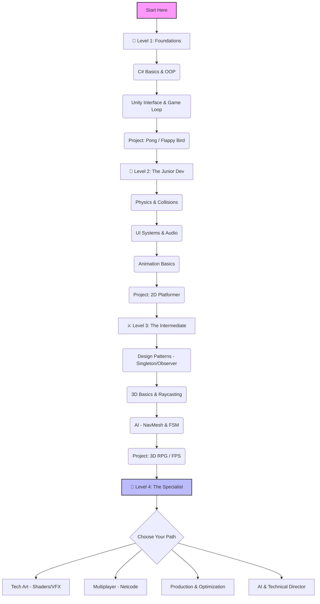

# 🎮 Game Development Roadmap (Unity Focus)

<!-- agent-summary -->
**Agent SUMMARY** (read this first; jump to `##` needed):
- Tech-track hub (Unity/C#, gameplay, netcode, graphics, labs) — not career deals.
- Sections: module index → reality check → visual roadmap → detailed Unity path → multiplayer deep-dive → portfolio → resources.
- Career/freelance/publisher → `guides/03-career-skills/game-dev/`. Practice → `challenges/game-dev/`.
<!-- /agent-summary -->

> **Goal & Success Criteria**  
> • **Goal:** Build technical mastery (Unity, C#, Multiplayer) và publish được trò chơi/ứng tuyển studio.  
> • **Deliverables:** Projects Tier 1-4, portfolio (Itch/GitHub), telemetry notes, server deployment.  
> • **Success:** Tự ship game hoàn chỉnh, chăm sóc live metrics, cross-skill giữa gameplay & server.

> **Scope of this domain (tech track):** Unity/C#, gameplay systems, netcode & server, graphics/VFX, production/QA, labs/challenges.  
> **Overlap map:** [`meta/domain-guide-map.md`](../../meta/domain-guide-map.md)  
> **Career & business track:** xem [guides/03-career-skills/game-dev/](../../guides/03-career-skills/game-dev/README.md) (freelance, publisher deals, monetization).

> 🆕 **What's new (Mar 2026):**
> - **Netcode/Backend:** +[anti-cheat-advanced.md](./anti-cheat-advanced.md), cập nhật hub networking.
> - **Graphics:** Nhấn URP/HDRP, custom render passes, profiling trong [art-tech/graphics](./art-tech/graphics/README.md).
> - **Labs/Challenges:** Thêm lab Shader trig, FSM, local LLM NPC, PlayFab, DOTS swarm; challenges spawn balance, lag reconcile, DOTS profiler.

> 📍 **Navigation Note:**  
> - **This folder (domains/game-dev/):** Technical skills - Unity, C#, Game Architecture, Shaders, Multiplayer  
> - **Career & Business guide:** See [guides/03-career-skills/game-dev/](../../guides/03-career-skills/game-dev/README.md) for freelancing, publisher deals, monetization strategies

> 🧭 **Learning Loop:**
> 1. **Reality Check → Visual Roadmap:** xác định level hiện tại (Level 1-4).
> 2. **Chọn Sprint 14 ngày hoặc Module** phù hợp mục tiêu (Gameplay, Netcode, Tech Art…).
> 3. **Gắn Lab/Challenge tương ứng:** xem bảng *Module ↔ Labs/Challenges* bên dưới để luyện tay.
> 4. **Ship deliverable + Log Telemetry:** mỗi project phải ghi tối thiểu 3 chỉ số vào [Unity Impact Metrics](./production/metrics/unity-impact-metrics.md) + retro bằng [Postmortem Template](./production/metrics/retro-template.md).
> 5. **Sync với Career Playbook:** map thành quả vào [Game Dev 10k Roadmap](../../guides/03-career-skills/game-dev/game-dev-10k-roadmap.md) hoặc plan freelance/remote tương ứng.

> [← Back to Chapter 1](../../chapters/01-xac-dinh-linh-vuc.md) | [Home](../../README.md) | [🚀 Quick Start](../../QUICK-START.md) | [📖 Glossary](../../GLOSSARY.md)
>
> **Difficulty:** 🟢 Beginner → 🔴 Advanced (Progressive)
>
> **Prerequisites:** Basic programming knowledge (any language), Passion for games
>
> **Time to Master:** 12-24 months (Beginner to Professional Unity Developer)
>
- 💰 **Business:** [Roadmap to $10k/Month for Game Developers](../../guides/03-career-skills/game-dev/game-dev-10k-roadmap.md)

**🎯 Starting Game Dev?** See [Quick Start - Beginner Path](../../QUICK-START.md#-path-1-beginner-developer-0-1-year) for your first steps!  
**🔍 Game Dev terms:** Check [Glossary](../../GLOSSARY.md) - Unity, C#, Physics, AI concepts explained simply.  
**📊 Difficulty levels:** See [DIFFICULTY-GUIDE.md](../../meta/ops/DIFFICULTY-GUIDE.md) to understand learning paths.  
**🧩 Knowledge Audit:** Check [Game Dev Knowledge Audit](../../case-studies/knowledge-audits/game-dev-knowledge-audit.md) to test your skills!  
**🧪 Labs & Thử thách:** Thực hành tại [labs/](./labs/README.md) và [challenges/](./challenges/README.md) trước khi apply/phỏng vấn.

---

## 🧱 Module Index (Điểm danh thư mục con)

**Chọn nhanh đường chuyên sâu:**
- **Tech Art (Graphics/VFX):** art-tech/graphics, art-tech/vfx, labs (shader trig), production/unity-deep-dive/vfx-lighting-mastery.md
- **Netcode/Backend:** programming/networking hub, rollback-netcode, mmo-architecture, anti-cheat-advanced, labs (PlayFab, lag reconcile)
- **Performance/Production:** production/unity-deep-dive, production/metrics, production/engines (DOTS vs UE), mobile-optimization, challenges ECS profiler
- **Gameplay/AI:** programming/ai (GOAP, steering, BT), programming/animation (IK/procedural), labs FSM/IK spider

**Starter pack (3 tài liệu ưu tiên mỗi chuyên sâu):**
- **Tech Art (Graphics/VFX):** [art-tech/graphics/shader-programming.md](./art-tech/graphics/shader-programming.md), [art-tech/graphics/render-pipelines.md](./art-tech/graphics/render-pipelines.md), [production/unity-deep-dive/vfx-lighting-mastery.md](./production/unity-deep-dive/vfx-lighting-mastery.md)
- **Netcode/Backend:** [programming/networking/game-server-guide.md](./programming/networking/game-server-guide.md), [rollback-netcode.md](./rollback-netcode.md), [anti-cheat-advanced.md](./anti-cheat-advanced.md)
- **Performance/Production:** [production/unity-deep-dive/optimization-techniques.md](./production/unity-deep-dive/optimization-techniques.md), [production/metrics/unity-impact-metrics.md](./production/metrics/unity-impact-metrics.md), [production/engines/unity-advanced.md](./production/engines/unity-advanced.md)
- **Gameplay/AI:** [programming/ai/goap-utility-ai.md](./programming/ai/goap-utility-ai.md), [programming/ai/behavior-tree/core-concepts.md](./programming/ai/behavior-tree/core-concepts.md), [programming/animation/inverse-kinematics.md](./programming/animation/inverse-kinematics.md)

| Module | Nội dung chính | Khi nào dùng |
| --- | --- | --- |
| **Fundamentals** |
| [fundamentals/unity-fundamentals.md](./fundamentals/unity-fundamentals.md) | Editor setup, lifecycle, build checklist | Onboard member mới hoặc reset kiến thức |
| [fundamentals/csharp-for-unity.md](./fundamentals/csharp-for-unity.md) | C# essentials, patterns, testing mindset | Người học chuyển ngành hoặc cần ôn nhanh |
| [fundamentals/advanced-game-math.md](./fundamentals/advanced-game-math.md) | Vector/Trig/Quaternion toolkit | Củng cố toán cho gameplay, physics, shader |
> **Đường dẫn tuyệt đối (Windows):**
> - `C:\Projects\Docs\domains\game-dev\fundamentals\unity-fundamentals.md`
> - `C:\Projects\Docs\domains\game-dev\fundamentals\csharp-for-unity.md`
> - `C:\Projects\Docs\domains\game-dev\fundamentals\advanced-game-math.md`
| **Game Design** |
| [game-design/README.md](./game-design/README.md) | Core loop, economy, narrative, telemetry | Đồng bộ designer ↔ gameplay engineer |
| [game-design/player-psychology.md](./game-design/player-psychology.md) | Flow, SDT, emotional mapping | Map feature → nhu cầu cảm xúc |
| [game-design/balancing-methodology.md](./game-design/balancing-methodology.md) | Excel modeling, Monte Carlo, KPI | Chốt chỉ số combat/economy trước patch |
| [game-design/genre-deep-dives/](./game-design/genre-deep-dives/README.md) | Genre pillar templates + case studies | Chuẩn hóa pillar theo thể loại |
| **Programming** |
| [programming/ai/](./programming/ai/README.md) | Behavior Tree, GOAP, steering | Level 3+ tập trung AI gameplay |
| [programming/animation/](./programming/animation/README.md) | IK, rigging, state machine | Khi nâng chất lượng chuyển động |
| [programming/physics/](./programming/physics/README.md) | Physics engine, vehicle, optimization | Build core mechanic dựa vào physics |
| [programming/networking/game-server-guide.md](./programming/networking/game-server-guide.md)   [programming/networking/senior-game-server-roadmap.md](./programming/networking/senior-game-server-roadmap.md) | Multiplayer architecture, career ladder | Path Multiplayer/Server Engineer |
| [rollback-netcode.md](./rollback-netcode.md), [mmo-architecture.md](./mmo-architecture.md), [social-features.md](./social-features.md), [anti-cheat-advanced.md](./anti-cheat-advanced.md) | Specialized netcode, social, anti-cheat | Fighting game, MMO, social layer |
| **Art Tech** |
| [art-tech/graphics/](./art-tech/graphics/README.md) | Shaders, URP/HDRP, custom passes, profiling | Technical Artist track |
| [art-tech/vfx/](./art-tech/vfx/README.md) | VFX breakdowns, shader graph recipes | Khi cần tách VFX khỏi graphics tổng |
| [art-tech/audio/](./art-tech/audio/README.md) | Sound design, middleware, spatial audio | Hoàn thiện feedback âm thanh |
| [art-tech/ui-ux/](./art-tech/ui-ux/README.md) | HUD, accessibility, feedback systems | Giảm friction, tăng clarity |
| **World Building** |
| [world-building/level-design/](./world-building/level-design/README.md) | Layout, pacing, encounter flow | Thiết kế level nhanh có logic |
| [world-building/pcg/](./world-building/pcg/README.md) | Procedural generation playbooks | Build roguelike, sandbox systems |
| [world-building/pcg/pipeline-01-heightfield-to-unity.md](./world-building/pcg/pipeline-01-heightfield-to-unity.md)   [pipeline-02-runtime-streaming.md](./world-building/pcg/pipeline-02-runtime-streaming.md)   [pipeline-03-tools-pipeline.md](./world-building/pcg/pipeline-03-tools-pipeline.md) | New pipelines: heightfield authoring, runtime streaming, tooling/version control | World-building team cần playbook end-to-end |
| **Production & Ops** |
| [production/README.md](./production/README.md) | Hub: deep dive, engines, metrics, QA | Điều phối production & ops |
| [production/unity-deep-dive/](./production/unity-deep-dive/README.md) | Clean code, editor tooling, optimization | Áp dụng dự án production |
| [production/engines/](./production/engines/README.md) | Unity DOTS vs Unreal (Nanite/Lumen) | Đánh giá engine & tối ưu |
| [production/metrics/](./production/metrics/README.md) | Unity Impact Metrics, genre cheat sheet | LiveOps, pitch dự án, marketing |
| [production/qa-testing/](./production/qa-testing/README.md) | QA workflow, automation, test plans | Thiết lập quy trình QA nội bộ |
| **Special Topics & Resources** |
| [live-service/](./live-service/README.md) | Battle Pass, events, economy cadence | Vận hành GaaS |
| [localization/](./localization/README.md) | Font, LTR/RTL, VO pipeline | Đa ngôn ngữ & region |
| [mobile-optimization/](./mobile-optimization/README.md) | Battery, thermal, touch input patterns | Tối ưu mobile build |
| [console-dev/](./console-dev/README.md) | Certification, platform features | Ship lên console |
| [vr-ar-xr/](./vr-ar-xr/README.md) | VR/AR interaction, comfort, perf budgets | Làm sản phẩm immersive |
| [testing/](./testing/README.md) | QA automation, playtest, telemetry | Đảm bảo chất lượng & dữ liệu |
| [cheatsheets/](./cheatsheets/) | Quick reference (shortcuts, shader math, netcode) | Ôn nhanh trước sprint/review |
| [analyses/](./analyses/) | Per-title **full-pack** — [Triangle Strategy](./analyses/triangle-strategy/) · [Honkai: Star Rail](./analyses/honkai-star-rail/) | Phân tích / scaffold design theo title |
| [case-studies/](./case-studies/) | Legacy / single essays (HSR teardown, Celeste, …); TS teardown → [analyses pack](./analyses/triangle-strategy/) | Study best-in-class execution |
| [challenges/](./challenges/README.md) | Coding exercises (spawn balance, lag reconcile, DOTS profiler) | Luyện tay trước/phỏng vấn |
| [labs/](./labs/README.md) | Labs thực chiến (shader trig, FSM, local LLM NPC, PlayFab, DOTS swarm) | Tăng phản xạ production, không copy-paste |
| [ai-for-game-dev.md](./ai-for-game-dev.md), [user-generated-content.md](./user-generated-content.md), [cloud-gaming.md](./cloud-gaming.md), [cross-platform-play.md](./cross-platform-play.md), [blockchain-gaming.md](./blockchain-gaming.md), [anti-cheat-advanced.md](./anti-cheat-advanced.md) | Emerging/advanced topics | Khi cần mở rộng tầm nhìn |

---

## 📊 1. Reality Check: Game Dev vs The World

Trước khi bắt đầu, hãy nhìn thẳng vào thực tế. Game Dev là con đường đầy đam mê nhưng cũng nhiều chông gai. Dưới đây là bảng so sánh với các lĩnh vực khác tại thị trường Việt Nam & Global.

| Tiêu chí | 🎮 Game Dev (Unity) | 🌐 Web Dev (Fullstack) | 📱 App Dev (Mobile) | 🤖 AI/ML Engineer |
| :--- | :--- | :--- | :--- | :--- |
| **Độ khó (Entry Barrier)** | ⭐⭐⭐⭐ (Khá khó - Toán + Art + Code) | ⭐⭐ (Dễ - JS/HTML/CSS) | ⭐⭐⭐ (Trung bình) | ⭐⭐⭐⭐⭐ (Rất khó - Toán cao cấp) |
| **Cơ hội việc làm (VN)** | ⭐⭐⭐ (VNG, Amanotes, Topebox, Indie) | ⭐⭐⭐⭐⭐ (Rất nhiều - Outsourcing/Product) | ⭐⭐⭐⭐ (Nhiều) | ⭐⭐⭐ (Đang hot nhưng ít slot Junior) |
| **Mức lương (Junior)** | 📉 Thấp hơn Web ~10-20% | 💰 Trung bình | 💰 Trung bình | 📈 Cao nhất |
| **Cạnh tranh** | 🔥 Cao (Nhiều người mê game) | 🔥 Rất cao (Bão hòa Junior) | ⚖️ Trung bình | ⚖️ Thấp (Thiếu nhân sự chất lượng) |
| **Work-Life Balance** | ⚠️ **Crunch Time** (Thường xuyên OT) | ✅ Ổn (Tùy công ty) | ✅ Ổn | ✅ Tốt (Research/Lab) |
| **Satisfaction** | ❤️ **Cực cao** (Thấy user chơi game mình làm) | 😐 Bình thường | 🙂 Khá | 🧠 Thỏa mãn trí tuệ |

> **Verdict:** Chỉ chọn Game Dev nếu bạn thực sự yêu thích việc tạo ra trải nghiệm tương tác (Interactive Experiences) và sẵn sàng chấp nhận mức lương khởi điểm thấp hơn một chút để đổi lấy niềm vui trong công việc.

---

## 🗺️ 2. Visual Roadmap (Unity Path)

---

## 🚀 3. Detailed Roadmap (Unity Focused)

### 🐣 Level 1: The Foundations (0 - 3 Tháng)
*Tập trung: Làm quen với C# và tư duy Component của Unity.*

*   **Core Concepts:**
    *   **C#:** Variables, Functions, Loops, Classes, Inheritance (Kế thừa).
    *   **Unity:** Scene view, Hierarchy, Inspector, Prefabs.
    *   **Advanced Game Math ✨:** [Học Toán Hình Không Gian Không Sợ Hãi](./fundamentals/advanced-game-math.md) (Vector, Dot/Cross, Quaternions, Trigonometry).
    *   **Scripting:** `Monobehaviour`, `Start()`, `Update()`, `GetComponent<>`.
*   **Actions:**
    *   Clone game **Pong**: Học về Input System (Legacy), Transform movement.
    *   Clone game **Flappy Bird**: Học về Rigidbody2D, Collision Detection, Instantiate (Spawn ống).
*   **✅ Completion Criteria:**
    *   [ ] Tự viết được một script di chuyển nhân vật mà không nhìn tutorial.
    *   [ ] Hiểu sự khác nhau giữa `Update()` và `FixedUpdate()`.
    *   [ ] Đăng 1 game đơn giản lên Itch.io.

### 🔨 Level 2: The Junior Dev (3 - 9 Tháng)
*Tập trung: Hoàn thiện kỹ năng làm game 2D và UI/UX.*

*   **Core Concepts:**
    *   **Physics 2D:** Forces, Gravity, Material (Friction/Bounciness).
    *   👉 **Advanced Physics:** [**Building a Simple 3D Physics Engine with Trigonometry**](./programming/physics/simple-physics-engine.md) (⭐ **New**)
    *   **UI (uGUI/Toolkit):** Canvas, Anchors, Buttons, Sliders.
    *   **Animation:** Animator Controller, States, Transitions, Blend Trees.
    *   **Audio:** AudioSource, AudioListener, AudioMixer.
    *   **Data:** `PlayerPrefs` để lưu điểm số/setting.
*   **Actions:**
    *   Build **2D Platformer** (kiểu Mario/Celeste): Xử lý Jumping logic, Ground check, Enemy đơn giản.
    *   Tạo **Main Menu**: Start Game, Options (Volume), Quit.
*   **✅ Completion Criteria:**
    *   [ ] Build được 1 file `.exe` hoặc `.apk` chạy ổn định.
    *   [ ] Game có đầy đủ vòng lặp: Start -> Play -> Game Over -> Restart.
    *   [ ] Code không bị spaghetti (biết tách script quản lý riêng).

### ⚔️ Level 3: The Intermediate (9 - 18 Tháng)
*Tập trung: Architecture, 3D và AI.*

*   **Core Concepts:**
    *   **Design Patterns:** Singleton (GameManager), Observer (Event System), Object Pooling.
    *   **3D World:** Mesh, Texture, Material, Lighting.
    *   **Animation Advanced:** [**Inverse Kinematics (IK) & Natural Movement**](./programming/animation/inverse-kinematics.md) (⭐ **New**)
    *   **AI:** NavMesh (Tìm đường), [**Steering Behaviors**](./programming/ai/steering-behaviors.md) (⭐ **New**), Finite State Machine.
    *   **Data Persistence:** JSON / ScriptableObjects.
*   **Actions:**
    *   Build **3D Shooter (FPS/TPS)** hoặc **Top-down RPG**.
    *   Implement hệ thống **Inventory** và **Quest**.
*   **✅ Completion Criteria:**
    *   [ ] Hiểu và sử dụng thành thạo `ScriptableObjects` để config data.
    *   [ ] Sử dụng Git để quản lý source code (biết dùng `.gitignore` cho Unity).
    *   [ ] Game chạy mượt 60fps trên máy cấu hình trung bình.

### 👑 Level 4: The Specialist (18+ Tháng)
*Tập trung: Chọn 1 ngách để trở thành Expert.*

Bạn không thể giỏi tất cả. Hãy chọn 1 con đường:

#### **🅰️ Path A: Technical Artist (Graphics)**
*   **Học:** Shader Graph, HLSL, VFX Graph, Post-processing, URP/HDRP Pipelines.
*   👉 **Advanced Shaders:** [**Mastering Shaders with Trigonometry: Water & Fire**](./art-tech/vfx/trig-shaders.md) (⭐ **New**)
*   **Job:** Cầu nối giữa Artist và Coder. Lương rất cao và khan hiếm.

#### **🅱️ Path B: Multiplayer Engineer (Networking)**
*   **Học:** Netcode for GameObjects (NGO), Mirror, Photon (PUN/Fusion).
*   **Concept:** Latency compensation, Server-Authoritative, Prediction.
*   **Job:** Làm game IO, MOBA, FPS Online.

#### **🅾️ Path C: Performance Engineer (Optimization)**
*   **Học:** Profiler, Memory Management, Addressables (Asset Loading), DOTS (Data-Oriented Technology Stack).
*   **Job:** Tối ưu game cho Mobile/VR/Console.

---

### ⏱️ Sprint 14 ngày ôn Unity (Basic → Advanced)

> **Mục tiêu:** Tua lại toàn bộ pipeline Unity trong 2 tuần – từ C# cơ bản, gameplay, UI, AI đến tối ưu và build.

| Ngày | Chủ đề | Bài tập/Deliverable |
| --- | --- | --- |
| 1 | C# Refresh (OOP, Collections, Events) | Viết script `CharacterStats` dùng property + event leveling |
| 2 | Unity Fundamentals (Scene, Prefab, Input System mới) | Rebuild mini Pong với Input System 1.5 |
| 3 | Game Loop & Time Management | Demo coroutine vs Update, Timer UI hiển thị FPS |
| 4 | 2D Physics & Collision | Làm Flappy clone, note lại quy tắc Rigidbody2D/Collider2D |
| 5 | UI Toolkit/uGUI & Localization | Trang Settings dùng UI Toolkit + hỗ trợ đa ngôn ngữ |
| 6 | Animation (Animator, StateMachineBehaviour) | Thiết kế blend tree chạy/nhảy + animation event |
| 7 | Data & Save System (ScriptableObject, JSON) | Tạo inventory dùng ScriptableObject + serialize save |
| 8 | Design Patterns (Singleton, Event Bus, Object Pool) | Refactor project sample để loại bỏ `FindObjectOfType` |
| 9 | 3D Basics (Lighting, Materials, Cinemachine) | Scene showcase có Cinemachine dolly + PostProcessing |
| 10 | AI: NavMesh + FSM + Steering | Enemy patrol + chase + flee, log state transitions |
| 11 | Multiplayer Primer (Netcode/Mirror) | Prototype sync transform + RPC gọi animation |
| 12 | Performance Toolkit (Profiler, Memory, Addressables) | Báo cáo draw call, GC alloc và asset bundle plan |
| 13 | Build & Deployment (PC/Mobile) | Xuất build Android/Windows, checklist icon, splash, IL2CPP |
| 14 | Capstone Review | Gộp highlight 2 tuần -> Viết doc + ghi lại issue/lesson |

**Nhịp mỗi ngày:** 25’ đọc docs/tutorial chính thống → 90’ build/refactor → 20’ ghi note + upload Git commit.

**Checklist hoàn thành sprint:**
- [ ] Repo Unity sạch (không commit `Library`, có `.gitignore`).
- [ ] Demo scene thể hiện ít nhất 3 hệ thống (gameplay, UI, AI/FX).
- [ ] Có build chạy được + video/GIF demo.
- [ ] Doc tóm tắt lesson learned & backlog tiếp theo.
- [ ] Checklist bug/optimization được ghi lại (Profiler capture, GC log).

---

### **Advanced Topics (Chuyên sâu)**
*   **[Procedural Animation & IK ✨](./programming/animation/procedural-animation-ik.md):** 🕷️ Lệnh nhện 4 chân di chuyển không cần Keyframe, Active Ragdolls. (⭐ **New**)
*   **[GOAP & Utility AI ✨](./programming/ai/goap-utility-ai.md):** 🧠 Vượt qua FSM để làm NPC sinh tồn như The Sims hay F.E.A.R. (⭐ **New**)
*   **[Game Backend (BaaS) & LiveOps ✨](./programming/networking/baas-cloud-save.md):** 🗄️ Tích hợp PlayFab/Firebase, Server-Authoritative chống hack. (⭐ **New**)
*   **[Unity CI/CD Pipeline ✨](./production/engines/unity-ci-cd-pipeline.md):** 🤖 Tự động hoá Build Git/GitHub Actions, không chờ thanh loading. (⭐ **New**)
*   **[Unity DOTS & ECS ✨](./production/unity-deep-dive/dots-ecs-architecture.md):** ⚡ Đập vỡ OOP, nhồi 10,000 thực thể trên màn hình bằng Burst Compiler. (⭐ **New**)
*   **[Advanced Game Math](./fundamentals/advanced-game-math.md):** 📐 Thao túng Quaternions, đòn bẩy Vectors, vẽ sóng Sin không dùng Animation.
*   **[Advanced Physics Engine](./programming/physics/simple-physics-engine.md):** 🎡 Ứng dụng lượng giác xây dựng Physics Engine 3D.
*   **[Trig Shaders (Water/Fire)](./art-tech/vfx/trig-shaders.md):** 🔥🌊 Tạo hiệu ứng nước và lửa bằng lượng giác. 
*   **[Game Economics & Monetization](./game-design/game-economics-monetization.md):** 💰 Phân tích Sinks/Sources, tỷ lệ Gacha Pity và lập file Excel cân bằng game F2P. (⭐ **New**)
*   **[Inverse Kinematics (IK)](./programming/animation/inverse-kinematics.md):** 🦶 Toán học giúp tay chân nhân vật bám sát địa hình. 
*   **[Steering Behaviors](./programming/ai/steering-behaviors.md):** 🤖 Hệ thống di chuyển AI thông minh dựa trên lực và lượng giác. 
*   **[Unity Impact Metrics Playbook](./production/metrics/unity-impact-metrics.md):** 📊 Crash rate, FPS, load time, concurrency và các KPI LiveOps.
*   **[Hybrid Casual vs Casual vs Midcore Cheat Sheet](./production/metrics/mobile-genre-impact.md):** 🕹️ So sánh core loop, audience, cost & team theo infographic AppMagic. (⭐ **New**)
*   **[Core Mechanic Game Design Doc](./core-mechanic-design-doc.md):** ✍️ Template viết GDD cho cơ chế cốt lõi + ví dụ Aether Dash.
*   **[Unity Coding Challenges](./challenges/README.md):** Tập các bài tập thực chiến (spawn balancing, netcode, ECS performance). (⭐ **New**)
*   **[Game Engines Deep Dive](./production/engines/unity-advanced.md):** Unity DOTS/ECS tối ưu hiệu năng và Unreal Engine 5 Nanite/Lumen.
*   **[Graphics & Shaders](./art-tech/graphics/shader-programming.md):** Viết Shader (HLSL/GLSL) và hiệu ứng VFX Graph.
*   **[Game AI Patterns](./programming/ai/game-ai-patterns.md):** Thiết kế trí tuệ nhân tạo cho NPC (FSM, Behavior Trees, GOAP).
*   **[Behavior Tree Guide](./programming/ai/behavior-tree/core-concepts.md):** Hướng dẫn toàn diện về Behavior Tree (Lý thuyết, Tự code, GraphView Editor).
*   **[Procedural Generation](./world-building/pcg/procedural-generation.md):** Thuật toán tạo thế giới ngẫu nhiên (Perlin Noise, Wave Function Collapse).

### 🔍 Advanced Research List (Kỹ thuật chuyên sâu cần nghiên cứu thêm)
*Đây là danh sách các kỹ thuật "khó" để bạn tra cứu và mở rộng sau này, không nhất thiết phải học ngay:*

*   **Projectile Trajectory & Prediction:** Dự đoán vị trí đón đầu mục tiêu dựa trên vận tốc và trọng lực.
*   **Procedural Mesh Generation:** Tự tạo hình học (Mesh) bằng code (ví dụ: tạo hang động, địa hình thực tế).
*   **Compute Shaders:** Tận dụng sức mạnh của GPU để tính toán hàng triệu tác vụ song song (như đàn cá, rừng cây).
*   **Rollback Netcode (GGPO):** Kỹ thuật đỉnh cao trong Networking giúp game đối kháng chạy mượt dù có độ trễ cao.
*   **Goal-Oriented Action Planning (GOAP):** Hệ thống AI cấp cao cho phép NPC tự lập kế hoạch để đạt được mục tiêu (dùng trong F.E.A.R, Stalker).
*   **Flow Field Pathfinding:** Kỹ thuật tìm đường cho hàng ngàn unit cùng lúc (phổ biến trong game RTS như StarCraft).
*   **Fluid Simulation (SPH):** Mô phỏng dòng chảy của nước, khói, lửa ở mức độ vật lý hạt.
*   **Spatial Audio & Ray-traced Sound:** Mô phỏng cách âm thanh phản xạ trong môi trường 3D.

### **Unity Deep Dive (Làm chủ Unity) & Engine Tech**
*   **[Unity to Godot Migration Guide](./production/engines/unity-to-godot-migration.md):** Chuyển sinh làm Indie Dev Godot, so sánh Node vs Component, GDScript Rosetta Stone. (⭐ **New**)
*   **[AI-Assisted Game Dev](./production/ai-assisted-gamedev.md):** Dùng Midjourney/Polycam làm Asset chớp nhoáng, nhúng SLM local vào làm hội thoại game NPC. (⭐ **New**)
*   **[Advanced Architecture](./production/unity-deep-dive/architecture-patterns.md):** ScriptableObjects, Dependency Injection (Zenject) và Design Patterns.
*   **[Clean Code & SOLID cho Unity](./production/unity-deep-dive/unity-clean-code-solid.md):** Áp dụng nguyên tắc lập trình sạch vào MonoBehaviour, ScriptableObject, event channel.
*   **[Performance Optimization](./production/unity-deep-dive/optimization-techniques.md):** Quản lý bộ nhớ, Profiling và Draw Call Batching.
*   **[Editor Scripting](./production/unity-deep-dive/editor-scripting.md):** Tự viết công cụ (Tools) và tùy biến Inspector.
*   **[VFX & Lighting](./production/unity-deep-dive/vfx-lighting-mastery.md):** Nghệ thuật ánh sáng (Lightmapping) và hiệu ứng hạt (VFX Graph).

## 🌐 4. Game Server & Multiplayer Deep Dive

Multiplayer Game không chỉ là game có nhiều người chơi, mà là một **Hệ phân tán (Distributed System)** phức tạp.

> 📘 **Tài liệu chi tiết:** Xem file **[Game Server & Multiplayer Guide](./programming/networking/game-server-guide.md)** để đọc bản phân tích chuyên sâu về Architecture, Code Concepts và DevOps.

**Advanced Multiplayer Reads:**
- [Rollback Netcode](./rollback-netcode.md)
- [MMO Architecture](./mmo-architecture.md)
- [Social Feature Architecture](./social-features.md)
- [Advanced Anti-Cheat](./anti-cheat-advanced.md)

### Tóm tắt nội dung chính:

1.  **Architecture:**
    *   **Dedicated Server:** Chuẩn mực cho game FPS/MOBA chống hack.
    *   **P2P / Listen Server:** Tiết kiệm chi phí cho game Co-op nhỏ.

2.  **Core Concepts (Xem chi tiết trong guide):**
    *   **Prediction & Reconciliation:** Kỹ thuật che giấu độ trễ (Lag) cho user.
    *   **Lag Compensation:** Server "quay ngược thời gian" để tính hit chính xác.
    *   **Serialization:** Tối ưu hóa gói tin gửi qua mạng (Bit packing).

3.  **DevOps & Hosting:**
    *   **Deployment:** Dockerize Unity Server & chạy trên Linux VPS/Cloud.
    *   **Scaling:** Sử dụng Kubernetes (Agones) hoặc AWS GameLift để tự động mở thêm server khi đông khách.

---

## 💼 5. Portfolio & Career Strategy

Để kiếm việc Unity Dev lương $1000+, bạn cần portfolio "chất" hơn là bằng đại học.

### Portfolio Checklist:
1.  **Github:** Phải có code sạch. Đừng upload cả thư mục `Library` (dùng .gitignore chuẩn).
2.  **Itch.io Page:** Trang trưng bày game. Screenshot đẹp, GIF gameplay, mô tả rõ ràng.
3.  **1 Flagship Project:**
    *   Đừng show 10 game rác tutorial.
    *   Show **1 game hoàn chỉnh nhất** (Tier 3).
    *   Có video trailer 30s.

### Interview Prep:
*   **Câu hỏi kinh điển:** "Object Pooling là gì?", "Tại sao không dùng `GameObject.Find()` trong Update?", "Draw Call là gì?".
*   **Live Coding:** Thường là bài toán thuật toán nhẹ hoặc fix bug trong 1 đoạn script có sẵn.

---

## 📚 6. Resources (Tài nguyên chọn lọc)

### 📺 YouTube Channels (Free)
*   **Brackeys:** (Huyền thoại) - Tốt nhất cho Beginner.
*   **Code Monkey:** Code sạch, Design Patterns, Game hoàn chỉnh.
*   **Jason Weimann:** Kiến trúc game, Career advice.
*   **Tarodev:** Tips ngắn, hay, modern Unity coding.
*   **Dapper Dino:** Chuyên về Multiplayer (Mirror/Netcode).

### 🎓 Courses (Paid)
*   **Udemy:** Các khóa của *GameDev.tv* (Ben Tristem).
*   **Unity Learn Premium:** Chính chủ Unity, chất lượng cao.

### 📖 Books
*   *"Game Programming Patterns"* - Robert Nystrom (Must read cho Level 3).
*   *"Clean Code"* - Robert C. Martin (Áp dụng cho C#).
*   *"Multiplayer Game Programming"* - Joshua Glazer (Kinh thánh về Networking).

---

## 💡 7. Core Skills Example (CV Keywords)

*   ❌ **Chung chung:** "Biết dùng Unity, C#."
*   ✅ **Specific (Gameplay):** "Strong grasp of Unity Physics 2D, Coroutines, and Input System. Experienced in implementing Character Controllers."
*   ✅ **Specific (Mobile):** "Mobile Performance Optimization (Object Pooling, Texture Compression, URP Batching) for Android devices."
*   ✅ **Specific (Multiplayer):** "Implemented Authoritative Server logic using Unity Netcode for GameObjects, handling Lag Compensation and Client-side Prediction for a fast-paced FPS."

---

> **Last Updated:** March 2026

