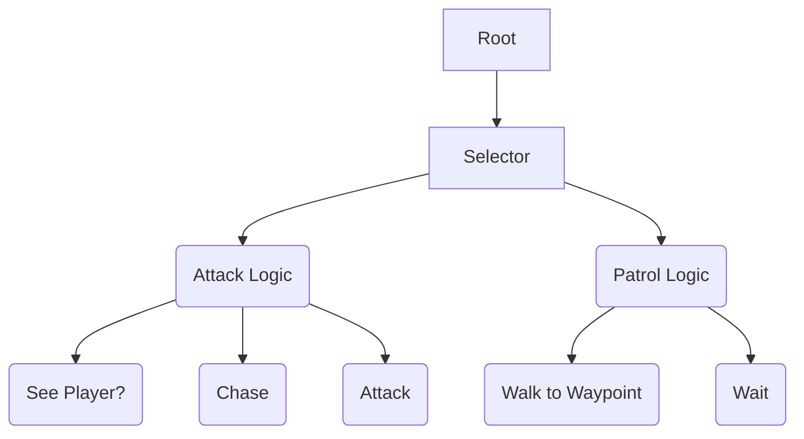

# 🌳 Behavior Tree Fundamentals: Lý thuyết cốt lõi

> [← Back to Game AI Patterns](../game-ai-patterns.md)

Tại sao Boss trong Dark Souls lại khó nhằn đến thế? Không phải vì nó nhiều máu, mà vì AI của nó biết "suy nghĩ".
Behavior Tree (Cây hành vi) là kiến trúc AI mạnh mẽ giúp bạn tạo ra những con Boss như vậy.

---

## 1. Tại sao dùng Behavior Tree (BT)?

*   **FSM (Finite State Machine):** Tốt cho AI đơn giản (Idle -> Chase -> Attack). Nhưng khi Boss có 50 hành động, FSM trở thành "mớ bòng bong" (Spaghetti Code) với hàng tá mũi tên chuyển trạng thái.
*   **BT (Behavior Tree):** Cấu trúc phân cấp (Hierarchical), dễ đọc, dễ mở rộng (Modular), và dễ tái sử dụng.

---

## 2. Cấu trúc của một Cây (Anatomy of a Tree)

Một BT bao gồm các **Node (Nút)**. Mỗi frame, cây sẽ duyệt từ gốc (Root) xuống lá (Leaf).

### **Trạng thái Node (Return Status):**
Mỗi node khi chạy xong sẽ trả về 1 trong 3 trạng thái:
1.  **Success (Thành công):** "Tôi đã làm xong việc rồi." (Ví dụ: Đã di chuyển đến nơi).
2.  **Failure (Thất bại):** "Tôi không làm được." (Ví dụ: Đường bị chặn).
3.  **Running (Đang chạy):** "Tôi đang làm dở, frame sau quay lại nhé." (Ví dụ: Đang di chuyển nhưng chưa tới).

### **Các loại Node:**

#### **A. Composite Nodes (Nút điều khiển luồng)**
Có nhiều con (Children). Quyết định chạy con nào.
*   **Sequence (Tuần tự - AND):** Chạy lần lượt từng con. Nếu một con Fail -> Cả Sequence Fail. Nếu tất cả Success -> Sequence Success.
    *   *Ví dụ:* (Tìm người chơi) -> (Chạy đến) -> (Tấn công).
*   **Selector (Lựa chọn - OR):** Chạy lần lượt từng con. Nếu một con Success -> Cả Selector Success (dừng lại không chạy tiếp).
    *   *Ví dụ:* (Hồi máu?) -> (Tấn công?) -> (Đi tuần). (Nếu Hồi máu được thì thôi không tấn công nữa).

#### **B. Decorator Nodes (Nút trang trí)**
Chỉ có 1 con. Dùng để biến đổi kết quả của con.
*   **Inverter (Đảo ngược):** Success -> Failure; Failure -> Success. (Dùng cho điều kiện "Enemy Is NOT Dead").
*   **Repeater (Lặp):** Chạy con liên tục (Loop).

#### **C. Leaf Nodes (Nút lá)**
Không có con. Thực hiện hành động cụ thể.
*   **Action:** Tấn công, Di chuyển, Play Animation.
*   **Condition:** Kiểm tra máu < 50%, Kiểm tra có nhìn thấy Player không.

---

## 3. Luồng thực thi (Execution Flow)

1.  **Frame 1:** Root gọi Selector. Selector gọi Sequence1.
2.  Sequence1 gọi Cond1 (See Player?).
3.  Nếu Cond1 trả về **Failure** (Không thấy) -> Sequence1 Failure -> Selector chuyển sang gọi Sequence2.
4.  Sequence2 gọi Action3 (Walk). Action3 trả về **Running**. -> Cả cây trả về Running.
5.  **Frame 2:** Cây chạy lại từ đầu. Lại check Cond1...
