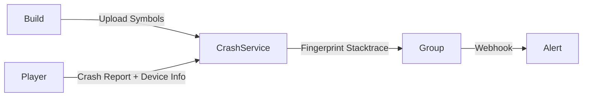

# 🛡️ Unity Game Quality Playbook: ANR, Crash, In-game Metrics & Performance

> [← Back to Game Development Roadmap](../README.md)

Unity không chỉ cần đẹp và mượt — nó phải **ổn định**. Bài viết này tập trung vào 4 trụ cột: **Crash**, **ANR**, **In-game Metrics** và **Performance Telemetry** để giúp bạn giữ vững chất lượng sản phẩm.

---

## 1. Goals & Success Criteria

| KPI | Mục tiêu | Công cụ theo dõi |
| --- | --- | --- |
| Crash-Free Users | ≥ 99.5% | Unity Cloud Diagnostics (UCD) / Firebase Crashlytics |
| ANR Rate (Android) | < 0.3% sessions | Play Console, ANR WatchDog |
| FPS trung bình | 55–60 fps (mobile), 90 fps (VR) | Unity Profiler + In-game monitor |
| Time-to-resolve | < 3 ngày cho crash/ANR top 3 | Jira, Linear, Notion |

> **Tip:** Định nghĩa “done” cho mỗi sprint bao gồm: không có crash blocker, ANR dưới ngưỡng, performance metrics đạt ngân sách.

---

## 2. Observability Stack cho Unity

1. **Instrumentation Layer**
   * `Application.logMessageReceived` để funnel log + stack trace vào hệ thống.
   * `UnityEngine.Diagnostics.Utils.ForceCrash` chỉ dùng trong QA để kiểm thử pipeline.
2. **Crash & ANR Collector**
   * Unity Cloud Diagnostics, Backtrace, Sentry, Firebase Crashlytics.
   * Upload symbol/`symbols.zip` (IL2CPP, dSYM) ngay trong CI để stack trace readable.
3. **In-game Metrics Stream**
   * Event bus (ScriptableObject hoặc Zenject Signal) ghi nhận KPI: retention, economy, LiveOps.
   * Streaming đến BigQuery, Snowflake hoặc OpenTelemetry collector.
4. **Visualization & Alerting**
   * Grafana/Looker Studio dashboard.
   * Alert rule: Crash spike > 30% trong 30 phút → ping Slack/Teams.

---

## 3. Crash Pipeline

### 3.1 Thu thập & phân nhóm



* **Fingerprinting:** dựa vào method signature + native address để nhóm crash.
* **Release channel:** gắn tag (alpha, beta, prod) để rollback nhanh.

### 3.2 Phân tích nguyên nhân

| Loại crash | Dấu hiệu | Hướng xử lý |
| --- | --- | --- |
| Managed Exception (C#) | Stack trace namespace game | Validations, guard clause, null-check automation |
| Native Crash (IL2CPP) | `libunity.so`, `libil2cpp.so` | Kiểm tra plugin native, Job/Burst bất đồng bộ |
| GPU / Driver | Model cụ thể, crash khi load scene | Thay đổi shader variant, fallback pipeline |

### 3.3 Chu trình triage

1. Crash alert → incident channel.
2. QA tái hiện bằng seed replay (nếu có).
3. Dev fix + viết test (Play Mode/Edit Mode) bao phủ scenario.
4. Regression test + deploy theo canary.

---

## 4. ANR (Application Not Responding)

### 4.1 Nhận diện
* Android: thread UI bị block > 5 giây.
* Dấu hiệu: `Input dispatching timed out`, `ANR Input event`, CPU spike khi GC/IO.

### 4.2 Công cụ
* **Google Play Console ANR dashboard.**
* **ANR-WatchDog** (Java plugin) gửi stack trace Unity main thread.
* **Systrace / Perfetto** để thấy thread timeline.

### 4.3 Chiến lược giảm ANR
* Di chuyển logic nặng sang **Job System/Burst** hoặc thread phụ.
* Dùng `UnityWebRequest.SendWebRequest()` async thay vì chặn chờ response.
* Tối ưu `Awake/Start` để không tải dữ liệu blocking khi mở scene.
* Với plugin Android, đảm bảo callback trả về ngay, công việc nặng chuyển sang background service.

> **Checklist:** Không Async Await trong `Update` mà không `ConfigureAwait(false)` → tránh deadlock khi marshal về main thread.

---

## 5. In-game Metrics & Telemetry

### 5.1 Thiết kế taxonomy
* **Session Layer:** session_start, session_end, crash_recovery.
* **Economy:** currency_sink/source, item_crafted, ad_reward_claimed.
* **Quality Signals:** fps_bucket, memory_warning, hitch_spike.

### 5.2 Kiến trúc sự kiện Unity

```csharp
[CreateAssetMenu(menuName = "Telemetry/EventChannel")]
public class TelemetryEventChannel : ScriptableObject {
    public UnityEvent<string, Dictionary<string, object>> OnEventRaised;

    public void Raise(string name, Dictionary<string, object> payload) {
        OnEventRaised?.Invoke(name, payload);
    }
}

public class QualityMetricEmitter : MonoBehaviour {
    public TelemetryEventChannel channel;
    void Update() {
        if (Time.frameCount % 300 == 0) {
            channel.Raise("fps_bucket", new() {
                { "fps", 1f / Time.deltaTime },
                { "device", SystemInfo.deviceModel }
            });
        }
    }
}
```

* Channel có thể plug vào SDK: GameAnalytics, Amplitude, PostHog.
* Tạo batching layer để gửi gói 5–10 sự kiện/lần, giảm chi phí mạng.

### 5.3 Bảo vệ dữ liệu
* Hash userId, không log PII.
* Dùng `UnityWebRequest.SetRequestHeader("X-Signature", signature)` để chống giả mạo.
* Retry với backoff, lưu queue khi offline.

---

## 6. Performance Telemetry Runtime

| Thành phần | Giải pháp |
| --- | --- |
| FPS & Frame Time | Mini overlay: `GUILayout.Label($"FPS:{fps}")` chỉ bật trong QA build |
| Memory | `ProfilerRecorder` cho GC Alloc, Used Heap |
| GPU Timing | `ProfilerRecorder.StartNew(ProfilerCategory.Render, "Gfx.PresentFrame")` |
| Hitch Detection | So sánh frame time với rolling average → log event khi > 2x |

**Automation:**
* CI chạy `-batchmode -runTests` + `-profiler-log-file` để xuất dữ liệu.
* Kéo log vào script Python, phát hiện regression > 10% và fail build.

---

## 7. Quality Gates & Release Checklist

1. **Pre-commit**: static analysis (Rider, Roslyn analyzer) + unit test pass.
2. **CI**: build tất cả target + upload symbol, chạy Play Mode test, smoke test.
3. **QA soak test**: 2 giờ chạy auto bot → thu thập crash/ANR/fps.
4. **Canary release** 5% user, monitor dashboard 24h.
5. **Post-release review**: cập nhật knowledge base (root cause, fix), refresh alert threshold.

---

## 8. Checklist triển khai nhanh

- [ ] Tích hợp crash + ANR collector với symbol upload tự động.
- [ ] Thiết kế taxonomy sự kiện chất lượng + pipeline gửi dữ liệu.
- [ ] Xây dựng dashboard tổng hợp Crash/ANR/FPS/Memory.
- [ ] Thiết lập alert và quy trình on-call.
- [ ] Thực thi quality gate trên CI/CD + canary.

Giữ được chất lượng nghĩa là bạn “đọc” được game mình đang vận hành. Hãy biến dữ liệu thành lợi thế cạnh tranh trước khi người chơi rời bỏ bạn vì một lần giật lag hoặc crash! 🚀
