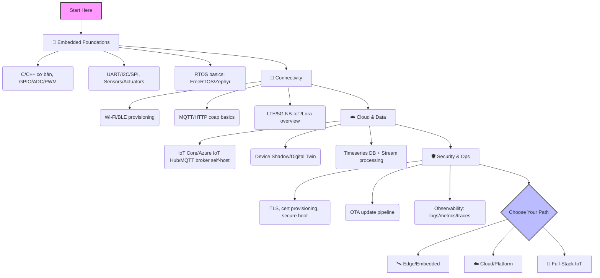

# 🌐 Internet of Things (IoT) Roadmap

> [← Back to domains](../README.md) | [Home](../../README.md) | [Knowledge Audit](../../case-studies/knowledge-audits/iot-knowledge-audit.md)
>
> **Domain maturity:** 🟡 Drafting · **Difficulty:** 🟢 Beginner → 🔴 Advanced
>
> **Prerequisites:** Lập trình C/C++ hoặc Python cơ bản, kiến thức điện tử số cơ bản (GPIO, UART), mạng máy tính căn bản (TCP/IP).
>
> **Time to Master:** 12-24 tháng (từ prototyping đến triển khai edge + cloud)
>
> **Practice:** [IoT Labs](./labs/README.md) · [challenges/iot](../../challenges/iot/README.md)

**Modules (đã tách khỏi mega-README):**
| Track | Docs |
| --- | --- |
| Foundations | [embedded-foundations.md](./foundations/embedded-foundations.md) |
| Connectivity | [mqtt-and-protocols.md](./connectivity/mqtt-and-protocols.md) |
| Cloud & data | [ingest-shadow-timeseries.md](./cloud/ingest-shadow-timeseries.md) |
| Security & OTA | [device-security-ota.md](./security/device-security-ota.md) |
| Case study | [smart-factory-floor.md](./case-studies/smart-factory-floor.md) |

**🧩 Knowledge Audit:** [iot-knowledge-audit.md](../../case-studies/knowledge-audits/iot-knowledge-audit.md)

---

## 🗺️ 1. Reality Check: IoT Engineer

| Tiêu chí | Embedded/Edge Engineer | IoT Cloud/Platform | IoT Full-Stack (Device ↔ Cloud) |
| :--- | :--- | :--- | :--- |
| **Độ khó** | ⭐⭐⭐⭐ (Firmware, RTOS, debug phần cứng) | ⭐⭐⭐ (Backend + event streaming) | ⭐⭐⭐⭐ (Phối hợp HW/SW/Cloud) |
| **Cơ hội việc làm** | ⭐⭐⭐⭐ (Thiết bị công nghiệp, sản phẩm tiêu dùng) | ⭐⭐⭐⭐ (Platform, data, integration) | ⭐⭐⭐⭐ (Team nhỏ, startup) |
| **Tech Stack** | C/C++, FreeRTOS/Zephyr, HAL/SDK, BLE/Wi-Fi, MQTT | Node/Go/Python, REST/gRPC, MQTT broker, Kafka, Timeseries DB | Kết hợp MCU + Cloud, OTA, observability |
| **Verdict** | Nếu mạnh firmware/điện tử, chọn Edge; nếu mạnh backend/data, chọn Cloud; muốn tổng lực thì Full-Stack IoT. |

---

## 📚 2. Visual Roadmap



### Visual Roadmap – Printable (PNG/SVG)
- Xem [visuals/README.md](./visuals/README.md) để xuất Mermaid → PNG/SVG khi cần.

> Nếu chưa có file hình trong `visuals/`, dùng sơ đồ Mermaid phía trên.

---

## 🧭 3. Detailed Roadmap (Mục lục)

### Foundations (Nền tảng bắt buộc)
👉 **[Embedded Foundations](./foundations/embedded-foundations.md)** — GPIO/ADC/PWM, bus I2C/SPI/UART, RTOS tối thiểu, toolchain.

### Connectivity & Protocols
👉 **[MQTT & Protocols](./connectivity/mqtt-and-protocols.md)** — QoS, topic map, LWT, C2 idempotent, mTLS/ACL.

### Cloud & Data Layer
👉 **[Ingest, Shadow & Timeseries](./cloud/ingest-shadow-timeseries.md)** — broker → stream → DB → alert + SLO.

### Security & Operations
👉 **[Device Security & OTA](./security/device-security-ota.md)** — secure boot, signing, staged rollout, threat model.

### Labs (Thực hành)
👉 **[Labs hub](./labs/README.md)**
* [Lab 1 – ESP32 Hello IoT](./labs/lab-esp32-hello-iot.md)
* [Lab 2 – Secure MQTT + OTA](./labs/lab-secure-mqtt-ota.md)
* [Lab 3 – Cloud ingest + Grafana](./labs/lab-cloud-ingest-grafana.md)

### Case Study
👉 **[Smart Factory Floor](./case-studies/smart-factory-floor.md)**

### Hướng dẫn build/flash nhanh

**ESP-IDF (ESP32)**
```bash
# Cài IDF (nếu chưa):
git clone --recursive https://github.com/espressif/esp-idf.git
cd esp-idf && ./install.sh esp32 && . ./export.sh

# Build & flash
idf.py set-target esp32
idf.py build
idf.py -p COM3 flash monitor   # trên Windows đổi COM3 theo cổng
```
Notes: dùng `menuconfig` để set Wi-Fi SSID/PWD, broker URI; bật `CONFIG_MQTT_TRANSPORT_SSL` để dùng mTLS.

**PlatformIO (ESP32)**
`platformio.ini` tối thiểu:
```ini
[env:esp32dev]
platform = espressif32
board = esp32dev
framework = arduino
monitor_speed = 115200
lib_deps = 
  knolleary/PubSubClient
build_flags = 
  -D WIFI_SSID="\"your-ssid\""
  -D WIFI_PASS="\"your-pass\""
```
Lệnh: `pio run -t upload -t monitor`.

### Career & Certification Mapping
| Track | Junior Goal | Advanced Goal | Content Mapping |
| --- | --- | --- | --- |
| Embedded/Edge | GPIO, RTOS cơ bản, MQTT pub/sub | OTA, secure boot, TinyML | Foundations, Connectivity, Security |
| Cloud/Platform | Broker, ingest, dashboard | Multi-tenant, twin, SRE | Cloud & Data, Security |
| Full-Stack IoT | MCU ↔ Cloud demo | Fleet ops, staged OTA | All modules + Labs |

### Learning Path (6-12-18 tháng)
* **0-3 tháng:** [Embedded foundations](./foundations/embedded-foundations.md) + Lab 1
* **4-6 tháng:** MQTT/cloud docs + Lab 3
* **7-9 tháng:** Security/OTA + Lab 2
* **10-18 tháng:** Case study fleet + specialize (TinyML / multi-tenant)

---

## ✅ 4. Checklist gợi ý

- [ ] Lab 1 (ESP32 + MQTT cơ bản)
- [ ] Lab 2 (mTLS + OTA)
- [ ] Lab 3 (ingest + dashboard)
- [ ] Đọc case Smart Factory + tự viết playbook
- [ ] Làm [IoT Knowledge Audit](../../case-studies/knowledge-audits/iot-knowledge-audit.md)

> **Last Updated:** August 2026