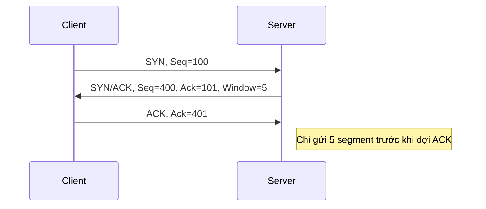

# 🚚 Transport Layer Internals: Lớp Giao vận

> [← Back to Network Security](../README.md)

Lớp 4 (Transport) chịu trách nhiệm đưa dữ liệu từ ứng dụng này sang ứng dụng kia một cách trọn vẹn (hoặc nhanh nhất).

---

## 1. TCP (Transmission Control Protocol) - "Quý ông Tin cậy"

TCP đảm bảo: Không mất gói tin, đúng thứ tự, không bị lỗi.

### **A. 3-Way Handshake (Bắt tay 3 bước)**
Trước khi gửi dữ liệu, 2 bên phải chào nhau:
1.  **SYN:** "Alo, tôi muốn kết nối." (Client -> Server)
2.  **SYN-ACK:** "Ok, tôi nghe rồi. Bạn có nghe tôi không?" (Server -> Client)
3.  **ACK:** "Nghe rõ. Bắt đầu nhé!" (Client -> Server)

#### 🔬 Lab nhanh: Bắt tay TCP với Wireshark
- Mở Wireshark, filter `tcp.flags.syn == 1` để thấy SYN.
- Theo dõi `SYN -> SYN/ACK -> ACK` và đọc `Options` (MSS, SACK Permitted, Window Scale).
- Sử dụng `Statistics > Flow Graph` để visualize handshake.
- Bài tập: chỉnh `sysctl net.ipv4.tcp_window_scaling=0` (Linux) rồi capture lại để thấy window thay đổi.

### **B. Flow Control (Điều khiển Luồng)**
*   **Vấn đề:** Server gửi quá nhanh, Client không kịp xử lý (tràn bộ đệm RAM) -> Mất dữ liệu.
*   **Giải pháp (Sliding Window):** Client bảo Server: "Tôi chỉ còn chỗ cho 5 gói tin thôi". Server sẽ chỉ gửi 5 gói rồi dừng lại chờ xác nhận.



### **C. Congestion Control (Điều khiển Tắc nghẽn)**
*   **Vấn đề:** Mạng Internet bị tắc (nhiều người dùng quá).
*   **Giải pháp (Slow Start):**
    *   Ban đầu gửi chậm (1 gói).
    *   Nếu thấy ổn -> Gửi gấp đôi (2 gói -> 4 gói -> 8 gói).
    *   Nếu thấy mất gói (Mạng tắc) -> Giảm tốc độ ngay lập tức.

---

## 2. UDP (User Datagram Protocol) - "Kẻ Liều lĩnh"

UDP gửi dữ liệu đi mà không cần biết đích đến có nhận được hay không.

### **Đặc điểm:**
*   Không có Handshake (Connectionless).
*   Không có Flow/Congestion Control.
*   Mất gói tin? Kệ nó.

### **Tại sao dùng UDP?**
*   **Tốc độ:** Không tốn thời gian bắt tay.
*   **Real-time:** Trong game bắn súng hoặc gọi video, việc nhận lại gói tin cũ (bị lag 2s) là vô nghĩa. Thà bỏ qua luôn để hiển thị cái mới nhất.

---

## 3. Ports & Sockets

Làm sao máy tính biết gói tin này là của Chrome hay của Game? -> Dựa vào **Port**.

*   **Port:** Số hiệu cửa (0-65535).
    *   0-1023: Well-known ports (80 HTTP, 443 HTTPS, 22 SSH).
    *   1024-49151: Registered ports (3306 MySQL, 5432 Postgres).
    *   49152-65535: Dynamic/Private ports (Dùng tạm thời cho Client).
*   **Socket:** Cặp địa chỉ `IP:Port` (VD: `192.168.1.5:8080`).

---

## 4. QUIC (The Future is UDP)

Giao thức nền tảng của HTTP/3.
*   Thực chất là: **TCP + TLS + HTTP/2** được xây dựng lại trên nền **UDP**.
*   Chuyển phần xử lý tắc nghẽn từ Kernel (OS) lên User Space (Ứng dụng) -> Linh hoạt hơn, cập nhật nhanh hơn.
*   Tích hợp TLS 1.3 ngay trong handshake, chỉ cần 1 round-trip để thiết lập kết nối bảo mật.

### **Khi nào chọn QUIC?**
- Mobile network nhiều packet loss, cần 0-RTT resume.
- Multi-streaming không bị Head-of-Line blocking như TCP/TLS.

### ⚖️ Thực nghiệm TCP vs QUIC
| Test | Môi trường | Kỳ vọng |
| --- | --- | --- |
| Download 10MB (curl vs `quiche-client`) | Wi-Fi ổn định | TCP & QUIC tương đương |
| Packet loss 5% (tc netem) | Linux + `tc qdisc add dev eth0 root netem loss 5%` | QUIC duy trì throughput tốt hơn |
| Mobile switching Wi-Fi ↔ 4G | Dùng `adb shell svc wifi disable/enable` trong khi stream | QUIC không cần handshake lại (connection ID) |

#### Benchmark Flow
1. Dùng `iperf3 -c host -t 60` (TCP) vs `quiche`/`aioquic` client (QUIC).
2. Bật `tc qdisc add dev eth0 root netem delay 80ms loss 2%`.
3. Log throughput/RTT bằng `Speedometer` hoặc `grafana-agent`.
4. Kết luận: QUIC tốt hơn khi packet loss cao hoặc switching network; TCP ổn định hơn khi thiết bị/Firewall chưa hỗ trợ QUIC.

---

## 5. TCP Attacks & Defenses

| Attack | Mô tả | Detection | Mitigation |
| --- | --- | --- | --- |
| **SYN Flood** | Gửi SYN hàng loạt không ACK → server exhaust backlog | Monitor `netstat -s | grep SYN` tăng đột biến, capture `SYN` không kèm ACK | SYN cookies, tăng backlog, rate-limit per IP/CDN |
| **TCP Reset (RST Injection)** | Chèn gói RST với seq đúng → reset connection | IDS log `RST` bất thường, Wireshark cho thấy RST từ IP lạ | Use TLS (RST không phá ứng dụng), ACL chặn IP giả mạo, TCP-AO |
| **Session Hijacking** | Đoán seq number, chèn data | Sequence anomaly, netflow mismatch | Use encryption/tunneling (TLS/VPN), random initial seq, ingress filtering |

### Lab gợi ý
1. **SYN Flood mini-lab:** sử dụng `hping3 -S -p 80 --flood target` trên lab riêng → monitor `ss -s` server.
2. **RST Attack:** chạy `scapy` gửi RST tới kết nối `nc` → quan sát connection drop.
3. Ghi lại PCAP, phân tích flags trong Wireshark.

---

## 6. Socket Programming Basics (Python)

### 6.1 TCP Client
```python
import socket

HOST = "example.com"
PORT = 80

with socket.socket(socket.AF_INET, socket.SOCK_STREAM) as s:
    s.connect((HOST, PORT))
    s.sendall(b"GET / HTTP/1.1\r\nHost: example.com\r\n\r\n")
    data = s.recv(1024)
    print(data.decode())
```

### 6.2 TCP Server
```python
import socket

HOST = "0.0.0.0"
PORT = 9000

with socket.socket(socket.AF_INET, socket.SOCK_STREAM) as s:
    s.bind((HOST, PORT))
    s.listen()
    conn, addr = s.accept()
    with conn:
        print("Connected by", addr)
        while True:
            data = conn.recv(1024)
            if not data:
                break
            conn.sendall(data)
```

#### Notes
- Dùng `socket.settimeout()` để tránh block.
- Sử dụng `select`/`asyncio` cho nhiều connection.
- Khi chạy lab socket, bắt PCAP để xem handshake + data flow tương ứng.

---

---

## 5. Lab: Wireshark Capture TCP Handshake

### **Mục tiêu**
- Bắt gói SYN/SYN-ACK/ACK và phân tích TCP options (MSS, Window Scale, SACK Permitted).
- Quan sát slow start & flow control trong thực tế.

### **Bước thực hiện**
1. **Chuẩn bị**
   - Cài Wireshark + quyền admin.
   - Chọn interface đang sử dụng (Ethernet/Wi-Fi).
2. **Tạo traffic**
   - Mở terminal và chạy `curl https://example.com --limit-rate 200k`.
   - Hoặc dùng `iperf3 -c iperf.scottlinux.com -t 10` để tạo stream dài hơn.
3. **Capture**
   - Trong Wireshark, filter `tcp.port == 443` (hoặc port tương ứng).
   - Stop capture sau khi curl hoàn tất.
4. **Phân tích**
   - Chọn gói SYN: xem **Seq=0**, MSS, Window Scale.
   - Theo dõi `Statistics > TCP Stream Graph > Time-Sequence (tcptrace)` để thấy slow start.
   - Quan sát ACK: nếu Window size giảm -> client đang backpressure.

### **Bài tập nâng cao**
- Thay đổi `netsh interface tcp set global autotuninglevel=disabled` (Windows) rồi capture lại để thấy ảnh hưởng.
- Bật BBR trên Linux (`sysctl net.ipv4.tcp_congestion_control=bbr`) và so sánh throughput/RTT.

### 🔗 Related Labs & Guides
- **[SIEM & Log Analysis (Elastic Stack)](../labs/siem-log-analysis.md):** Thu thập log TCP/SSH và dựng dashboard brute-force để thấy rõ handshake & retransmission.
- **[Splunk Threat Hunting Basics](../labs/splunk-threat-hunting.md):** Tập trung vào event Windows/SSH để phân tích connection state, phù hợp so khớp với transport-level theory.
- **[Advanced Detection Use Cases](../labs/advanced-detection-usecases.md#2-dns-beacon--ja3-ssl-fingerprinting):** Áp dụng kiến thức TLS handshake/JA3 fingerprint (Layer 4/5) vào hunting.

---
