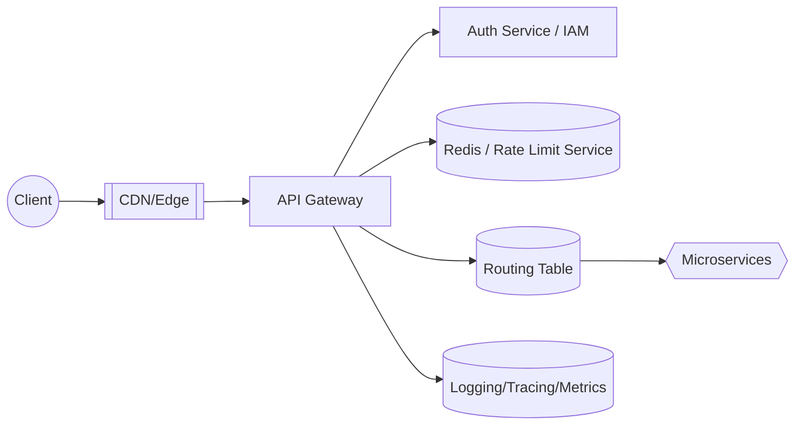
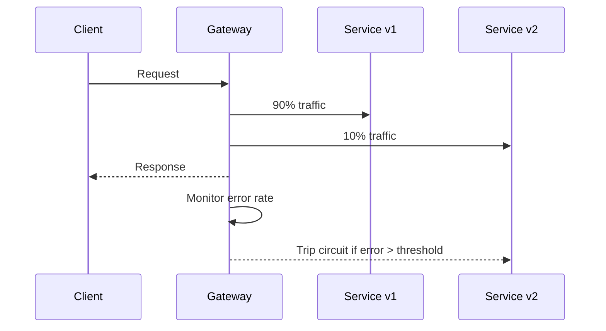

# 🚪 Deep Dive: Design API Gateway (Routing, Auth, Rate Limit, Logging)

> **"Mục tiêu: Thiết kế lớp cổng (Gateway) đứng trước toàn bộ microservices để xử lý routing thông minh, xác thực, rate limit và quan sát lưu lượng."**

---

## 1. Clarify Requirements

### Functional Requirements
*   **Routing:** Điều phối request đến service tương ứng dựa trên path, header, version.
*   **Authentication & Authorization:** Xác thực OAuth/JWT/API key, enforce RBAC/ABAC.
*   **Rate Limiting & Throttling:** Bảo vệ backend khỏi abuse.
*   **Observability:** Logging, metrics, tracing cho mọi request qua gateway.
*   **Transformation:** Chỉnh sửa header/body (ví dụ thêm correlation ID, chuyển JSON ↔ gRPC).
*   **Blue/Green & Canary:** Route một phần traffic để test phiên bản mới.

### Non-Functional Requirements
*   **High Availability:** Gateway là single entry point → phải multi-region + auto failover.
*   **Low Latency:** Thêm <5ms overhead.
*   **Scalability:** Handle hàng trăm nghìn RPS.
*   **Extensibility:** Cấu hình dễ dàng cho team sản phẩm tự publish API.

---

## 2. Architecture Overview

> Gateway có thể dựa trên Nginx/Envoy/API Gateway managed (AWS API Gateway, Kong, Apigee...).

---

## 3. Core Components

### 3.1 Routing Engine
*   **Path-based:** `/api/v1/users` → User Service.
*   **Header-based:** `X-Tenant-ID` để định tuyến theo tenant.
*   **Method-based:** GET → cacheable, POST → no cache.
*   **Weighted routing:** 90% traffic → v1, 10% → v2 (canary).
*   **Service Discovery integration:** Pull từ Consul/Eureka/Kubernetes để biết endpoint đang khỏe.

### 3.2 Authentication & Authorization
*   **JWT/OAuth:** Validate signature, expiry, scopes.
*   **mTLS:** Cho internal service-to-service.
*   **API Keys:** Hash & store ở Gateway hoặc IAM service.
*   **Policy Engine:** Tích hợp với OPA (Open Policy Agent) để enforce rule (ví dụ chỉ admin mới gọi được `/admin/*`).

### 3.3 Rate Limiting & Quota
*   Embed logic từ [Design Rate Limiter](./design-rate-limiter.md).
*   Key gồm `tenant_id`, `user_id`, `ip` để chống bot.
*   Hỗ trợ burst (Token Bucket) + global limit.

### 3.4 Logging & Observability
*   **Structured Logs:** JSON ghi `request_id`, `latency`, `upstream_status`.
*   **Metrics:** Prometheus/StatsD (QPS, p99 latency, error rate).
*   **Distributed Tracing:** Inject `traceparent` header, export sang Jaeger/Zipkin.
*   **Access Log Sampling:** Sampling 1% traffic cho phân tích chuyên sâu.

### 3.5 Request Transformation
*   **Header rewrite:** Thêm `X-Request-ID`, `X-Forwarded-For`.
*   **Body transformation:** REST ↔ GraphQL, JSON ↔ gRPC (Envoy filters).
*   **Response caching:** Cache GET response tại gateway cho traffic public.

---

## 4. Deployment Topology

| Layer | Mô tả | Lợi ích |
| --- | --- | --- |
| **Edge CDN** | CloudFront/Akamai, termination TLS, static cache | Giảm latency, bảo vệ DDoS |
| **Regional API Gateway** | Cluster Envoy/Kong đặt ở nhiều region | HA, giảm round-trip |
| **Service Mesh (Optional)** | Istio/Linkerd sau gateway | Feature nâng cao (circuit breaker, retries) |

> Cần kiến trúc multi-region active-active, sử dụng Anycast IP hoặc GSLB để failover.

---

## 5. Management Plane

*   **Config Store:** GitOps hoặc control plane để quản lý route config (YAML/CRD).
*   **Developer Portal:** Cho phép team đăng ký API, lấy key, theo dõi usage.
*   **Policy as Code:** Review và deploy rule thông qua pipeline (lint, test).

---

## 6. Interview Pro-tips & Trade-offs

1.  **Monolithic vs Distributed gateway:** Monolith đơn giản nhưng khó scale; distributed (per region) yêu cầu đồng bộ config.
2.  **Stateful features:** Session/token store nên tách khỏi gateway để stateless scale-out.
3.  **Negative caching:** Nếu service downstream lỗi 5xx liên tục, gateway có nên cache lỗi để giảm thác đổ?
4.  **Security:** WAF, bot detection nên tích hợp tại gateway để chặn trước khi vào backend.
5.  **Extensibility:** Plugin architecture (Lua/Go/Wasmer) để thêm custom logic mà không rebuild gateway.

---

## 7. Case Study: Canary & Circuit Breaker

*   Gateway thu thập lỗi p95 từ v2. Nếu vượt ngưỡng → circuit breaker mở, tất cả traffic quay lại v1.
*   Sau 5 phút ổn định → thử “half-open” cho phép 1% traffic quay lại.

---

## 8. Quick Estimation Template

| Thông số | Ví dụ | Ghi chú |
| --- | --- | --- |
| Peak QPS | 200k req/s | Tính số instance (ví dụ Envoy 20k req/s mỗi pod) |
| Latency budget | < 5ms | Gateway phải nhẹ, tránh logic blocking |
| Config objects | 500 routes | Cần hot reload mà không downtime |
| Log volume | 500k req/s x 1KB = 500MB/s | Phải sampling hoặc log pipeline mạnh |

---

## 📚 Bài tiếp theo
*   [Design Rate Limiter](./design-rate-limiter.md) – tích hợp quota vào gateway.
*   [Fundamentals: Load Balancing & CDN](./fundamentals-load-balancing-cdn.md) – hiểu cơ chế Edge/Anycast.
