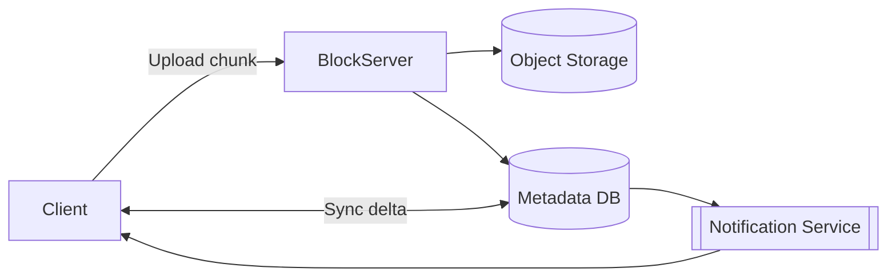
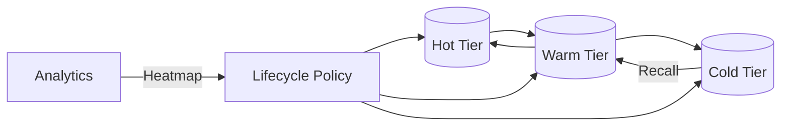
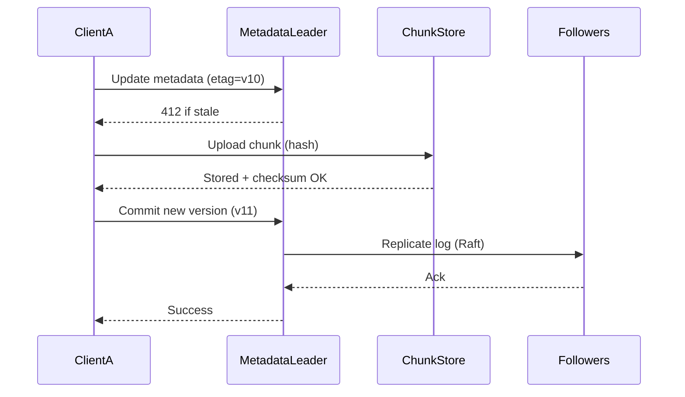
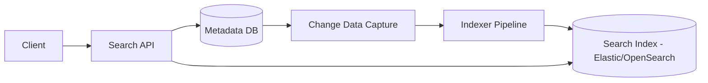
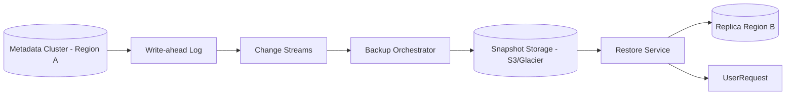

# 📂 Deep Dive: Design File Storage System (Google Drive/Dropbox)

> **"Mục tiêu: Thiết kế một hệ thống lưu trữ tệp tin đám mây cho phép người dùng tải lên, tải về, chia sẻ và đồng bộ hóa tệp tin trên nhiều thiết bị."**

---

## 1. Clarify Requirements (Làm rõ yêu cầu)

### Functional Requirements
*   **File Upload/Download:** Tải tệp lên và tải tệp về.
*   **Syncing:** Tệp tin tự động cập nhật trên mọi thiết bị (Laptop, Mobile).
*   **Versioning:** Xem lịch sử và khôi phục các phiên bản cũ của tệp.
*   **Sharing:** Chia sẻ tệp/thư mục cho người dùng khác với quyền đọc/ghi.

### Non-Functional Requirements
*   **Reliability:** Không được mất tệp tin (Độ bền dữ liệu cực cao).
*   **Consistency:** Khi cập nhật ở thiết bị A, thiết bị B phải thấy thay đổi sớm nhất có thể.
*   **Scalability:** Hỗ trợ hàng tỷ tệp tin và hàng triệu người dùng.

---

## 2. High-level Design

### Components
*   **Block Server:** Xử lý việc chia nhỏ tệp thành các khối (chunks) để upload/download hiệu quả.
*   **Metadata DB:** Lưu thông tin về tệp (tên, kích thước, đường dẫn) và các phiên bản.
*   **Object Storage:** Nơi lưu trữ thực sự các khối dữ liệu (dùng S3/GCS).
*   **Notification Service:** Thông báo cho các thiết bị khác khi có thay đổi tệp để bắt đầu quá trình đồng bộ.

> Client gửi chunk đến Block Server, metadata được ghi đồng bộ và Notification Service bắn tín hiệu sync tới thiết bị khác.

---

## 3. Back-of-the-envelope Estimation

| Metric | Assumption | Result |
| --- | --- | --- |
| DAU | 50 triệu | 50M |
| Avg files/user | 2.000 files | 100B files |
| Avg upload/day | 200MB/user | 10PB data/day |
| Chunk size | 4MB | 2.5B chunks/day |

> Số lượng chunk cực lớn => cần pipeline song song & dedup để giảm IO.

---

## 4. Deep Dive: Efficiency & Reliability (Trọng tâm)

### Chunking (Chia nhỏ tệp)
Thay vì upload toàn bộ 1 file 1GB, hệ thống chia nhỏ thành các khối (ví dụ 4MB).
*   *Lợi ích:* 
    *   **Retry:** Nếu upload thất bại, chỉ cần upload lại chunk đó.
    *   **Differential Sync:** Nếu chỉ sửa 1 câu trong file, hệ thống chỉ cần upload chunk chứa thay đổi đó.

### Deduplication (Loại bỏ trùng lặp)
Nếu 1.000 người cùng upload một file giáo trình nặng 100MB, hệ thống có lưu 100GB không?
*   **Giải pháp:** Hash từng chunk. Nếu chunk đó đã tồn tại trong Object Storage, Metadata chỉ việc trỏ link đến chunk cũ thay vì lưu mới.
*   *Kết quả:* Tiết kiệm chi phí lưu trữ khổng lồ.

### Metadata DB [Sharding](./fundamentals-scalability-consistency.md#2-replication--sharding)
Với hàng tỷ tệp tin, DB metadata sẽ trở nên rất lớn.
*   **Sharding theo `user_id`:** Tất cả tệp của 1 user sẽ nằm cùng 1 node, giúp các thao tác duyệt thư mục và tìm kiếm của user đó nhanh hơn.

---

## 5. Deep Dive: Syncing Mechanism

Làm sao để thiết bị B biết thiết bị A vừa sửa file?
1.  **Thiết bị A:** Upload chunk mới -> Update Metadata -> Gửi tín hiệu đến Notification Service.
2.  **Notification Service:** Dùng **Long Polling** hoặc **WebSocket** để đẩy tín hiệu "New Update" đến các thiết bị đang online của người dùng đó.
3.  **Thiết bị B:** Nhận tín hiệu -> So sánh version trong Metadata -> Chỉ tải về các chunk bị thay đổi.

---

## 6. Conflict Handling (Xử lý xung đột)
Khi 2 người cùng sửa 1 file lúc offline và cùng online cùng lúc:
*   **Strategy:** Hệ thống tạo ra 2 version khác nhau (Conflicted copy) và yêu cầu người dùng tự giải quyết (Merge manual) giống như Git.

---

## 7. Upload/Download Lifecycle
1.  **Upload:** Client chia file thành chunks → gửi kèm hash → Block Server xác thực, ghi vào Object Storage, update metadata (atomic transaction).
2.  **Download:** Client lấy metadata (danh sách chunk + checksum) → tải song song nhiều chunk → verify checksum → ghép file.
3.  **Delta Sync:** Watcher trên máy tính phát hiện thay đổi → chỉ upload chunk mới → metadata version++.

---

## 8. Interview Pro-tips (Trade-offs)

1.  **Strong vs Eventual Consistency:** Metadata cần **[Strong Consistency](./fundamentals-scalability-consistency.md#cap-theorem--consistency-spectrum)** (không thể thấy file tồn tại nhưng click vào lại báo lỗi). Dữ liệu chunk có thể chấp nhận **[Eventual Consistency](./fundamentals-scalability-consistency.md#cap-theorem--consistency-spectrum)** trong quá trình đồng bộ.
2.  **Storage Costs:** Đề cập đến chiến lược **Cold Storage** (lưu các version cũ hoặc file lâu không dùng vào loại đĩa rẻ tiền hơn).

---

## 9. Case Study: Storage Tiering & Lifecycle

### Bài toán
Tối ưu chi phí lưu trữ nhưng vẫn đảm bảo user có thể truy cập file cũ khi cần.

### Tier Strategy
| Tier | Latency | Cost | Use cases |
| --- | --- | --- | --- |
| **Hot** (SSD) | < 10ms | $$$ | File mới tải lên, đang được chỉnh sửa |
| **Warm** (HDD) | ~20ms | $$ | File được truy cập vài lần/tháng |
| **Cold** (Object Storage + Glacier) | giây/phút | $ | Version cũ, file lâu không dùng |

### Lifecycle Policy
1.  **Access Heatmap:** Track last-access time + frequency. Nếu file không truy cập >30 ngày -> chuyển sang Warm.
2.  **Version Pruning:** Giữ 10 version cuối ở Warm, version cũ hơn đẩy xuống Cold (Glacier) với metadata pointer.
3.  **Recall Flow:** Khi user mở file ở Cold tier, hệ thống kick-off job restore (1-5 phút) và thông báo user.

### Trade-offs
- **Latency Shock:** User mở file Cold có thể phải đợi vài phút. Cần UX rõ ràng.
- **Metadata Consistency:** Khi di chuyển chunk giữa tier, phải cập nhật pointer atomically để tránh broken link.
- **Cost vs Durability:** Cold tier có SLA phục hồi lâu hơn nhưng giá rẻ hơn ~10x.

---

## 10. Case Study: Consistency Protocols

### Bài toán
Đảm bảo metadata và data luôn đồng bộ khi có nhiều client sửa file cùng lúc, tránh mất cập nhật hoặc xung đột.

### Metadata Consistency
- **Primary-Secondary [Replication](./fundamentals-scalability-consistency.md#2-replication--sharding):** Metadata DB sử dụng leader election (Raft) để đảm bảo ghi tuần tự. Client chỉ ghi vào leader để được Strong Consistency.
- **Optimistic Locking:** Mỗi file version kèm `etag` hoặc `version_id`. Khi client cập nhật metadata, nó gửi `If-Match: etag`. Nếu mismatch → trả về `412 Precondition Failed`.

### Chunk Consistency
- **Content-addressable Storage:** Chunk ID dựa trên hash (SHA-256). Client gửi hash → server verify để tránh ghi trùng hoặc sai dữ liệu.
- **2-phase Commit Light:** Block Server ghi chunk vào Object Storage, sau đó ghi metadata; chỉ khi cả hai thành công mới ack client.

### Collaborative Editing
- **CRDT/OT:** Với file văn bản (Google Docs), dùng Operational Transformations hoặc Conflict-free Replicated Data Types để merge các chỉnh sửa theo thời gian thực.
- **Presence Service:** Broadcast cursor/selection để các client biết ai đang chỉnh đoạn nào, giảm nguy cơ xung đột.

### Diagram

### Trade-offs
- **Latency:** Strong consistency tăng độ trễ vì phải commit ở leader + chờ replication.
- **Availability:** Khi leader down cần failover (few seconds). Đối với offline sync, CRDT giúp user tiếp tục chỉnh nhưng cần reconcile.
- **Complexity:** CRDT/OT phức tạp hơn nhiều so với file locking truyền thống.

---

## 11. Case Study: Metadata Search & Query Engine

### Bài toán
Mỗi user có hàng triệu file, cần tìm kiếm theo tên, tag, người chỉnh sửa, thời gian cập nhật chỉ trong vài trăm mili-giây.

### Kiến trúc

1. **Change Data Capture (CDC):** Stream binlog hoặc sử dụng Debezium để gửi mọi thay đổi metadata sang Kafka.
2. **Indexer Pipeline:** Workers chuẩn hóa dữ liệu (tokenize, n-gram, permission filtering) rồi ghi vào Elastic/OpenSearch.
3. **Search API:** Truy vấn index trước (full-text), sau đó gọi Metadata DB để lấy metadata chi tiết và kiểm tra ACL.

### Permission-aware Search
- Index lưu `doc_id` + `visibility bitmap` (owner, shared users, nhóm).
- Khi query, Search API tính `allowed_principals` từ access token → thêm filter trên bitmap hoặc `join table` cache.
- Với file share public link, TTL được nhúng vào index để tự động expire.

### Tối ưu
- **Hybrid Query:** Kết hợp vector search (semantic) với keyword search truyền thống.
- **Prefix Index:** Dùng Edge N-gram để hỗ trợ autocomplete tên file.
- **Query Federation:** Nếu user có workspace riêng, giữ shard nóng trong memory để tránh fan-out.

### Trade-offs
- Duplicated storage giữa Metadata DB và Search Index (eventual consistency ~seconds).
- CDC lag có thể gây chậm cập nhật quyền truy cập → cần audit job để sync định kỳ.
- Elastic cluster tốn chi phí, nên thiết lập ILM (Index Lifecycle Management) với snapshot S3 để giảm cost.

---

## 12. Case Study: Backup & Cross-region Restore

### Bài toán
Đảm bảo không mất dữ liệu khi datacenter gặp sự cố, đồng thời cung cấp khả năng khôi phục file/lịch sử phiên bản khi user xóa nhầm.

### Kiến trúc

1. **Incremental Snapshot:** Metadata DB tạo snapshot mỗi đêm (full) + incremental theo block-level, lưu vào S3 với versioning.
2. **Chunk Backup:** Object Storage dùng Cross-Region Replication (CRR) async, đồng thời tạo checksum manifest để đảm bảo toàn vẹn.
3. **Backup Orchestrator:** Theo dõi job status, giữ catalog (snapshot_id, timestamp, region).
4. **Restore Workflows:**
   - **Disaster Recovery:** Promote Region B thành primary, rehydrate metadata từ snapshot mới nhất + apply change stream.
   - **Per-file Restore:** User chọn file → Restore Service lấy chunk + metadata pointer từ snapshot tương ứng, ghi về Region A.

### RPO/RTO
- **RPO:** Metadata 5 phút (nhờ change stream), chunk data vài phút do CRR latency.
- **RTO:** DR < 30 phút bằng cách giữ cluster warm-standby ở Region B.

### Trade-offs
- Chi phí nhân đôi storage + băng thông replication.
- Snapshot lớn → cần dedup/compression và lifecycle policy (giữ 7 daily, 4 weekly, 12 monthly).
- Restore per-file phải kiểm tra ACL để tránh khôi phục file mà user không còn quyền.

## 📚 Bài tiếp theo
*   [Design Rate Limiter](./design-rate-limiter.md)
