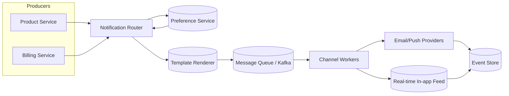

# 📣 Deep Dive: Design Notification System (Email, Push, In-app)

> **"Mục tiêu: Thiết kế nền tảng gửi thông báo đa kênh (push, email, SMS, in-app) bảo đảm đúng người, đúng nội dung, đúng thời điểm và không spam người dùng."**

---

## 1. Clarify Requirements (Làm rõ yêu cầu)

### Functional Requirements
*   **Multi-channel:** Hỗ trợ push mobile, email, SMS, in-app banner.
*   **User Preferences:** Người dùng có thể bật/tắt từng loại notification, chọn kênh ưu tiên.
*   **Template & Personalization:** Khả năng render nội dung động (ví dụ: `{{user_name}}`).
*   **Idempotency:** Không gửi trùng thông báo khi hệ thống retry hoặc user hành động nhiều lần.
*   **Delivery Status:** Theo dõi sent/delivered/open/click.

### Non-Functional Requirements
*   **High Throughput:** Xử lý hàng triệu events/ngày (marketing + transactional).
*   **Reliability:** Bảo đảm thông báo quan trọng luôn được gửi (retry/backoff, DLQ).
*   **Latency:** Notification giao dịch (OTP, security alert) < 2s end-to-end.
*   **Compliance:** Tuân thủ chính sách opt-in/opt-out (GDPR, CAN-SPAM).

---

## 2. High-level Architecture



> **Pipeline:** Event (order shipped) → Router → Respect preferences → Render template → Queue → Channel workers → Provider → Delivery status → Analytics.

---

## 3. Deep Dive: Router & Preference Service

### Notification Router
*   Nhận `NotificationRequest` từ microservices.
*   Chuẩn hóa event (schema version, metadata).
*   Tra cứu **User Preference** & **Channel Fallback Logic**:
    *   Ví dụ: OTP → SMS trước, nếu fail mới gửi email.
    *   Marketing → chỉ gửi email vào 9:00–21:00 theo múi giờ user.
*   Áp dụng **Rate Limit per user/campaign** để tránh spam (tích hợp [Design Rate Limiter](./design-rate-limiter.md)).

### Preference Service
*   Lưu cấu hình notification type → channel → status (opt-in/opt-out).
*   Schema mẫu (NoSQL):
```json
{
  "user_id": "123",
  "time_zone": "Asia/Ho_Chi_Minh",
  "channels": {
    "security_alert": {"push": true, "email": true, "sms": false},
    "marketing": {"email": true, "push": false, "quiet_hours": "21:00-08:00"}
  }
}
```
*   Cache layer (Redis) cho lookup dưới 5ms.
*   API cho người dùng cập nhật (tối ưu qua batching hoặc change data capture để invalidate cache).

---

## 4. Deep Dive: Queue & Idempotency

### Message Queue (Kafka/SQS/PubSub)
*   **Decouple:** Producers không chờ việc gửi. Router publish event vào topic `notifications`.
*   **Partition key:** Theo `user_id` để giữ thứ tự event trong cùng user.
*   **Retry strategy:**
    *   **Primary queue:** Worker retry nhanh (exponential backoff 3 lần).
    *   **DLQ:** Message lỗi lâu (ví dụ template thiếu dữ liệu) chuyển sang Dead Letter Queue để phân tích.

### Idempotency & Deduplication
*   `notification_id = hash(event_id + channel)`.
*   Channel worker kiểm tra Redis `SETNX` trước khi gửi. Nếu key đã tồn tại -> skip (đã gửi trước đó).
*   Provider callback (webhook) cũng cần idempotent để tránh double-update status.

---

## 5. Channel Workers

| Channel | Đặc điểm | Best practice |
| --- | --- | --- |
| **Push (Firebase/APNs)** | Latency thấp, phụ thuộc token thiết bị | Refresh token định kỳ, handle `Unregistered` error, batch send |
| **Email (SES/SendGrid)** | Throughput cao nhưng dễ vào spam | DKIM/SPF alignment, warm-up IP, segmentation |
| **SMS (Twilio/Sinch)** | Đắt, phải tuân thủ local regulation | Prioritize OTP/security, geo-route qua nhiều provider |
| **In-app** | Real-time trong app/web | Dùng WebSocket hoặc fan-out qua Cache/Feed service |

> **Provider abstraction layer:** Định nghĩa interface `send(channel, payload)` để dễ dàng thay đổi vendor hoặc multi-provider failover.

---

## 6. Scheduling & Throttling

*   **Campaign Scheduler:** Cho phép thiết lập gửi vào thời điểm tương lai, hỗ trợ múi giờ.
*   **Rate Control:** Throttling per campaign (ví dụ 1 triệu email trong 1 giờ) để tránh bị provider chặn.
*   **Quiet Hours:** Các notification không khẩn cấp phải tôn trọng giờ yên lặng của user.

---

## 7. Delivery Analytics & Observability

*   **Event tracking:** `sent`, `delivered`, `open`, `click`, `unsubscribe`.
*   **Storage:** Append-only log (Kafka) → ETL → Data warehouse.
*   **Dashboard:** Thống kê CTR, bounce rate, spam complaint. Theo dõi `latency p95`, `error by provider`.
*   **Alerting:** Nếu bounce rate > threshold → tự động disable campaign hoặc chuyển provider.

---

## 8. Interview Pro-tips (Trade-offs)

1.  **Exactly-once vs At-least-once:** Hầu hết providers chỉ đảm bảo at-least-once. Thiết kế idempotency ở application layer để tránh gửi trùng.
2.  **User Preference Source of Truth:** Dùng event sourcing/CQRS khi quy mô lớn để audit mọi thay đổi opt-in/out.
3.  **Multi-tenant:** Cần partition theo tenant để bảo vệ khách hàng lớn khỏi bị ảnh hưởng bởi chiến dịch khác (rate limit per tenant).
4.  **Cost Control:** SMS đắt → fallback sang push/email nếu user đã cài app.
5.  **Compliance:** Lưu log opt-in/out + content đã gửi để audit.

---

## 9. Case Study: Unified Inbox & Priority

### Bài toán
Người dùng bị ngập thông báo từ nhiều dịch vụ nhưng vẫn phải thấy event quan trọng (refund, security alert).

### Giải pháp
1.  **Priority Queue:** Chia topic thành `high`, `medium`, `low`. Worker ưu tiên tiêu thụ high trước.
2.  **In-app inbox:** Lưu toàn bộ notification vào `notification_feed` (NoSQL) để user có lịch sử.
3.  **Snooze/Mute:** Cho phép user tạm thời mute 1 thread. Router phải tôn trọng trạng thái này.
4.  **ML Ranking:** Dùng signal (open rate, dismiss) để xếp hạng notification in-app.

---

## 10. Quick Estimation Template

| Thông số | Ví dụ giả định | Ghi chú |
| --- | --- | --- |
| DAU | 50 triệu | 30% bật push |
| Event/ user / ngày | 5 | → 250 triệu notification event |
| OTP/sec (peak) | 20k | Tính số worker + TPS của SMS provider |
| Email campaign | 5 triệu / ngày | Cần batching + IP warm-up |
| Storage feed | 30 ngày giữ lịch sử | 250M × 1KB ≈ 250GB/tháng |

---

## 📚 Bài tiếp theo
*   [Design Rate Limiter](./design-rate-limiter.md) – tích hợp quota để tránh spam.
*   [Fundamentals: Messaging Patterns](./fundamentals-messaging-patterns.md) – hiểu cơ chế queue/log.
