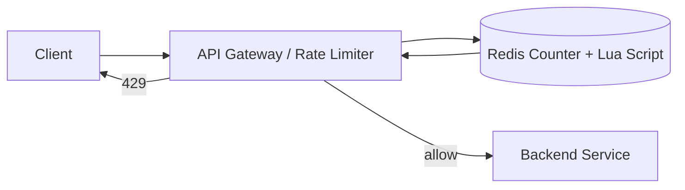
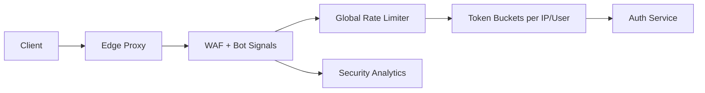
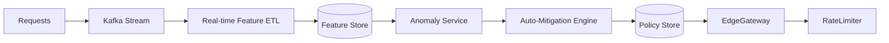

# 🛡️ Deep Dive: Design Rate Limiter

> **"Mục tiêu: Thiết kế một hệ thống kiểm soát lưu lượng truy cập (Rate Limiting) để ngăn chặn spam, tấn công DoS và đảm bảo công bằng trong việc sử dụng tài nguyên giữa các người dùng."**

---

## 1. Clarify Requirements (Làm rõ yêu cầu)

### Functional Requirements
*   **Limiting:** Chặn request nếu vượt quá ngưỡng cho phép (ví dụ: 10 request/giây).
*   **Feedback:** Trả về mã lỗi HTTP 429 (Too Many Requests) khi bị chặn.

### Non-Functional Requirements
*   **Low Latency:** Việc kiểm tra phải cực nhanh, không được làm chậm request chính.
*   **Distributed:** Phải hoạt động chính xác trong môi trường nhiều server.
*   **Scalability:** Xử lý được hàng triệu request mỗi giây.

---

## 2. Deep Dive: Algorithms (Trọng tâm)

Đây là phần "sống còn" của bài phỏng vấn. Bạn phải trình bày được ít nhất 2-3 thuật toán và trade-offs.

### A. Token Bucket (Phổ biến nhất - Amazon/Stripe dùng)
*   Mỗi user có 1 cái "xô" chứa Token. Mỗi request bốc đi 1 Token. Token được nạp lại định kỳ.
*   *Ưu điểm:* Cho phép một lượng truy cập đột biến (Burst of traffic). Dễ cài đặt.

### B. Leaky Bucket (Shopify dùng)
*   Request vào xô và chảy ra với tốc độ cố định (giống cái phễu). Nếu xô đầy -> Chặn.
*   *Ưu điểm:* Lưu lượng ra luôn ổn định. Phù hợp cho các hệ thống yêu cầu tốc độ xử lý đều.

### C. Fixed Window Counter
*   Chia thời gian thành các cửa sổ cố định (ví dụ 1 phút). Mỗi cửa sổ có một bộ đếm.
*   *Nhược điểm:* **Spike problem** tại biên của 2 cửa sổ (có thể lọt gấp đôi số request trong thời gian ngắn).

### D. Sliding Window Log / Counter - **Khuyên dùng cho Senior**
*   Theo dõi thời gian chính xác của từng request.
*   *Ưu điểm:* Giải quyết triệt để vấn đề Spike ở biên. Cực kỳ chính xác.

---

## 3. Distributed Rate Limiter (Thiết kế Phân tán)

Làm sao để 10 server cùng biết User A đã dùng bao nhiêu request?

### Sử dụng Redis (Lựa chọn tối ưu)
Redis là bộ nhớ dùng chung cực nhanh, hỗ trợ các thao tác nguyên tử (Atomic operations).
1.  **Key:** `rate_limit:{user_id}:{minute}`
2.  **Value:** Bộ đếm (Counter).
3.  **Operation:** Dùng lệnh `INCR` và `EXPIRE`.

### Race Condition & Performance
*   **Race Condition:** Nếu 2 request cùng đọc Counter cùng lúc, cả hai đều thấy chưa quá hạn -> Dùng **Lua Script** trong Redis để thực hiện kiểm tra và tăng counter trong 1 thao tác duy nhất.
*   **Performance:** Để giảm tải cho Redis, ta có thể dùng **Local Cache** tại từng App Server để chặn bớt trước khi hỏi Redis (nhưng sẽ kém chính xác hơn một chút).

---

## 4. High-level Architecture

1.  **Client** gửi request.
2.  **Rate Limiter Middleware** (nằm ở API Gateway) bốc `user_id` hoặc `IP`.
3.  Thực hiện kiểm tra/tăng counter trong **Redis** bằng operation nguyên tử (Lua script).
4.  Nếu OK -> Chuyển request đến **Backend Service**.
5.  Nếu NO -> Trả về **HTTP 429** + Header `Retry-After`.

---

## 5. Interview Pro-tips (Trade-offs)

1.  **Where to put it?** 
    *   API Gateway: Tốt cho việc bảo vệ toàn bộ hệ thống, tách biệt logic.
    *   Client-side: Dễ bị bypass, không an toàn.
2.  **Hard vs Soft Limiting:** 
    *   Hard: Chặn ngay lập tức.
    *   Soft: Cho phép vượt quá một chút trong thời gian ngắn (Burst).
3.  **Global vs Per-user:** Thảo luận về việc chặn theo User ID (an toàn hơn) hay IP (dễ chặn robot).

---

## 6. Case Study: Anti-abuse Firewall (DoS + Credential Stuffing)

### Bài toán
Các endpoint login/signup bị bot tấn công credential stuffing, khiến backend quá tải và gia tăng nguy cơ lock account.

### Kiến trúc

1. **Edge Proxy/CDN** terminate TLS và thêm header device fingerprint.
2. **WAF** gắn nhãn traffic (bot score, ASN reputation) → gửi metadata kèm request.
3. **Global Rate Limiter** đánh chỉ số per tenant, per API key, per IP /24.
4. **Token Buckets** trong Redis/LFU cache: bucket nghi ngờ bị shrink capacity.
5. **Security Analytics (SIEM)** ghi nhận IP bị chặn để hỗ trợ threat intel.

### Chiến lược hạn chế lạm dụng
- **Dynamic Penalty:** Nếu bot score cao hoặc liên tục 429 → giảm tốc độ refill token.
- **Multi-dimensional Keys:** `limit:{user}:{ip}:{device}` tránh bot xoay IP.
- **Shadow Mode:** Trước khi bật luật mới, chạy ở chế độ giám sát để tránh chặn nhầm user thật.

### Trade-offs
- Penalty quá mạnh gây false positive, nhất là Wi-Fi công cộng (nhiều người chung IP).
- WAF + rate limiter cần latency <5ms để không ảnh hưởng login.
- Bảo trì blacklist lớn tốn chi phí; nên kết hợp threat intel feed tự động.

---

## 7. Case Study: Behavioral Analytics & Auto-Mitigation

### Bài toán
Các API công khai (search, pricing) bị abuse bởi script phân tán, traffic hợp lệ trộn lẫn khiến việc chặn theo IP không hiệu quả.

### Kiến trúc

1. **Streaming ETL:** Mọi request được publish lên Kafka với metadata (tenant, path, device, latency).
2. **Feature Store:** Tính sliding metrics (`req_per_minute`, `error_ratio`, `token_miss_rate`) cho từng dimension.
3. **Anomaly Service:** Dùng models (Isolation Forest/Prophet) phát hiện spike bất thường.
4. **Auto-Mitigation Engine:** Khi score vượt ngưỡng, tạo rule tạm thời (ví dụ giảm quota 90%, yêu cầu captcha) lưu vào Policy Store.
5. **Edge Gateway:** Pull rule mới mỗi vài giây, áp dụng ngay tại ingress trước khi vào Rate Limiter truyền thống.

### Điều phối vận hành
- **Human-in-the-loop:** SOC nhận alert có thể override rule hoặc promote thành permanent policy.
- **Decay policy:** Rule tự hết hạn sau 30 phút nếu không còn anomalous traffic.
- **Safe-list:** Các partner quan trọng được safe-list nhưng vẫn theo dõi metrics để cảnh báo mềm.

### Trade-offs
- Hệ thống ML phức tạp, cần dữ liệu chất lượng và pipeline observability.
- Rule tự động có thể chặn nhầm chiến dịch marketing legit; phải thiết kế UI kiểm duyệt nhanh.
- Latency của pipeline analytics (5-10s) → cần buffer ở rate limiter hiện có để chịu đựng spike trong khoảng thời gian đó.

---

## 6. Quick Estimation Template
| Thông số | Ví dụ giả định | Ghi chú |
| --- | --- | --- |
| Người dùng hoạt động | 10 triệu DAU | Chọn order-of-magnitude |
| QPS trung bình | 20k req/s | Peak có thể gấp 3-5 lần |
| Giới hạn per user | 100 req/phút | -> Tạo key `user:minute` |
| Bộ nhớ Redis | (100 bytes/key) × (DAU × windows) ≈ vài GB | Giúp tính số node |

**Logic:** Ước lượng số counter cần lưu trong Redis để quyết định sharding/cluster size.

---

## 📚 Bài tiếp theo
*   [Design Search Autocomplete (Google Search)](./design-search-autocomplete.md)
