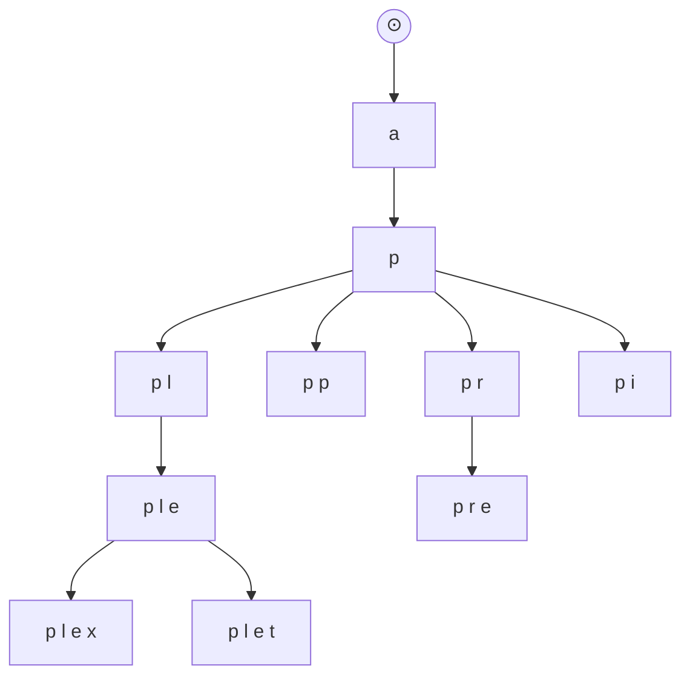

# 🔍 Deep Dive: Design Search Autocomplete (Google Search)

> **"Mục tiêu: Thiết kế một hệ thống gợi ý 5 từ khóa tìm kiếm phổ biến nhất bắt đầu bằng ký tự mà người dùng đang nhập."**

---

## 1. Clarify Requirements (Làm rõ yêu cầu)

### Functional Requirements
*   **Query Suggestion:** Trả về Top 5 từ khóa phù hợp nhất.
*   **Ranking:** Sắp xếp dựa trên tần suất tìm kiếm (frequency).

### Non-Functional Requirements
*   **Low Latency:** Thời gian trả về phải < 100ms. Nếu chậm hơn, người dùng sẽ thấy "giật" khi gõ.
*   **Highly Available:** Hệ thống phải luôn sẵn sàng.
*   **Scalability:** Xử lý hàng trăm nghìn request mỗi giây.

---

## 2. Deep Dive: Data Structure (Trọng tâm)

Làm sao để tìm nhanh các từ khóa có cùng tiền tố (prefix)?

### Cấu trúc dữ liệu: Trie (Prefix Tree)
*   Mỗi node đại diện cho một ký tự.
*   Một đường đi từ gốc đến một node tạo thành một tiền tố.
*   **Vấn đề:** Nếu chỉ dùng Trie thuần túy, ta phải quét toàn bộ các nhánh con của tiền tố đó để tìm Top 5 từ khóa phổ biến nhất -> Cực chậm.

### Tối ưu Trie: Lưu sẵn kết quả (Pre-computation)
*   Tại mỗi node, ta lưu luôn danh sách **Top 5 từ khóa phổ biến nhất** của nhánh đó.
*   *Kết quả:* Khi người dùng gõ "ap", ta chỉ việc truy cập node 'p', lấy ngay danh sách lưu sẵn -> Độ phức tạp $O(1)$.

> Mỗi node lưu kèm `top_queries`: ví dụ node `ap` chứa `["apple","app store","ap schedule"]`.

---

## 3. Deep Dive: Data Update Strategy

Làm sao để cập nhật tần suất từ khóa mà không làm chậm hệ thống?

### Quy trình cập nhật (Analytics Pipeline)
1.  **Log Service:** Lưu mọi từ khóa người dùng tìm kiếm vào file log.
2.  **Aggregation Service:** Hàng tuần hoặc hàng ngày (tùy độ trễ chấp nhận được), dùng **MapReduce (Hadoop/Spark)** để đếm tổng số lần xuất hiện của từng từ khóa.
3.  **Trie Builder:** Xây dựng lại cấu trúc Trie mới từ dữ liệu đã tổng hợp.
4.  **Trie Cache:** Đẩy Trie mới vào bộ nhớ (In-memory) để phục vụ request.

---

## 4. High-level Architecture

1.  **User** gõ phím.
2.  **Browser/Mobile** gửi request đến **Autocomplete Service**.
3.  **Service** truy xuất từ **Trie Cache** (Redis/Custom In-memory store).
4.  Trả về kết quả cho User.
5.  Dữ liệu tìm kiếm được đẩy vào **Kafka/Logs** để Aggregation Service xử lý sau.

---

## 5. Interview Pro-tips (Optimization)

1.  **Browser Caching:** Cho phép trình duyệt lưu kết quả gợi ý trong một khoảng thời gian ngắn (ví dụ 1 tiếng) để giảm tải cho server.
2.  **Sampling:** Không cần log lại 100% request nếu hệ thống quá tải. Chỉ cần log 1/10 request cũng đủ để tính toán xu hướng phổ biến.
3.  **Personalization:** Làm thế nào để gợi ý dựa trên sở hữu của từng cá nhân? (Lưu lịch sử tìm kiếm riêng của user trong DB và kết hợp với kết quả chung).
4.  **Trie Sharding:** Chia nhỏ Trie theo ký tự đầu tiên (A-M, N-Z) để lưu trên nhiều server khác nhau.

---

## 📚 Bài tiếp theo
*   [Design Logging / Monitoring System](./design-logging-monitoring.md)
