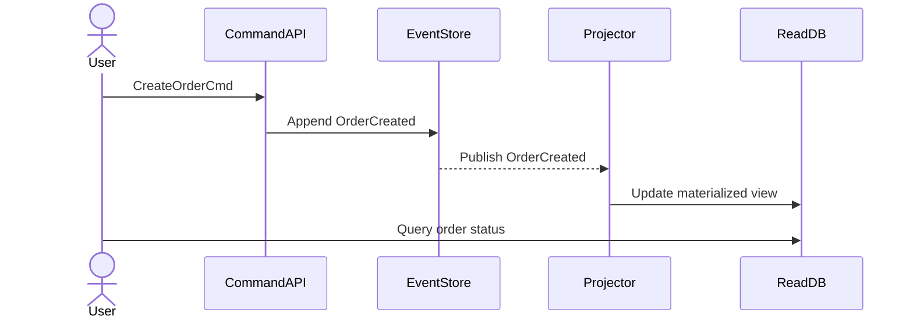

# 🌀 Event Sourcing & CQRS Fundamentals

> [← Back to System Design](./README.md)

Event sourcing lưu **mọi sự kiện (event) đã xảy ra** như nguồn sự thật (source of truth), thay vì chỉ lưu trạng thái cuối cùng. Khi kết hợp với CQRS, bạn tách kênh **write** (command) và **read** (query) để đạt scalability + auditability.

---

## 1. Ý tưởng cốt lõi
- **State = replay(events)**: trạng thái hiện tại luôn có thể dựng lại bằng cách đọc log sự kiện theo thứ tự thời gian.
- **Append-only log**: mọi thay đổi là append, không update in-place → dễ audit/rollback.
- **Command vs Query (CQRS)**: write model tối ưu validate/consistency, read model tối ưu truy vấn.

---

## 2. Khi nào nên dùng?
| Use case | Lợi ích chính |
| --- | --- |
| Fintech, banking | Audit trail, dễ rollback giao dịch, compliance |
| Gaming, IoT, logistics | Replay state theo thời gian, time-travel debugging |
| Complex workflows | Kết hợp saga / process manager xử lý state machine |

**Tránh dùng** nếu bài toán CRUD đơn giản, không cần lịch sử, team thiếu kinh nghiệm vận hành event store.

---

## 3. Thành phần kiến trúc
1. **Command Handler**: validate business rule, tạo event (OrderCreated, PaymentFailed...).
2. **Event Store**: append log + version (ETag) để phát hiện concurrent write.
3. **Projections / Read Model**: subscribe event → cập nhật materialized view (SQL/Elastic/Cache).
4. **Snapshotting**: lưu trạng thái định kỳ (ví dụ mỗi 100 events) để tránh replay quá dài.
5. **Saga / Process Manager** (tuỳ chọn): điều phối nhiều aggregate (Order ↔ Payment ↔ Inventory).

---

## 4. Design Checklist (phỏng vấn)
- [ ] Làm rõ granularity của event (aggregate là gì?).
- [ ] Chọn event store (Kafka, DynamoDB streams, custom append log?).
- [ ] Chiến lược versioning & concurrency (optimistic lock, ETag).
- [ ] Read model cập nhật eventual, latency mục tiêu?
- [ ] Rebuild & snapshot: mất bao lâu? có job nền?
- [ ] Schema evolution: thay đổi payload event thế nào?
- [ ] GDPR/Right-to-be-forgotten xử lý ra sao?

---

## 5. Pitfalls phổ biến
1. **Event explosion**: ghi quá nhiều event granular → projection tắc.
2. **Hard delete**: không có strategy xoá PII khỏi log.
3. **Tight coupling**: consumer phụ thuộc payload cũ, không version → deploy vỡ.
4. **Debug khó**: thiếu tooling visualize event timeline.

> **Best practice:** Version event bằng `eventType::v2`, giữ backward compatibility ≥1-2 version trước khi loại bỏ.

---

## 6. Hỏi đáp mẫu trong phỏng vấn
- "Nếu service B down, event có bị mất?" → trả lời bằng durable log + retry + DLQ.
- "Làm sao đảm bảo idempotency khi replay?" → sequence number + idempotent handler.
- "Read model stale thì sao?" → nêu SLA (VD <5s) + cơ chế refresh/poll.
- "Khi nào chuyển về RDBMS thường?" → nếu requirement thay đổi, build migration job từ snapshot mới nhất.

---

## 7. Tài liệu & thực hành
- [Martin Fowler — Event Sourcing](https://martinfowler.com/eaaDev/EventSourcing.html)
- [Greg Young — CQRS Journey](https://cqrs.files.wordpress.com/2010/11/cqrs_documents.pdf)
- Luyện tập: áp dụng cho [Design Logging/Monitoring](./design-logging-monitoring.md) hoặc bài **Order Service** trong [domains/backend-dev](../../domains/backend-dev/README.md).
