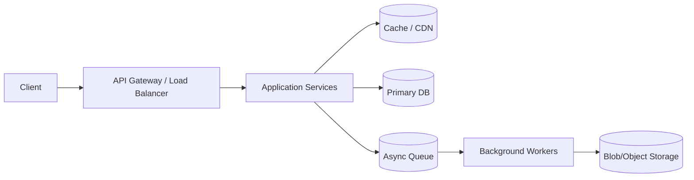

# 🧭 System Design Interview Flow & Checklist (45’)

> [← Back to System Design](./README.md) | [Top 10 Problems](./top-10-problems.md)

Khung 45 phút giúp bạn điều hướng mọi cuộc phỏng vấn System Design với cấu trúc rõ ràng. Mỗi giai đoạn có mục tiêu, câu hỏi và checklist cụ thể.

---

## ⏱️ Breakdown 45 phút
| Thời lượng | Phase | Mục tiêu chính |
| --- | --- | --- |
| 5’ | **Clarify** | Hiểu functional + non-functional, scope và constraint |
| 5’ | **Estimate** | Ước lượng QPS, storage, bandwidth để chọn kiến trúc |
| 10’ | **High-level Design** | Vẽ diagram Client → API/LB → Services → DB/Cache/Queue |
| 20’ | **Deep Dive** | Chọn 1-2 component quan trọng và giải thích scaling, bottleneck |
| 5’ | **Wrap-up & Trade-offs** | Tổng kết, nói về monitoring, failure, câu hỏi follow-up |

---

## ✅ Checklist chi tiết

### 1. Clarify (5’)
- [ ] Functional requirements: user hành động gì? (upload, search, chat)
- [ ] Non-functional: latency, availability, consistency, retention?
- [ ] Scale assumptions: DAU, geo, compliance?
- [ ] Out of scope: feature nào không làm?

**Ví dụ câu hỏi:**
- URL Shortener: “Có cần custom alias? Link tồn tại bao lâu? Track analytics ở mức nào?”
- Chat System: “Có group chat hay chỉ 1-1? Yêu cầu delivery guarantee (exactly-once hay at-least-once)?”
- Video Streaming: “Độ trễ phát lại tối đa cho phép? Có DRM hay multi-region?”
- Ride Sharing: “Realtime update cần P95 bao nhiêu ms? Có cần offline caching cho driver?”

### 2. Estimate (5’)
- [ ] QPS peak + read/write ratio
- [ ] Storage per entity × retention (GB/TB)
- [ ] Bandwidth cho upload/download (nếu media)
- [ ] Con số đưa ra luôn kèm giả định rõ ràng

**Ví dụ nhanh:**
- Rate Limiter: “Giả sử 50M DAU, mỗi user 20 request/phút ⇒ peak 16K QPS; cần bao nhiêu key trong Redis?”
- Search Autocomplete: “Index 10M từ khóa, mỗi entry 50 byte ⇒ ~500MB; update mỗi 5 phút.”
- Distributed Cache: “Nếu cache hit 80% trong 200GB dataset ⇒ cần 160GB RAM + replication hệ số 2.”

### 3. High-level Design (10’)

- [ ] Gọi tên component chính và nhiệm vụ của chúng
- [ ] Nhắc tới redundancy (multi-AZ, replication)
- [ ] Đánh dấu điểm single point of failure & cách bảo vệ

### 4. Deep Dive (20’)
- [ ] Pick 1-2 trọng tâm (ví dụ data model + consistency; caching; indexing)
- [ ] Trình bày: vấn đề → giải pháp → trade-off → vì sao chọn
- [ ] Nhắc tới scaling path (sharding, partition key, async processing)
- [ ] Đưa ra chiến lược quan sát (metrics, alert) nếu kịp

**Ví dụ chọn trọng tâm:**
- Rate Limiter: đào vào Token Bucket + Redis Lua script, nói về penalty bot score.
- File Storage: phân tích metadata store vs chunk store, snapshot/backup chiến lược.
- Video Streaming: mô tả encoding pipeline + CDN edge caching.
- Search Autocomplete: trie lưu frequency + hot cache cho prefix phổ biến.

### 5. Wrap / Trade-offs (5’)
- [ ] Nhắc lại ưu tiên chính + quyết định lớn
- [ ] Đề cập trade-off chính: CAP, cost vs latency, độ phức tạp vận hành
- [ ] Đặt câu hỏi mở: “Bạn muốn đào sâu phần nào thêm?” hoặc “Nếu traffic tăng 10x, tôi sẽ…”
- [ ] Bonus: nói thêm monitoring, rate limiter, DR plan

**Ví dụ trade-off cần nhắc:**
- Rate Limiter: “Ưu tiên availability nên chọn eventual sync giữa region, chấp nhận burst nhỏ.”
- Search Autocomplete: “Dùng eventual update để giữ latency <50ms, đổi lại từ khóa mới xuất hiện sau 5 phút.”
- File Storage: “Chọn erasure coding để giảm cost 40% nhưng tăng latency rebuild.”

---

## 📝 Quick Reference
- **Mindset:** Clarify → Estimate → High-level → Deep dive → Wrap (đừng bỏ qua bước nào)
- **Con số:** mọi đề xuất đều nên gắn với estimation (even ballpark)
- **Trade-off:** luôn nêu điểm mạnh/yếu, kể cả khi không có thời gian vẽ chi tiết
- **Practice:** áp dụng checklist này cho [Top 10 System Design Problems](./top-10-problems.md)

---

## 📚 Liên kết
- [System Design Fundamentals](./system-design-fundamentals.md)
- [45’ System Design Interview Flow (chi tiết)](./system-design-interview-flow.md)
- [Top 10 Problems](./top-10-problems.md)