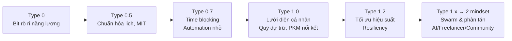

🪐 **Thang đo Kardashev: Văn minh được đo bằng công suất năng lượng**

## Tóm tắt nhanh
- Kardashev đo mức văn minh dựa trên **công suất khai thác/kiểm soát năng lượng (Watt)**.
- Công thức xấp xỉ: **K = (log10(P) − 6) / 10**, với *P* (W). Trái Đất hiện ~10^13 W → **K ≈ 0.7 (Type 0.x)**.
- Ba mốc chính: **Type I (hành tinh) ~10^16 W**, **Type II (hệ sao) ~10^26 W**, **Type III (thiên hà) ~10^36 W**.
- Hạn chế: Năng lượng ≠ trí tuệ; hiệu suất, bền vững, thông tin và đạo đức cũng quan trọng.

---

## 1) Thang đo gốc (Kardashev 1964)
- **Type I – Hành tinh (~10^16–10^17 W, K≈1.0):** Khai thác toàn bộ năng lượng hành tinh (mặt đất + khí quyển + gió + địa nhiệt + mặt trời tại quỹ đạo hành tinh).
- **Type II – Hệ sao (~10^26 W, K≈2.0):** Khai thác phần lớn năng lượng của ngôi sao trung tâm (ví dụ: **cấu trúc Dyson** dạng bầy vệ tinh/thu gọn thu năng lượng, không nhất thiết “quả cầu rắn”).
- **Type III – Thiên hà (~10^36 W, K≈3.0):** Kiểm soát năng lượng cấp thiên hà (nhiều hệ sao), đòi hỏi khả năng vận chuyển/điều phối ở quy mô liên sao.

## 2) Mở rộng hiện đại
- **Type 0.x:** Văn minh trước hành tinh đầy đủ; Trái Đất ~0.7. Nhấn mạnh **hiệu suất** và **khử carbon** thay vì chỉ tăng tổng công suất.
- **Type I.5 / II.5:** Giai đoạn trung gian: thu năng lượng mặt trời tại quỹ đạo, khai thác tiểu hành tinh, hạ tầng hạt nhân an toàn, lưới siêu dẫn.
- **Type IV–V (giả thuyết):** Kiểm soát năng lượng cấp cụm thiên hà/đa vũ trụ; chủ yếu để tư duy viễn tưởng.

## 3) Góc nhìn phê bình
- **Năng lượng ≠ tiến bộ tổng thể:** Thông tin, tri thức, đạo đức, độ bền vững, khả năng tự điều chỉnh quan trọng không kém.
- **Rủi ro ngoài ý muốn:** Quy mô năng lượng lớn đi kèm **nguy cơ thảm họa** (tai nạn hạt nhân, biến đổi khí hậu, chiến tranh năng lượng).
- **Hiệu suất & Độ bền vững:** Văn minh “tiết kiệm năng lượng” nhưng hiệu quả (low-energy, high-intellect) có thể vượt trội ở nhiều khía cạnh.
- **Dấu hiệu quan sát (astrobiology):** Tìm Dyson swarm, phổ hồng ngoại bất thường, hay thất thoát ánh sáng sao.

## 4) Ứng dụng tư duy Kardashev vào sản phẩm/tổ chức
- **Quy mô tài nguyên (Power) = Năng lực vận hành:**
  - **Type 0 → 0.7:** Đội nhỏ, tận dụng công cụ có sẵn, tối ưu cá nhân.
  - **Type 0.7 → 1.0:** Chuẩn hóa quy trình, tự động hóa, lưới hạ tầng (data, observability), an toàn-bảo mật cơ bản.
  - **Type 1 → 1.x:** Nền tảng nội bộ (platformization), quản trị chi phí/hiệu suất, resiliency và legal/compliance.
  - **Type 2 mindset:** Thiết kế “Dyson swarm” trong tổ chức: nhiều **micro-service / team** phối hợp, khai thác “năng lượng sao” (thị trường/nguồn khách hàng) hiệu quả hơn đối thủ.
- **Thước đo thay thế năng lượng:** Throughput hệ thống (requests/sec), GMV, khả năng huy động vốn/nhân lực, hoặc **tổng công suất tính toán** (compute budget) đối với AI.
- **Quản trị rủi ro theo cấp:**
  - Type 0.x: Giảm nợ kỹ thuật; backup cơ bản.
  - Type 1.x: Khả dụng cao (HA), DR/BCP, di chuyển đa đám mây.
  - Type 2: Chiến lược phân tán, đa khu vực, kiểm soát supply chain.

## 4b) Ứng dụng vào cuộc sống cá nhân (ẩn dụ Kardashev, kèm ví dụ)
- **Type 0 → 0.5 (Cá nhân mới bắt đầu):**
  - Việc chính: Nhận diện và bịt rò rỉ năng lượng.
  - Ví dụ: đo giấc ngủ (>=7h), bỏ đa nhiệm khi Deep Work 25 phút, tắt thông báo không cần thiết, nghỉ ngắn 5 phút mỗi 60–90 phút.
- **Type 0.5 → 0.7 (Ổn định nền tảng):**
  - Việc chính: Chuẩn hóa lịch và thói quen lặp lại.
  - Ví dụ: time blocking cho 2 phiên Deep Work sáng; MIT 3 việc/ngày; checklist sáng/tối; template email phản hồi nhanh; phím tắt/automation nhỏ (text expanders).
- **Type 0.7 → 1.0 (Hệ “hành tinh” cá nhân):**
  - Việc chính: Xây “lưới điện” cá nhân và kho dự trữ.
  - Ví dụ: hệ thống task (Kanban/agenda), tài chính cá nhân có quỹ khẩn cấp 3–6 tháng, PKM có tag/links, backup dữ liệu 3-2-1; buffer 10–20% thời gian/tuần cho sự cố.
- **Type 1 → 1.2 (Tăng hiệu suất & bền vững):**
  - Việc chính: Tối ưu hiệu suất/chi phí và tăng khả năng phục hồi.
  - Ví dụ: sleep hygiene, tập luyện 3x/tuần, cắt caffeine sau 14h, “shutdown ritual” cuối ngày; kế hoạch khi mất điện/mạng, hotspot dự phòng, giảm phụ thuộc một nguồn thu.
- **Type 1.x → 2 “mindset” (Swarm & phân tán):**
  - Việc chính: Huy động vệ tinh và phân tán rủi ro.
  - Ví dụ: dùng AI hỗ trợ viết/tóm tắt, thuê freelancer/VA cho việc lặp lại, tham gia cộng đồng chuyên gia; đa nền tảng lưu trữ (cloud + ổ cứng), thiết bị dự phòng tối thiểu.

### Ví dụ thực tế
- **Quản trị năng lượng hằng ngày:**
  - Sáng: 1–2 phiên Deep Work (25–50 phút), tránh họp; check-in năng lượng.
  - Chiều: task nhẹ, giao tiếp; đi bộ ngắn để giảm entropy.
  - Tối: review ngắn, plan ngày mai, tách rời màn hình trước ngủ 60–90 phút.
- **Tài chính cá nhân:**
  - Type 0.5: ghi chép dòng tiền, xóa nợ tiêu dùng lãi cao.
  - Type 0.7: quỹ khẩn cấp, bảo hiểm cơ bản, tự động hóa tiết kiệm.
  - Type 1.0: phân bổ danh mục (core-satellite), theo dõi drawdown; có kế hoạch DR cho thu nhập (side gigs).
- **Học tập/tri thức (PKM):**
  - Type 0.5: thu thập rời rạc.
  - Type 0.7: chuẩn hóa tag, template ghi chú; ôn tập giãn cách.
  - Type 1.0: pipeline tri thức → idea backlog → xuất bản định kỳ.
- **Đội/nhóm nhỏ:**
  - Type 0.5: họp lẫn lộn, ít metric.
  - Type 0.7: OKR đơn giản, rhythm tuần, bảng Kanban chung.
  - Type 1.0: CI/CD tri thức (retro hàng tuần, SOP), cảnh báo rủi ro sớm; trách nhiệm phân tán.

### Sơ đồ tiến cấp (Type 0 → 2)

## 5) Mini playbook “tăng cấp” (ẩn dụ Kardashev)
1) **Chuẩn hóa & quan sát (0 → 0.7):** Logging, metrics, alerting; SOP; tri thức chung.
2) **Tự động hóa & năng lượng sạch (0.7 → 1.0):** CI/CD, IaC, FinOps; ưu tiên hiệu suất/chi phí; khử lãng phí.
3) **Swarm & phân tán (1.0 → 1.5):** Modular hóa (microservice/µfrontends), phân tán workload, tính chịu lỗi.
4) **Orchestrate quy mô hệ sao (1.5 → 2.0):** Orchestration liên vùng, marketplace/partner ecosystem, bảo mật chuỗi cung ứng.

## 6) Takeaways
- Kardashev hữu ích như **ẩn dụ về quy mô tài nguyên và độ phức tạp vận hành**.
- Đừng chỉ “dùng nhiều năng lượng hơn”; hãy **tăng hiệu suất, an toàn và bền vững**.
- Mốc “Type 1” của một tổ chức có thể là: **hệ thống quan sát tốt, tự động hóa triển khai, resiliency, quản trị chi phí**, và không phụ thuộc vào cá nhân.