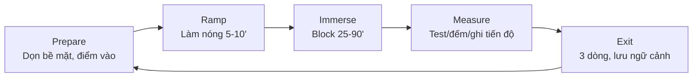

# 🌊 Làm sao để đạt trạng thái Flow

## Tóm tắt nhanh
- Flow = tập trung sâu, rõ mục tiêu, phản hồi tức thì, thách thức vừa đủ so với kỹ năng.
- 5 chìa khóa: (1) Rõ mục tiêu gần, (2) Thách thức vừa tầm + tăng dần, (3) Loại nhiễu và giới hạn thời gian, (4) Ritural vào phiên, (5) Phản hồi nhanh + đo nhịp.
- Công thức thực hành: **PRIME** — *Prepare* (chuẩn bị bề mặt), *Ramp* (làm nóng), *Immerse* (đắm sâu block), *Measure* (phản hồi), *Exit* (hạ cánh).

---

## 1) Điều kiện cần của Flow
- Mục tiêu cụ thể, gần (ví dụ: hoàn thành 1 hàm, viết 300–500 chữ, giải 3 bài).
- Thách thức vừa tầm (skill ≈ challenge); nếu quá khó → lo âu, quá dễ → chán.
- Phản hồi tức thì: biết mình đang tiến hay không (test nhỏ, log, preview, đếm chữ/đơn vị).
- Giới hạn nhiễu: không thông báo, không chat; không đa nhiệm.
- Thời gian đủ dài nhưng có ranh: 25–90 phút/phiên, tùy loại việc.

## 2) Khung PRIME
1) **Prepare (chuẩn bị):**
   - Dọn bề mặt: tài liệu, repo, môi trường, playlist không lời.
   - Viết “điểm vào”: task, trạng thái hiện tại, bước đầu tiên.
2) **Ramp (làm nóng 5–10’):**
   - Ôn nhanh bối cảnh (spec, note, test), làm 1 bước nhỏ/khởi động.
   - Thở 4-7-8 một phút; kéo giãn/đi bộ ngắn.
3) **Immerse (đắm sâu block 25–50–90’):**
   - Chọn 1 MIT; tắt thông báo; dùng Pomodoro dài (50/10) hoặc 90/15.
   - Cấm chuyển tab ngoài mục tiêu.
4) **Measure (phản hồi nhanh):**
   - Kết thúc block: chạy test, review nhanh, đếm chữ/số bài, ghi lại tiến độ.
5) **Exit (hạ cánh):**
   - Ghi 3 dòng: làm được gì, kẹt gì, bước tiếp theo. Lưu ngữ cảnh để phiên sau vào nhanh.

### Sơ đồ PRIME (mermaid)

## 3) Checklist vào Flow (phiên 45–90’)
- Tắt thông báo, chặn site gây nhiễu 90’. Chuẩn bị nước, tai nghe.
- Viết điểm vào: task, trạng thái hiện tại, bước đầu tiên.
- Ramp 5–10’: ôn nhanh bối cảnh, làm 1 bước nhỏ.
- Chạy block 45–90’ (hoặc 50/10): chỉ 1 MIT, không tab khác.
- Kết thúc block: test/preview/log; ghi 3 dòng; xác định bước tiếp theo.

## 4) Điều chỉnh thách thức–kỹ năng
- Quá khó → chia nhỏ, scaffold (pseudo, outline), xin ví dụ, hạ phạm vi, tăng thời gian block ngắn hơn.
- Quá dễ → thêm ràng buộc (deadline ngắn), tăng yêu cầu chất lượng (test, lint), thêm biến số (edge case) để giữ hứng thú.

## 5) Nhiên liệu sinh học & nhịp
- Ngủ 7–9h; ăn đủ protein; tránh đường nhanh trước phiên dài.
- Đặt phiên sâu vào khung giờ tỉnh nhất (thường sáng/đầu chiều).
- Đi bộ ngắn sau 90’; tránh đa nhiệm sau bữa ăn nặng.

## 6) Sai lầm thường gặp
- Mục tiêu mơ hồ, không có “điểm vào” → lãng phí 15–30’ đầu phiên.
- Giữ slack/chat mở → não liên tục context switch, không vào được Flow.
- Không đo/không kết thúc phiên: mất phản hồi, khó cải thiện.

## 7) Liên kết gợi ý
- **Post-game focus (reset sau game):** [./post-game-focus.md](./post-game-focus.md)
- **Không còn đường lùi: tăng tốc khi cắt lùi:** [./no-way-back-momentum.md](./no-way-back-momentum.md)
- **Resilience:** [./resilience.md](./resilience.md)
- **Nguồn năng lượng nguyên thủy & Sublimation:** [./primal-energy-sublimation.md](./primal-energy-sublimation.md)