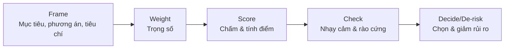

# 🧭 Ra quyết định đa tiêu chí (MCDM)

## Tóm tắt nhanh
- Khi lựa chọn nhiều phương án và nhiều tiêu chí (giá, rủi ro, tốc độ, phù hợp đội…), dùng bảng tiêu chí + trọng số để giảm cảm tính và so sánh công bằng.
- Quy trình 5 bước: **Frame** (khung & tiêu chí) → **Weight** (trọng số) → **Score** (chấm điểm) → **Check** (nhạy cảm & rào cứng) → **Decide/De-risk** (chọn & giảm rủi ro).
- Mẹo: giữ số tiêu chí 4–7; trọng số chuẩn hóa (tổng 100%); chấm điểm thang 1–5 hoặc 1–10; thêm “rào cứng” (must-have) để loại nhanh.

---

## 1) Khi nào dùng MCDM?
- Lựa chọn vendor/giải pháp/công nghệ/sản phẩm cần cân bằng giá–chất lượng–rủi ro–thời gian.
- Ưu tiên backlog/roadmap với nhiều ràng buộc (ảnh hưởng, effort, rủi ro, chiến lược).
- Chọn việc cá nhân có nhiều yếu tố (nhà/xe, lộ trình nghề, thành phố để sống).

## 2) Quy trình 5 bước (đào sâu)
1) **Frame:**
   - Mục tiêu ra quyết định? (giảm chi phí? tăng tốc time-to-market? nâng chất lượng?)
   - Phương án: 2–5 lựa chọn; loại sớm những phương án không khả thi.
   - Tiêu chí 4–7, gắn nhãn **must-have** (rào cứng) vs **nice-to-have** (chấm điểm).
2) **Weight:**
   - Gán trọng số tổng 100%. Mẹo nhanh: 3 mức (Cao 40–60, Trung 20–30, Thấp 10–15) rồi chuẩn hóa.
   - Nếu cần khách quan hơn: so sánh cặp (pairwise) hoặc cho nhóm bỏ phiếu trọng số, sau đó lấy trung bình.
3) **Score:**
   - Thang 1–5 (thô) hoặc 1–10 (chi tiết); nhất quán cùng một thang.
   - Định nghĩa rõ từng mức (ví dụ 1 = kém/không đạt, 3 = đạt tối thiểu, 5 = vượt kỳ vọng).
   - Nhân điểm × trọng số → tính tổng; có thể lưu cả “giải thích điểm” để tránh cảm tính.
4) **Check:**
   - **Nhạy cảm:** đổi ±10–20% trọng số tiêu chí top; xem thứ hạng có đảo không.
   - **Rào cứng:** phương án vi phạm must-have (tuân thủ, bảo mật, ngân sách trần) → loại hoặc thêm phương án giảm rủi ro.
   - **Tail risk:** viết worst-case và biện pháp: pilot nhỏ, SLA/penalty, điều khoản exit.
5) **Decide / De-risk:**
   - Chọn phương án. Nếu sát điểm, ưu tiên phương án linh hoạt/ít lock-in hơn.
   - Đính kèm kế hoạch giảm rủi ro: POC 2 tuần, milestone kiểm tra, điều khoản thanh toán theo mốc, rollback plan.

### Sơ đồ quy trình (mermaid)


## 3) Mẫu bảng chấm nhanh (Markdown)
```
| Phương án | Trọng số | Tiêu chí 1 | Tiêu chí 2 | Tiêu chí 3 | Tổng |
|-----------|----------|------------|------------|------------|------|
| Weight    |   100%   |    40%     |    35%     |    25%     |      |
| A         |          | 4          | 3          | 5          | 4.05 |
| B         |          | 5          | 4          | 3          | 4.10 |
| C         |          | 3          | 5          | 4          | 3.95 |
```
*Điểm tổng = Σ (điểm tiêu chí × trọng số). Thang 1–5 hoặc 1–10; đảm bảo nhất quán thang đo.*

## 4) Mẹo thực dụng
- Tiêu chí phải phân biệt: tránh trùng lặp (ví dụ “chất lượng” và “hiệu quả” mơ hồ).
- Dán nhãn tiêu chí theo loại: *Value* (giá trị), *Cost* (chi phí/effort), *Risk*, *Time*, *Fit* (phù hợp chiến lược/văn hóa).
- Thử chấm nhanh “phiên bản nghịch” (devil’s advocate): giả sử trọng số khác để xem phương án có còn đứng đầu.
- Nếu dữ liệu mù mờ: gán khoảng (min–max), dùng POC/pilot để thu thêm số liệu rồi chấm lại.
- Giới hạn số phương án (≤5) để không loãng.

## 5) Sai lầm thường gặp
- Quá nhiều tiêu chí → loãng trọng số, không quyết được.
- Không có rào cứng (must-have) → chọn phương án điểm cao nhưng phá vỡ điều kiện tối thiểu.
- Trộn thang điểm (có tiêu chí 1–5, có tiêu chí 1–10) → sai lệch.
- Không kiểm tra nhạy cảm → quyết định mong manh, dễ đảo chỉ vì thay đổi nhỏ.

## 6) Biến thể nhanh: ICE / RICE
- **ICE:** Impact × Confidence ÷ Effort. Dùng khi ưu tiên tính năng/ý tưởng nhanh, tiêu chí ít.
- **RICE:** Reach × Impact × Confidence ÷ Effort. Dùng cho product/roadmap có thêm yếu tố độ phủ.
*MCDM tổng quát hơn: cho phép nhiều tiêu chí, trọng số tùy chỉnh, rào cứng, kiểm tra nhạy cảm.*

## 7) Ví dụ áp dụng nhanh
- **Chọn nhà cung cấp cloud:** tiêu chí (chi phí 3 năm TCO, độ tin cậy/SLA, lock-in, hiệu năng vùng, bảo mật/tuân thủ, hỗ trợ VN). Must-have: tuân thủ, region khả dụng. Kết quả: A cao điểm chi phí + SLA nhưng lock-in cao → quyết định chọn A kèm điều khoản exit + kiến trúc hạn chế dịch vụ độc quyền.
- **Ưu tiên tính năng roadmap:** tiêu chí (impact doanh thu, reach, chiến lược, effort, rủi ro kỹ thuật). Dùng trọng số 40/25/15/10/10. Feature X cao impact/reach nhưng rủi ro kỹ thuật; quyết định làm POC 2 tuần trước commit toàn bộ.
- **Chọn thành phố để sống:** tiêu chí (thu nhập/chi phí, cơ hội nghề, chất lượng sống, khí hậu, gia đình/bạn bè). Must-have: an toàn, hạ tầng y tế. Kết quả: City B điểm cao tổng nhưng khí hậu kém; nếu khí hậu là must-have → chọn City A, hoặc thử sống 3 tháng (pilot) trước khi chuyển hẳn.

## 8) Liên kết gợi ý
- **Decision Razors (dao cạo quyết định):** [../decision-making-razors.md](../decision-making-razors.md)
- **Three Levels of Thinking:** [./three-levels-of-thinking.md](./three-levels-of-thinking.md)
- **Flow state (vào dòng chảy làm việc):** [./flow-state.md](./flow-state.md)