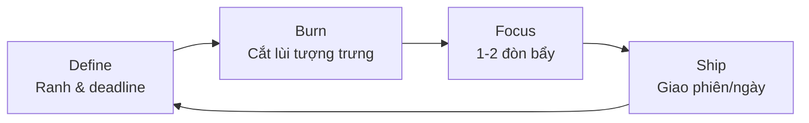

s# 🚀 Khoảnh khắc không còn đường lùi là lúc tiến nhanh nhất

## Tóm tắt nhanh
- “Không còn đường lùi” tạo áp lực tích cực (eustress) → tập trung, cắt nhiễu, hành động dứt khoát.
- Ba điều kiện để hiệu ứng này hữu ích: **(1) Giới hạn rõ**, **(2) Đòn bẩy ngay**, **(3) An toàn tối thiểu** (không liều mạng).
- Khung 4 bước: **Define** (đặt ranh), **Burn** (cắt lùi tượng trưng), **Focus** (1–2 mũi đòn bẩy), **Ship** (giao trong cửa sổ thời gian ngắn).

---

## 1) Vì sao “cắt lùi” lại tăng tốc?
- **Attention squeeze:** ít lựa chọn → giảm tải nhận thức, tập trung tự nhiên.
- **Loss aversion:** sợ mất thúc đẩy hành động hơn mong được thêm (Kahneman/Tversky).
- **Identity lock-in:** cam kết công khai tạo ràng buộc danh tính → nhất quán hành vi.
- **Eustress tối ưu:** áp lực vừa đủ nâng hiệu suất (Yerkes–Dodson), quá mức sẽ gãy.

## 2) Điều kiện an toàn tối thiểu
- Rủi ro kiểm soát được: không đánh cược sinh mạng/tài chính thảm họa.
- Cửa sổ thời gian rõ: ví dụ 3–14 ngày “nước rút”, không phải liều dài hạn.
- Kế hoạch dự phòng nhỏ: buffer 10–20% thời gian/nguồn lực; phương án B nhỏ gọn.

## 3) Khung 4 bước “No Way Back”
1) **Define (đặt ranh):** mục tiêu và ranh không thể lùi (deadline, cam kết công khai, khóa lựa chọn phụ).
2) **Burn (cắt lùi tượng trưng):** gỡ app gây xao lãng, chặn lịch, thông báo với người liên quan.
3) **Focus (chọn mũi đòn bẩy):** 1–2 tác vụ quyết định kết quả (MIT); chuẩn bị nguyên liệu trước.
4) **Ship (giao nhanh):** chia nhỏ theo ngày/phiên; mỗi ngày phải có sản phẩm trung gian.

### Sơ đồ (mermaid)

## 4) Checklist nhanh khi “không còn đường lùi”
- Viết rõ mục tiêu + deadline + tiêu chí hoàn thành.
- Tắt/khóa 3 nguồn nhiễu lớn nhất (app, thông báo, lịch phụ).
- Chọn 1–2 MIT cho 24–72h tới; block lịch làm ngay đầu ngày.
- Mỗi 1–2 ngày phải có deliverable xem/đánh giá được (demo, draft, số đo).
- Daily hạ cánh: ghi 3 dòng (tiến độ, vướng, bước tiếp theo).

## 5) Sai lầm thường gặp
- Biến “không còn đường lùi” thành phá hủy: bỏ hết an toàn tối thiểu (tiền thuê nhà, sức khỏe, quan hệ thiết yếu).
- Chọn mục tiêu mơ hồ → áp lực thành lo âu, không thành hành động.
- Thiếu đòn bẩy: bận rộn việc lặt vặt, không đụng MIT.
- Không có deliverable ngắn hạn → mất feedback, dễ nản.

## 6) Ví dụ áp dụng
- **Launch side project 7 ngày:** Define = ngày demo; Burn = báo với 3 người, gỡ mạng xã hội 1 tuần; Focus = 2 feature cốt lõi; Ship = demo ngày 3/5/7.
- **Ôn phỏng vấn 14 ngày:** Define = lịch phỏng vấn; Burn = khóa giải trí buổi tối; Focus = 2 chủ đề yếu nhất; Ship = 1 mock/day.
- **Giảm cân 21 ngày khởi động:** Define = mục tiêu kg & lịch đo; Burn = dọn đồ ăn rác khỏi nhà; Focus = ăn đủ protein + đi bộ 8–10k bước; Ship = log mỗi ngày.

## 7) Liên kết chéo
- **Resilience (chịu áp & phục hồi):** [./resilience.md](./resilience.md)
- **Three Levels of Thinking (ưu tiên đòn bẩy):** [./three-levels-of-thinking.md](./three-levels-of-thinking.md)
- **Decision-making razors (cắt nhiễu):** [../decision-making-razors.md](../decision-making-razors.md)

## 8) Tài nguyên gợi ý
- Yerkes–Dodson law (áp lực tối ưu & hiệu suất).
- Loss aversion – Kahneman & Tversky.
- Thực hành: Pomodoro, daily demo/draft, public commitment nhỏ (nhóm bạn/đồng nghiệp).