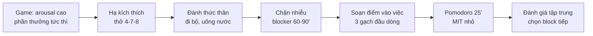

# 🎮 Sau khi chơi game, vì sao khó tập trung làm việc? (và cách xử lý)

## Tóm tắt nhanh
- Game kích thích cao (dopamine, nhịp nhanh) làm não ưu tiên phần thưởng tức thì → khó chuyển sang nhiệm vụ chậm, khô, cần kiên nhẫn.
- Khi dừng game, có “độ trễ trạng thái” (state lag): nhịp kích thích cao, não tìm thêm phần thưởng; đồng thời có mệt tâm trí (mental fatigue) do quyết định liên tục.
- Giải pháp: hạ kích thích + reset thân–tâm ngắn + vào việc bằng block nhỏ (Pomodoro 25’), giảm nhiễu và chuẩn bị đầu vào rõ ràng.

---

## 1) Vì sao chơi game xong khó tập trung?
- **Chênh lệch phần thưởng:** Game cho phản hồi tức thì, nhiệm vụ công việc cho phần thưởng chậm → não so sánh và ưu tiên cái “dễ sướng” hơn.
- **State switching:** Từ arousal cao (căng, nhanh) sang arousal vừa/thấp (làm sâu) cần thời gian hạ nhịp.
- **Decision fatigue:** Trong game vẫn ra quyết định liên tục → sau đó dễ kiệt ý chí cho việc khó.
- **Cạn năng lượng sinh học:** Thiếu ngủ/đói/khát làm tăng impulsivity; game chỉ che phủ tạm cảm giác mệt.
- **Nhiễu tồn dư:** Âm thanh, hình ảnh, mong muốn “thắng tiếp” còn lưu, kéo tay sang mở lại.

## 2) Nghi thức reset 10–15 phút
1) **Hạ kích thích:** tắt màn hình, ra chỗ thoáng; thở 4-7-8 hoặc box breathing 1–2 phút.
2) **Đánh thức thân:** đi bộ/giãn vai 5–10 phút; uống nước (200–300ml); ăn nhẹ nếu đói (protein nhẹ, không đường cao).
3) **Chặn nhiễu:** đóng game/app, tắt thông báo; nếu cần, dùng website blocker 60–90 phút.
4) **Soạn sẵn điểm vào việc:** viết 1–3 gạch đầu dòng: *task cụ thể, trạng thái hiện tại, bước nhỏ tiếp theo*.
5) **Vào block đầu tiên:** chạy Pomodoro 25 phút với 1 MIT nhỏ; sau block, đánh giá mức tập trung (0–10) rồi quyết định block kế tiếp.

### Sơ đồ (mermaid)

## 3) Checklist nhanh
- Tắt game/màn hình, ra khỏi ghế 5–10 phút.
- Thở 1–2 phút (4-7-8). Uống nước 200–300ml.
- Viết 3 gạch: (1) Task, (2) Đang dở, (3) Bước tiếp theo.
- Pomodoro 25’ cho 1 MIT nhỏ. Sau block: chấm mức tập trung 0–10.
- Dùng blocker 60–90’ để không “lỡ tay” mở game/news.

## 4) Sai lầm thường gặp
- Vào việc ngay khi vừa tắt game → não chưa hạ kích thích, dễ mở lại hoặc trôi social.
- Chọn việc quá lớn/ mơ hồ → não từ chối, quay lại phần thưởng tức thì.
- Thiếu năng lượng sinh học (đói/thiếu ngủ) → kỷ luật ngắn hạn sụp.

## 5) Nếu vẫn phải chơi game trong ngày
- Đặt quota rõ (thời lượng, khung giờ) và chơi sau khi đã hoàn thành MIT chính.
- Chơi ở block riêng, không đan xen liên tục.
- Dùng alarm/limiter; sau khi chơi: bắt buộc chạy nghi thức reset 10–15’ trước khi làm việc.

## 6) Liên kết gợi ý
- **Resilience (hồi phục & ổn định):** [./resilience.md](./resilience.md)
- **Nguồn năng lượng nguyên thủy & Sublimation:** [./primal-energy-sublimation.md](./primal-energy-sublimation.md)
- **Không còn đường lùi: khoảnh khắc tăng tốc:** [./no-way-back-momentum.md](./no-way-back-momentum.md)