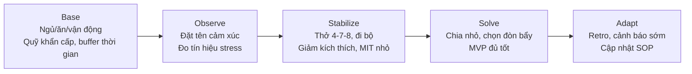

# 🛡️ Resilience (Tinh thần chống chịu)

## Tóm tắt nhanh
- Resilience = khả năng **hấp thụ cú sốc**, **hồi phục** và **thích nghi** tốt hơn sau nghịch cảnh.
- 3 trụ cột: **Thân** (sức khỏe & năng lượng), **Tâm** (cảm xúc & ý nghĩa), **Hệ** (quan hệ & cấu trúc hỗ trợ).
- Công thức thực hành: **BOSSA** – *Base* (nền tảng), *Observe* (quan sát), *Stabilize* (ổn định), *Solve* (giải quyết), *Adapt* (thích nghi).

---

## 1) Khung khái niệm
- **Chống sốc (Absorb):** không sụp khi có biến (kho dự trữ, giảm phụ thuộc).
- **Hồi phục (Recover):** quay lại trạng thái vận hành ổn sau cú sốc (sleep, nghỉ phục hồi, chăm sóc xã hội).
- **Thích nghi (Adapt):** học & điều chỉnh để lần sau chịu đựng tốt hơn (retro, cải tiến hệ thống).
- **Antifragile (vượt resilience):** dùng cú sốc làm chất kích thích tăng trưởng có kiểm soát.

## 2) 3 trụ cột
- **Thân (Body & Energy):** ngủ 7–9h, tập 2–4 buổi/tuần, dinh dưỡng ổn định đường huyết, nhịp sinh học đều đặn.
- **Tâm (Mind & Meaning):** gán nghĩa tích cực/khả dụng, tái cấu trúc nhận thức (CBT), journaling, thực hành chánh niệm/thiền ngắn.
- **Hệ (System & Social):** mạng lưới 3–5 người tin cậy, lịch sinh hoạt ổn, tài chính có quỹ khẩn cấp, backup dữ liệu/kế hoạch.

## 3) Khung BOSSA (5 bước)
1) **Base (Nền tảng):** Ngủ, ăn, vận động, nhịp ngày/tuần cố định. Thiết lập quỹ khẩn cấp (3–6 tháng), buffer thời gian 10–20%/tuần.
2) **Observe (Quan sát):** Đặt tên cảm xúc, đo tín hiệu stress (nhịp tim, giấc ngủ, khó tập trung). Nhật ký 3 dòng: *điều xảy ra – cảm xúc – ý nghĩa đang gán*.
3) **Stabilize (Ổn định nhanh):** Hít thở 4-7-8, đi bộ 10–15 phút, giảm kích thích (news/social), ưu tiên MIT 1–2 việc nhỏ để lấy lại kiểm soát.
4) **Solve (Giải quyết):** Chia nhỏ vấn đề, chọn hành động đòn bẩy, hỏi “điều tối thiểu đủ tốt” (MVP) để giảm tê liệt.
5) **Adapt (Thích nghi):** Retro sau biến cố: *nguyên nhân*, *cảnh báo sớm*, *bước phòng ngừa*, *bước ứng cứu nhanh*. Cập nhật SOP cá nhân/đội.

### Sơ đồ BOSSA (mermaid)

## 4) Checklists thực hành
- **Hằng ngày:**
  - Ngủ đủ, 1–2 phiên Deep Work, 1 phiên vận động/đi bộ, 1 lần journaling ngắn.
  - Kết nối xã hội nhẹ (nhắn 1 người thân/bạn), hạn chế news/scroll vô thức.
- **Hằng tuần:**
  - Weekly review: wins, thất bại, tín hiệu stress, kế hoạch điều chỉnh.
  - Lên lịch vui/khôi phục (hobby, thiên nhiên, thể thao nhẹ).
- **Khi khủng hoảng:**
  - Hạ mục tiêu: chỉ giữ 1–2 MIT sống còn.
  - Giảm input (tin tức, việc mới), giữ nhịp ngủ/ăn, gọi 1 người đáng tin.
  - Ghi nhanh phương án A/B/C; chọn A tối thiểu đủ an toàn.

### Bảng “khi khủng hoảng” (in nhanh)
- **Mục tiêu:** sống còn, không tối ưu.
- **Giữ nhịp:** ngủ/ăn đúng giờ; 1–2 việc sống còn/ngày.
- **Giảm tải:** tắt news/scroll; hạ họp; postpone việc không khẩn.
- **Ổn định thân:** thở 4-7-8, đi bộ 10–15’, uống nước, ăn đủ.
- **Liên lạc:** gọi 1 người tin cậy; nhờ hỗ trợ cụ thể (A/B/C).
- **Kế hoạch A/B/C:** chọn A tối thiểu đủ an toàn; B/C để dự phòng.
- **Thời hạn ngắn:** rà lại mỗi 24h; sau ổn định 72h mới tăng nhịp.

## 5) Công cụ nhanh
- **Breath reset:** 4-7-8 hoặc box breathing 4x4.
- **Grounding 5-4-3-2-1:** 5 thứ thấy, 4 thứ chạm, 3 thứ nghe, 2 thứ ngửi, 1 thứ nếm.
- **If-Then stress rule:** Nếu nhận ra mình bắt đầu doomscroll → đặt điện thoại xuống, đi bộ 5 phút.
- **90% rule:** Nếu không chắc ≥90% mình cần việc này hôm nay, để sau.

## 6) Ví dụ áp dụng
- **Startup founder:** Base = giấc ngủ + tập; Stabilize = cắt họp, giữ 1–2 KPI chính; Solve = shipping nhỏ/tuần; Adapt = postmortem sau mỗi tuần căng.
- **Nhân viên knowledge worker:** Base = time blocking + ăn trưa đúng giờ; Observe = theo dõi giấc ngủ & focus; Solve = ưu tiên 1 deliverable/ngày; Adapt = cập nhật SOP tránh tái stress.
- **Cá nhân gặp biến cố cá nhân:** Stabilize = chăm sóc thân, liên lạc 1–2 người tin; Solve = xử lý thủ tục tối thiểu; Adapt = kế hoạch tài chính/pháp lý dự phòng.

## 7) Tín hiệu sức khỏe resilience
- Ngủ: thời lượng và chất lượng không suy giảm kéo dài.
- Nhịp: vẫn duy trì được tối thiểu 1–2 thói quen cốt lõi khi có biến.
- Cảm xúc: có thể đặt tên cảm xúc, không bị cuốn hoàn toàn; hồi phục trong ngày/tuần.
- Hệ thống: tài chính có buffer, dữ liệu có backup, công việc có SOP thay thế tạm.

## 8) Tài nguyên gợi ý
- Sách: *Option B* (Sheryl Sandberg), *Antifragile* (Nassim Taleb), *The Body Keeps the Score* (Bessel van der Kolk).
- Thực hành: Body scan 5 phút, Journaling 3 dòng, Weekly review 30 phút.

---

Liên kết chéo:
- **Self-mastery:** [./self-mastery.md](./self-mastery.md)
- **Defense & Manipulation (cơ chế phòng vệ):** [./defense-mechanisms.md](./defense-mechanisms.md)