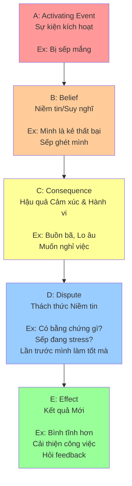

# 💡 CBT: Liệu pháp Nhận thức Hành vi

> [← Back to Psychology](../../../README.md)

**Cognitive Behavioral Therapy (CBT)** là phương pháp trị liệu tâm lý phổ biến và hiệu quả nhất hiện nay.

---

## 1. Nguyên lý Cốt lõi
*   Không phải sự việc (Event) làm ta đau khổ.
*   Mà là **cách ta suy nghĩ (Belief)** về sự việc đó làm ta đau khổ.

### **Mô hình ABC(DE):**



**Phiên bản ASCII (cho terminal/text editor):**
```
┌─────────────────────────┐
│  A: Activating Event    │
│  (Sự kiện kích hoạt)    │
│  Ex: Bị sếp mắng        │
└───────────┬─────────────┘
            │
            ↓
┌─────────────────────────┐
│  B: Belief              │
│  (Niềm tin/Suy nghĩ)    │
│  Ex: "Mình thất bại"    │
│      "Sếp ghét mình"    │
└───────────┬─────────────┘
            │
            ↓
┌─────────────────────────┐
│  C: Consequence         │
│  (Hậu quả)              │
│  Ex: Buồn, lo âu        │
│      Muốn nghỉ việc     │
└───────────┬─────────────┘
            │
            ↓
┌─────────────────────────┐
│  D: Dispute             │
│  (Thách thức)           │
│  Ex: Có bằng chứng?     │
│      Sếp đang stress?   │
└───────────┬─────────────┘
            │
            ↓
┌─────────────────────────┐
│  E: Effect              │
│  (Kết quả mới)          │
│  Ex: Bình tĩnh          │
│      Cải thiện việc     │
└─────────────────────────┘
```

**→ Muốn đổi C (Consequence), phải đổi B (Belief).**

## 2. Cognitive Distortions (Lỗi tư duy thường gặp)
Người trầm cảm/lo âu thường mắc các lỗi này:
1.  **All-or-Nothing (Tư duy trắng đen):** "Nếu không hoàn hảo thì là thất bại".
2.  **Catastrophizing (Thảm họa hóa):** Luôn nghĩ đến kịch bản xấu nhất ("Đau bụng -> Chắc là ung thư").
3.  **Personalization (Cá nhân hóa):** "Sếp cau mày chắc là do mình làm sai gì đó" (thực ra sếp đau bụng).
4.  **Emotional Reasoning:** "Tôi cảm thấy sợ, nên chắc chắn là có nguy hiểm".

## 3. Cách thực hành CBT
1.  **Nhận diện:** Bắt lấy suy nghĩ tiêu cực tự động ("Mình thật ngu ngốc").
2.  **Tranh luận:** Tìm bằng chứng phản bác ("Có thật là mình ngu không? Lần trước mình làm tốt mà. Sếp mắng vì dự án gấp thôi").
3.  **Thay thế:** Bằng suy nghĩ thực tế hơn ("Mình mắc lỗi này, nhưng mình có thể sửa. Sếp đang căng thẳng, không phải ghét mình").

## 4. Ứng dụng
*   Trị liệu trầm cảm, rối loạn lo âu, ám ảnh cưỡng chế (OCD).
*   Giúp người bình thường quản lý stress và tư duy tích cực hơn (Stoicism hiện đại).
