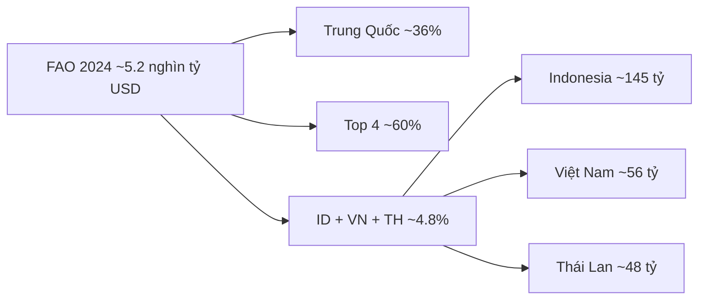

# Khái quát sản lượng nông nghiệp thế giới và Đông Nam Á

> [← Finance hub](../README.md) · [Commodity supercycles](./commodity-supercycles.md) · [Ngành NN VN](../../investing/vietnam-market/industry-analysis/agriculture-industry.md)

<!-- agent-summary -->
**Agent SUMMARY**
- Năm 2024, nông nghiệp toàn cầu tạo khoảng **5,2 nghìn tỷ USD** giá trị sản xuất (FAO).
- **Trung Quốc ~1,9 nghìn tỷ USD (~36%)** — lớn hơn Ấn Độ + Hoa Kỳ + Brazil cộng lại; **top 4 ~60%** giá trị toàn cầu.
- Bốn mô hình: hệ thống lương thực khổng lồ (TQ, Ấn Độ) · năng suất + công nghệ (Hoa Kỳ) · agribusiness xuất khẩu (Brazil).
- Nông nghiệp dùng khoảng **một nửa đất có thể sinh sống**; vai trò an ninh lương thực, thương mại, việc làm nông thôn.
- Đông Nam Á có 3 nước trong nhóm lớn nhất: **Indonesia ~145 tỷ** (hạng 5), **Việt Nam ~56 tỷ**, **Thái Lan ~48 tỷ**.
- Không bịa số liệu ngoài bài; đối chiếu FAOSTAT trước khi dùng cho đầu tư. Educational, not investment advice.
<!-- /agent-summary -->

Nông nghiệp toàn cầu tạo ra khoảng **5,2 nghìn tỷ USD** giá trị sản xuất trong năm 2024, đưa lĩnh vực này thành một trong những ngành kinh tế lớn nhất và có tầm quan trọng chiến lược hàng đầu thế giới.

**Nguồn số liệu:** Tổ chức Lương thực và Nông nghiệp Liên Hợp Quốc (FAO). Các mức USD dưới đây là **giá trị sản xuất** (không phải kim ngạch xuất khẩu, không phải đóng góp GDP). Đối chiếu [FAOSTAT](https://www.fao.org/faostat/) trước khi dùng cho quyết định đầu tư hay chính sách.

## 1. Bức tranh tập trung toàn cầu

| | Giá trị sản xuất (2024) | Ghi chú |
| --- | ---: | --- |
| Thế giới | ~5,2 nghìn tỷ USD | Toàn ngành nông nghiệp |
| Trung Quốc | ~1,9 nghìn tỷ USD | ~36% toàn cầu; lớn hơn Ấn Độ + Hoa Kỳ + Brazil cộng lại |
| Top 4 quốc gia | ~60% toàn cầu | Trung Quốc, Ấn Độ, Hoa Kỳ, Brazil |
| Indonesia | ~145 tỷ USD | Hạng 5 thế giới |
| Việt Nam | ~56 tỷ USD | Lúa gạo, cà phê, hồ tiêu, điều, rau quả, chăn nuôi |
| Thái Lan | ~48 tỷ USD | Gạo, cao su, mía đường, sắn, trái cây nhiệt đới |

Từ các số trên (làm tròn):

- Trung Quốc ≈ **36%** giá trị thế giới (1,9 / 5,2).
- Indonesia + Việt Nam + Thái Lan ≈ **249 tỷ USD**, khoảng **4,8%** giá trị toàn cầu.
- Việt Nam ≈ **1,1%** giá trị sản xuất nông nghiệp thế giới — nhỏ về quy mô tuyệt đối, lớn về một số mặt hàng nhiệt đới xuất khẩu.

Sự tập trung này không phải ngẫu nhiên: đất đai, dân số, khí hậu và mô hình tổ chức sản xuất khác nhau tạo ra các “cách xây sức mạnh nông nghiệp” khác nhau.

## 2. Bốn mô hình tạo sức mạnh nông nghiệp

| Mô hình | Quốc gia điển hình | Đặc trưng |
| --- | --- | --- |
| Hệ thống lương thực – thực phẩm nội địa khổng lồ | Trung Quốc, Ấn Độ | Phục vụ gần **ba tỷ người**; ưu tiên đủ ăn, đa dạng nội địa, ổn định chính trị |
| Quy mô + năng suất + công nghệ | Hoa Kỳ | Trang trại lớn, cơ giới, giống, logistics; vừa nuôi nội địa vừa xuất khẩu |
| Agribusiness định hướng xuất khẩu | Brazil | Cạnh tranh trên thị trường thế giới (đậu tương, thịt, đường, cà phê…) |
| Nhiệt đới + xuất khẩu chuyên biệt | Indonesia, Việt Nam, Thái Lan | Dầu cọ, gạo, cà phê, cao su, hồ tiêu, điều, trái cây, đường, sắn |

Trung Quốc dẫn đầu không chỉ vì “nhiều đất”: quy mô nền nông nghiệp nước này còn **lớn hơn tổng** Ấn Độ, Hoa Kỳ và Brazil. Bốn nước lớn nhất đóng góp gần **60%** giá trị toàn cầu — phần còn lại của thế giới chia sẻ khoảng 40%.

## 3. Nông nghiệp lớn hơn con số sản xuất

Tầm quan trọng của ngành **vượt** giá trị sản xuất thuần túy:

- Dùng khoảng **một nửa diện tích đất có thể sinh sống** của thế giới.
- **An ninh lương thực:** giá lương thực lan vào lạm phát, bất ổn xã hội, chính sách xuất khẩu (cấm xuất, hạn ngạch).
- **Thương mại toàn cầu:** nông sản nhiệt đới và ngũ cốc là hàng hóa chiến lược, nhạy cảm thời tiết và địa chính trị.
- **Việc làm nông thôn và ổn định kinh tế:** tỷ trọng GDP có thể nhỏ ở nước công nghiệp, nhưng tỷ trọng lao động và địa bàn vẫn lớn.

Đọc thêm khung chu kỳ hàng hóa (nông sản, phân bón, El Niño): [`commodity-supercycles.md`](./commodity-supercycles.md). Chuỗi cung ứng / địa chính trị: [`geopolitics-supply-chain.md`](./geopolitics-supply-chain.md), [`political-economy.md`](../../../04-lifestyle-os/politics/geopolitics/political-economy.md).

## 4. Đông Nam Á trong nhóm nông nghiệp lớn nhất thế giới

Đáng chú ý, Đông Nam Á có **ba đại diện** trong nhóm những nền nông nghiệp lớn nhất thế giới.

### Indonesia (~145 tỷ USD, hạng 5 toàn cầu)

Dựa trên quy mô đất đai rộng và thế mạnh **dầu cọ, cao su, lúa gạo** cùng cây trồng nhiệt đới. Đây là “neo” quy mô của khu vực: một mình Indonesia đã lớn hơn Việt Nam và Thái Lan cộng lại trên thước đo giá trị sản xuất.

### Việt Nam (~56 tỷ USD)

Nổi bật **lúa gạo, cà phê, hồ tiêu, điều, rau quả và chăn nuôi**. Quy mô nhỏ hơn Indonesia, nhưng cơ cấu lệch về mặt hàng xuất khẩu có thương hiệu toàn cầu (cà phê, hồ tiêu, điều, gạo, trái cây).

Góc cổ phiếu / chuỗi 3F trong nước: [`agriculture-industry.md`](../../investing/vietnam-market/industry-analysis/agriculture-industry.md) · thủy sản: [`seafood-industry.md`](../../investing/vietnam-market/industry-analysis/seafood-industry.md) · phân bón đầu vào: [`fertilizer-industry.md`](../../investing/vietnam-market/industry-analysis/fertilizer-industry.md).

### Thái Lan (~48 tỷ USD)

Thế mạnh **gạo, cao su, mía đường, sắn và trái cây nhiệt đới**. Cạnh tranh trực tiếp với Việt Nam trên gạo và trái cây; bổ sung cho Indonesia trên cao su và cây công nghiệp.

### Ý nghĩa khu vực

Ba nước này cho thấy Đông Nam Á không chỉ là vùng **sản xuất lương thực** quan trọng mà còn là một trong những **trung tâm cung ứng nông sản nhiệt đới và xuất khẩu thực phẩm** hàng đầu thế giới. Cạnh tranh nội khối (gạo, trái cây, cao su) đi cùng phụ thuộc chung vào thời tiết, Trung Quốc (cầu nhập khẩu) và logistics biển.

## 5. Cách dùng bài này

| Câu hỏi | Đi tiếp |
| --- | --- |
| Chu kỳ giá nông sản / phân bón / khí hậu? | [`commodity-supercycles.md`](./commodity-supercycles.md) |
| Đầu tư ngành NN–chăn nuôi VN? | [`agriculture-industry.md`](../../investing/vietnam-market/industry-analysis/agriculture-industry.md) |
| Cao su, đường, thủy sản VN? | rubber / sugar / seafood trong [Vietnam industry library](../../investing/vietnam-market/README.md) |
| Nông nghiệp như công cụ quyền lực / thương mại? | [`political-economy.md`](../../../04-lifestyle-os/politics/geopolitics/political-economy.md) |

**Không suy ra:** thứ hạng xuất khẩu, lợi nhuận doanh nghiệp, hay “nên mua mã nào” từ bảng giá trị sản xuất FAO.

## Nguồn

- Tổ chức Lương thực và Nông nghiệp Liên Hợp Quốc (FAO), giá trị sản xuất nông nghiệp năm **2024** (tổng hợp trong bài).
- Tra cứu gốc: [FAOSTAT](https://www.fao.org/faostat/).
