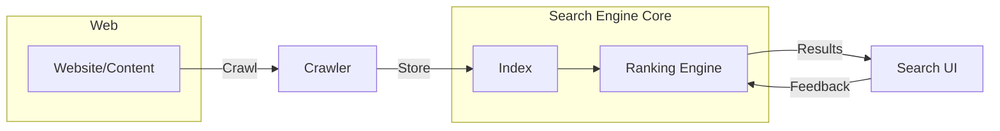

# 🔍 Search Engine 101 – Hiểu sâu để làm chủ SEO & Search

> [← Back to Traffic Mastery](./traffic-mastery.md) | [MMO Roadmap](../../../README.md) | [Home](../../../../README.md)
>
> **Difficulty:** 🟡 Intermediate → 🔴 Advanced
>
> **Prerequisites:** Hiểu cơ bản về web/SEO, copywriting và analytics
>
> **Time to Master:** 3-6 tháng (lý thuyết) + 6-12 tháng vận hành thực tế
>
> **🔗 Curated Links:** [resources/collected_links/web-dev.md](../../../../resources/collected_links/web-dev.md)

---

## 1. Tổng quan Search Engine – Vì sao phải hiểu kỹ?

Search Engine (máy tìm kiếm) là hệ thống thu thập dữ liệu web, lập chỉ mục (index) và trả về kết quả phù hợp nhất với truy vấn (query) của người dùng. Trong MMO/SEO, hiểu cơ chế này giúp bạn:

| Lợi ích | Ý nghĩa | Ví dụ |
| --- | --- | --- |
| Dự đoán hành vi Google | Biết khi nào nội dung lên top, khi nào bị tụt | Cập nhật Core Update → điều chỉnh nội dung |
| Tối ưu doanh thu | Nhắm đúng search intent mang lại conversion cao | Bài “so sánh hosting” mang lại hoa hồng cao hơn “hosting là gì” |
| Xây hệ thống bền vững | Traffic không phụ thuộc ads trả phí | Authority site, niche site |

**Các loại Search Engine phổ biến**:
1. **Web Search:** Google, Bing, Baidu – phục vụ người dùng phổ thông.
2. **Vertical Search:** Amazon (sản phẩm), YouTube (video), Booking (du lịch).
3. **Enterprise Search:** Tìm kiếm nội bộ doanh nghiệp (Elastic, Coveo).
4. **AI/LLM Search:** Perplexity, Google SGE – kết hợp LLM + web index.

---

## 2. Kiến trúc Search Engine – 3 lớp chính

### 2.1 Crawling (Thu thập dữ liệu)
- **Crawler/Bot (Googlebot):** đi theo link, đọc sitemap.xml, tôn trọng robots.txt.
- **Budget Crawl:** Google phân bổ tài nguyên cho mỗi site → site tải chậm hoặc nhiều URL trùng lặp sẽ bị crawl ít.
- **Best practices:**
  - Cấu trúc URL rõ ràng, tránh ghi vô hạn (?page=999)
  - Sử dụng sitemap.xml và cập nhật khi có bài mới
  - Dùng `robots.txt` chặn những phần không muốn index (admin, search result page)

### 2.2 Indexing (Lập chỉ mục)
- **Inverted Index:** Lưu mapping từ từ khóa → danh sách tài liệu.
- **Document Store:** Lưu metadata (tiêu đề, mô tả, schema, vector embedding).
- **Canonicalization:** Google chọn URL “chính” để tránh duplicate content.
- **Structured Data:** Schema.org, JSON-LD giúp bot hiểu ngữ nghĩa (FAQ, Product, Article).

### 2.3 Ranking (Xếp hạng)
- **Scoring Engine:** Tính điểm dựa trên 200+ signals: nội dung, backlink, UX.
- **Query Understanding:** Xác định loại intent (Informational, Navigational, Transactional, Commercial Investigation).
- **Personalization & Context:** Vị trí địa lý, lịch sử tìm kiếm.

---

## 3. Thuật toán xếp hạng quan trọng

| Thuật toán / Signal | Mục đích | Tác động tới SEO |
| --- | --- | --- |
| **PageRank** | Đánh giá uy tín thông qua backlink | Authority quan trọng ở chủ đề có cạnh tranh |
| **Panda** | Phạt nội dung mỏng, farm | Tránh duplicate/thin content |
| **Penguin** | Chống spam backlink | Xây dựng backlink tự nhiên, đa dạng |
| **Hummingbird** | Hiểu ngữ nghĩa truy vấn | Content phải giải đáp toàn diện câu hỏi |
| **RankBrain** | Machine learning đo CTR, dwell time | Tối ưu tiêu đề, UX để giữ người dùng |
| **BERT / MUM / SGE** | Hiểu ngôn ngữ tự nhiên, đa modal | Nội dung sâu, cấu trúc rõ, dữ liệu hỗ trợ |

Ngoài ra còn có Core Web Vitals (LCP/CLS/FID), Helpful Content Update, SpamBrain.

---

## 4. Chiến lược tối ưu Search Engine (SEO 360º)

### 4.1 Technical SEO
- **Performance:** PageSpeed, Core Web Vitals → ưu tiên tối ưu ảnh, lazy load.
- **Architecture:** Silo/Topic Cluster giúp bot hiểu chủ đề.
- **Schema Markup:** Rich snippets tăng CTR.
- **Log Analysis:** Kiểm tra bot crawl trang nào, status code 4xx/5xx.

### 4.2 Content SEO
- **Search Intent Mapping:** Xác định mục tiêu người dùng theo funnel (TOFU-MOFU-BOFU).
- **Content Depth:** Bài pillar (3k-5k chữ) + cluster bài hỗ trợ.
- **EEAT (Experience, Expertise, Authority, Trust):** About page, tác giả, nguồn.

### 4.3 Off-page & Authority Building
- **Digital PR:** Xuất hiện trên báo lớn, podcast.
- **Topical Authority:** Cover đầy đủ topic tree, internal link chặt chẽ.
- **Community Signals:** Brand mentions, social proof.

### 4.4 Measurement & Feedback
- **Search Console:** Impression/CTR/Position, xử lý coverage issue.
- **Analytics:** Segment traffic theo intent, đo conversion.
- **A/B Testing (Title, schema, UX):** Dùng Google Optimize, VWO.

---

## 5. Xây dựng Search Engine nội bộ (Site Search / Product Search)

| Thành phần | Công nghệ phổ biến | Lưu ý |
| --- | --- | --- |
| **Crawl/Ingest** | Logstash, Scrapy, custom ETL | Chuẩn hóa dữ liệu, loại bỏ trùng lặp |
| **Index** | Elasticsearch, OpenSearch, Vespa | Chọn analyzer phù hợp ngôn ngữ |
| **Vector Store** | Pinecone, Weaviate, Qdrant | Phục vụ semantic search, RAG |
| **Ranking** | BM25, Learning-to-Rank (XGBoost, LightGBM) | Cần dữ liệu click/feedback |
| **UI/API** | Next.js, React, API Gateway | Tối ưu autocomplete, typo tolerance |

**Pattern phổ biến:** Hybrid search (keyword BM25 + vector search) giúp vừa chính xác từ khóa vừa hiểu ngữ nghĩa.

---

## 6. Xu hướng Search Engine mới
1. **AI Search & Answer Engine:** Perplexity, ChatGPT Search – tổng hợp thông tin bằng LLM.
2. **RAG (Retrieval-Augmented Generation):** Kết hợp search + LLM để trả lời dựa trên nguồn dữ liệu riêng.
3. **Generative Experiences (SGE):** Google hiển thị summary AI → nội dung cần structured data và trích dẫn rõ.
4. **Privacy-first Search:** DuckDuckGo, Kagi – nhấn mạnh dữ liệu người dùng không bị theo dõi.
5. **Multimodal Search:** Tìm kiếm bằng hình ảnh/giọng nói (Google Lens, Bing Visual Search).

---

## 7. Checklist triển khai Search/SEO

| Giai đoạn | Checklist chính | Tool hỗ trợ |
| --- | --- | --- |
| **Discovery** | Audit site, audit đối thủ, map search intent | Ahrefs, Semrush, Screaming Frog |
| **Build** | Topic cluster, content brief, technical fix | Notion, SurferSEO, Webflow/WordPress |
| **Launch** | Schema, submit sitemap, tracking event | Google Search Console, Tag Manager |
| **Optimize** | Monitor ranking, refresh content, link earning | GSC API, Looker Studio, HARO |
| **Scale** | Internal search, RAG chatbot, multi-language | Elasticsearch, Pinecone, Lokalise |

---

## 8. Tài nguyên & Liên kết chéo
- 🧭 **Traffic Mastery:** [guides/02-wealth-business/mmo-roadmap/foundations/traffic-mastery.md](./traffic-mastery.md)
- 📚 **SEO resources curated:** [resources/collected_links/web-dev.md](../../../../resources/collected_links/web-dev.md)
- 🛠️ **Backend search stack:** [domains/backend-dev/system-design/search-service.md] *(nếu có / cần tạo thêm)*
- 🎯 **MMO Roadmap:** [guides/02-wealth-business/mmo-roadmap/README.md](../../../README.md)

---

> **Last Updated:** March 2026