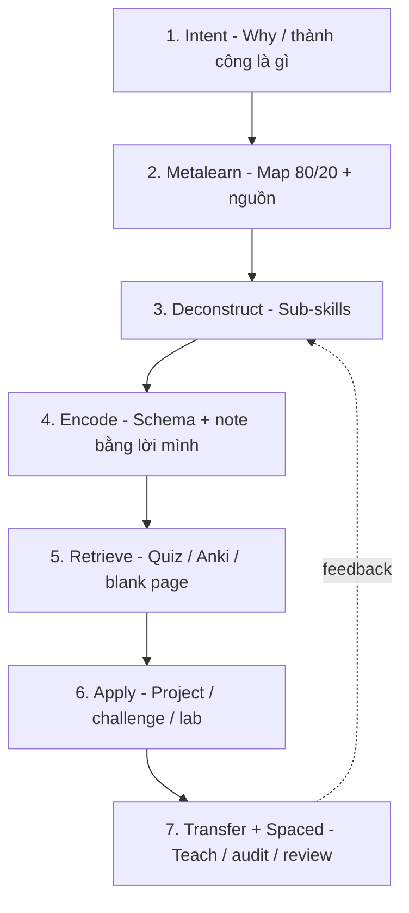

# 🎓 Learning OS Framework — Học bất kỳ kiến thức nào một cách có hệ thống

> [← Meta Skills Hub](./README.md) | [Chapter 2: Deliberate Practice](../../../../chapters/02-luyen-tap-co-chu-dich.md) | [Personal data](../../../../personal/README.md)
>
> **Vai trò:** Framework vận hành (operating system) — các bài Feynman / Ultralearning / PKM là **module**.  
> **Last Updated:** August 2026

<!-- agent-summary -->
**Agent SUMMARY** (read this first; jump to `##` needed):
- Canonical for “how do I learn X fast/systematically?” — pipeline, not one-off tips.
- 7 layers: Intent → Metalearn → Deconstruct → Encode → Retrieve → Apply/Teach → Spaced review.
- §2 Topic Attack (~90′) = default tactical protocol; §7 = 1-page checklist; §10 = start in 24h.
- Use with repo: domains/challenges + `templates/personal/learning-session.md`; log deep work in `personal/daily/` if asked.
- Modules: learning-how-to-learn, meta-learning, Chapter 2 deliberate practice.
<!-- /agent-summary -->

Bạn không cần “bộ não đặc biệt”. Bạn cần **pipeline lặp lại được** cho mọi domain: chọn → phân rã → encode → retrieve → apply → teach → spaced review.

> Mục tiêu thực tế: nắm **nhanh + dùng được** (competent), không phải ảo tưởng master mọi thứ trong 1 tuần. Competence có thể rất nhanh; mastery vẫn cần deliberate practice dài.

---

## 0. Khoa học hiện đại đằng sau (ngắn)

| Nguyên lý | Ý chính | Đừng làm |
| --- | --- | --- |
| **Retrieval practice** | Gọi kiến thức ra > đọc lại | Highlight / re-read thụ động |
| **Spaced repetition** | Ôn đúng điểm quên | Cram 1 đêm |
| **Desirable difficulties** | Học hơi khó = nhớ lâu hơn | Chỉ làm bài quá dễ |
| **Interleaving** | Xen thể loại bài | Block AAAA rồi BBBB mãi |
| **Generation / elaboration** | Tự giải thích, tự tạo ví dụ | Chỉ copy note |
| **Dual coding** | Chữ + sơ đồ | Chỉ tường chữ hoặc chỉ meme |
| **Direct practice** | Luyện gần tình huống thật | Tutorial hell không output |
| **Deliberate practice** | Mục tiêu hẹp + feedback ngay | “Ngồi 10.000 giờ” mơ hồ |
| **Metalearning** | 10% thời gian map *cách học môn đó* | Nhảy vào Udemy ngay |
| **AI as tutor** | Socratic quiz, Feynman partner | Để AI viết hết rồi tưởng mình biết |

Chi tiết từng kỹ thuật: [learning-how-to-learn.md](./learning-how-to-learn.md) · [meta-learning.md](./meta-learning.md) · [Chapter 2](../../../../chapters/02-luyen-tap-co-chu-dich.md)

---

## 1. Learning OS = 7 layer



| Layer | Câu hỏi | Output bắt buộc |
| ---: | --- | --- |
| 1 Intent | Học để *làm được gì* trong bao lâu? | 1 câu Definition of Done |
| 2 Metalearn | Nguồn tốt nhất? Lộ trình 80/20? | ½–1 trang map |
| 3 Deconstruct | 3–7 sub-skill? Đâu là bottleneck? | Checklist sub-skills |
| 4 Encode | Giải thích được bằng lời mình? | Note PKM / trang Docs |
| 5 Retrieve | Tự hỏi / flashcard / blank page? | ≥5 câu self-test / buổi |
| 6 Apply | Demo / PR / lab / challenge? | Artifact chạy được |
| 7 Transfer | Dạy / audit / spaced review? | Feynman 1 trang + lịch ôn |

---

## 2. Protocol tấn công mọi chủ đề (Topic Attack — 90 phút mẫu)

Dùng cho **bất kỳ** kiến thức: System Design, hormone, React, tiếng Anh…

### Phút 0–10 — Intent + Metalearn
1. Viết 1 dòng: *Sau khi học, tôi sẽ _____* (demo cụ thể).  
2. Tìm **1 nguồn chính** (doc trong repo / sách / paper / course) — không mở 10 tab.  
3. Liệt kê **top 5 idea** môn này thường có (giả thuyết 80/20).

### Phút 10–35 — Encode (Focused)
4. Đọc/active watch với mục tiêu tìm câu trả lời cho 5 idea.  
5. **Đóng nguồn**, viết lại bằng lời mình (Feynman nháp).  
6. Vẽ 1 sơ đồ (dual coding) hoặc bảng so sánh.

### Phút 35–40 — Diffuse reset
7. Đứng dậy / nước / không SNS (Focused ↔ Diffuse).

### Phút 40–70 — Retrieve + Apply
8. Blank page: viết lại từ nhớ.  
9. Làm **1 bài nhỏ** gần đời thật (lab, leetcode nhỏ, case, challenge repo).  
10. Sai chỗ nào → mở nguồn **chỉ** chỗ đó.

### Phút 70–90 — Card + Schedule
11. Tạo 5–15 flashcards (Anki) hoặc câu hỏi trong daily note.  
12. Đặt ôn: +1 ngày, +3 ngày, +7 ngày.  
13. 3 dòng retro: hiệu quả / phí / đổi protocol.

**Template sẵn:** [learning-project-canvas.md](../../../../templates/productivity/learning-project-canvas.md) · [learning-plan.md](../../../../templates/productivity/learning-plan.md)

---

## 3. Bloom ladder — biết mình đang ở tầng nào

Đừng ngủ ở tầng nhớ thuật ngữ.

| Tầng | Prove bằng |
| --- | --- |
| Remember | Thuật ngữ / công thức |
| Understand | Feynman cho người ngoài ngành |
| Apply | Làm bài / lab có đáp án hành vi |
| Analyze | So sánh trade-off A vs B |
| Evaluate | Chọn phương án + lý do trong constraint |
| Create | Build artifact mới / design từ trống |

Rule: **mỗi tuần leo ≥1 tầng** trên chủ đề đang học. Ví dụ học hormone: Understand map → Apply checklist hàng ngày → Analyze khi sleep thiếu thì hormone nào lệch.

---

## 4. Vận hành với repo Docs của bạn

| Việc học | Đặt vào |
| --- | --- |
| Lý thuyết domain | `domains/<x>/` — đọc README → module |
| Drill | `challenges/<x>/` |
| Soft skill / career | `guides/03-career-skills/` |
| Life / hormone | `guides/04-lifestyle-os/` + track `personal/` |
| Note tổng hợp cá nhân | PKM / hoặc trang trong domain nếu reusable |
| Session học hàng ngày | `personal/daily/` (deep work blocks + “What I learned”) |
| Dự án học 2–4 tuần | Canvas template + milestone trong daily/weekly |

### Loop chuẩn trong repo
```
QUICK-START / domain README
    → 1 module theory
    → challenge hoặc lab
    → Feynman note (Docs hoặc PKM)
    → Anki cards
    → personal daily: deep work h + win
    → knowledge audit (nếu có) sau 2–4 tuần
```

---

## 5. AI-native learning (2025–2026) — dùng đúng

**Dùng AI để:**
- Socratic: “Đừng cho đáp án — hỏi mình 5 câu kiểm tra”
- Feynman partner: “Chỉ ra chỗ giải thích mập mờ”
- Interleave quiz: trộn 3 chủ đề đã học tuần này
- Rubric: chấm lab theo acceptance criteria

**Không dùng AI để:**
- Viết Feynman hộ rồi skip đọc
- Generate flashcard không review
- Code lab 100% rồi commit như thể bạn hiểu

Prompt mẫu:
> Tôi đang học `<topic>`. Mục tiêu: `<DoD>`. Hãy hỏi tôi từng câu một; chỉ gợi ý khi tôi sai 2 lần; cuối buổi liệt kê 3 lỗ hổng.

Chi tiết: [working-with-ai.md](./working-with-ai.md)

---

## 6. Lịch tuần Learning OS (mặc định)

| Ngày | Focus |
| --- | --- |
| T2–T6 | 1–2 Topic Attack 60–90′ (layer 4–6) |
| Hàng ngày 10′ | Anki / blank page (layer 5+7) |
| 1 buổi/tuần | Project/challenge dài (layer 6) |
| Chủ nhật 45–60′ | Weekly learning review (dưới đây) |

### Weekly Learning Review
- [ ] Sub-skill nào đã lên tầng Bloom?  
- [ ] Artifact nào ship được tuần này?  
- [ ] Card Anki nào fail rate cao → rewrite  
- [ ] Tutorial hell? (giờ consume > giờ produce → cắt intake)  
- [ ] Chủ đề tuần sau chỉ **1** (hoặc 1 chính + 1 phụ nhẹ)

Ghi vào [`personal/weekly/`](../../../../personal/weekly/) hoặc [weekly-review.md](../../../../templates/weekly-review.md).

---

## 7. Checklist 1 trang — in / pin

### Trước khi học (2′)
`[ ] DoD 1 câu   [ ] 1 nguồn chính   [ ] Điện thoại xa / SNS block`

### Trong phiên (Topic Attack)
`[ ] Encode lời mình   [ ] Sơ đồ   [ ] Blank page   [ ] 1 bài apply   [ ] 5–15 cards]`

### Sau phiên (5′)
`[ ] Retro 3 dòng   [ ] Schedule ôn D+1/D+3/D+7   [ ] Link note vào hub]`

### Cờ đỏ (đang học sai)
- [ ] >2h chỉ xem không produce  
- [ ] Note copy-paste > 50%  
- [ ] Không có self-test  
- [ ] Không có artifact sau 1 tuần  

---

## 8. Ví dụ: áp dụng Learning OS lên 2 domain khác nhau

### A. Học System Design (kỹ thuật)
1. **DoD:** 45′ whiteboard URL shortener đạt checklist interview.  
2. **Metalearn:** `domains/system-design/README` + challenge URL shortener.  
3. **Encode:** tự vẽ pipeline.  
4. **Retrieve:** đóng doc, viết lại requirements → API → DB → scale.  
5. **Apply:** [challenge-design-url-shortener](../../../../challenges/system-design/challenge-design-url-shortener.md).  
6. **Transfer:** giải thích cho AI/bạn; Anki trade-off CAP/cache.

### B. Học Hormone (đời sống)
1. **DoD:** 7 ngày chạy Master Daily Stack + giải thích Cortisol vs Melatonin.  
2. **Metalearn:** [endocrine-hormone-map](../../../04-lifestyle-os/health/endocrine-hormone-map.md) → [control playbook](../../../04-lifestyle-os/health/endocrine-control-playbook.md).  
3. **Encode:** Feynman 1 trang.  
4. **Apply:** track `personal/` sleep/mood/nutrition.  
5. **Retrieve:** mỗi sáng hỏi “hôm nay kéo hormone nào bằng hành động nào?”.

Cùng OS — khác artifact.

---

## 9. Module liên quan (đọc theo nhu cầu)

| Nhu cầu | Doc |
| --- | --- |
| Kỹ thuật học cốt lõi | [learning-how-to-learn.md](./learning-how-to-learn.md) |
| Ultralearning roadmap | [meta-learning.md](./meta-learning.md) |
| Nghệ thuật học (Waitzkin) | [the-art-of-learning.md](./the-art-of-learning.md) |
| Second brain / PKM | [personal-knowledge-base.md](./personal-knowledge-base.md) · [pkm-system.md](./pkm-system.md) |
| Quản lý study project | [study-project-management.md](./study-project-management.md) |
| Sprint 30 ngày meta-skill | [meta-skill-sprint-30-days.md](./meta-skill-sprint-30-days.md) |
| Deep work thời gian | [Chapter 6](../../../../chapters/06-quan-ly-thoi-gian.md) |
| Dopamine / focus sinh học | [dopamine-system.md](../../../04-lifestyle-os/health/dopamine-system.md) |

---

## 10. Bắt đầu trong 24 giờ

1. Chọn **1** chủ đề (đừng 5).  
2. Điền [Learning Project Canvas](../../../../templates/productivity/learning-project-canvas.md) (10′).  
3. Chạy **một** Topic Attack 90′ (mục 2).  
4. Ghi deep work + win vào `personal/daily/`.  
5. Đặt ôn D+1 trên lịch / Anki.

> Learning OS không thay thế giờ luyện — nó **xoá waste**: passive reading, tutorial hell, note chết. Học nhanh = feedback nhanh + retrieval nhiều + apply sớm.
