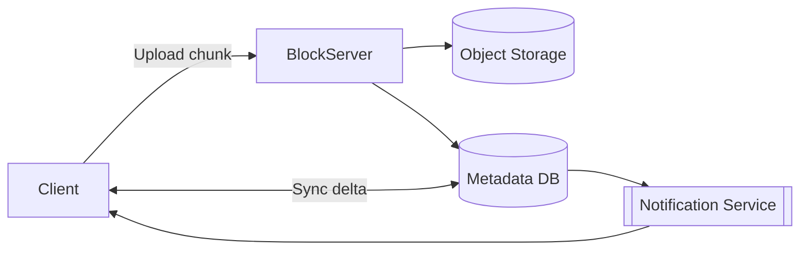
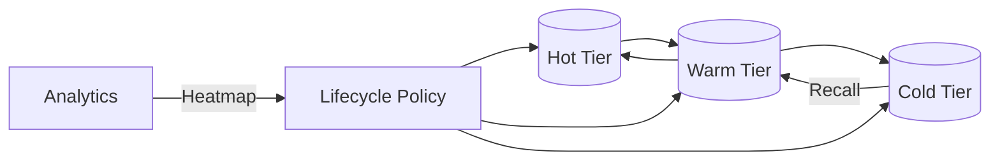

# 📂 Deep Dive: Design File Storage System (Google Drive/Dropbox)

> **"Mục tiêu: Thiết kế một hệ thống lưu trữ tệp tin đám mây cho phép người dùng tải lên, tải về, chia sẻ và đồng bộ hóa tệp tin trên nhiều thiết bị."**

---

## 1. Clarify Requirements (Làm rõ yêu cầu)

### Functional Requirements
*   **File Upload/Download:** Tải tệp lên và tải tệp về.
*   **Syncing:** Tệp tin tự động cập nhật trên mọi thiết bị (Laptop, Mobile).
*   **Versioning:** Xem lịch sử và khôi phục các phiên bản cũ của tệp.
*   **Sharing:** Chia sẻ tệp/thư mục cho người dùng khác với quyền đọc/ghi.

### Non-Functional Requirements
*   **Reliability:** Không được mất tệp tin (Độ bền dữ liệu cực cao).
*   **Consistency:** Khi cập nhật ở thiết bị A, thiết bị B phải thấy thay đổi sớm nhất có thể.
*   **Scalability:** Hỗ trợ hàng tỷ tệp tin và hàng triệu người dùng.

---

## 2. High-level Design

### Components
*   **Block Server:** Xử lý việc chia nhỏ tệp thành các khối (chunks) để upload/download hiệu quả.
*   **Metadata DB:** Lưu thông tin về tệp (tên, kích thước, đường dẫn) và các phiên bản.
*   **Object Storage:** Nơi lưu trữ thực sự các khối dữ liệu (dùng S3/GCS).
*   **Notification Service:** Thông báo cho các thiết bị khác khi có thay đổi tệp để bắt đầu quá trình đồng bộ.

> Client gửi chunk đến Block Server, metadata được ghi đồng bộ và Notification Service bắn tín hiệu sync tới thiết bị khác.

---

## 3. Back-of-the-envelope Estimation

| Metric | Assumption | Result |
| --- | --- | --- |
| DAU | 50 triệu | 50M |
| Avg files/user | 2.000 files | 100B files |
| Avg upload/day | 200MB/user | 10PB data/day |
| Chunk size | 4MB | 2.5B chunks/day |

> Số lượng chunk cực lớn => cần pipeline song song & dedup để giảm IO.

---

## 4. Deep Dive: Efficiency & Reliability (Trọng tâm)

### Chunking (Chia nhỏ tệp)
Thay vì upload toàn bộ 1 file 1GB, hệ thống chia nhỏ thành các khối (ví dụ 4MB).
*   *Lợi ích:* 
    *   **Retry:** Nếu upload thất bại, chỉ cần upload lại chunk đó.
    *   **Differential Sync:** Nếu chỉ sửa 1 câu trong file, hệ thống chỉ cần upload chunk chứa thay đổi đó.

### Deduplication (Loại bỏ trùng lặp)
Nếu 1.000 người cùng upload một file giáo trình nặng 100MB, hệ thống có lưu 100GB không?
*   **Giải pháp:** Hash từng chunk. Nếu chunk đó đã tồn tại trong Object Storage, Metadata chỉ việc trỏ link đến chunk cũ thay vì lưu mới.
*   *Kết quả:* Tiết kiệm chi phí lưu trữ khổng lồ.

### Metadata DB Sharding
Với hàng tỷ tệp tin, DB metadata sẽ trở nên rất lớn.
*   **Sharding theo `user_id`:** Tất cả tệp của 1 user sẽ nằm cùng 1 node, giúp các thao tác duyệt thư mục và tìm kiếm của user đó nhanh hơn.

---

## 5. Deep Dive: Syncing Mechanism

Làm sao để thiết bị B biết thiết bị A vừa sửa file?
1.  **Thiết bị A:** Upload chunk mới -> Update Metadata -> Gửi tín hiệu đến Notification Service.
2.  **Notification Service:** Dùng **Long Polling** hoặc **WebSocket** để đẩy tín hiệu "New Update" đến các thiết bị đang online của người dùng đó.
3.  **Thiết bị B:** Nhận tín hiệu -> So sánh version trong Metadata -> Chỉ tải về các chunk bị thay đổi.

---

## 6. Conflict Handling (Xử lý xung đột)
Khi 2 người cùng sửa 1 file lúc offline và cùng online cùng lúc:
*   **Strategy:** Hệ thống tạo ra 2 version khác nhau (Conflicted copy) và yêu cầu người dùng tự giải quyết (Merge manual) giống như Git.

---

## 7. Upload/Download Lifecycle
1.  **Upload:** Client chia file thành chunks → gửi kèm hash → Block Server xác thực, ghi vào Object Storage, update metadata (atomic transaction).
2.  **Download:** Client lấy metadata (danh sách chunk + checksum) → tải song song nhiều chunk → verify checksum → ghép file.
3.  **Delta Sync:** Watcher trên máy tính phát hiện thay đổi → chỉ upload chunk mới → metadata version++.

---

## 8. Interview Pro-tips (Trade-offs)

1.  **Strong vs Eventual Consistency:** Metadata cần **Strong Consistency** (không thể thấy file tồn tại nhưng click vào lại báo lỗi). Dữ liệu chunk có thể chấp nhận **Eventual Consistency** trong quá trình đồng bộ.
2.  **Storage Costs:** Đề cập đến chiến lược **Cold Storage** (lưu các version cũ hoặc file lâu không dùng vào loại đĩa rẻ tiền hơn).

---

## 9. Case Study: Storage Tiering & Lifecycle

### Bài toán
Tối ưu chi phí lưu trữ nhưng vẫn đảm bảo user có thể truy cập file cũ khi cần.

### Tier Strategy
| Tier | Latency | Cost | Use cases |
| --- | --- | --- | --- |
| **Hot** (SSD) | < 10ms | $$$ | File mới tải lên, đang được chỉnh sửa |
| **Warm** (HDD) | ~20ms | $$ | File được truy cập vài lần/tháng |
| **Cold** (Object Storage + Glacier) | giây/phút | $ | Version cũ, file lâu không dùng |

### Lifecycle Policy
1.  **Access Heatmap:** Track last-access time + frequency. Nếu file không truy cập >30 ngày -> chuyển sang Warm.
2.  **Version Pruning:** Giữ 10 version cuối ở Warm, version cũ hơn đẩy xuống Cold (Glacier) với metadata pointer.
3.  **Recall Flow:** Khi user mở file ở Cold tier, hệ thống kick-off job restore (1-5 phút) và thông báo user.

### Trade-offs
- **Latency Shock:** User mở file Cold có thể phải đợi vài phút. Cần UX rõ ràng.
- **Metadata Consistency:** Khi di chuyển chunk giữa tier, phải cập nhật pointer atomically để tránh broken link.
- **Cost vs Durability:** Cold tier có SLA phục hồi lâu hơn nhưng giá rẻ hơn ~10x.

---

## 📚 Bài tiếp theo
*   [Design Rate Limiter](./design-rate-limiter.md)
