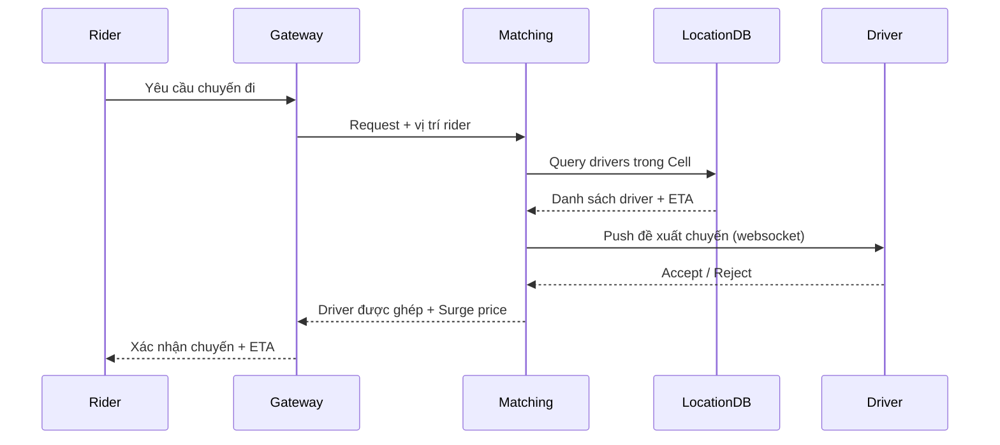

# 🚗 Deep Dive: Design Ride Sharing System (Uber/Grab)

> **"Mục tiêu: Thiết kế một hệ thống kết nối hành khách (riders) với tài xế (drivers) gần nhất, theo dõi vị trí thời gian thực và tính toán giá cước linh hoạt."**

---

## 1. Clarify Requirements (Làm rõ yêu cầu)

### Functional Requirements
*   **Location Update:** Tài xế cập nhật vị trí mỗi 1-5 giây.
*   **Ride Request:** Hành khách yêu cầu chuyến đi -> Hệ thống tìm tài xế gần nhất.
*   **Matching:** Ghép đôi tài xế và hành khách.
*   **Surge Pricing:** Tăng giá khi nhu cầu cao vượt nguồn cung.

### Non-Functional Requirements
*   **Low Latency:** Việc tìm tài xế và cập nhật bản đồ phải diễn ra theo thời gian thực.
*   **High Availability:** Hệ thống không được gián đoạn (đặc biệt là khâu đặt xe).
*   **Scalability:** Xử lý hàng triệu tài xế và hành khách đồng thời.

---

## 2. Back-of-the-envelope Estimation (Ước lượng)
*   **Active Drivers:** 1 triệu tài xế.
*   **Requests:** Mỗi tài xế gửi vị trí mỗi 3 giây -> ~333k requests/giây (vô cùng nặng về ghi).
*   **Storage:** Chỉ cần lưu vị trí hiện tại (Ephemeral data), không cần lưu lịch sử vị trí quá lâu trong DB chính.

---

## 3. High-level Design

### Components
*   **Location Service:** Nhận và lưu vị trí hiện tại của tài xế vào In-memory DB (Redis).
*   **Matching Service:** Tìm tài xế trong bán kính X km dựa trên vị trí của hành khách.
*   **Pricing Service:** Tính toán giá dựa trên quãng đường, thời gian và hệ số nhân (Surge).
*   **Notification Service:** Thông báo cho tài xế qua WebSocket/Push.

---

## 4. Deep Dive: Geo-Indexing (Trọng tâm)

Làm sao để tìm tài xế "gần nhất" trong hàng triệu người một cách hiệu quả?

### Tại sao SQL không hiệu quả?
*   Query kiểu `SELECT * FROM drivers WHERE lat/long WITHIN radius` sẽ phải quét toàn bộ bảng -> Cực chậm.

### Giải pháp: Spatial Indexing
1.  **QuadTree (Lựa chọn kinh điển):** 
    *   Chia bản đồ thành 4 phần. Nếu 1 vùng quá đông tài xế, lại chia nhỏ tiếp vùng đó thành 4.
    *   *Ưu điểm:* Dễ dàng tìm kiếm các node hàng xóm.
2.  **Google S2 (Lựa chọn hiện đại - Uber dùng):**
    *   Ánh xạ bề mặt trái đất lên một đường cong 1 chiều (Hilbert Curve).
    *   Mỗi vùng đất được gán một ID duy nhất. Các ID gần nhau trên dãy số cũng gần nhau trên bản đồ.
    *   *Ưu điểm:* Query cực nhanh bằng cách so sánh dãy số ID.

```mermaid
flowchart TD
    subgraph City Map
        Quad1[Cell A1]
        Quad2[Cell A2]
        Quad3[Cell B1]
        Quad4[Cell B2]
    end
    Rider((Rider)) -->|Request ride| Dispatcher[Matching Service]
    Dispatcher --> GeoIndex[Geo Index (S2/QuadTree)]
    GeoIndex --> Drivers{Nearby Drivers}
    Drivers --> Dispatcher
    Dispatcher -->|Assign| Driver
    Driver --> Rider
```

> Matching Service truy vấn Geo Index để lấy danh sách tài xế trong các cell lân cận, sau đó tính ETA và chọn tài xế tốt nhất.

---

## 5. Deep Dive: Matching & Surge Pricing

### Matching Algorithm
*   Không chỉ là "người gần nhất". Hệ thống cần tính tới:
    *   **ETA (Estimated Time of Arrival):** Một tài xế ở gần (đường chim bay) có thể mất lâu hơn để đến nếu gặp đường một chiều hoặc kẹt xe.
    *   **Driver Status:** Tài xế đang có khách hay trống?

### Surge Pricing (Giá tăng cường)
*   Dùng **Message Queue (Kafka)** để thu thập dữ liệu yêu cầu xe theo từng vùng địa lý (S2 Cell).
*   Nếu số lượng hành khách > số tài xế trống trong một ô (Cell) -> Kích hoạt hệ số nhân giá.
*   *Mục tiêu:* Khuyến khích tài xế di chuyển từ vùng vắng khách sang vùng đang có Surge.



> Sequence cho thấy flow thời gian thực: rider request → matching → thông báo driver → chấp nhận → phản hồi rider.

---

## 6. Interview Pro-tips (Trade-offs)

1.  **Consistency vs Availability:** Vị trí tài xế không cần chính xác 100% từng mili-giây (Eventual Consistency). Tuy nhiên, khâu thanh toán và khớp lệnh phải đảm bảo tính nhất quán (Strong Consistency).
2.  **Database:** Dùng **Redis (with Geospatial indexes)** để lưu vị trí tài xế vì tốc độ đọc/ghi cực nhanh. Dùng **PostgreSQL (PostGIS)** để lưu dữ liệu hạ tầng bản đồ cố định.

---

## 7. Optimization Ideas
- **Cold Start:** Preload tài xế trên route phổ biến dựa vào lịch sử demand.
- **Pooling / Shared Rides:** Matching service cần hỗ trợ ghép nhiều rider trên cùng một xe (điều chỉnh cost function).
- **Driver Incentive Engine:** Dùng ML dự đoán nhu cầu để push khuyến mãi cho tài xế di chuyển đến cell đang thiếu.
- **Fraud Detection:** Giám sát hành vi giả lập vị trí hoặc hủy chuyến liên tục.

---

## 📚 Bài tiếp theo
*   [Design File Storage System (Google Drive)](./design-file-storage.md)
