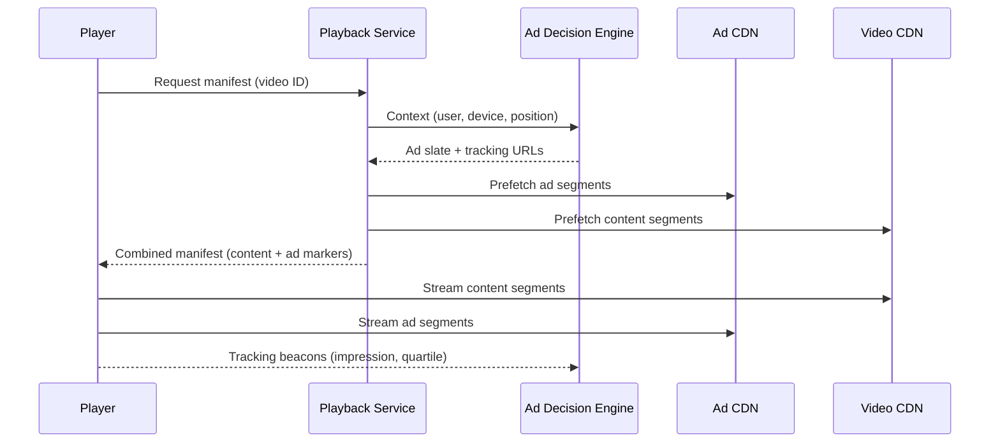
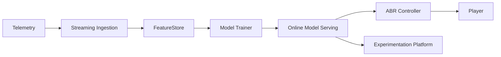

# 🎥 Deep Dive: Design Video Streaming Platform (YouTube/Netflix)

> **"Mục tiêu: Thiết kế một hệ thống cho phép người dùng tải lên video, chuyển đổi định dạng (encoding) và xem trực tuyến (streaming) với độ trễ thấp và chất lượng thích ứng."**

---

## 1. Clarify Requirements (Làm rõ yêu cầu)

### Functional Requirements
*   **Uploading:** Người dùng có thể upload video.
*   **Streaming:** Người dùng có thể xem video trên web/mobile.
*   **Searching:** Tìm kiếm video theo tiêu đề.
*   **Quality Switching:** Tự động điều chỉnh chất lượng dựa trên tốc độ mạng.

### Non-Functional Requirements
*   **Highly Reliable:** Không mất video đã upload.
*   **High Scalability:** Phục vụ hàng tỷ lượt xem mỗi ngày.
*   **Low Latency:** Thời gian "buffering" thấp nhất có thể.

---

## 2. Back-of-the-envelope Estimation (Ước lượng)
*   **Users:** 1 tỷ DAU.
*   **Views:** Trung bình 5 video/user/ngày -> 5 tỷ lượt xem/ngày.
*   **Storage:** Giả sử mỗi phút video chiếm 50MB. Nếu mỗi ngày có 100k giờ video mới -> 100k * 60 * 50MB = 300TB/ngày.
*   **Bandwidth:** Streaming chiếm phần lớn băng thông quốc tế. Đây là bài toán cực nặng về **Egress traffic**.

---

## 3. High-level Design

### Components
*   **Web Server:** Xử lý metadata, auth, search.
*   **Blob Storage:** Lưu video gốc và video đã qua xử lý (dùng S3/GCS).
*   **Transcoding Pipeline:** Chuyển đổi video sang các định dạng (MP4, DASH) và độ phân giải (360p, 720p, 1080p, 4K) khác nhau.
*   **CDN (Content Delivery Network):** Đưa video đến gần người dùng nhất để giảm độ trễ.

---

## 4. Deep Dive: Transcoding & Adaptive Streaming

Đây là "trái tim" của hệ thống video.

### Video Transcoding Pipeline
Khi một video 4K được upload, ta không thể gửi file 4K đó cho người dùng dùng mạng 3G.
1.  **Chipping:** Chia video thành các đoạn nhỏ (chunks) - ví dụ 2-5 giây mỗi chunk.
2.  **Parallel Processing:** Dùng các worker để encode song song các chunk sang nhiều độ phân giải khác nhau.
3.  **DAG (Directed Acyclic Graph):** Quy trình xử lý phức tạp (watermarking, thumbnail extraction, encoding) được quản lý bởi một DAG để đảm bảo thứ tự và khả năng retry.

### Adaptive Bitrate Streaming (ABR)
Hệ thống sử dụng các giao thức như **HLS (Apple)** hoặc **DASH (MPEG)**.
*   Máy nghe (Client) sẽ dựa trên tốc độ internet hiện tại để chủ động yêu cầu chunk video tiếp theo ở độ phân giải phù hợp.
*   Nếu mạng yếu -> Client bốc chunk 360p. Nếu mạng mạnh -> Client bốc chunk 1080p.

```mermaid
flowchart LR
    Uploader -->|HTTP Upload| WebAPI
    WebAPI --> Queue[Encoding Queue]
    Queue --> Transcoder[Transcoding Workers]
    Transcoder --> Storage[Blob Storage (S3/GCS)]
    Storage --> CDN[CDN Edge]
    Viewer --> CDN
    CDN -->|Manifest + Segments| Viewer
    Analytics --> WebAPI
    Viewer --> Analytics[Playback Analytics]
```

> Pipeline cơ bản: Upload -> Queue -> Transcode -> Lưu bản mã hóa -> CDN -> Client adaptive streaming.

---

## 5. Deep Dive: Content Delivery Network (CDN)

Streaming video mà không có CDN là không thể thực hiện được ở quy mô lớn.
*   **Edge Servers:** Video được lưu tại các máy chủ đặt tại ISP (Viettel, VNPT, FPT) để người dùng tải dữ liệu ngay trong nước thay vì đi qua cáp quang biển.
*   **Caching Strategy:** 
    *   Video phổ biến (Trending): Lưu ở tất cả các Edge nodes.
    *   Video cũ/ít người xem: Lưu ở Origin Storage, chỉ đẩy lên CDN khi có yêu cầu.

---

## 6. Interview Pro-tips (Trade-offs)

1.  **Upload vs View:** Upload có thể chậm (Asynchronous), nhưng View phải nhanh (Real-time). Hãy tập trung vào việc tối ưu đường ra (Egress).
2.  **Cost Optimization:** CDN rất đắt. Netflix tự xây dựng hệ thống CDN riêng gọi là **Open Connect** để tiết kiệm chi phí trả cho bên thứ 3 như Akamai hay Cloudflare.
3.  **Blob Storage:** Video gốc (Original) nên được lưu ở "Cold Storage" (rẻ tiền) sau khi đã được encode xong để dự phòng.

---

## 7. Playback Flow & Observability
1.  **Manifest** (`.m3u8` hoặc `.mpd`) chứa danh sách bitrate + URL chunk.
2.  **Player** tải trước vài chunk (buffer) cùng với **DRM license** nếu nội dung được bảo vệ (Widevine/FairPlay/PlayReady).
3.  **QoE Metrics:** Theo dõi `startup time`, `rebuffer count`, `average bitrate`, `watch time` để tinh chỉnh ABR.
4.  **Error Budget:** Tách rõ lỗi CDN, player, network để tối ưu từng khâu.

---

## 8. Optimization Ideas
- **Prefetch/Prewarm CDN:** Đẩy trước chunk đầu tiên của video trending sang edge nodes.
- **Multi-CDN Strategy:** Chọn nhiều nhà cung cấp CDN để failover và tối ưu chi phí.
- **Edge Computing:** Encode những bitrate phổ biến ngay tại edge khi cần (Just-in-time packaging).
- **Ads Insertion:** Dùng server-side ad insertion (SSAI) để tránh ad blockers.

---

## 9. Ads Pipeline (Server-side Ad Insertion)

### Goal
Chèn quảng cáo cá nhân hóa vào video mà không bị client chặn, đảm bảo trải nghiệm xem liền mạch.



### Key Components
- **Ad Decision Engine:** Kết nối DSP/Ad server, trả về danh sách quảng cáo phù hợp (bỏ qua quảng cáo đã xem hoặc không hợp lệ theo policy).
- **Stitching Layer:** Ghép manifest HLS/DASH để client nhận một stream duy nhất, tránh mất buffer khi chuyển từ content sang ad.
- **Measurement/Tracking:** Gửi ping ở các mốc 0%, 25%, 50%, 75%, 100% để tính doanh thu và phát hiện ad fraud.

### Trade-offs
- **Latency:** Ad decision phải trả lời trong <200ms để không làm chậm playback start.
- **Ad Podding:** Cần logic tối ưu số lượng ad liên tục (không quá dài, giảm churn).
- **Privacy:** Tuân thủ GDPR/CCPA khi sử dụng dữ liệu user cho target.

---

## 10. Case Study: QoE Optimization with ML

### Mục tiêu
Tự động điều chỉnh tham số streaming để giảm `rebuffer ratio` và tăng `watch time`.

### Data Pipeline
- **Client Telemetry:** Player gửi event `startup_time`, `bitrate`, `buffer_level`, `errors` mỗi vài giây.
- **Edge Logs:** CDN ghi lại latency, cache hit/miss, throughput.
- **Context:** Thông tin thiết bị, OS, ISP, vùng địa lý.

### Feature Engineering
| Feature | Mô tả |
| --- | --- |
| `avg_buffer_ms` | Độ dài buffer trung bình 60s gần nhất |
| `recent_rebuffer_count` | Số lần rebuffer trong 5 phút |
| `cdn_latency_p95` | Độ trễ CDN tương ứng ISP |
| `bitrate_switch_volatility` | Mức dao động bitrate |
| `device_cpu_load` | CPU usage (mobile) |

### Kiến trúc



> Model dự đoán QoE score cho mỗi cấu hình bitrate/chunk size. ABR Controller chọn profile tối ưu dựa trên score.

### Loại mô hình
- **Gradient Boosted Trees** cho việc dự đoán `rebuffer probability` theo từng profile.
- **Contextual Multi-armed Bandits** để explore/exploit các cấu hình mới.

### Feedback Loop
1.  ABR áp dụng cấu hình đề xuất.
2.  Player gửi telemetry → Feature Store cập nhật.
3.  Hệ thống so sánh QoE trước/sau → A/B testing để xác minh.

### Thách thức
- **Data Quality:** Telemetry có thể bị thiếu (người dùng offline). Cần cơ chế retry/aggregation.
- **User Privacy:** Thu thập dữ liệu theo chuẩn consent, ẩn danh thông tin nhạy cảm.
- **Model Drift:** ISP/vùng địa lý thay đổi → cần retrain định kỳ.

---

## 📚 Bài tiếp theo
*   [Design Distributed Cache (Redis Concept)](./design-distributed-cache.md)
