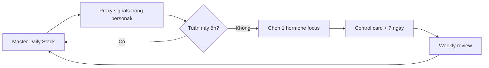

# 🎛️ Endocrine Control Playbook — Kiểm soát từng hormone

> [← Hormone Map](./endocrine-hormone-map.md) | [Health OS](./health-os-overview.md) | [Personal data](../../../personal/README.md)
>
> **Mục tiêu:** Biết *đòn bẩy nào* kéo *hormone nào*, và chạy checklist ngày/tuần — không phải tự kê thuốc nội tiết.
>
> **Last Updated:** August 2026

<!-- agent-summary -->
**Agent SUMMARY:** 4 base levers (sleep, light, food, movement) → Master Daily Stack → per-hormone control cards (max 1–2/week) → weekly review with `personal/` proxies. Start here for “how do I control hormones?” after the map.
<!-- /agent-summary -->

---

## 0. Quy tắc vận hành (đọc trước)

Bạn **không** kiểm soát hormone như chỉnh slider riêng biệt. Hầu hết cùng chịu ảnh hưởng bởi **4 đòn bẩy nền**:

| # | Đòn bẩy | Hormone bị kéo mạnh |
| ---: | --- | --- |
| 1 | Ngủ (giờ + đủ + tối) | Melatonin, GH, Testosterone, Leptin↑ / Ghrelin↓, Cortisol |
| 2 | Ánh sáng (sáng ngoài trời / tối dim) | Cortisol nhịp ngày, Melatonin |
| 3 | Ăn (protein–xơ–đường) | Insulin, GLP-1, Serotonin (gián tiếp), Dopamine ổn định |
| 4 | Vận động (đi bộ + strength ± HIIT) | Insulin nhạy, Endorphin, Testosterone, GH, Dopamine |

**Cách làm đúng:**
1. Chạy **Master Daily Stack** mỗi ngày (phần 1) — cover ~70% hormone.  
2. Chọn **tối đa 1–2 hormone ưu tiên / tuần** để soi kỹ (phần 2).  
3. Cuối tuần: weekly review (phần 3).  
4. Triệu chứng y khoa → bác sĩ, không tự hormone therapy.

---

## 1. Master Daily Stack (chạy mỗi ngày)

Copy sang `personal/daily/…` hoặc tick tại đây khi in.

### Sáng (0–90 phút sau thức)
- [ ] **Ánh sáng ngoài trời 10–30′** (không kính râm cả buổi nếu an toàn mắt) → Cortisol nhịp ↑ đúng giờ, Serotonin hỗ trợ  
- [ ] **Nước + muối khoáng nhẹ** nếu đổ mồ hôi / cafein muộn  
- [ ] **Protein bữa sáng đủ** (target cá nhân, vd ≥30g) → bớt crash, hỗ trợ GLP-1/no  
- [ ] **Caffeine sau ~90′ thức** (tùy người) → bớt đè nhịp cortisol sáng  
- [ ] **Không doomscroll ngay khi thức** → bảo vệ Dopamine baseline  

### Ban ngày
- [ ] **≥1 deep-work / mục tiêu nhỏ hoàn thành** → Dopamine “kiếm được”  
- [ ] **Đi bộ 10–20′ sau bữa chính** → Insulin nhạy cảm  
- [ ] **Strength hoặc Zone-2** (theo lịch tuần) → T, Endorphin, Insulin  
- [ ] **Xã hội / tin nhắn người thật ≥1 lần chất lượng** → Oxytocin (nhẹ)  
- [ ] **Stress reset 5′** (box breathing / đi bộ không tai nghe tin nóng) → hạ Adrenaline/Cortisol mạn  

### Tối (T−2h → ngủ)
- [ ] **Caffeine cutoff** (thường ≤14–16h, chỉnh theo bạn) → Melatonin / ngủ  
- [ ] **Bữa tối không nhồi đường lớn** → Overnight glucose, leptin/ghrelin  
- [ ] **Màn hình dim / filter; T−60′ giảm kích thích** → Melatonin  
- [ ] **Phòng ngủ mát + tối** → Melatonin, GH cửa sổ đêm  
- [ ] **Mục tiêu ngủ trước cửa sổ bạn đặt** (vd 22:30–23:00 nếu muốn cửa sổ GH)  

### Proxy ghi vào `personal/` (không xét nghiệm máu mỗi ngày)
| Proxy | File |
| --- | --- |
| Sleep h / quality | `body/metrics.csv` |
| Energy / mood / stress 1–10 | `daily/YYYY-MM-DD.md` |
| Craving, crash sau ăn | `nutrition/…` |
| Habits caffeine / move / protein AM | `habits/YYYY-MM.md` |

---

## 2. Control card từng hormone

Cách dùng mỗi card:
- **Mục tiêu trạng thái** = hướng bạn muốn  
- **Tăng / Hỗ trợ tốt** = levers “up” lành mạnh  
- **Giảm / Tránh kích xấu** = levers làm lệch  
- **Proxy theo dõi** = tín hiệu hàng ngày (không phải lab)  
- **Cờ đỏ** = đi khám  

---

### 2.1 Dopamine
| | |
| --- | --- |
| **Mục tiêu** | Động lực bền, không phụ thuộc kích thích rẻ |
| **Tăng / hỗ trợ** | Hoàn thành MIT nhỏ; tập; nắng sáng; ngủ đủ; cold shower tùy chọn |
| **Giảm lệch** | SNS/game vô độ; đa nhiệm; thưởng empty (like/scroll) |
| **Proxy** | Motivation 1–10; số lần mở feed trước khi MIT xong |
| **Cờ đỏ** | Mất hứng thú hầu hết hoạt động ≥2 tuần (cân nhắc chuyên khoa) |
| **Deep** | [dopamine-system.md](./dopamine-system.md) |

### 2.2 Serotonin
| | |
| --- | --- |
| **Mục tiêu** | Mood ổn, ít lo dao động |
| **Tăng / hỗ trợ** | Nắng sáng; đi bộ; tryptophan + carbs phức hợp bữa tối vừa phải; xã hội |
| **Giảm lệch** | Thiếu nắng; thiếu ngủ; rượu tối; cô lập |
| **Proxy** | Mood 1–10; thèm ngọt buổi tối; chất lượng ngủ |
| **Cờ đỏ** | Trầm cảm / lo âu nặng, ý nghĩ tự hại → cấp cứu / bác sĩ |
| **Deep** | [neurotransmitters-guide.md](./neurotransmitters-guide.md) |

### 2.3 Oxytocin
| | |
| --- | --- |
| **Mục tiêu** | Cảm giác gắn kết, giảm cô độc |
| **Tăng / hỗ trợ** | Gặp người thân/bạn; ôm (đồng thuận); thú cưng; giúp việc nhỏ có mặt |
| **Giảm lệch** | Chỉ tương tác online; conflict không resolve |
| **Proxy** | “Có tiếp xúc chất lượng hôm nay?” □ |
| **Cờ đỏ** | Cô lập kéo dài + suy sụp mood |

### 2.4 Endorphin
| | |
| --- | --- |
| **Mục tiêu** | Giảm đau / mood sau vận động lành mạnh |
| **Tăng / hỗ trợ** | Interval / chạy / tập đủ thách thức; cười / xã hội vui |
| **Giảm lệch** | Tập khi chấn thương để “chase high” |
| **Proxy** | Mood sau workout; có tập đủ thở mệt vừa? |
| **Cờ đỏ** | Đau khớp/gân ngày càng tăng |

### 2.5 Cortisol
| | |
| --- | --- |
| **Mục tiêu** | Cao buổi sáng, hạ về tối — không phẳng cao cả ngày |
| **Hỗ trợ nhịp đúng** | Nắng sáng; caffeine vừa; đủ ngủ; ranh giới công việc tối |
| **Giảm mạn tính** | Thiền 5–10′; cắt doomscroll tin; yoga; tắt việc trước ngủ |
| **Proxy** | Stress 1–10; khó ngủ dù mệt; mỡ bụng / thèm ăn stress |
| **Cờ đỏ** | Kiệt sức, HA cao kéo dài, rụng tóc + tăng cân trung tâm nhanh → BS |
| **Deep** | [cortisol-melatonin-system.md](./cortisol-melatonin-system.md) |

### 2.6 Melatonin
| | |
| --- | --- |
| **Mục tiêu** | Buồn ngủ đúng giờ, ngủ sâu |
| **Tăng / hỗ trợ** | Tối tối; giờ ngủ cố định; phòng mát tối; T−60′ giảm màn hình |
| **Giảm lệch** | Ánh sáng xanh sát ngủ; caffeine/rượu muộn; ngủ ngày dài |
| **Proxy** | Phút vào giấc; số lần thức giấc; sleep quality 1–10 |
| **Cờ đỏ** | Ngưng thở khi ngủ, ngủ gà nguy hiểm (lái xe) → BS giấc ngủ |
| **Deep** | [sleep-optimization.md](./sleep-optimization.md) |

### 2.7 Adrenaline / Noradrenaline
| | |
| --- | --- |
| **Mục tiêu** | Có khi cần tập trung/sống còn — không stuck “on” |
| **Dùng hữu ích** | Deadline có kế hoạch; HIIT ngắn; caffeine có cắt giờ |
| **Giảm lệch** | Thông báo liên tục; tranh luận mạng; horror-scroll tối |
| **Proxy** | Tim hồi hộp không lý do; khó “xuống” tối |
| **Cờ đỏ** | Hồi hộp + đau ngực / khó thở → cấp cứu |

### 2.8 Insulin
| | |
| --- | --- |
| **Mục tiêu** | Đường huyết ổn, ít thèm vòng lặp |
| **Hỗ trợ** | Protein+xơ mỗi bữa; đi bộ sau ăn; hạn chế đường siêu chế biến; ngủ đủ |
| **Giảm lệch** | Nước ngọt, bánh liên tục; ngồi cả ngày sau meal lớn |
| **Proxy** | Crash 1–3h sau ăn; đói lại quá sớm; vòng eo |
| **Cờ đỏ** | Khát nhiều, tiểu nhiều, sụt cân lạ / gia đình ĐTĐ → xét nghiệm |
| **Deep** | [glucose-insulin-system.md](./glucose-insulin-system.md) |

### 2.9 T3 / T4 (giáp)
| | |
| --- | --- |
| **Mục tiêu** | Chuyển hóa ổn định (không tự chỉnh bằng thuốc) |
| **Hỗ trợ lối sống** | Calorie không crash lâu; ngủ; stress quản lý; đa dạng thực phẩm |
| **Không làm** | Mua thyroid online; “mega iodine” tự ý |
| **Proxy** | Sợ lạnh + mệt + rụng tóc + tăng cân **cùng lúc**; hoặc tim nhanh + sụt cân |
| **Cờ đỏ** | Nghi ngờ nhược/ưu giáp → xét TSH/FT4 với bác sĩ |

### 2.10 Leptin & Ghrelin
| | |
| --- | --- |
| **Mục tiêu** | Đói/no đúng tín hiệu |
| **Hỗ trợ** | Ngủ 7–8h; bữa có protein; đừng nhảy calorie quá gắt quá lâu |
| **Giảm lệch** | Thức khuya + ngủ thiếu; nhịn rồi binge |
| **Proxy** | Thèm ăn mất kiểm soát sau đêm ngủ kém |
| **Cờ đổ** | Rối loạn ăn uống → chuyên khoa |

### 2.11 GLP-1 (tự nhiên)
| | |
| --- | --- |
| **Mục tiêu** | No lâu hơn sau bữa, ít snack cưỡng bức |
| **Hỗ trợ** | Protein + xơ; ăn chậm; ngủ; tránh Ultra-processed lỏng |
| **Không làm** | Tự tiêm/thuốc GLP-1 không chỉ định |
| **Proxy** | Thời gian no sau bữa (phút/giờ) |

### 2.12 CCK & Secretin
| | |
| --- | --- |
| **Mục tiêu** | Tiêu hóa ổn, no khỏe |
| **Hỗ trợ** | Nhai kỹ; đủ chất béo tốt vừa phải; không nhồi quá nhanh |
| **Proxy** | Đầy hơi / nặng bụng sau ăn nhanh |

### 2.13 GH (Growth Hormone)
| | |
| --- | --- |
| **Mục tiêu** | Phục hồi đêm + hỗ trợ thành phần cơ thể |
| **Hỗ trợ** | Ngủ sớm/đủ sâu; HIIT hoặc nặng ngắn; khoảng cách ăn–ngủ hợp lý |
| **Giảm lệch** | Thức đêm đèn sáng; rượu gần ngủ |
| **Proxy** | Sleep depth; phục hồi sau tập (không phải “GH máu”) |
| **Cờ đỏ** | Không dùng GH đen |

### 2.14 Testosterone
| | |
| --- | --- |
| **Mục tiêu** | Drive, sức mạnh, phục hồi tốt hơn baseline |
| **Hỗ trợ** | Strength 2–4×/tuần; ngủ; Zn/D từ ăn+nắng; % mỡ hợp lý; cortisol không mạn |
| **Giảm lệch** | Overtraining; ngủ thiếu; rượu nhiều; stress kinh niên |
| **Proxy** | Drive tập; năng lượng; (lab nếu triệu chứng kéo dài) |
| **Deep** | [testosterone-system.md](./testosterone-system.md) |

### 2.15 Estrogen & Progesterone
| | |
| --- | --- |
| **Mục tiêu** | Chu kỳ / xương / mood ổn hơn (nữ) |
| **Hỗ trợ** | % mỡ lành mạnh; đủ fat tốt; ngủ; stress |
| **Cờ đỏ** | Rối loạn chu kỳ nặng, đau dữ dội, chảy máu bất thường → BS |

### 2.16 Aldosterone · ADH
| | |
| --- | --- |
| **Mục tiêu** | Nước–muối–HA ổn |
| **Hỗ trợ** | Hydration theo khát + khí hậu; hạn chế rượu gần ngủ (ADH) |
| **Cờ đỏ** | HA cao/thấp bất thường, phù, tiểu rất ít/rất nhiều bất thường → BS |

### 2.17 PTH & Calcitonin (xương–canxi)
| | |
| --- | --- |
| **Mục tiêu** | Xương dài hạn chắc |
| **Hỗ trợ** | Ca + D + protein đủ; strength/impact phù hợp |
| **Cờ đỏ** | Gãy xương nhẹ va chạm, co cứng cơ do Ca thấp nghi ngờ → BS |

---

## 3. Weekly Control Review (Chủ nhật ~15–20′)

Dùng kèm [`personal/weekly/`](../../../personal/weekly/) hoặc tick:

### A. Numbers
- [ ] Avg sleep h / quality  
- [ ] Stress avg  
- [ ] Số ngày crash sau ăn  
- [ ] Số buổi strength / Zone-2  
- [ ] % ngày giữ caffeine cutoff  

### B. Chọn focus tuần tới (max 2)
Ví dụ hợp lý:
- Tuần 1–2: **Melatonin + Cortisol** (ngủ + sáng nắng)  
- Tuần 3–4: **Insulin + Dopamine** (ăn + MIT trước scroll)  
- Sau đó: **Testosterone / GH** (strength + ngủ cửa sổ)

Focus tuần này: _______________ / _______________

### C. 1 thí nghiệm nhỏ
| Experiment | Success metric | Stop nếu |
| --- | --- | --- |
| vd: đi bộ 15′ sau trưa | hết crash ≤1 ngày/tuần | đau gối tăng |

### D. Cờ đỏ tuần này?
□ Không □ Có → ghi & book khám: _______________

---

## 4. Checklist in nhanh (1 trang)

### Mỗi sáng
`[ ] Nắng  [ ] Protein AM  [ ] Không scroll trước MIT  [ ] Caffeine đúng cửa sổ`

### Mỗi tối
`[ ] Cutoff cafein đúng  [ ] Dim screen  [ ] Phòng tối mát  [ ] Ghi sleep/mood/nutrition`

### Mỗi tuần
`[ ] Review proxy  [ ] 1–2 hormone focus  [ ] 1 thí nghiệm  [ ] Cập nhật personal/dashboard.md`

---

## 5. Lịch 4 tuần mẫu (lần đầu kiểm soát)

| Tuần | Focus | Hành động bắt buộc |
| ---: | --- | --- |
| 1 | Melatonin + Cortisol | Nắng sáng + giờ ngủ cố định + dim tối |
| 2 | Insulin | Protein/xơ mỗi bữa + walk after meal |
| 3 | Dopamine | MIT trước SNS; hoàn thành 1 việc khó/ngày |
| 4 | Strength → T / GH / Endorphin | 3 buổi nặng hoặc bodyweight + ngủ |

Không mở thêm supplement tuần 1–4 trừ thiếu đã biết (vd D3 theo xét nghiệm).

---

## 6. Khi nào cần lab / bác sĩ (không thay bằng checklist)

- Triệu chứng giáp (nhược/ưu)  
- Nghi ĐTĐ / đa niệu–đa khát  
- Trầm cảm / lo âu nặng  
- Rối loạn chu kỳ nặng  
- HA, hồi hộp + đau ngực  
- Muốn dùng thuốc GLP-1 / TRT / thyroid — **chỉ có bác sĩ**

---

## 7. Liên kết

| Doc | Vai trò |
| --- | --- |
| [endocrine-hormone-map.md](./endocrine-hormone-map.md) | Bản đồ kiến thức |
| **Playbook này** | Cách kiểm soát + checklist |
| [personal/](../../../personal/README.md) | Ghi proxy hàng ngày |
| Deep-dives | Dopamine / Cortisol-Melatonin / Glucose / Testosterone… |

> **Bắt đầu hôm nay:** chạy Master Daily Stack §1 + chọn **1 focus** tuần này (gợi ý: Melatonin nếu ngủ đang tệ).
